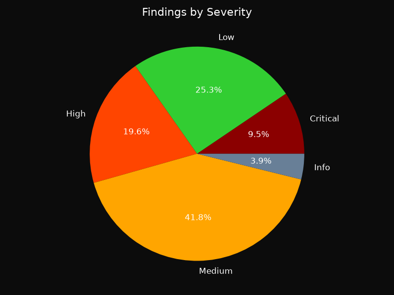
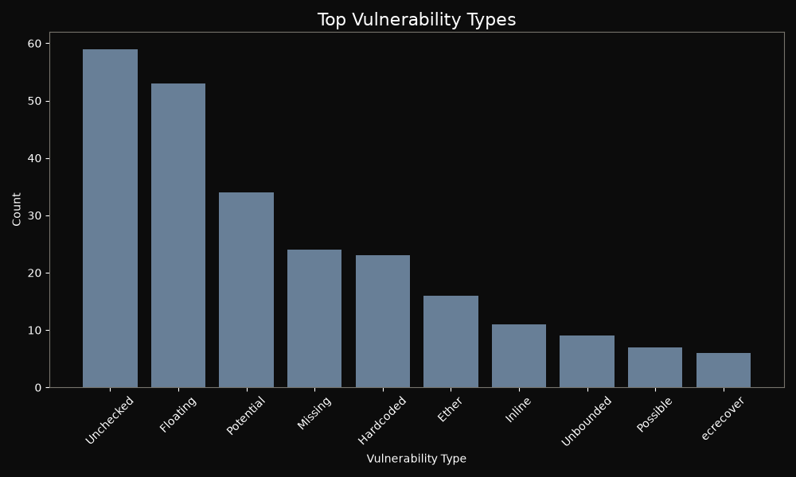

# Hawk-i Audit Report

**Generated:** 2026-07-23T13:50:54.197133Z

## Executive Summary

- **Mode:** minimal (AI: False, Sandbox: False)
- **Repository:** demo/DeFiVulnLabs/src/test (local)
- **Contracts Scanned:** 149
- **Files Analyzed:** 57
- **Total Findings:** 285
- **Severity Breakdown:** Critical: 27, High: 56, Medium: 119, Low: 72, Info: 11
- **Simulation Success Rate:** N/A
- **Security Score:** 0/100 (Critical Risk)


> AI reasoning was not enabled during this scan.


> Exploit simulation was not executed.


## Vulnerability Breakdown

### Severity Distribution



### Vulnerability Types (Top 10)



### Severity Table

| Severity | Count |
|----------|-------|
| Critical | 27 |
| High     | 56 |
| Medium   | 119 |
| Low      | 72 |
| Info     | 11 |

## Detailed Findings

Each finding below shows exactly where the flaw is, the code responsible, a
plain explanation of why it is dangerous, its impact, and a concrete fix.


### F001 | Critical: Missing access control on destroy

- **Severity:** Critical
- **Location:** `demo/DeFiVulnLabs/src/test/fee-on-transfer.sol:287`
- **Function:** `destroy`

**Vulnerable code**

```solidity
285 | }
  286 |
> 287 | function destroy(uint256 amount) external {
  288 |     _destroy(msg.sender, amount);
  289 | }
```

**What is wrong**

Sensitive functions (e.g., `withdraw`, `setOwner`, `pause`) must be protected by access control modifiers like `onlyOwner`. Without such protection, any user can call these functions and compromise the contract.

**Impact**

An attacker can drain funds, change critical parameters, or take ownership of the contract.

**Recommended fix**

```solidity
function destroy() external onlyOwner {
    // function body remains
}
```


---

### F002 | Critical: Missing access control on destroyFrom

- **Severity:** Critical
- **Location:** `demo/DeFiVulnLabs/src/test/fee-on-transfer.sol:299`
- **Function:** `destroyFrom`

**Vulnerable code**

```solidity
297 | }
  298 |
> 299 | function destroyFrom(address account, uint256 amount) external {
  300 |     require(amount <= _allowed[account][msg.sender]);
  301 |     _allowed[account][msg.sender] = _allowed[account][msg.sender].sub(
```

**What is wrong**

Sensitive functions (e.g., `withdraw`, `setOwner`, `pause`) must be protected by access control modifiers like `onlyOwner`. Without such protection, any user can call these functions and compromise the contract.

**Impact**

An attacker can drain funds, change critical parameters, or take ownership of the contract.

**Recommended fix**

```solidity
function destroyFrom() external onlyOwner {
    // function body remains
}
```


---

### F003 | Critical: Missing access control on withdraw

- **Severity:** Critical
- **Location:** `demo/DeFiVulnLabs/src/test/phantom-permit.sol:106`
- **Function:** `withdraw`

**Vulnerable code**

```solidity
104 | }
  105 |
> 106 | function withdraw(uint256 amount) public {
  107 |     require(token.transfer(msg.sender, amount), "Transfer failed");
  108 | }
```

**What is wrong**

Sensitive functions (e.g., `withdraw`, `setOwner`, `pause`) must be protected by access control modifiers like `onlyOwner`. Without such protection, any user can call these functions and compromise the contract.

**Impact**

An attacker can drain funds, change critical parameters, or take ownership of the contract.

**Recommended fix**

```solidity
function withdraw() public onlyOwner {
    // function body remains
}
```


---

### F004 | Critical: Missing access control on changeOwner

- **Severity:** Critical
- **Location:** `demo/DeFiVulnLabs/src/test/Visibility.sol:53`
- **Function:** `changeOwner`

**Vulnerable code**

```solidity
51 |
  52 | // wrong visibility of changeOwner function should be onlyOwner
> 53 | function changeOwner(address _new) public {
  54 |     owner = _new;
  55 | }
```

**What is wrong**

Sensitive functions (e.g., `withdraw`, `setOwner`, `pause`) must be protected by access control modifiers like `onlyOwner`. Without such protection, any user can call these functions and compromise the contract.

**Impact**

An attacker can drain funds, change critical parameters, or take ownership of the contract.

**Recommended fix**

```solidity
function changeOwner() public onlyOwner {
    // function body remains
}
```


---

### F005 | Critical: Missing access control on withdraw

- **Severity:** Critical
- **Location:** `demo/DeFiVulnLabs/src/test/empty-loop.sol:67`
- **Function:** `withdraw`

**Vulnerable code**

```solidity
65 | }
  66 |
> 67 | function withdraw(Signature[] calldata sigs) public {
  68 |     // Mitigation: Check the number of signatures
  69 |     //require(sigs.length > 0, "No signatures provided");
```

**What is wrong**

Sensitive functions (e.g., `withdraw`, `setOwner`, `pause`) must be protected by access control modifiers like `onlyOwner`. Without such protection, any user can call these functions and compromise the contract.

**Impact**

An attacker can drain funds, change critical parameters, or take ownership of the contract.

**Recommended fix**

```solidity
function withdraw() public onlyOwner {
    // function body remains
}
```


---

### F006 | Low: ERC20 approval race condition

- **Severity:** Low
- **Location:** `demo/DeFiVulnLabs/src/test/Overflow2.sol:116`
- **Function:** `approve`

**Vulnerable code**

```solidity
114 | );
  115 |
> 116 | function approve(address spender, uint256 value) public {
  117 |     allowance[msg.sender][spender] = value;
  118 |     emit Approval(msg.sender, spender, value);
```

**What is wrong**

The standard ERC20 `approve` function is vulnerable to a race condition: if an owner changes allowance from N to M, and the spender submits a transfer before the new approval, they can spend N and then M, exceeding the intended limit.

**Impact**

An attacker can spend more tokens than allowed, leading to theft.

**Recommended fix**

```solidity
function approve(address spender, uint256 amount) public returns (bool) {
    require((amount == 0) || (allowance[msg.sender][spender] == 0), "Use increaseAllowance instead");
    allowance[msg.sender][spender] = amount;
    emit Approval(msg.sender, spender, amount);
    return true;
}
```


---

### F007 | Low: ERC20 approval race condition

- **Severity:** Low
- **Location:** `demo/DeFiVulnLabs/src/test/UnsafeCall.sol:113`
- **Function:** `approve`

**Vulnerable code**

```solidity
111 | );
  112 |
> 113 | function approve(address spender, uint256 value) public {
  114 |     allowance[msg.sender][spender] = value;
  115 |     emit Approval(msg.sender, spender, value);
```

**What is wrong**

The standard ERC20 `approve` function is vulnerable to a race condition: if an owner changes allowance from N to M, and the spender submits a transfer before the new approval, they can spend N and then M, exceeding the intended limit.

**Impact**

An attacker can spend more tokens than allowed, leading to theft.

**Recommended fix**

```solidity
function approve(address spender, uint256 amount) public returns (bool) {
    require((amount == 0) || (allowance[msg.sender][spender] == 0), "Use increaseAllowance instead");
    allowance[msg.sender][spender] = amount;
    emit Approval(msg.sender, spender, amount);
    return true;
}
```


---

### F008 | Low: ERC20 approval race condition

- **Severity:** Low
- **Location:** `demo/DeFiVulnLabs/src/test/fee-on-transfer.sol:225`
- **Function:** `approve`

**Vulnerable code**

```solidity
223 | }
  224 |
> 225 | function approve(address spender, uint256 value) public returns (bool) {
  226 |     require(spender != address(0));
  227 |     _allowed[msg.sender][spender] = value;
```

**What is wrong**

The standard ERC20 `approve` function is vulnerable to a race condition: if an owner changes allowance from N to M, and the spender submits a transfer before the new approval, they can spend N and then M, exceeding the intended limit.

**Impact**

An attacker can spend more tokens than allowed, leading to theft.

**Recommended fix**

```solidity
function approve(address spender, uint256 amount) public returns (bool) {
    require((amount == 0) || (allowance[msg.sender][spender] == 0), "Use increaseAllowance instead");
    allowance[msg.sender][spender] = amount;
    emit Approval(msg.sender, spender, amount);
    return true;
}
```


---

### F009 | Low: ERC20 approval race condition

- **Severity:** Low
- **Location:** `demo/DeFiVulnLabs/src/test/ApproveScam.sol:95`
- **Function:** `approve`

**Vulnerable code**

```solidity
93 | }
  94 |
> 95 | function approve(address spender, uint amount) external returns (bool) {
  96 |     allowance[msg.sender][spender] = amount;
  97 |     emit Approval(msg.sender, spender, amount);
```

**What is wrong**

The standard ERC20 `approve` function is vulnerable to a race condition: if an owner changes allowance from N to M, and the spender submits a transfer before the new approval, they can spend N and then M, exceeding the intended limit.

**Impact**

An attacker can spend more tokens than allowed, leading to theft.

**Recommended fix**

```solidity
function approve(address spender, uint256 amount) public returns (bool) {
    require((amount == 0) || (allowance[msg.sender][spender] == 0), "Use increaseAllowance instead");
    allowance[msg.sender][spender] = amount;
    emit Approval(msg.sender, spender, amount);
    return true;
}
```


---

### F010 | Low: ERC20 approval race condition

- **Severity:** Low
- **Location:** `demo/DeFiVulnLabs/src/test/phantom-permit.sol:190`
- **Function:** `approve`

**Vulnerable code**

```solidity
188 | }
  189 |
> 190 | function approve(address guy, uint wad) public returns (bool) {
  191 |     allowance[msg.sender][guy] = wad;
  192 |     emit Approval(msg.sender, guy, wad);
```

**What is wrong**

The standard ERC20 `approve` function is vulnerable to a race condition: if an owner changes allowance from N to M, and the spender submits a transfer before the new approval, they can spend N and then M, exceeding the intended limit.

**Impact**

An attacker can spend more tokens than allowed, leading to theft.

**Recommended fix**

```solidity
function approve(address spender, uint256 amount) public returns (bool) {
    require((amount == 0) || (allowance[msg.sender][spender] == 0), "Use increaseAllowance instead");
    allowance[msg.sender][spender] = amount;
    emit Approval(msg.sender, spender, amount);
    return true;
}
```


---

### F011 | High: Arbitrary external call

- **Severity:** High
- **Location:** `demo/DeFiVulnLabs/src/test/Price_manipulation.sol:148`
- **Function:** `flashLoan`

**Vulnerable code**

```solidity
146 |     "Flashloan transfer failed"
  147 | );
> 148 | (bool success, ) = borrower.call(data);
  149 | require(success, "Flashloan callback failed");
  150 | uint256 balanceAfter = USDaToken.balanceOf(address(this));
```

**What is wrong**

A publicly reachable function performs a low-level `.call` or `.delegatecall` on an address that is supplied as a function parameter. The caller fully controls the call target (and often the calldata), so the contract can be made to execute arbitrary external code on the caller's behalf.

**Impact**

An attacker can point the call at any contract: drain tokens the contract holds or is approved to spend, spoof trusted callbacks, or (with delegatecall) execute attacker code in this contract's storage context and take it over completely.

**Recommended fix**

```solidity
Do not accept call targets from untrusted callers. Restrict targets to an allowlist or an immutable address, gate the function with strong access control (e.g. `onlyOwner`), and never expose `delegatecall` to a user-supplied address.
```


---

### F012 | High: Arbitrary external call

- **Severity:** High
- **Location:** `demo/DeFiVulnLabs/src/test/UnsafeCall.sol:138`
- **Function:** `approveAndCallcode`

**Vulnerable code**

```solidity
136 |     bool success;
  137 |     // vulnerable call execute unsafe user code
> 138 |     (success, ) = _spender.call(_extraData);
  139 |     console.log("success:", success);
  140 | }
```

**What is wrong**

A publicly reachable function performs a low-level `.call` or `.delegatecall` on an address that is supplied as a function parameter. The caller fully controls the call target (and often the calldata), so the contract can be made to execute arbitrary external code on the caller's behalf.

**Impact**

An attacker can point the call at any contract: drain tokens the contract holds or is approved to spend, spoof trusted callbacks, or (with delegatecall) execute attacker code in this contract's storage context and take it over completely.

**Recommended fix**

```solidity
Do not accept call targets from untrusted callers. Restrict targets to an allowlist or an immutable address, gate the function with strong access control (e.g. `onlyOwner`), and never expose `delegatecall` to a user-supplied address.
```


---

### F013 | High: Arbitrary external call

- **Severity:** High
- **Location:** `demo/DeFiVulnLabs/src/test/txorigin.sol:69`
- **Function:** `transfer`

**Vulnerable code**

```solidity
67 |     require(tx.origin == owner, "Not owner");
  68 |
> 69 |     (bool sent, ) = _to.call{value: _amount}("");
  70 |     require(sent, "Failed to send Ether");
  71 | }
```

**What is wrong**

A publicly reachable function performs a low-level `.call` or `.delegatecall` on an address that is supplied as a function parameter. The caller fully controls the call target (and often the calldata), so the contract can be made to execute arbitrary external code on the caller's behalf.

**Impact**

An attacker can point the call at any contract: drain tokens the contract holds or is approved to spend, spoof trusted callbacks, or (with delegatecall) execute attacker code in this contract's storage context and take it over completely.

**Recommended fix**

```solidity
Do not accept call targets from untrusted callers. Restrict targets to an allowlist or an immutable address, gate the function with strong access control (e.g. `onlyOwner`), and never expose `delegatecall` to a user-supplied address.
```


---

### F014 | High: Insecure randomness via blockhash

- **Severity:** High
- **Location:** `demo/DeFiVulnLabs/src/test/Randomness.sol:71`


**Vulnerable code**

```solidity
69 | uint answer = uint(
  70 |     keccak256(
> 71 |         abi.encodePacked(blockhash(block.number - 1), block.timestamp)
  72 |     )
  73 | );
```

**What is wrong**

Using `blockhash` or `block.blockhash` as a source of randomness is insecure because miners can influence it. They can choose to withhold blocks or manipulate the hash to their advantage.

**Impact**

An attacker could predict or manipulate the randomness, leading to unfair outcomes in games, lotteries, or other mechanisms that rely on unpredictable values.

**Recommended fix**

```solidity
// Use Chainlink VRF instead
uint256 randomness = requestRandomness(keyHash, fee);
```


---

### F015 | High: Insecure randomness via blockhash

- **Severity:** High
- **Location:** `demo/DeFiVulnLabs/src/test/Randomness.sol:88`


**Vulnerable code**

```solidity
86 | uint answer = uint(
  87 |     keccak256(
> 88 |         abi.encodePacked(blockhash(block.number - 1), block.timestamp)
  89 |     )
  90 | );
```

**What is wrong**

Using `blockhash` or `block.blockhash` as a source of randomness is insecure because miners can influence it. They can choose to withhold blocks or manipulate the hash to their advantage.

**Impact**

An attacker could predict or manipulate the randomness, leading to unfair outcomes in games, lotteries, or other mechanisms that rely on unpredictable values.

**Recommended fix**

```solidity
// Use Chainlink VRF instead
uint256 randomness = requestRandomness(keyHash, fee);
```


---

### F016 | Low: Costly operation inside a loop

- **Severity:** Low
- **Location:** `demo/DeFiVulnLabs/src/test/return-break.sol:95`


**Vulnerable code**

```solidity
93 |
  94 |     for (uint i = 0; i < addresses.length; i++) {
> 95 |         banks.push(Bank(addresses[i], names[i]));
  96 |     }
  97 | }
```

**What is wrong**

A loop body performs a gas-heavy operation on every iteration: an external call (`.call`/`.transfer`/`.send`) or a storage-array `.push`. Gas cost grows linearly with the iteration count, and external calls add untrusted code execution per element.

**Impact**

Once the iterated collection grows large enough, the transaction exceeds the block gas limit and the function becomes permanently uncallable (denial of service). With per-recipient transfers, a single reverting recipient can also block the entire batch.

**Recommended fix**

```solidity
Move to a pull-payment model (recipients withdraw individually), bound the iteration count, or process the collection in resumable batches instead of calling out / growing storage inside one unbounded loop.
```


---

### F017 | Critical: Unsafe delegatecall

- **Severity:** Critical
- **Location:** `demo/DeFiVulnLabs/src/test/Storage-collision.sol:55`


**Vulnerable code**

```solidity
53 | function testcollision() public {
  54 |     bool success;
> 55 |     (success, ) = implementation.delegatecall(
  56 |         abi.encodeWithSignature("foo(address)", address(this))
  57 |     );
```

**What is wrong**

`delegatecall` executes code from another contract in the context of the caller. If the target address can be controlled by an attacker, they can manipulate the contract's storage and potentially drain funds or take over the contract.

**Impact**

An attacker can execute arbitrary code in the context of the vulnerable contract, leading to complete loss of funds or contract takeover.

**Recommended fix**

```solidity
// Never delegatecall into user supplied or unvalidated addresses.
// Whitelist implementations and align storage layouts.
address private immutable IMPLEMENTATION;

constructor(address impl) {
    require(impl != address(0), "Invalid implementation");
    IMPLEMENTATION = impl;
}

function _execute(bytes calldata data) internal {
    (bool ok, ) = IMPLEMENTATION.delegatecall(data);
    require(ok, "Delegatecall failed");
}

// For upgradeable contracts use the audited ERC1967/UUPS proxy from
// OpenZeppelin instead of hand rolling delegatecall.
```


---

### F018 | Critical: Unsafe delegatecall

- **Severity:** Critical
- **Location:** `demo/DeFiVulnLabs/src/test/Uninitialized_variables.sol:74`


**Vulnerable code**

```solidity
72 | );
  73 | _getAddressSlot(_IMPLEMENTATION_SLOT).value = _logic;
> 74 | (bool success, ) = _logic.delegatecall(
  75 |     abi.encodeWithSignature("initialize()")
  76 | );
```

**What is wrong**

`delegatecall` executes code from another contract in the context of the caller. If the target address can be controlled by an attacker, they can manipulate the contract's storage and potentially drain funds or take over the contract.

**Impact**

An attacker can execute arbitrary code in the context of the vulnerable contract, leading to complete loss of funds or contract takeover.

**Recommended fix**

```solidity
// Never delegatecall into user supplied or unvalidated addresses.
// Whitelist implementations and align storage layouts.
address private immutable IMPLEMENTATION;

constructor(address impl) {
    require(impl != address(0), "Invalid implementation");
    IMPLEMENTATION = impl;
}

function _execute(bytes calldata data) internal {
    (bool ok, ) = IMPLEMENTATION.delegatecall(data);
    require(ok, "Delegatecall failed");
}

// For upgradeable contracts use the audited ERC1967/UUPS proxy from
// OpenZeppelin instead of hand rolling delegatecall.
```


---

### F019 | Critical: Unsafe delegatecall

- **Severity:** Critical
- **Location:** `demo/DeFiVulnLabs/src/test/Uninitialized_variables.sol:160`


**Vulnerable code**

```solidity
158 | _setImplementation(newImplementation);
  159 | if (data.length > 0) {
> 160 |     (bool success, ) = newImplementation.delegatecall(data);
  161 |     require(success, "Call failed");
  162 | }
```

**What is wrong**

`delegatecall` executes code from another contract in the context of the caller. If the target address can be controlled by an attacker, they can manipulate the contract's storage and potentially drain funds or take over the contract.

**Impact**

An attacker can execute arbitrary code in the context of the vulnerable contract, leading to complete loss of funds or contract takeover.

**Recommended fix**

```solidity
// Never delegatecall into user supplied or unvalidated addresses.
// Whitelist implementations and align storage layouts.
address private immutable IMPLEMENTATION;

constructor(address impl) {
    require(impl != address(0), "Invalid implementation");
    IMPLEMENTATION = impl;
}

function _execute(bytes calldata data) internal {
    (bool ok, ) = IMPLEMENTATION.delegatecall(data);
    require(ok, "Delegatecall failed");
}

// For upgradeable contracts use the audited ERC1967/UUPS proxy from
// OpenZeppelin instead of hand rolling delegatecall.
```


---

### F020 | Medium: Division before multiplication

- **Severity:** Medium
- **Location:** `demo/DeFiVulnLabs/src/test/Precision-loss.sol:64`


**Vulnerable code**

```solidity
62 | //console.log(_supplied);
  63 | // Calculate the reward
> 64 | _reward = (totalDebt * _timeDelta) / (365 days * 1e18);
  65 | console.log("Current reward", _reward);
  66 |
```

**What is wrong**

Solidity integer division truncates toward zero, so performing a division before a multiplication (e.g. `a / b * c`) discards the remainder before it can be scaled back up, producing a smaller result than the mathematically equivalent `a * c / b`.

**Impact**

Accumulated rounding errors can systematically short-change users in reward, share, or price calculations, and in edge cases truncate small amounts to zero.

**Recommended fix**

```solidity
Reorder the arithmetic so multiplications happen before divisions (`a * c / b` instead of `a / b * c`), or use a higher-precision fixed-point library.
```


---

### F021 | Medium: Division before multiplication

- **Severity:** Medium
- **Location:** `demo/DeFiVulnLabs/src/test/Divmultiply.sol:67`


**Vulnerable code**

```solidity
65 |         uint256 discount
  66 |     ) public pure returns (uint256) {
> 67 |         return (price / 100) * discount; // wrong calculation
  68 |     }
  69 | }
```

**What is wrong**

Solidity integer division truncates toward zero, so performing a division before a multiplication (e.g. `a / b * c`) discards the remainder before it can be scaled back up, producing a smaller result than the mathematically equivalent `a * c / b`.

**Impact**

Accumulated rounding errors can systematically short-change users in reward, share, or price calculations, and in edge cases truncate small amounts to zero.

**Recommended fix**

```solidity
Reorder the arithmetic so multiplications happen before divisions (`a * c / b` instead of `a / b * c`), or use a higher-precision fixed-point library.
```


---

### F022 | High: Potential DoS via unchecked external call

- **Severity:** High
- **Location:** `demo/DeFiVulnLabs/src/test/UnsafeCall.sol:10`


**Vulnerable code**

```solidity
8 | In TokenWhale contract's approveAndCallcode function. The vulnerability allows an
   9 | arbitrary call to be executed with arbitrary data, leading to potential security risks
> 10 | and unintended consequences. The function uses a low-level call (_spender.call(_extraData))
  11 | to execute code from the _spender address without any validation or checks on the provided _extraData.
  12 | This can lead to unexpected behavior, reentrancy attacks, or unauthorized operations.
```

**What is wrong**

If a function can be forced to revert by an attacker (e.g., by making an external call that fails, or by manipulating state), it can lead to denial of service, locking funds or preventing legitimate use.

**Impact**

An attacker could block critical contract functionality, such as withdrawals or governance votes, causing financial loss or governance paralysis.

**Recommended fix**

```solidity
// Use pull pattern: record withdrawal instead of sending directly
function withdraw() external {
    uint amount = pendingWithdrawals[msg.sender];
    pendingWithdrawals[msg.sender] = 0;
    (bool success, ) = msg.sender.call{value: amount}("");
    if (!success) {
        pendingWithdrawals[msg.sender] = amount; // revert and retry later
    }
}
```


---

### F023 | High: Potential DoS via unchecked external call

- **Severity:** High
- **Location:** `demo/DeFiVulnLabs/src/test/UnsafeCall.sol:138`


**Vulnerable code**

```solidity
136 |     bool success;
  137 |     // vulnerable call execute unsafe user code
> 138 |     (success, ) = _spender.call(_extraData);
  139 |     console.log("success:", success);
  140 | }
```

**What is wrong**

If a function can be forced to revert by an attacker (e.g., by making an external call that fails, or by manipulating state), it can lead to denial of service, locking funds or preventing legitimate use.

**Impact**

An attacker could block critical contract functionality, such as withdrawals or governance votes, causing financial loss or governance paralysis.

**Recommended fix**

```solidity
// Use pull pattern: record withdrawal instead of sending directly
function withdraw() external {
    uint amount = pendingWithdrawals[msg.sender];
    pendingWithdrawals[msg.sender] = 0;
    (bool success, ) = msg.sender.call{value: amount}("");
    if (!success) {
        pendingWithdrawals[msg.sender] = amount; // revert and retry later
    }
}
```


---

### F024 | High: Potential DoS via unchecked external call

- **Severity:** High
- **Location:** `demo/DeFiVulnLabs/src/test/Delegatecall.sol:62`


**Vulnerable code**

```solidity
60 | console.log("Change DelegationContract owner to Alice...");
  61 | vm.prank(alice);
> 62 | address(proxy).call(abi.encodeWithSignature("pwn()")); // exploit here
  63 | // Proxy.fallback() will delegatecall Delegate.pwn()
  64 |
```

**What is wrong**

If a function can be forced to revert by an attacker (e.g., by making an external call that fails, or by manipulating state), it can lead to denial of service, locking funds or preventing legitimate use.

**Impact**

An attacker could block critical contract functionality, such as withdrawals or governance votes, causing financial loss or governance paralysis.

**Recommended fix**

```solidity
// Use pull pattern: record withdrawal instead of sending directly
function withdraw() external {
    uint amount = pendingWithdrawals[msg.sender];
    pendingWithdrawals[msg.sender] = 0;
    (bool success, ) = msg.sender.call{value: amount}("");
    if (!success) {
        pendingWithdrawals[msg.sender] = amount; // revert and retry later
    }
}
```


---

### F025 | High: Potential DoS via unchecked external call

- **Severity:** High
- **Location:** `demo/DeFiVulnLabs/src/test/phantom-permit.sol:88`


**Vulnerable code**

```solidity
86 |     bytes32 s
  87 | ) public {
> 88 |     (bool success, ) = address(token).call(
  89 |         abi.encodeWithSignature(
  90 |             "permit(address,uint256,uint8,bytes32,bytes32)",
```

**What is wrong**

If a function can be forced to revert by an attacker (e.g., by making an external call that fails, or by manipulating state), it can lead to denial of service, locking funds or preventing legitimate use.

**Impact**

An attacker could block critical contract functionality, such as withdrawals or governance votes, causing financial loss or governance paralysis.

**Recommended fix**

```solidity
// Use pull pattern: record withdrawal instead of sending directly
function withdraw() external {
    uint amount = pendingWithdrawals[msg.sender];
    pendingWithdrawals[msg.sender] = 0;
    (bool success, ) = msg.sender.call{value: amount}("");
    if (!success) {
        pendingWithdrawals[msg.sender] = amount; // revert and retry later
    }
}
```


---

### F026 | High: Potential DoS via unchecked external call

- **Severity:** High
- **Location:** `demo/DeFiVulnLabs/src/test/Uninitialized_variables.sol:32`


**Vulnerable code**

```solidity
30 | console.log("Unintialized Upgrader:", EngineContract.upgrader());
  31 | // Malicious user calls initialize() on Engine contract to become upgrader.
> 32 | address(EngineContract).call(abi.encodeWithSignature("initialize()"));
  33 | // Malicious user becomes the upgrader
  34 | console.log("Initialized Upgrader:", EngineContract.upgrader());
```

**What is wrong**

If a function can be forced to revert by an attacker (e.g., by making an external call that fails, or by manipulating state), it can lead to denial of service, locking funds or preventing legitimate use.

**Impact**

An attacker could block critical contract functionality, such as withdrawals or governance votes, causing financial loss or governance paralysis.

**Recommended fix**

```solidity
// Use pull pattern: record withdrawal instead of sending directly
function withdraw() external {
    uint amount = pendingWithdrawals[msg.sender];
    pendingWithdrawals[msg.sender] = 0;
    (bool success, ) = msg.sender.call{value: amount}("");
    if (!success) {
        pendingWithdrawals[msg.sender] = amount; // revert and retry later
    }
}
```


---

### F027 | High: Potential DoS via unchecked external call

- **Severity:** High
- **Location:** `demo/DeFiVulnLabs/src/test/Uninitialized_variables.sol:38`


**Vulnerable code**

```solidity
36 | // Upgrade the implementation of the proxy to a malicious contract and call `attack()`
  37 | bytes memory initEncoded = abi.encodeWithSignature("attack()");
> 38 | address(EngineContract).call(
  39 |     abi.encodeWithSignature(
  40 |         "upgradeToAndCall(address,bytes)",
```

**What is wrong**

If a function can be forced to revert by an attacker (e.g., by making an external call that fails, or by manipulating state), it can lead to denial of service, locking funds or preventing legitimate use.

**Impact**

An attacker could block critical contract functionality, such as withdrawals or governance votes, causing financial loss or governance paralysis.

**Recommended fix**

```solidity
// Use pull pattern: record withdrawal instead of sending directly
function withdraw() external {
    uint amount = pendingWithdrawals[msg.sender];
    pendingWithdrawals[msg.sender] = 0;
    (bool success, ) = msg.sender.call{value: amount}("");
    if (!success) {
        pendingWithdrawals[msg.sender] = amount; // revert and retry later
    }
}
```


---

### F028 | High: Potential DoS via unchecked external call

- **Severity:** High
- **Location:** `demo/DeFiVulnLabs/src/test/Uninitialized_variables.sol:48`


**Vulnerable code**

```solidity
46 | console.log("Exploit completed");
  47 | console.log("Since EngineContract destroyed, next call will fail.");
> 48 | address(EngineContract).call(
  49 |     abi.encodeWithSignature(
  50 |         "upgradeToAndCall(address,bytes)",
```

**What is wrong**

If a function can be forced to revert by an attacker (e.g., by making an external call that fails, or by manipulating state), it can lead to denial of service, locking funds or preventing legitimate use.

**Impact**

An attacker could block critical contract functionality, such as withdrawals or governance votes, causing financial loss or governance paralysis.

**Recommended fix**

```solidity
// Use pull pattern: record withdrawal instead of sending directly
function withdraw() external {
    uint amount = pendingWithdrawals[msg.sender];
    pendingWithdrawals[msg.sender] = 0;
    (bool success, ) = msg.sender.call{value: amount}("");
    if (!success) {
        pendingWithdrawals[msg.sender] = amount; // revert and retry later
    }
}
```


---

### F029 | High: ecrecover result not validated

- **Severity:** High
- **Location:** `demo/DeFiVulnLabs/src/test/SignatureReplayNBA.sol:119`
- **Function:** `verify`

**Vulnerable code**

```solidity
117 |         abi.encodePacked("\x19Ethereum Signed Message:\n32", hash)
  118 |     );
> 119 |     address recovered = ecrecover(data, sigV, sigR, sigS);
  120 |     return signer == recovered;
  121 | }
```

**What is wrong**

`ecrecover` returns `address(0)` instead of reverting when the signature is invalid. This function uses the recovered address without ever comparing it to `address(0)`, so a malformed signature yields the zero address as a 'valid' signer.

**Impact**

An attacker can submit garbage signatures that recover to `address(0)` and impersonate unset owners/signers (storage defaults to zero), forging approvals, permits, or governance votes.

**Recommended fix**

```solidity
After recovery, add `require(recovered != address(0), "invalid signature")` before trusting the address, or use OpenZeppelin's ECDSA library which reverts on invalid signatures.
```


---

### F030 | High: ecrecover result not validated

- **Severity:** High
- **Location:** `demo/DeFiVulnLabs/src/test/ecrecover.sol:70`
- **Function:** `recoverSignerAddress`

**Vulnerable code**

```solidity
68 |     bytes32 _s
  69 | ) private pure returns (address) {
> 70 |     address recoveredAddress = ecrecover(_hash, _v, _r, _s);
  71 |     return recoveredAddress;
  72 | }
```

**What is wrong**

`ecrecover` returns `address(0)` instead of reverting when the signature is invalid. This function uses the recovered address without ever comparing it to `address(0)`, so a malformed signature yields the zero address as a 'valid' signer.

**Impact**

An attacker can submit garbage signatures that recover to `address(0)` and impersonate unset owners/signers (storage defaults to zero), forging approvals, permits, or governance votes.

**Recommended fix**

```solidity
After recovery, add `require(recovered != address(0), "invalid signature")` before trusting the address, or use OpenZeppelin's ECDSA library which reverts on invalid signatures.
```


---

### F031 | High: ecrecover result not validated

- **Severity:** High
- **Location:** `demo/DeFiVulnLabs/src/test/empty-loop.sol:62`
- **Function:** `verifySignatures`

**Vulnerable code**

```solidity
60 | function verifySignatures(Signature calldata sig) public {
  61 |     require(
> 62 |         msg.sender == ecrecover(sig.hash, sig.v, sig.r, sig.s),
  63 |         "Invalid signature"
  64 |     );
```

**What is wrong**

`ecrecover` returns `address(0)` instead of reverting when the signature is invalid. This function uses the recovered address without ever comparing it to `address(0)`, so a malformed signature yields the zero address as a 'valid' signer.

**Impact**

An attacker can submit garbage signatures that recover to `address(0)` and impersonate unset owners/signers (storage defaults to zero), forging approvals, permits, or governance votes.

**Recommended fix**

```solidity
After recovery, add `require(recovered != address(0), "invalid signature")` before trusting the address, or use OpenZeppelin's ECDSA library which reverts on invalid signatures.
```


---

### F032 | High: ecrecover result not validated

- **Severity:** High
- **Location:** `demo/DeFiVulnLabs/src/test/SignatureReplay.sol:69`
- **Function:** `testSignatureReplay`

**Vulnerable code**

```solidity
67 | emit log_named_bytes32("s", s);
  68 |
> 69 | address alice_address = ecrecover(hash, v, r, s);
  70 | emit log_named_address("alice_address", alice_address);
  71 | emit log_string(
```

**What is wrong**

`ecrecover` returns `address(0)` instead of reverting when the signature is invalid. This function uses the recovered address without ever comparing it to `address(0)`, so a malformed signature yields the zero address as a 'valid' signer.

**Impact**

An attacker can submit garbage signatures that recover to `address(0)` and impersonate unset owners/signers (storage defaults to zero), forging approvals, permits, or governance votes.

**Recommended fix**

```solidity
After recovery, add `require(recovered != address(0), "invalid signature")` before trusting the address, or use OpenZeppelin's ECDSA library which reverts on invalid signatures.
```


---

### F033 | High: ecrecover result not validated

- **Severity:** High
- **Location:** `demo/DeFiVulnLabs/src/test/SignatureReplay.sol:178`
- **Function:** `transferProxy`

**Vulnerable code**

```solidity
176 |     abi.encodePacked(_from, _to, _value, _feeUgt, nonce)
  177 | );
> 178 | if (_from != ecrecover(h, _v, _r, _s)) revert();
  179 |
  180 | if (
```

**What is wrong**

`ecrecover` returns `address(0)` instead of reverting when the signature is invalid. This function uses the recovered address without ever comparing it to `address(0)`, so a malformed signature yields the zero address as a 'valid' signer.

**Impact**

An attacker can submit garbage signatures that recover to `address(0)` and impersonate unset owners/signers (storage defaults to zero), forging approvals, permits, or governance votes.

**Recommended fix**

```solidity
After recovery, add `require(recovered != address(0), "invalid signature")` before trusting the address, or use OpenZeppelin's ECDSA library which reverts on invalid signatures.
```


---

### F034 | High: ecrecover result not validated

- **Severity:** High
- **Location:** `demo/DeFiVulnLabs/src/test/SignatureReplay.sol:237`
- **Function:** `transferProxy`

**Vulnerable code**

```solidity
235 |     abi.encodePacked(_from, _to, _value, _feeUgt, nonce)
  236 | );
> 237 | if (_from != ecrecover(h, _v, _r, _s)) revert();
  238 |
  239 | if (
```

**What is wrong**

`ecrecover` returns `address(0)` instead of reverting when the signature is invalid. This function uses the recovered address without ever comparing it to `address(0)`, so a malformed signature yields the zero address as a 'valid' signer.

**Impact**

An attacker can submit garbage signatures that recover to `address(0)` and impersonate unset owners/signers (storage defaults to zero), forging approvals, permits, or governance votes.

**Recommended fix**

```solidity
After recovery, add `require(recovered != address(0), "invalid signature")` before trusting the address, or use OpenZeppelin's ECDSA library which reverts on invalid signatures.
```


---

### F035 | Medium: Unchecked ERC20 transfer

- **Severity:** Medium
- **Location:** `demo/DeFiVulnLabs/src/test/ReadOnlyReentrancy.sol:71`


**Vulnerable code**

```solidity
69 |
  70 | function stake(uint amount) external {
> 71 |     token.transferFrom(msg.sender, address(this), amount);
  72 |     balanceOf[msg.sender] += amount;
  73 | }
```

**What is wrong**

An ERC20 `transfer`/`transferFrom` call is executed as a bare statement, discarding its boolean return value. Many widely used tokens (e.g. USDT, BNB-chain BEP20s) signal failure by returning false instead of reverting, so the surrounding logic proceeds as if the tokens moved when they did not.

**Impact**

Accounting desynchronizes from real balances: deposits can be credited without tokens arriving, withdrawals marked paid without tokens leaving, enabling theft or permanent loss of user funds.

**Recommended fix**

```solidity
Wrap the call: `require(token.transfer(to, amount), "transfer failed");` or, better, use OpenZeppelin's SafeERC20 (`using SafeERC20 for IERC20;` then `token.safeTransfer(...)`), which also handles non-standard tokens that return no value.
```


---

### F036 | Medium: Unchecked ERC20 transfer

- **Severity:** Medium
- **Location:** `demo/DeFiVulnLabs/src/test/ReadOnlyReentrancy.sol:77`


**Vulnerable code**

```solidity
75 | function unstake(uint amount) external {
  76 |     balanceOf[msg.sender] -= amount;
> 77 |     token.transfer(msg.sender, amount);
  78 | }
  79 |
```

**What is wrong**

An ERC20 `transfer`/`transferFrom` call is executed as a bare statement, discarding its boolean return value. Many widely used tokens (e.g. USDT, BNB-chain BEP20s) signal failure by returning false instead of reverting, so the surrounding logic proceeds as if the tokens moved when they did not.

**Impact**

Accounting desynchronizes from real balances: deposits can be credited without tokens arriving, withdrawals marked paid without tokens leaving, enabling theft or permanent loss of user funds.

**Recommended fix**

```solidity
Wrap the call: `require(token.transfer(to, amount), "transfer failed");` or, better, use OpenZeppelin's SafeERC20 (`using SafeERC20 for IERC20;` then `token.safeTransfer(...)`), which also handles non-standard tokens that return no value.
```


---

### F037 | Medium: Unchecked ERC20 transfer

- **Severity:** Medium
- **Location:** `demo/DeFiVulnLabs/src/test/fee-on-transfer.sol:324`


**Vulnerable code**

```solidity
322 | require(amount > 0, "Deposit amount must be greater than zero");
  323 |
> 324 | token.transferFrom(msg.sender, address(this), amount);
  325 | balances[msg.sender] += amount;
  326 | emit Deposit(msg.sender, amount);
```

**What is wrong**

An ERC20 `transfer`/`transferFrom` call is executed as a bare statement, discarding its boolean return value. Many widely used tokens (e.g. USDT, BNB-chain BEP20s) signal failure by returning false instead of reverting, so the surrounding logic proceeds as if the tokens moved when they did not.

**Impact**

Accounting desynchronizes from real balances: deposits can be credited without tokens arriving, withdrawals marked paid without tokens leaving, enabling theft or permanent loss of user funds.

**Recommended fix**

```solidity
Wrap the call: `require(token.transfer(to, amount), "transfer failed");` or, better, use OpenZeppelin's SafeERC20 (`using SafeERC20 for IERC20;` then `token.safeTransfer(...)`), which also handles non-standard tokens that return no value.
```


---

### F038 | Medium: Unchecked ERC20 transfer

- **Severity:** Medium
- **Location:** `demo/DeFiVulnLabs/src/test/fee-on-transfer.sol:334`


**Vulnerable code**

```solidity
332 |
  333 |     balances[msg.sender] -= amount;
> 334 |     token.transfer(msg.sender, amount);
  335 |     emit Withdrawal(msg.sender, amount);
  336 | }
```

**What is wrong**

An ERC20 `transfer`/`transferFrom` call is executed as a bare statement, discarding its boolean return value. Many widely used tokens (e.g. USDT, BNB-chain BEP20s) signal failure by returning false instead of reverting, so the surrounding logic proceeds as if the tokens moved when they did not.

**Impact**

Accounting desynchronizes from real balances: deposits can be credited without tokens arriving, withdrawals marked paid without tokens leaving, enabling theft or permanent loss of user funds.

**Recommended fix**

```solidity
Wrap the call: `require(token.transfer(to, amount), "transfer failed");` or, better, use OpenZeppelin's SafeERC20 (`using SafeERC20 for IERC20;` then `token.safeTransfer(...)`), which also handles non-standard tokens that return no value.
```


---

### F039 | Medium: Unchecked ERC20 transfer

- **Severity:** Medium
- **Location:** `demo/DeFiVulnLabs/src/test/fee-on-transfer.sol:361`


**Vulnerable code**

```solidity
359 | uint256 balanceBefore = token.balanceOf(address(this));
  360 |
> 361 | token.transferFrom(msg.sender, address(this), amount);
  362 |
  363 | uint256 balanceAfter = token.balanceOf(address(this));
```

**What is wrong**

An ERC20 `transfer`/`transferFrom` call is executed as a bare statement, discarding its boolean return value. Many widely used tokens (e.g. USDT, BNB-chain BEP20s) signal failure by returning false instead of reverting, so the surrounding logic proceeds as if the tokens moved when they did not.

**Impact**

Accounting desynchronizes from real balances: deposits can be credited without tokens arriving, withdrawals marked paid without tokens leaving, enabling theft or permanent loss of user funds.

**Recommended fix**

```solidity
Wrap the call: `require(token.transfer(to, amount), "transfer failed");` or, better, use OpenZeppelin's SafeERC20 (`using SafeERC20 for IERC20;` then `token.safeTransfer(...)`), which also handles non-standard tokens that return no value.
```


---

### F040 | Medium: Unchecked ERC20 transfer

- **Severity:** Medium
- **Location:** `demo/DeFiVulnLabs/src/test/fee-on-transfer.sol:375`


**Vulnerable code**

```solidity
373 |
  374 |     balances[msg.sender] -= amount;
> 375 |     token.transfer(msg.sender, amount);
  376 |     emit Withdrawal(msg.sender, amount);
  377 | }
```

**What is wrong**

An ERC20 `transfer`/`transferFrom` call is executed as a bare statement, discarding its boolean return value. Many widely used tokens (e.g. USDT, BNB-chain BEP20s) signal failure by returning false instead of reverting, so the surrounding logic proceeds as if the tokens moved when they did not.

**Impact**

Accounting desynchronizes from real balances: deposits can be credited without tokens arriving, withdrawals marked paid without tokens leaving, enabling theft or permanent loss of user funds.

**Recommended fix**

```solidity
Wrap the call: `require(token.transfer(to, amount), "transfer failed");` or, better, use OpenZeppelin's SafeERC20 (`using SafeERC20 for IERC20;` then `token.safeTransfer(...)`), which also handles non-standard tokens that return no value.
```


---

### F041 | Medium: Unchecked ERC20 transfer

- **Severity:** Medium
- **Location:** `demo/DeFiVulnLabs/src/test/Incorrect_sanity_checks.sol:128`


**Vulnerable code**

```solidity
126 |
  127 | // Transfer the tokens to this contract
> 128 | IERC20(tokenAddress).transferFrom(msg.sender, address(this), amount);
  129 |
  130 | // Create the locker
```

**What is wrong**

An ERC20 `transfer`/`transferFrom` call is executed as a bare statement, discarding its boolean return value. Many widely used tokens (e.g. USDT, BNB-chain BEP20s) signal failure by returning false instead of reverting, so the surrounding logic proceeds as if the tokens moved when they did not.

**Impact**

Accounting desynchronizes from real balances: deposits can be credited without tokens arriving, withdrawals marked paid without tokens leaving, enabling theft or permanent loss of user funds.

**Recommended fix**

```solidity
Wrap the call: `require(token.transfer(to, amount), "transfer failed");` or, better, use OpenZeppelin's SafeERC20 (`using SafeERC20 for IERC20;` then `token.safeTransfer(...)`), which also handles non-standard tokens that return no value.
```


---

### F042 | Medium: Unchecked ERC20 transfer

- **Severity:** Medium
- **Location:** `demo/DeFiVulnLabs/src/test/Incorrect_sanity_checks.sol:154`


**Vulnerable code**

```solidity
152 |         // This is where the exploit happens, as this can be called multiple times
  153 |         // before the lock time has elapsed.
> 154 |         IERC20(locker.tokenAddress).transfer(msg.sender, amount);
  155 |     }
  156 | }
```

**What is wrong**

An ERC20 `transfer`/`transferFrom` call is executed as a bare statement, discarding its boolean return value. Many widely used tokens (e.g. USDT, BNB-chain BEP20s) signal failure by returning false instead of reverting, so the surrounding logic proceeds as if the tokens moved when they did not.

**Impact**

Accounting desynchronizes from real balances: deposits can be credited without tokens arriving, withdrawals marked paid without tokens leaving, enabling theft or permanent loss of user funds.

**Recommended fix**

```solidity
Wrap the call: `require(token.transfer(to, amount), "transfer failed");` or, better, use OpenZeppelin's SafeERC20 (`using SafeERC20 for IERC20;` then `token.safeTransfer(...)`), which also handles non-standard tokens that return no value.
```


---

### F043 | Medium: Unchecked ERC20 transfer

- **Severity:** Medium
- **Location:** `demo/DeFiVulnLabs/src/test/Incorrect_sanity_checks.sol:192`


**Vulnerable code**

```solidity
190 |
  191 | // Transfer the tokens to this contract
> 192 | IERC20(tokenAddress).transferFrom(msg.sender, address(this), amount);
  193 |
  194 | // Create the locker
```

**What is wrong**

An ERC20 `transfer`/`transferFrom` call is executed as a bare statement, discarding its boolean return value. Many widely used tokens (e.g. USDT, BNB-chain BEP20s) signal failure by returning false instead of reverting, so the surrounding logic proceeds as if the tokens moved when they did not.

**Impact**

Accounting desynchronizes from real balances: deposits can be credited without tokens arriving, withdrawals marked paid without tokens leaving, enabling theft or permanent loss of user funds.

**Recommended fix**

```solidity
Wrap the call: `require(token.transfer(to, amount), "transfer failed");` or, better, use OpenZeppelin's SafeERC20 (`using SafeERC20 for IERC20;` then `token.safeTransfer(...)`), which also handles non-standard tokens that return no value.
```


---

### F044 | Medium: Unchecked ERC20 transfer

- **Severity:** Medium
- **Location:** `demo/DeFiVulnLabs/src/test/Incorrect_sanity_checks.sol:217`


**Vulnerable code**

```solidity
215 |
  216 |         // Transfer tokens to the locker owner
> 217 |         IERC20(locker.tokenAddress).transfer(msg.sender, amount);
  218 |     }
  219 | }
```

**What is wrong**

An ERC20 `transfer`/`transferFrom` call is executed as a bare statement, discarding its boolean return value. Many widely used tokens (e.g. USDT, BNB-chain BEP20s) signal failure by returning false instead of reverting, so the surrounding logic proceeds as if the tokens moved when they did not.

**Impact**

Accounting desynchronizes from real balances: deposits can be credited without tokens arriving, withdrawals marked paid without tokens leaving, enabling theft or permanent loss of user funds.

**Recommended fix**

```solidity
Wrap the call: `require(token.transfer(to, amount), "transfer failed");` or, better, use OpenZeppelin's SafeERC20 (`using SafeERC20 for IERC20;` then `token.safeTransfer(...)`), which also handles non-standard tokens that return no value.
```


---

### F045 | Medium: Unchecked ERC20 transfer

- **Severity:** Medium
- **Location:** `demo/DeFiVulnLabs/src/test/ApproveScam.sol:28`


**Vulnerable code**

```solidity
26 | ERC20Contract = new ERC20();
  27 | ERC20Contract.mint(1000);
> 28 | ERC20Contract.transfer(address(alice), 1000);
  29 |
  30 | vm.prank(alice);
```

**What is wrong**

An ERC20 `transfer`/`transferFrom` call is executed as a bare statement, discarding its boolean return value. Many widely used tokens (e.g. USDT, BNB-chain BEP20s) signal failure by returning false instead of reverting, so the surrounding logic proceeds as if the tokens moved when they did not.

**Impact**

Accounting desynchronizes from real balances: deposits can be credited without tokens arriving, withdrawals marked paid without tokens leaving, enabling theft or permanent loss of user funds.

**Recommended fix**

```solidity
Wrap the call: `require(token.transfer(to, amount), "transfer failed");` or, better, use OpenZeppelin's SafeERC20 (`using SafeERC20 for IERC20;` then `token.safeTransfer(...)`), which also handles non-standard tokens that return no value.
```


---

### F046 | Medium: Unchecked ERC20 transfer

- **Severity:** Medium
- **Location:** `demo/DeFiVulnLabs/src/test/ApproveScam.sol:45`


**Vulnerable code**

```solidity
43 | vm.prank(eve);
  44 | // Now, Eve can move funds from Alice.
> 45 | ERC20Contract.transferFrom(address(alice), address(eve), 1000);
  46 | console.log(
  47 |     "After exploiting, Balance of Eve:",
```

**What is wrong**

An ERC20 `transfer`/`transferFrom` call is executed as a bare statement, discarding its boolean return value. Many widely used tokens (e.g. USDT, BNB-chain BEP20s) signal failure by returning false instead of reverting, so the surrounding logic proceeds as if the tokens moved when they did not.

**Impact**

Accounting desynchronizes from real balances: deposits can be credited without tokens arriving, withdrawals marked paid without tokens leaving, enabling theft or permanent loss of user funds.

**Recommended fix**

```solidity
Wrap the call: `require(token.transfer(to, amount), "transfer failed");` or, better, use OpenZeppelin's SafeERC20 (`using SafeERC20 for IERC20;` then `token.safeTransfer(...)`), which also handles non-standard tokens that return no value.
```


---

### F047 | Critical: Potential flash loan manipulation

- **Severity:** Critical
- **Location:** `demo/DeFiVulnLabs/src/test/first-deposit.sol:141`


**Vulnerable code**

```solidity
139 | require(balanceOf[msg.sender] >= shares, "Insufficient balance");
  140 |
> 141 | uint tokenAmount = (shares * loanToken.balanceOf(address(this))) /
  142 |     totalShares;
  143 |
```

**What is wrong**

Using spot prices derived from pool reserves in the same transaction allows an attacker to take a flash loan, manipulate the price, and profit before repaying the loan.

**Impact**

An attacker can drain funds by artificially inflating/deflating prices and trading against the protocol.

**Recommended fix**

```solidity
function swap(uint amountIn) public returns (uint) {
    uint price = getTwapPrice(); // use TWAP
    uint amountOut = amountIn * price / 1e18;
    // ...
}
```


---

### F048 | Low: Floating pragma

- **Severity:** Low
- **Location:** `demo/DeFiVulnLabs/src/test/Immunefi_ch1.sol:2`


**Vulnerable code**

```solidity
1 | // SPDX-License-Identifier: MIT
> 2 | pragma solidity ^0.8.18;
  3 |
  4 | import "forge-std/Test.sol";
```

**What is wrong**

The contract uses a floating pragma (a version range such as `^0.8.0` or `>=0.6.0`). The exact compiler version used for deployment is therefore not locked, so the contract may be compiled with a newer compiler than it was tested with, potentially introducing behavioral differences or new bugs.

**Impact**

Deployments become non-reproducible: different compiler versions can produce different bytecode, and an untested compiler release may contain bugs or changed semantics that affect the contract.

**Recommended fix**

```solidity
Pin the pragma to the exact compiler version the contract was tested with, e.g. `pragma solidity 0.8.24;` instead of `pragma solidity ^0.8.24;`.
```


---

### F049 | Low: Floating pragma

- **Severity:** Low
- **Location:** `demo/DeFiVulnLabs/src/test/Selfdestruct.sol:2`


**Vulnerable code**

```solidity
1 | // SPDX-License-Identifier: MIT
> 2 | pragma solidity ^0.8.18;
  3 |
  4 | import "forge-std/Test.sol";
```

**What is wrong**

The contract uses a floating pragma (a version range such as `^0.8.0` or `>=0.6.0`). The exact compiler version used for deployment is therefore not locked, so the contract may be compiled with a newer compiler than it was tested with, potentially introducing behavioral differences or new bugs.

**Impact**

Deployments become non-reproducible: different compiler versions can produce different bytecode, and an untested compiler release may contain bugs or changed semantics that affect the contract.

**Recommended fix**

```solidity
Pin the pragma to the exact compiler version the contract was tested with, e.g. `pragma solidity 0.8.24;` instead of `pragma solidity ^0.8.24;`.
```


---

### F050 | Low: Floating pragma

- **Severity:** Low
- **Location:** `demo/DeFiVulnLabs/src/test/SignatureReplayNBA.sol:2`


**Vulnerable code**

```solidity
1 | // SPDX-License-Identifier: MIT
> 2 | pragma solidity ^0.8.18;
  3 |
  4 | import "forge-std/Test.sol";
```

**What is wrong**

The contract uses a floating pragma (a version range such as `^0.8.0` or `>=0.6.0`). The exact compiler version used for deployment is therefore not locked, so the contract may be compiled with a newer compiler than it was tested with, potentially introducing behavioral differences or new bugs.

**Impact**

Deployments become non-reproducible: different compiler versions can produce different bytecode, and an untested compiler release may contain bugs or changed semantics that affect the contract.

**Recommended fix**

```solidity
Pin the pragma to the exact compiler version the contract was tested with, e.g. `pragma solidity 0.8.24;` instead of `pragma solidity ^0.8.24;`.
```


---

### F051 | Low: Floating pragma

- **Severity:** Low
- **Location:** `demo/DeFiVulnLabs/src/test/Bypasscontract.sol:2`


**Vulnerable code**

```solidity
1 | // SPDX-License-Identifier: MIT
> 2 | pragma solidity ^0.8.18;
  3 |
  4 | import "forge-std/Test.sol";
```

**What is wrong**

The contract uses a floating pragma (a version range such as `^0.8.0` or `>=0.6.0`). The exact compiler version used for deployment is therefore not locked, so the contract may be compiled with a newer compiler than it was tested with, potentially introducing behavioral differences or new bugs.

**Impact**

Deployments become non-reproducible: different compiler versions can produce different bytecode, and an untested compiler release may contain bugs or changed semantics that affect the contract.

**Recommended fix**

```solidity
Pin the pragma to the exact compiler version the contract was tested with, e.g. `pragma solidity 0.8.24;` instead of `pragma solidity ^0.8.24;`.
```


---

### F052 | Low: Floating pragma

- **Severity:** Low
- **Location:** `demo/DeFiVulnLabs/src/test/Hash-collisions.sol:2`


**Vulnerable code**

```solidity
1 | // SPDX-License-Identifier: MIT
> 2 | pragma solidity ^0.8.15;
  3 |
  4 | import "forge-std/Test.sol";
```

**What is wrong**

The contract uses a floating pragma (a version range such as `^0.8.0` or `>=0.6.0`). The exact compiler version used for deployment is therefore not locked, so the contract may be compiled with a newer compiler than it was tested with, potentially introducing behavioral differences or new bugs.

**Impact**

Deployments become non-reproducible: different compiler versions can produce different bytecode, and an untested compiler release may contain bugs or changed semantics that affect the contract.

**Recommended fix**

```solidity
Pin the pragma to the exact compiler version the contract was tested with, e.g. `pragma solidity 0.8.24;` instead of `pragma solidity ^0.8.24;`.
```


---

### F053 | Low: Floating pragma

- **Severity:** Low
- **Location:** `demo/DeFiVulnLabs/src/test/UniswapV3ETHRefundExploit.sol:2`


**Vulnerable code**

```solidity
1 | // SPDX-License-Identifier: UNLICENSED
> 2 | pragma solidity ^0.8.18;
  3 |
  4 | import "forge-std/Test.sol";
```

**What is wrong**

The contract uses a floating pragma (a version range such as `^0.8.0` or `>=0.6.0`). The exact compiler version used for deployment is therefore not locked, so the contract may be compiled with a newer compiler than it was tested with, potentially introducing behavioral differences or new bugs.

**Impact**

Deployments become non-reproducible: different compiler versions can produce different bytecode, and an untested compiler release may contain bugs or changed semantics that affect the contract.

**Recommended fix**

```solidity
Pin the pragma to the exact compiler version the contract was tested with, e.g. `pragma solidity 0.8.24;` instead of `pragma solidity ^0.8.24;`.
```


---

### F054 | Low: Floating pragma

- **Severity:** Low
- **Location:** `demo/DeFiVulnLabs/src/test/Struct-deletion.sol:2`


**Vulnerable code**

```solidity
1 | // SPDX-License-Identifier: MIT
> 2 | pragma solidity ^0.8.18;
  3 |
  4 | import "forge-std/Test.sol";
```

**What is wrong**

The contract uses a floating pragma (a version range such as `^0.8.0` or `>=0.6.0`). The exact compiler version used for deployment is therefore not locked, so the contract may be compiled with a newer compiler than it was tested with, potentially introducing behavioral differences or new bugs.

**Impact**

Deployments become non-reproducible: different compiler versions can produce different bytecode, and an untested compiler release may contain bugs or changed semantics that affect the contract.

**Recommended fix**

```solidity
Pin the pragma to the exact compiler version the contract was tested with, e.g. `pragma solidity 0.8.24;` instead of `pragma solidity ^0.8.24;`.
```


---

### F055 | Low: Floating pragma

- **Severity:** Low
- **Location:** `demo/DeFiVulnLabs/src/test/payable-transfer.sol:2`


**Vulnerable code**

```solidity
1 | // SPDX-License-Identifier: MIT
> 2 | pragma solidity ^0.8.18;
  3 |
  4 | import "forge-std/Test.sol";
```

**What is wrong**

The contract uses a floating pragma (a version range such as `^0.8.0` or `>=0.6.0`). The exact compiler version used for deployment is therefore not locked, so the contract may be compiled with a newer compiler than it was tested with, potentially introducing behavioral differences or new bugs.

**Impact**

Deployments become non-reproducible: different compiler versions can produce different bytecode, and an untested compiler release may contain bugs or changed semantics that affect the contract.

**Recommended fix**

```solidity
Pin the pragma to the exact compiler version the contract was tested with, e.g. `pragma solidity 0.8.24;` instead of `pragma solidity ^0.8.24;`.
```


---

### F056 | Low: Floating pragma

- **Severity:** Low
- **Location:** `demo/DeFiVulnLabs/src/test/Privatedata.sol:2`


**Vulnerable code**

```solidity
1 | // SPDX-License-Identifier: MIT
> 2 | pragma solidity ^0.8.18;
  3 |
  4 | import "forge-std/Test.sol";
```

**What is wrong**

The contract uses a floating pragma (a version range such as `^0.8.0` or `>=0.6.0`). The exact compiler version used for deployment is therefore not locked, so the contract may be compiled with a newer compiler than it was tested with, potentially introducing behavioral differences or new bugs.

**Impact**

Deployments become non-reproducible: different compiler versions can produce different bytecode, and an untested compiler release may contain bugs or changed semantics that affect the contract.

**Recommended fix**

```solidity
Pin the pragma to the exact compiler version the contract was tested with, e.g. `pragma solidity 0.8.24;` instead of `pragma solidity ^0.8.24;`.
```


---

### F057 | Low: Floating pragma

- **Severity:** Low
- **Location:** `demo/DeFiVulnLabs/src/test/recoverERC20.sol:2`


**Vulnerable code**

```solidity
1 | // SPDX-License-Identifier: MIT
> 2 | pragma solidity ^0.8.18;
  3 |
  4 | import "forge-std/Test.sol";
```

**What is wrong**

The contract uses a floating pragma (a version range such as `^0.8.0` or `>=0.6.0`). The exact compiler version used for deployment is therefore not locked, so the contract may be compiled with a newer compiler than it was tested with, potentially introducing behavioral differences or new bugs.

**Impact**

Deployments become non-reproducible: different compiler versions can produce different bytecode, and an untested compiler release may contain bugs or changed semantics that affect the contract.

**Recommended fix**

```solidity
Pin the pragma to the exact compiler version the contract was tested with, e.g. `pragma solidity 0.8.24;` instead of `pragma solidity ^0.8.24;`.
```


---

### F058 | Low: Floating pragma

- **Severity:** Low
- **Location:** `demo/DeFiVulnLabs/src/test/return-break.sol:2`


**Vulnerable code**

```solidity
1 | // SPDX-License-Identifier: MIT
> 2 | pragma solidity ^0.8.18;
  3 |
  4 | import "forge-std/Test.sol";
```

**What is wrong**

The contract uses a floating pragma (a version range such as `^0.8.0` or `>=0.6.0`). The exact compiler version used for deployment is therefore not locked, so the contract may be compiled with a newer compiler than it was tested with, potentially introducing behavioral differences or new bugs.

**Impact**

Deployments become non-reproducible: different compiler versions can produce different bytecode, and an untested compiler release may contain bugs or changed semantics that affect the contract.

**Recommended fix**

```solidity
Pin the pragma to the exact compiler version the contract was tested with, e.g. `pragma solidity 0.8.24;` instead of `pragma solidity ^0.8.24;`.
```


---

### F059 | Low: Floating pragma

- **Severity:** Low
- **Location:** `demo/DeFiVulnLabs/src/test/TransientStorageMisuse.t.sol:2`


**Vulnerable code**

```solidity
1 | // SPDX-License-Identifier: MIT
> 2 | pragma solidity ^0.8.24;
  3 |
  4 | import "forge-std/Test.sol";
```

**What is wrong**

The contract uses a floating pragma (a version range such as `^0.8.0` or `>=0.6.0`). The exact compiler version used for deployment is therefore not locked, so the contract may be compiled with a newer compiler than it was tested with, potentially introducing behavioral differences or new bugs.

**Impact**

Deployments become non-reproducible: different compiler versions can produce different bytecode, and an untested compiler release may contain bugs or changed semantics that affect the contract.

**Recommended fix**

```solidity
Pin the pragma to the exact compiler version the contract was tested with, e.g. `pragma solidity 0.8.24;` instead of `pragma solidity ^0.8.24;`.
```


---

### F060 | Low: Floating pragma

- **Severity:** Low
- **Location:** `demo/DeFiVulnLabs/src/test/Overflow2.sol:2`


**Vulnerable code**

```solidity
1 | // SPDX-License-Identifier: MIT
> 2 | pragma solidity ^0.7.6;
  3 | // this need to be older version of solidity from 0.8.0 solidty compiler checks for overflow and underflow
  4 |
```

**What is wrong**

The contract uses a floating pragma (a version range such as `^0.8.0` or `>=0.6.0`). The exact compiler version used for deployment is therefore not locked, so the contract may be compiled with a newer compiler than it was tested with, potentially introducing behavioral differences or new bugs.

**Impact**

Deployments become non-reproducible: different compiler versions can produce different bytecode, and an untested compiler release may contain bugs or changed semantics that affect the contract.

**Recommended fix**

```solidity
Pin the pragma to the exact compiler version the contract was tested with, e.g. `pragma solidity 0.8.24;` instead of `pragma solidity ^0.8.24;`.
```


---

### F061 | Low: Floating pragma

- **Severity:** Low
- **Location:** `demo/DeFiVulnLabs/src/test/Price_manipulation.sol:2`


**Vulnerable code**

```solidity
1 | // SPDX-License-Identifier: MIT
> 2 | pragma solidity ^0.8.18;
  3 |
  4 | import "forge-std/Test.sol";
```

**What is wrong**

The contract uses a floating pragma (a version range such as `^0.8.0` or `>=0.6.0`). The exact compiler version used for deployment is therefore not locked, so the contract may be compiled with a newer compiler than it was tested with, potentially introducing behavioral differences or new bugs.

**Impact**

Deployments become non-reproducible: different compiler versions can produce different bytecode, and an untested compiler release may contain bugs or changed semantics that affect the contract.

**Recommended fix**

```solidity
Pin the pragma to the exact compiler version the contract was tested with, e.g. `pragma solidity 0.8.24;` instead of `pragma solidity ^0.8.24;`.
```


---

### F062 | Low: Floating pragma

- **Severity:** Low
- **Location:** `demo/DeFiVulnLabs/src/test/Unprotected-callback.sol:2`


**Vulnerable code**

```solidity
1 | // SPDX-License-Identifier: MIT
> 2 | pragma solidity ^0.8.18;
  3 |
  4 | import "forge-std/Test.sol";
```

**What is wrong**

The contract uses a floating pragma (a version range such as `^0.8.0` or `>=0.6.0`). The exact compiler version used for deployment is therefore not locked, so the contract may be compiled with a newer compiler than it was tested with, potentially introducing behavioral differences or new bugs.

**Impact**

Deployments become non-reproducible: different compiler versions can produce different bytecode, and an untested compiler release may contain bugs or changed semantics that affect the contract.

**Recommended fix**

```solidity
Pin the pragma to the exact compiler version the contract was tested with, e.g. `pragma solidity 0.8.24;` instead of `pragma solidity ^0.8.24;`.
```


---

### F063 | Low: Floating pragma

- **Severity:** Low
- **Location:** `demo/DeFiVulnLabs/src/test/DataLocation.sol:2`


**Vulnerable code**

```solidity
1 | // SPDX-License-Identifier: MIT
> 2 | pragma solidity ^0.8.18;
  3 |
  4 | import "forge-std/Test.sol";
```

**What is wrong**

The contract uses a floating pragma (a version range such as `^0.8.0` or `>=0.6.0`). The exact compiler version used for deployment is therefore not locked, so the contract may be compiled with a newer compiler than it was tested with, potentially introducing behavioral differences or new bugs.

**Impact**

Deployments become non-reproducible: different compiler versions can produce different bytecode, and an untested compiler release may contain bugs or changed semantics that affect the contract.

**Recommended fix**

```solidity
Pin the pragma to the exact compiler version the contract was tested with, e.g. `pragma solidity 0.8.24;` instead of `pragma solidity ^0.8.24;`.
```


---

### F064 | Low: Floating pragma

- **Severity:** Low
- **Location:** `demo/DeFiVulnLabs/src/test/UnsafeCall.sol:2`


**Vulnerable code**

```solidity
1 | // SPDX-License-Identifier: MIT
> 2 | pragma solidity ^0.8.18;
  3 |
  4 | /*
```

**What is wrong**

The contract uses a floating pragma (a version range such as `^0.8.0` or `>=0.6.0`). The exact compiler version used for deployment is therefore not locked, so the contract may be compiled with a newer compiler than it was tested with, potentially introducing behavioral differences or new bugs.

**Impact**

Deployments become non-reproducible: different compiler versions can produce different bytecode, and an untested compiler release may contain bugs or changed semantics that affect the contract.

**Recommended fix**

```solidity
Pin the pragma to the exact compiler version the contract was tested with, e.g. `pragma solidity 0.8.24;` instead of `pragma solidity ^0.8.24;`.
```


---

### F065 | Low: Floating pragma

- **Severity:** Low
- **Location:** `demo/DeFiVulnLabs/src/test/fee-on-transfer.sol:2`


**Vulnerable code**

```solidity
1 | // SPDX-License-Identifier: MIT
> 2 | pragma solidity ^0.8.18;
  3 |
  4 | import "forge-std/Test.sol";
```

**What is wrong**

The contract uses a floating pragma (a version range such as `^0.8.0` or `>=0.6.0`). The exact compiler version used for deployment is therefore not locked, so the contract may be compiled with a newer compiler than it was tested with, potentially introducing behavioral differences or new bugs.

**Impact**

Deployments become non-reproducible: different compiler versions can produce different bytecode, and an untested compiler release may contain bugs or changed semantics that affect the contract.

**Recommended fix**

```solidity
Pin the pragma to the exact compiler version the contract was tested with, e.g. `pragma solidity 0.8.24;` instead of `pragma solidity ^0.8.24;`.
```


---

### F066 | Low: Floating pragma

- **Severity:** Low
- **Location:** `demo/DeFiVulnLabs/src/test/Flashloan-flaw.sol:2`


**Vulnerable code**

```solidity
1 | // SPDX-License-Identifier: MIT
> 2 | pragma solidity ^0.8.18;
  3 |
  4 | import "forge-std/Test.sol";
```

**What is wrong**

The contract uses a floating pragma (a version range such as `^0.8.0` or `>=0.6.0`). The exact compiler version used for deployment is therefore not locked, so the contract may be compiled with a newer compiler than it was tested with, potentially introducing behavioral differences or new bugs.

**Impact**

Deployments become non-reproducible: different compiler versions can produce different bytecode, and an untested compiler release may contain bugs or changed semantics that affect the contract.

**Recommended fix**

```solidity
Pin the pragma to the exact compiler version the contract was tested with, e.g. `pragma solidity 0.8.24;` instead of `pragma solidity ^0.8.24;`.
```


---

### F067 | Low: Floating pragma

- **Severity:** Low
- **Location:** `demo/DeFiVulnLabs/src/test/Incorrect_sanity_checks.sol:2`


**Vulnerable code**

```solidity
1 | // SPDX-License-Identifier: MIT
> 2 | pragma solidity ^0.8.18;
  3 |
  4 | import "forge-std/Test.sol";
```

**What is wrong**

The contract uses a floating pragma (a version range such as `^0.8.0` or `>=0.6.0`). The exact compiler version used for deployment is therefore not locked, so the contract may be compiled with a newer compiler than it was tested with, potentially introducing behavioral differences or new bugs.

**Impact**

Deployments become non-reproducible: different compiler versions can produce different bytecode, and an untested compiler release may contain bugs or changed semantics that affect the contract.

**Recommended fix**

```solidity
Pin the pragma to the exact compiler version the contract was tested with, e.g. `pragma solidity 0.8.24;` instead of `pragma solidity ^0.8.24;`.
```


---

### F068 | Low: Floating pragma

- **Severity:** Low
- **Location:** `demo/DeFiVulnLabs/src/test/Returnvalue.sol:2`


**Vulnerable code**

```solidity
1 | // SPDX-License-Identifier: MIT
> 2 | pragma solidity ^0.8.18;
  3 |
  4 | import "forge-std/Test.sol";
```

**What is wrong**

The contract uses a floating pragma (a version range such as `^0.8.0` or `>=0.6.0`). The exact compiler version used for deployment is therefore not locked, so the contract may be compiled with a newer compiler than it was tested with, potentially introducing behavioral differences or new bugs.

**Impact**

Deployments become non-reproducible: different compiler versions can produce different bytecode, and an untested compiler release may contain bugs or changed semantics that affect the contract.

**Recommended fix**

```solidity
Pin the pragma to the exact compiler version the contract was tested with, e.g. `pragma solidity 0.8.24;` instead of `pragma solidity ^0.8.24;`.
```


---

### F069 | Low: Floating pragma

- **Severity:** Low
- **Location:** `demo/DeFiVulnLabs/src/test/txorigin.sol:2`


**Vulnerable code**

```solidity
1 | // SPDX-License-Identifier: MIT
> 2 | pragma solidity ^0.8.15;
  3 |
  4 | import "forge-std/Test.sol";
```

**What is wrong**

The contract uses a floating pragma (a version range such as `^0.8.0` or `>=0.6.0`). The exact compiler version used for deployment is therefore not locked, so the contract may be compiled with a newer compiler than it was tested with, potentially introducing behavioral differences or new bugs.

**Impact**

Deployments become non-reproducible: different compiler versions can produce different bytecode, and an untested compiler release may contain bugs or changed semantics that affect the contract.

**Recommended fix**

```solidity
Pin the pragma to the exact compiler version the contract was tested with, e.g. `pragma solidity 0.8.24;` instead of `pragma solidity ^0.8.24;`.
```


---

### F070 | Low: Floating pragma

- **Severity:** Low
- **Location:** `demo/DeFiVulnLabs/src/test/Reentrancy.sol:2`


**Vulnerable code**

```solidity
1 | // SPDX-License-Identifier: MIT
> 2 | pragma solidity ^0.8.18;
  3 |
  4 | import "forge-std/Test.sol";
```

**What is wrong**

The contract uses a floating pragma (a version range such as `^0.8.0` or `>=0.6.0`). The exact compiler version used for deployment is therefore not locked, so the contract may be compiled with a newer compiler than it was tested with, potentially introducing behavioral differences or new bugs.

**Impact**

Deployments become non-reproducible: different compiler versions can produce different bytecode, and an untested compiler release may contain bugs or changed semantics that affect the contract.

**Recommended fix**

```solidity
Pin the pragma to the exact compiler version the contract was tested with, e.g. `pragma solidity 0.8.24;` instead of `pragma solidity ^0.8.24;`.
```


---

### F071 | Low: Floating pragma

- **Severity:** Low
- **Location:** `demo/DeFiVulnLabs/src/test/first-deposit.sol:2`


**Vulnerable code**

```solidity
1 | // SPDX-License-Identifier: MIT
> 2 | pragma solidity ^0.8.15;
  3 |
  4 | import "forge-std/Test.sol";
```

**What is wrong**

The contract uses a floating pragma (a version range such as `^0.8.0` or `>=0.6.0`). The exact compiler version used for deployment is therefore not locked, so the contract may be compiled with a newer compiler than it was tested with, potentially introducing behavioral differences or new bugs.

**Impact**

Deployments become non-reproducible: different compiler versions can produce different bytecode, and an untested compiler release may contain bugs or changed semantics that affect the contract.

**Recommended fix**

```solidity
Pin the pragma to the exact compiler version the contract was tested with, e.g. `pragma solidity 0.8.24;` instead of `pragma solidity ^0.8.24;`.
```


---

### F072 | Low: Floating pragma

- **Severity:** Low
- **Location:** `demo/DeFiVulnLabs/src/test/Overflow.sol:2`


**Vulnerable code**

```solidity
1 | // SPDX-License-Identifier: MIT
> 2 | pragma solidity ^0.7.6;
  3 | // this need to be older version of solidity from 0.8.0 solidty compiler checks for overflow and underflow
  4 |
```

**What is wrong**

The contract uses a floating pragma (a version range such as `^0.8.0` or `>=0.6.0`). The exact compiler version used for deployment is therefore not locked, so the contract may be compiled with a newer compiler than it was tested with, potentially introducing behavioral differences or new bugs.

**Impact**

Deployments become non-reproducible: different compiler versions can produce different bytecode, and an untested compiler release may contain bugs or changed semantics that affect the contract.

**Recommended fix**

```solidity
Pin the pragma to the exact compiler version the contract was tested with, e.g. `pragma solidity 0.8.24;` instead of `pragma solidity ^0.8.24;`.
```


---

### F073 | Low: Floating pragma

- **Severity:** Low
- **Location:** `demo/DeFiVulnLabs/src/test/Delegatecall.sol:2`


**Vulnerable code**

```solidity
1 | // SPDX-License-Identifier: MIT
> 2 | pragma solidity ^0.8.18;
  3 |
  4 | import "forge-std/Test.sol";
```

**What is wrong**

The contract uses a floating pragma (a version range such as `^0.8.0` or `>=0.6.0`). The exact compiler version used for deployment is therefore not locked, so the contract may be compiled with a newer compiler than it was tested with, potentially introducing behavioral differences or new bugs.

**Impact**

Deployments become non-reproducible: different compiler versions can produce different bytecode, and an untested compiler release may contain bugs or changed semantics that affect the contract.

**Recommended fix**

```solidity
Pin the pragma to the exact compiler version the contract was tested with, e.g. `pragma solidity 0.8.24;` instead of `pragma solidity ^0.8.24;`.
```


---

### F074 | Low: Floating pragma

- **Severity:** Low
- **Location:** `demo/DeFiVulnLabs/src/test/self-transfer.sol:2`


**Vulnerable code**

```solidity
1 | // SPDX-License-Identifier: MIT
> 2 | pragma solidity ^0.8.18;
  3 |
  4 | import "forge-std/Test.sol";
```

**What is wrong**

The contract uses a floating pragma (a version range such as `^0.8.0` or `>=0.6.0`). The exact compiler version used for deployment is therefore not locked, so the contract may be compiled with a newer compiler than it was tested with, potentially introducing behavioral differences or new bugs.

**Impact**

Deployments become non-reproducible: different compiler versions can produce different bytecode, and an untested compiler release may contain bugs or changed semantics that affect the contract.

**Recommended fix**

```solidity
Pin the pragma to the exact compiler version the contract was tested with, e.g. `pragma solidity 0.8.24;` instead of `pragma solidity ^0.8.24;`.
```


---

### F075 | Low: Floating pragma

- **Severity:** Low
- **Location:** `demo/DeFiVulnLabs/src/test/unsafe-downcast.sol:2`


**Vulnerable code**

```solidity
1 | // SPDX-License-Identifier: MIT
> 2 | pragma solidity ^0.8.18;
  3 |
  4 | import "forge-std/Test.sol";
```

**What is wrong**

The contract uses a floating pragma (a version range such as `^0.8.0` or `>=0.6.0`). The exact compiler version used for deployment is therefore not locked, so the contract may be compiled with a newer compiler than it was tested with, potentially introducing behavioral differences or new bugs.

**Impact**

Deployments become non-reproducible: different compiler versions can produce different bytecode, and an untested compiler release may contain bugs or changed semantics that affect the contract.

**Recommended fix**

```solidity
Pin the pragma to the exact compiler version the contract was tested with, e.g. `pragma solidity 0.8.24;` instead of `pragma solidity ^0.8.24;`.
```


---

### F076 | Low: Floating pragma

- **Severity:** Low
- **Location:** `demo/DeFiVulnLabs/src/test/gas-price.sol:2`


**Vulnerable code**

```solidity
1 | // SPDX-License-Identifier: MIT
> 2 | pragma solidity ^0.8.18;
  3 |
  4 | import "forge-std/Test.sol";
```

**What is wrong**

The contract uses a floating pragma (a version range such as `^0.8.0` or `>=0.6.0`). The exact compiler version used for deployment is therefore not locked, so the contract may be compiled with a newer compiler than it was tested with, potentially introducing behavioral differences or new bugs.

**Impact**

Deployments become non-reproducible: different compiler versions can produce different bytecode, and an untested compiler release may contain bugs or changed semantics that affect the contract.

**Recommended fix**

```solidity
Pin the pragma to the exact compiler version the contract was tested with, e.g. `pragma solidity 0.8.24;` instead of `pragma solidity ^0.8.24;`.
```


---

### F077 | Low: Floating pragma

- **Severity:** Low
- **Location:** `demo/DeFiVulnLabs/src/test/Array-deletion.sol:2`


**Vulnerable code**

```solidity
1 | // SPDX-License-Identifier: MIT
> 2 | pragma solidity ^0.8.18;
  3 |
  4 | import "forge-std/Test.sol";
```

**What is wrong**

The contract uses a floating pragma (a version range such as `^0.8.0` or `>=0.6.0`). The exact compiler version used for deployment is therefore not locked, so the contract may be compiled with a newer compiler than it was tested with, potentially introducing behavioral differences or new bugs.

**Impact**

Deployments become non-reproducible: different compiler versions can produce different bytecode, and an untested compiler release may contain bugs or changed semantics that affect the contract.

**Recommended fix**

```solidity
Pin the pragma to the exact compiler version the contract was tested with, e.g. `pragma solidity 0.8.24;` instead of `pragma solidity ^0.8.24;`.
```


---

### F078 | Low: Floating pragma

- **Severity:** Low
- **Location:** `demo/DeFiVulnLabs/src/test/ApproveScam.sol:2`


**Vulnerable code**

```solidity
1 | // SPDX-License-Identifier: MIT
> 2 | pragma solidity ^0.8.18;
  3 |
  4 | import "forge-std/Test.sol";
```

**What is wrong**

The contract uses a floating pragma (a version range such as `^0.8.0` or `>=0.6.0`). The exact compiler version used for deployment is therefore not locked, so the contract may be compiled with a newer compiler than it was tested with, potentially introducing behavioral differences or new bugs.

**Impact**

Deployments become non-reproducible: different compiler versions can produce different bytecode, and an untested compiler release may contain bugs or changed semantics that affect the contract.

**Recommended fix**

```solidity
Pin the pragma to the exact compiler version the contract was tested with, e.g. `pragma solidity 0.8.24;` instead of `pragma solidity ^0.8.24;`.
```


---

### F079 | Low: Floating pragma

- **Severity:** Low
- **Location:** `demo/DeFiVulnLabs/src/test/NFT-transfer.sol:2`


**Vulnerable code**

```solidity
1 | // SPDX-License-Identifier: MIT
> 2 | pragma solidity ^0.8.18;
  3 |
  4 | import "forge-std/Test.sol";
```

**What is wrong**

The contract uses a floating pragma (a version range such as `^0.8.0` or `>=0.6.0`). The exact compiler version used for deployment is therefore not locked, so the contract may be compiled with a newer compiler than it was tested with, potentially introducing behavioral differences or new bugs.

**Impact**

Deployments become non-reproducible: different compiler versions can produce different bytecode, and an untested compiler release may contain bugs or changed semantics that affect the contract.

**Recommended fix**

```solidity
Pin the pragma to the exact compiler version the contract was tested with, e.g. `pragma solidity 0.8.24;` instead of `pragma solidity ^0.8.24;`.
```


---

### F080 | Low: Floating pragma

- **Severity:** Low
- **Location:** `demo/DeFiVulnLabs/src/test/Backdoor-assembly.sol:2`


**Vulnerable code**

```solidity
1 | // SPDX-License-Identifier: MIT
> 2 | pragma solidity ^0.8.18;
  3 |
  4 | import "forge-std/Test.sol";
```

**What is wrong**

The contract uses a floating pragma (a version range such as `^0.8.0` or `>=0.6.0`). The exact compiler version used for deployment is therefore not locked, so the contract may be compiled with a newer compiler than it was tested with, potentially introducing behavioral differences or new bugs.

**Impact**

Deployments become non-reproducible: different compiler versions can produce different bytecode, and an untested compiler release may contain bugs or changed semantics that affect the contract.

**Recommended fix**

```solidity
Pin the pragma to the exact compiler version the contract was tested with, e.g. `pragma solidity 0.8.24;` instead of `pragma solidity ^0.8.24;`.
```


---

### F081 | Low: Floating pragma

- **Severity:** Low
- **Location:** `demo/DeFiVulnLabs/src/test/Randomness.sol:2`


**Vulnerable code**

```solidity
1 | // SPDX-License-Identifier: MIT
> 2 | pragma solidity ^0.8.18;
  3 |
  4 | import "forge-std/Test.sol";
```

**What is wrong**

The contract uses a floating pragma (a version range such as `^0.8.0` or `>=0.6.0`). The exact compiler version used for deployment is therefore not locked, so the contract may be compiled with a newer compiler than it was tested with, potentially introducing behavioral differences or new bugs.

**Impact**

Deployments become non-reproducible: different compiler versions can produce different bytecode, and an untested compiler release may contain bugs or changed semantics that affect the contract.

**Recommended fix**

```solidity
Pin the pragma to the exact compiler version the contract was tested with, e.g. `pragma solidity 0.8.24;` instead of `pragma solidity ^0.8.24;`.
```


---

### F082 | Low: Floating pragma

- **Severity:** Low
- **Location:** `demo/DeFiVulnLabs/src/test/Slippage-deadline.sol:2`


**Vulnerable code**

```solidity
1 | // SPDX-License-Identifier: MIT
> 2 | pragma solidity ^0.8.18;
  3 |
  4 | import "forge-std/Test.sol";
```

**What is wrong**

The contract uses a floating pragma (a version range such as `^0.8.0` or `>=0.6.0`). The exact compiler version used for deployment is therefore not locked, so the contract may be compiled with a newer compiler than it was tested with, potentially introducing behavioral differences or new bugs.

**Impact**

Deployments become non-reproducible: different compiler versions can produce different bytecode, and an untested compiler release may contain bugs or changed semantics that affect the contract.

**Recommended fix**

```solidity
Pin the pragma to the exact compiler version the contract was tested with, e.g. `pragma solidity 0.8.24;` instead of `pragma solidity ^0.8.24;`.
```


---

### F083 | Low: Floating pragma

- **Severity:** Low
- **Location:** `demo/DeFiVulnLabs/src/test/Immunefi_ch2.sol:2`


**Vulnerable code**

```solidity
1 | // SPDX-License-Identifier: MIT
> 2 | pragma solidity ^0.8.18;
  3 |
  4 | import "forge-std/Test.sol";
```

**What is wrong**

The contract uses a floating pragma (a version range such as `^0.8.0` or `>=0.6.0`). The exact compiler version used for deployment is therefore not locked, so the contract may be compiled with a newer compiler than it was tested with, potentially introducing behavioral differences or new bugs.

**Impact**

Deployments become non-reproducible: different compiler versions can produce different bytecode, and an untested compiler release may contain bugs or changed semantics that affect the contract.

**Recommended fix**

```solidity
Pin the pragma to the exact compiler version the contract was tested with, e.g. `pragma solidity 0.8.24;` instead of `pragma solidity ^0.8.24;`.
```


---

### F084 | Low: Floating pragma

- **Severity:** Low
- **Location:** `demo/DeFiVulnLabs/src/test/phantom-permit.sol:2`


**Vulnerable code**

```solidity
1 | // SPDX-License-Identifier: MIT
> 2 | pragma solidity ^0.8.18;
  3 |
  4 | import "forge-std/Test.sol";
```

**What is wrong**

The contract uses a floating pragma (a version range such as `^0.8.0` or `>=0.6.0`). The exact compiler version used for deployment is therefore not locked, so the contract may be compiled with a newer compiler than it was tested with, potentially introducing behavioral differences or new bugs.

**Impact**

Deployments become non-reproducible: different compiler versions can produce different bytecode, and an untested compiler release may contain bugs or changed semantics that affect the contract.

**Recommended fix**

```solidity
Pin the pragma to the exact compiler version the contract was tested with, e.g. `pragma solidity 0.8.24;` instead of `pragma solidity ^0.8.24;`.
```


---

### F085 | Low: Floating pragma

- **Severity:** Low
- **Location:** `demo/DeFiVulnLabs/src/test/Returnfalse.sol:2`


**Vulnerable code**

```solidity
1 | // SPDX-License-Identifier: MIT
> 2 | pragma solidity ^0.8.18;
  3 |
  4 | import "forge-std/Test.sol";
```

**What is wrong**

The contract uses a floating pragma (a version range such as `^0.8.0` or `>=0.6.0`). The exact compiler version used for deployment is therefore not locked, so the contract may be compiled with a newer compiler than it was tested with, potentially introducing behavioral differences or new bugs.

**Impact**

Deployments become non-reproducible: different compiler versions can produce different bytecode, and an untested compiler release may contain bugs or changed semantics that affect the contract.

**Recommended fix**

```solidity
Pin the pragma to the exact compiler version the contract was tested with, e.g. `pragma solidity 0.8.24;` instead of `pragma solidity ^0.8.24;`.
```


---

### F086 | Low: Floating pragma

- **Severity:** Low
- **Location:** `demo/DeFiVulnLabs/src/test/Precision-loss.sol:2`


**Vulnerable code**

```solidity
1 | // SPDX-License-Identifier: MIT
> 2 | pragma solidity ^0.8.18;
  3 |
  4 | import "forge-std/Test.sol";
```

**What is wrong**

The contract uses a floating pragma (a version range such as `^0.8.0` or `>=0.6.0`). The exact compiler version used for deployment is therefore not locked, so the contract may be compiled with a newer compiler than it was tested with, potentially introducing behavioral differences or new bugs.

**Impact**

Deployments become non-reproducible: different compiler versions can produce different bytecode, and an untested compiler release may contain bugs or changed semantics that affect the contract.

**Recommended fix**

```solidity
Pin the pragma to the exact compiler version the contract was tested with, e.g. `pragma solidity 0.8.24;` instead of `pragma solidity ^0.8.24;`.
```


---

### F087 | Low: Floating pragma

- **Severity:** Low
- **Location:** `demo/DeFiVulnLabs/src/test/Invariant.sol:2`


**Vulnerable code**

```solidity
1 | // SPDX-License-Identifier: MIT
> 2 | pragma solidity ^0.7.0;
  3 | // this need to be older version of solidity from 0.8.0 solidty compiler checks for overflow and underflow
  4 |
```

**What is wrong**

The contract uses a floating pragma (a version range such as `^0.8.0` or `>=0.6.0`). The exact compiler version used for deployment is therefore not locked, so the contract may be compiled with a newer compiler than it was tested with, potentially introducing behavioral differences or new bugs.

**Impact**

Deployments become non-reproducible: different compiler versions can produce different bytecode, and an untested compiler release may contain bugs or changed semantics that affect the contract.

**Recommended fix**

```solidity
Pin the pragma to the exact compiler version the contract was tested with, e.g. `pragma solidity 0.8.24;` instead of `pragma solidity ^0.8.24;`.
```


---

### F088 | Low: Floating pragma

- **Severity:** Low
- **Location:** `demo/DeFiVulnLabs/src/test/ecrecover.sol:2`


**Vulnerable code**

```solidity
1 | // SPDX-License-Identifier: MIT
> 2 | pragma solidity ^0.8.18;
  3 |
  4 | import "forge-std/Test.sol";
```

**What is wrong**

The contract uses a floating pragma (a version range such as `^0.8.0` or `>=0.6.0`). The exact compiler version used for deployment is therefore not locked, so the contract may be compiled with a newer compiler than it was tested with, potentially introducing behavioral differences or new bugs.

**Impact**

Deployments become non-reproducible: different compiler versions can produce different bytecode, and an untested compiler release may contain bugs or changed semantics that affect the contract.

**Recommended fix**

```solidity
Pin the pragma to the exact compiler version the contract was tested with, e.g. `pragma solidity 0.8.24;` instead of `pragma solidity ^0.8.24;`.
```


---

### F089 | Low: Floating pragma

- **Severity:** Low
- **Location:** `demo/DeFiVulnLabs/src/test/Divmultiply.sol:2`


**Vulnerable code**

```solidity
1 | // SPDX-License-Identifier: MIT
> 2 | pragma solidity ^0.8.18;
  3 |
  4 | import "forge-std/Test.sol";
```

**What is wrong**

The contract uses a floating pragma (a version range such as `^0.8.0` or `>=0.6.0`). The exact compiler version used for deployment is therefore not locked, so the contract may be compiled with a newer compiler than it was tested with, potentially introducing behavioral differences or new bugs.

**Impact**

Deployments become non-reproducible: different compiler versions can produce different bytecode, and an untested compiler release may contain bugs or changed semantics that affect the contract.

**Recommended fix**

```solidity
Pin the pragma to the exact compiler version the contract was tested with, e.g. `pragma solidity 0.8.24;` instead of `pragma solidity ^0.8.24;`.
```


---

### F090 | Low: Floating pragma

- **Severity:** Low
- **Location:** `demo/DeFiVulnLabs/src/test/Storage-collision.sol:2`


**Vulnerable code**

```solidity
1 | // SPDX-License-Identifier: MIT
> 2 | pragma solidity ^0.8.18;
  3 |
  4 | import "forge-std/Test.sol";
```

**What is wrong**

The contract uses a floating pragma (a version range such as `^0.8.0` or `>=0.6.0`). The exact compiler version used for deployment is therefore not locked, so the contract may be compiled with a newer compiler than it was tested with, potentially introducing behavioral differences or new bugs.

**Impact**

Deployments become non-reproducible: different compiler versions can produce different bytecode, and an untested compiler release may contain bugs or changed semantics that affect the contract.

**Recommended fix**

```solidity
Pin the pragma to the exact compiler version the contract was tested with, e.g. `pragma solidity 0.8.24;` instead of `pragma solidity ^0.8.24;`.
```


---

### F091 | Low: Floating pragma

- **Severity:** Low
- **Location:** `demo/DeFiVulnLabs/src/test/Oracle-stale.sol:2`


**Vulnerable code**

```solidity
1 | // SPDX-License-Identifier: MIT
> 2 | pragma solidity ^0.8.18;
  3 |
  4 | import "forge-std/Test.sol";
```

**What is wrong**

The contract uses a floating pragma (a version range such as `^0.8.0` or `>=0.6.0`). The exact compiler version used for deployment is therefore not locked, so the contract may be compiled with a newer compiler than it was tested with, potentially introducing behavioral differences or new bugs.

**Impact**

Deployments become non-reproducible: different compiler versions can produce different bytecode, and an untested compiler release may contain bugs or changed semantics that affect the contract.

**Recommended fix**

```solidity
Pin the pragma to the exact compiler version the contract was tested with, e.g. `pragma solidity 0.8.24;` instead of `pragma solidity ^0.8.24;`.
```


---

### F092 | Low: Floating pragma

- **Severity:** Low
- **Location:** `demo/DeFiVulnLabs/src/test/Visibility.sol:2`


**Vulnerable code**

```solidity
1 | // SPDX-License-Identifier: MIT
> 2 | pragma solidity ^0.8.18;
  3 | import "forge-std/Test.sol";
  4 |
```

**What is wrong**

The contract uses a floating pragma (a version range such as `^0.8.0` or `>=0.6.0`). The exact compiler version used for deployment is therefore not locked, so the contract may be compiled with a newer compiler than it was tested with, potentially introducing behavioral differences or new bugs.

**Impact**

Deployments become non-reproducible: different compiler versions can produce different bytecode, and an untested compiler release may contain bugs or changed semantics that affect the contract.

**Recommended fix**

```solidity
Pin the pragma to the exact compiler version the contract was tested with, e.g. `pragma solidity 0.8.24;` instead of `pragma solidity ^0.8.24;`.
```


---

### F093 | Low: Floating pragma

- **Severity:** Low
- **Location:** `demo/DeFiVulnLabs/src/test/Storage-collision-audio.sol:2`


**Vulnerable code**

```solidity
1 | // SPDX-License-Identifier: MIT
> 2 | pragma solidity ^0.8.18;
  3 |
  4 | import "forge-std/Test.sol";
```

**What is wrong**

The contract uses a floating pragma (a version range such as `^0.8.0` or `>=0.6.0`). The exact compiler version used for deployment is therefore not locked, so the contract may be compiled with a newer compiler than it was tested with, potentially introducing behavioral differences or new bugs.

**Impact**

Deployments become non-reproducible: different compiler versions can produce different bytecode, and an untested compiler release may contain bugs or changed semantics that affect the contract.

**Recommended fix**

```solidity
Pin the pragma to the exact compiler version the contract was tested with, e.g. `pragma solidity 0.8.24;` instead of `pragma solidity ^0.8.24;`.
```


---

### F094 | Low: Floating pragma

- **Severity:** Low
- **Location:** `demo/DeFiVulnLabs/src/test/Uninitialized_variables.sol:2`


**Vulnerable code**

```solidity
1 | // SPDX-License-Identifier: MIT
> 2 | pragma solidity ^0.8.18;
  3 |
  4 | import "forge-std/Test.sol";
```

**What is wrong**

The contract uses a floating pragma (a version range such as `^0.8.0` or `>=0.6.0`). The exact compiler version used for deployment is therefore not locked, so the contract may be compiled with a newer compiler than it was tested with, potentially introducing behavioral differences or new bugs.

**Impact**

Deployments become non-reproducible: different compiler versions can produce different bytecode, and an untested compiler release may contain bugs or changed semantics that affect the contract.

**Recommended fix**

```solidity
Pin the pragma to the exact compiler version the contract was tested with, e.g. `pragma solidity 0.8.24;` instead of `pragma solidity ^0.8.24;`.
```


---

### F095 | Low: Floating pragma

- **Severity:** Low
- **Location:** `demo/DeFiVulnLabs/src/test/NFTMint_exposedMetadata.sol:2`


**Vulnerable code**

```solidity
1 | // SPDX-License-Identifier: UNLICENSED
> 2 | pragma solidity ^0.8.18;
  3 |
  4 | import "forge-std/Test.sol";
```

**What is wrong**

The contract uses a floating pragma (a version range such as `^0.8.0` or `>=0.6.0`). The exact compiler version used for deployment is therefore not locked, so the contract may be compiled with a newer compiler than it was tested with, potentially introducing behavioral differences or new bugs.

**Impact**

Deployments become non-reproducible: different compiler versions can produce different bytecode, and an untested compiler release may contain bugs or changed semantics that affect the contract.

**Recommended fix**

```solidity
Pin the pragma to the exact compiler version the contract was tested with, e.g. `pragma solidity 0.8.24;` instead of `pragma solidity ^0.8.24;`.
```


---

### F096 | Low: Floating pragma

- **Severity:** Low
- **Location:** `demo/DeFiVulnLabs/src/test/empty-loop.sol:2`


**Vulnerable code**

```solidity
1 | // SPDX-License-Identifier: MIT
> 2 | pragma solidity ^0.8.15;
  3 |
  4 | import "forge-std/Test.sol";
```

**What is wrong**

The contract uses a floating pragma (a version range such as `^0.8.0` or `>=0.6.0`). The exact compiler version used for deployment is therefore not locked, so the contract may be compiled with a newer compiler than it was tested with, potentially introducing behavioral differences or new bugs.

**Impact**

Deployments become non-reproducible: different compiler versions can produce different bytecode, and an untested compiler release may contain bugs or changed semantics that affect the contract.

**Recommended fix**

```solidity
Pin the pragma to the exact compiler version the contract was tested with, e.g. `pragma solidity 0.8.24;` instead of `pragma solidity ^0.8.24;`.
```


---

### F097 | Low: Floating pragma

- **Severity:** Low
- **Location:** `demo/DeFiVulnLabs/src/test/SignatureReplay.sol:2`


**Vulnerable code**

```solidity
1 | // SPDX-License-Identifier: MIT
> 2 | pragma solidity ^0.8.18;
  3 |
  4 | import "forge-std/Test.sol";
```

**What is wrong**

The contract uses a floating pragma (a version range such as `^0.8.0` or `>=0.6.0`). The exact compiler version used for deployment is therefore not locked, so the contract may be compiled with a newer compiler than it was tested with, potentially introducing behavioral differences or new bugs.

**Impact**

Deployments become non-reproducible: different compiler versions can produce different bytecode, and an untested compiler release may contain bugs or changed semantics that affect the contract.

**Recommended fix**

```solidity
Pin the pragma to the exact compiler version the contract was tested with, e.g. `pragma solidity 0.8.24;` instead of `pragma solidity ^0.8.24;`.
```


---

### F098 | Low: Floating pragma

- **Severity:** Low
- **Location:** `demo/DeFiVulnLabs/src/test/Selfdestruct2.sol:2`


**Vulnerable code**

```solidity
1 | // SPDX-License-Identifier: MIT
> 2 | pragma solidity ^0.8.18;
  3 |
  4 | import "forge-std/Test.sol";
```

**What is wrong**

The contract uses a floating pragma (a version range such as `^0.8.0` or `>=0.6.0`). The exact compiler version used for deployment is therefore not locked, so the contract may be compiled with a newer compiler than it was tested with, potentially introducing behavioral differences or new bugs.

**Impact**

Deployments become non-reproducible: different compiler versions can produce different bytecode, and an untested compiler release may contain bugs or changed semantics that affect the contract.

**Recommended fix**

```solidity
Pin the pragma to the exact compiler version the contract was tested with, e.g. `pragma solidity 0.8.24;` instead of `pragma solidity ^0.8.24;`.
```


---

### F099 | Low: Floating pragma

- **Severity:** Low
- **Location:** `demo/DeFiVulnLabs/src/test/DOS.sol:2`


**Vulnerable code**

```solidity
1 | // SPDX-License-Identifier: MIT
> 2 | pragma solidity ^0.8.18;
  3 |
  4 | import "forge-std/Test.sol";
```

**What is wrong**

The contract uses a floating pragma (a version range such as `^0.8.0` or `>=0.6.0`). The exact compiler version used for deployment is therefore not locked, so the contract may be compiled with a newer compiler than it was tested with, potentially introducing behavioral differences or new bugs.

**Impact**

Deployments become non-reproducible: different compiler versions can produce different bytecode, and an untested compiler release may contain bugs or changed semantics that affect the contract.

**Recommended fix**

```solidity
Pin the pragma to the exact compiler version the contract was tested with, e.g. `pragma solidity 0.8.24;` instead of `pragma solidity ^0.8.24;`.
```


---

### F100 | Low: Floating pragma

- **Severity:** Low
- **Location:** `demo/DeFiVulnLabs/src/test/ERC777-reentrancy.sol:2`


**Vulnerable code**

```solidity
1 | // SPDX-License-Identifier: MIT
> 2 | pragma solidity ^0.8.18;
  3 |
  4 | import "forge-std/Test.sol";
```

**What is wrong**

The contract uses a floating pragma (a version range such as `^0.8.0` or `>=0.6.0`). The exact compiler version used for deployment is therefore not locked, so the contract may be compiled with a newer compiler than it was tested with, potentially introducing behavioral differences or new bugs.

**Impact**

Deployments become non-reproducible: different compiler versions can produce different bytecode, and an untested compiler release may contain bugs or changed semantics that affect the contract.

**Recommended fix**

```solidity
Pin the pragma to the exact compiler version the contract was tested with, e.g. `pragma solidity 0.8.24;` instead of `pragma solidity ^0.8.24;`.
```


---

### F101 | Low: Potential front-running via block.timestamp/number

- **Severity:** Low
- **Location:** `demo/DeFiVulnLabs/src/test/UniswapV3ETHRefundExploit.sol:74`


**Vulnerable code**

```solidity
72 | fee: 500,
  73 | recipient: address(this),
> 74 | deadline: block.timestamp,
  75 | amountIn: amountIn,
  76 | amountOutMinimum: 0,
```

**What is wrong**

Using `block.timestamp` or `block.number` for critical logic can allow miners or bots to front-run transactions by manipulating the block parameters or ordering.

**Impact**

Attackers can exploit front-running to gain unfair advantage, e.g., by seeing a pending trade and inserting their own transaction first.

**Recommended fix**

```solidity
// Add slippage protection and, where ordering matters, commit reveal.
function swap(uint amountIn, uint minAmountOut, uint deadline) external {
    require(block.timestamp <= deadline, "Expired");
    uint amountOut = _swap(amountIn);
    require(amountOut >= minAmountOut, "Slippage exceeded");
}

// Commit reveal for order sensitive actions:
// 1. commit(keccak256(abi.encode(value, salt)))
// 2. later reveal(value, salt) and verify the stored hash.
// Consider private mempools or batch auctions to remove ordering advantage.
```


---

### F102 | Low: Potential front-running via block.timestamp/number

- **Severity:** Low
- **Location:** `demo/DeFiVulnLabs/src/test/Incorrect_sanity_checks.sol:12`


**Vulnerable code**

```solidity
10 |
  11 | Description:
> 12 | The bug lies in the unlockToken function, which lacks a check to ensure that block.timestamp is larger than locktime.
  13 | This allows tokens to be unlocked multiple times before the lock period has elapsed,
  14 | potentially leading to significant financial loss.
```

**What is wrong**

Using `block.timestamp` or `block.number` for critical logic can allow miners or bots to front-run transactions by manipulating the block parameters or ordering.

**Impact**

Attackers can exploit front-running to gain unfair advantage, e.g., by seeing a pending trade and inserting their own transaction first.

**Recommended fix**

```solidity
// Add slippage protection and, where ordering matters, commit reveal.
function swap(uint amountIn, uint minAmountOut, uint deadline) external {
    require(block.timestamp <= deadline, "Expired");
    uint amountOut = _swap(amountIn);
    require(amountOut >= minAmountOut, "Slippage exceeded");
}

// Commit reveal for order sensitive actions:
// 1. commit(keccak256(abi.encode(value, salt)))
// 2. later reveal(value, salt) and verify the stored hash.
// Consider private mempools or batch auctions to remove ordering advantage.
```


---

### F103 | Low: Potential front-running via block.timestamp/number

- **Severity:** Low
- **Location:** `demo/DeFiVulnLabs/src/test/Overflow.sol:45`


**Vulnerable code**

```solidity
43 | function deposit() external payable {
  44 |     balances[msg.sender] += msg.value;
> 45 |     lockTime[msg.sender] = block.timestamp + 1 weeks;
  46 | }
  47 |
```

**What is wrong**

Using `block.timestamp` or `block.number` for critical logic can allow miners or bots to front-run transactions by manipulating the block parameters or ordering.

**Impact**

Attackers can exploit front-running to gain unfair advantage, e.g., by seeing a pending trade and inserting their own transaction first.

**Recommended fix**

```solidity
// Add slippage protection and, where ordering matters, commit reveal.
function swap(uint amountIn, uint minAmountOut, uint deadline) external {
    require(block.timestamp <= deadline, "Expired");
    uint amountOut = _swap(amountIn);
    require(amountOut >= minAmountOut, "Slippage exceeded");
}

// Commit reveal for order sensitive actions:
// 1. commit(keccak256(abi.encode(value, salt)))
// 2. later reveal(value, salt) and verify the stored hash.
// Consider private mempools or batch auctions to remove ordering advantage.
```


---

### F104 | Low: Potential front-running via block.timestamp/number

- **Severity:** Low
- **Location:** `demo/DeFiVulnLabs/src/test/Randomness.sol:28`


**Vulnerable code**

```solidity
26 |
  27 | Mitigation:
> 28 | Don't use blockhash and block.timestamp as source of randomness
  29 |
  30 | REF:
```

**What is wrong**

Using `block.timestamp` or `block.number` for critical logic can allow miners or bots to front-run transactions by manipulating the block parameters or ordering.

**Impact**

Attackers can exploit front-running to gain unfair advantage, e.g., by seeing a pending trade and inserting their own transaction first.

**Recommended fix**

```solidity
// Add slippage protection and, where ordering matters, commit reveal.
function swap(uint amountIn, uint minAmountOut, uint deadline) external {
    require(block.timestamp <= deadline, "Expired");
    uint amountOut = _swap(amountIn);
    require(amountOut >= minAmountOut, "Slippage exceeded");
}

// Commit reveal for order sensitive actions:
// 1. commit(keccak256(abi.encode(value, salt)))
// 2. later reveal(value, salt) and verify the stored hash.
// Consider private mempools or batch auctions to remove ordering advantage.
```


---

### F105 | Low: Potential front-running via block.timestamp/number

- **Severity:** Low
- **Location:** `demo/DeFiVulnLabs/src/test/interface.sol:14`


**Vulnerable code**

```solidity
12 | }
  13 |
> 14 | // Set block.timestamp (newTimestamp)
  15 | function warp(uint256) external;
  16 |
```

**What is wrong**

Using `block.timestamp` or `block.number` for critical logic can allow miners or bots to front-run transactions by manipulating the block parameters or ordering.

**Impact**

Attackers can exploit front-running to gain unfair advantage, e.g., by seeing a pending trade and inserting their own transaction first.

**Recommended fix**

```solidity
// Add slippage protection and, where ordering matters, commit reveal.
function swap(uint amountIn, uint minAmountOut, uint deadline) external {
    require(block.timestamp <= deadline, "Expired");
    uint amountOut = _swap(amountIn);
    require(amountOut >= minAmountOut, "Slippage exceeded");
}

// Commit reveal for order sensitive actions:
// 1. commit(keccak256(abi.encode(value, salt)))
// 2. later reveal(value, salt) and verify the stored hash.
// Consider private mempools or batch auctions to remove ordering advantage.
```


---

### F106 | Low: Potential front-running via block.timestamp/number

- **Severity:** Low
- **Location:** `demo/DeFiVulnLabs/src/test/Precision-loss.sol:49`


**Vulnerable code**

```solidity
47 | constructor() {
  48 |     totalDebt = 10000e6; //debt token is USDC and has 6 digit decimals.
> 49 |     lastAccrueInterestTime = block.timestamp - 1;
  50 |     loanTokenBalance = 500e18;
  51 | }
```

**What is wrong**

Using `block.timestamp` or `block.number` for critical logic can allow miners or bots to front-run transactions by manipulating the block parameters or ordering.

**Impact**

Attackers can exploit front-running to gain unfair advantage, e.g., by seeing a pending trade and inserting their own transaction first.

**Recommended fix**

```solidity
// Add slippage protection and, where ordering matters, commit reveal.
function swap(uint amountIn, uint minAmountOut, uint deadline) external {
    require(block.timestamp <= deadline, "Expired");
    uint amountOut = _swap(amountIn);
    require(amountOut >= minAmountOut, "Slippage exceeded");
}

// Commit reveal for order sensitive actions:
// 1. commit(keccak256(abi.encode(value, salt)))
// 2. later reveal(value, salt) and verify the stored hash.
// Consider private mempools or batch auctions to remove ordering advantage.
```


---

### F107 | High: Potential gas griefing (unbounded loop)

- **Severity:** High
- **Location:** `demo/DeFiVulnLabs/src/test/return-break.sol:94`


**Vulnerable code**

```solidity
92 | require(addresses.length == names.length, "Arrays must have the same length");
  93 |
> 94 | for (uint i = 0; i < addresses.length; i++) {
  95 |     banks.push(Bank(addresses[i], names[i]));
  96 | }
```

**What is wrong**

If a contract performs operations that cost gas proportional to user-supplied data (e.g., iterating over an array), an attacker can cause the transaction to run out of gas or cost the victim a lot of gas.

**Impact**

An attacker can grief users by making their transactions fail or become extremely expensive, effectively blocking them.

**Recommended fix**

```solidity
// Limit loop iterations
uint maxIterations = 100;
for (uint i = 0; i < array.length && i < maxIterations; i++) {
    // process
}
```


---

### F108 | High: Potential gas griefing (unbounded loop)

- **Severity:** High
- **Location:** `demo/DeFiVulnLabs/src/test/return-break.sol:129`


**Vulnerable code**

```solidity
127 | // BUG: Using 'return' causes premature exit after removing only one bank
  128 | function removeBanksWithReturn(address[] memory banksToRemove) public {
> 129 |     for (uint i = 0; i < banks.length; i++) {
  130 |         for (uint j = 0; j < banksToRemove.length; j++) {
  131 |             if (banks[i].bankAddress == banksToRemove[j]) {
```

**What is wrong**

If a contract performs operations that cost gas proportional to user-supplied data (e.g., iterating over an array), an attacker can cause the transaction to run out of gas or cost the victim a lot of gas.

**Impact**

An attacker can grief users by making their transactions fail or become extremely expensive, effectively blocking them.

**Recommended fix**

```solidity
// Limit loop iterations
uint maxIterations = 100;
for (uint i = 0; i < array.length && i < maxIterations; i++) {
    // process
}
```


---

### F109 | High: Potential gas griefing (unbounded loop)

- **Severity:** High
- **Location:** `demo/DeFiVulnLabs/src/test/return-break.sol:130`


**Vulnerable code**

```solidity
128 | function removeBanksWithReturn(address[] memory banksToRemove) public {
  129 |     for (uint i = 0; i < banks.length; i++) {
> 130 |         for (uint j = 0; j < banksToRemove.length; j++) {
  131 |             if (banks[i].bankAddress == banksToRemove[j]) {
  132 |                 emit log_string(string(abi.encodePacked(
```

**What is wrong**

If a contract performs operations that cost gas proportional to user-supplied data (e.g., iterating over an array), an attacker can cause the transaction to run out of gas or cost the victim a lot of gas.

**Impact**

An attacker can grief users by making their transactions fail or become extremely expensive, effectively blocking them.

**Recommended fix**

```solidity
// Limit loop iterations
uint maxIterations = 100;
for (uint i = 0; i < array.length && i < maxIterations; i++) {
    // process
}
```


---

### F110 | High: Potential gas griefing (unbounded loop)

- **Severity:** High
- **Location:** `demo/DeFiVulnLabs/src/test/return-break.sol:147`


**Vulnerable code**

```solidity
145 | function listBanks() public {
  146 |     emit log_string("Banks in buggy manager:");
> 147 |     for (uint i = 0; i < banks.length; i++) {
  148 |         emit log_string(string(abi.encodePacked(
  149 |             "Bank ", toString(i), ": ",
```

**What is wrong**

If a contract performs operations that cost gas proportional to user-supplied data (e.g., iterating over an array), an attacker can cause the transaction to run out of gas or cost the victim a lot of gas.

**Impact**

An attacker can grief users by making their transactions fail or become extremely expensive, effectively blocking them.

**Recommended fix**

```solidity
// Limit loop iterations
uint maxIterations = 100;
for (uint i = 0; i < array.length && i < maxIterations; i++) {
    // process
}
```


---

### F111 | High: Potential gas griefing (unbounded loop)

- **Severity:** High
- **Location:** `demo/DeFiVulnLabs/src/test/return-break.sol:197`


**Vulnerable code**

```solidity
195 | function removeBanksWithBreak(address[] memory banksToRemove) public {
  196 |     // We need to iterate backwards to avoid index issues when removing elements
> 197 |     for (int i = int(banks.length) - 1; i >= 0; i--) {
  198 |         for (uint j = 0; j < banksToRemove.length; j++) {
  199 |             if (banks[uint(i)].bankAddress == banksToRemove[j]) {
```

**What is wrong**

If a contract performs operations that cost gas proportional to user-supplied data (e.g., iterating over an array), an attacker can cause the transaction to run out of gas or cost the victim a lot of gas.

**Impact**

An attacker can grief users by making their transactions fail or become extremely expensive, effectively blocking them.

**Recommended fix**

```solidity
// Limit loop iterations
uint maxIterations = 100;
for (uint i = 0; i < array.length && i < maxIterations; i++) {
    // process
}
```


---

### F112 | High: Potential gas griefing (unbounded loop)

- **Severity:** High
- **Location:** `demo/DeFiVulnLabs/src/test/return-break.sol:198`


**Vulnerable code**

```solidity
196 | // We need to iterate backwards to avoid index issues when removing elements
  197 | for (int i = int(banks.length) - 1; i >= 0; i--) {
> 198 |     for (uint j = 0; j < banksToRemove.length; j++) {
  199 |         if (banks[uint(i)].bankAddress == banksToRemove[j]) {
  200 |             emit log_string(string(abi.encodePacked(
```

**What is wrong**

If a contract performs operations that cost gas proportional to user-supplied data (e.g., iterating over an array), an attacker can cause the transaction to run out of gas or cost the victim a lot of gas.

**Impact**

An attacker can grief users by making their transactions fail or become extremely expensive, effectively blocking them.

**Recommended fix**

```solidity
// Limit loop iterations
uint maxIterations = 100;
for (uint i = 0; i < array.length && i < maxIterations; i++) {
    // process
}
```


---

### F113 | High: Potential gas griefing (unbounded loop)

- **Severity:** High
- **Location:** `demo/DeFiVulnLabs/src/test/return-break.sol:215`


**Vulnerable code**

```solidity
213 | function listBanks() public {
  214 |     emit log_string("Banks in fixed manager:");
> 215 |     for (uint i = 0; i < banks.length; i++) {
  216 |         emit log_string(string(abi.encodePacked(
  217 |             "Bank ", toString(i), ": ",
```

**What is wrong**

If a contract performs operations that cost gas proportional to user-supplied data (e.g., iterating over an array), an attacker can cause the transaction to run out of gas or cost the victim a lot of gas.

**Impact**

An attacker can grief users by making their transactions fail or become extremely expensive, effectively blocking them.

**Recommended fix**

```solidity
// Limit loop iterations
uint maxIterations = 100;
for (uint i = 0; i < array.length && i < maxIterations; i++) {
    // process
}
```


---

### F114 | High: Potential gas griefing (unbounded loop)

- **Severity:** High
- **Location:** `demo/DeFiVulnLabs/src/test/Array-deletion.sol:84`


**Vulnerable code**

```solidity
82 | require(index < myArray.length, "Invalid index");
  83 |
> 84 | for (uint i = _index; i < myArray.length - 1; i++) {
  85 |     myArray[i] = myArray[i + 1];
  86 | }
```

**What is wrong**

If a contract performs operations that cost gas proportional to user-supplied data (e.g., iterating over an array), an attacker can cause the transaction to run out of gas or cost the victim a lot of gas.

**Impact**

An attacker can grief users by making their transactions fail or become extremely expensive, effectively blocking them.

**Recommended fix**

```solidity
// Limit loop iterations
uint maxIterations = 100;
for (uint i = 0; i < array.length && i < maxIterations; i++) {
    // process
}
```


---

### F115 | High: Potential gas griefing (unbounded loop)

- **Severity:** High
- **Location:** `demo/DeFiVulnLabs/src/test/empty-loop.sol:70`


**Vulnerable code**

```solidity
68 | // Mitigation: Check the number of signatures
  69 | //require(sigs.length > 0, "No signatures provided");
> 70 | for (uint i = 0; i < sigs.length; i++) {
  71 |     Signature calldata signature = sigs[i];
  72 |     // Verify every signature and revert if any of them fails to verify.
```

**What is wrong**

If a contract performs operations that cost gas proportional to user-supplied data (e.g., iterating over an array), an attacker can cause the transaction to run out of gas or cost the victim a lot of gas.

**Impact**

An attacker can grief users by making their transactions fail or become extremely expensive, effectively blocking them.

**Recommended fix**

```solidity
// Limit loop iterations
uint maxIterations = 100;
for (uint i = 0; i < array.length && i < maxIterations; i++) {
    // process
}
```


---

### F116 | Critical: Governance vote manipulation via flash loan

- **Severity:** Critical
- **Location:** `demo/DeFiVulnLabs/src/test/Unprotected-callback.sol:68`


**Vulnerable code**

```solidity
66 | function mint(uint256 amount) external {
  67 |     require(
> 68 |         balanceOf(msg.sender) + amount <= MAX_PER_USER,
  69 |         "exceed max per user"
  70 |     );
```

**What is wrong**

If voting power is based on token balance at the time of voting, an attacker can borrow tokens via flash loan, vote, and return the tokens, gaining undue influence.

**Impact**

An attacker can pass malicious proposals or block legitimate ones, compromising the DAO.

**Recommended fix**

```solidity
function vote(uint proposalId, uint support) public {
    uint votes = token.getPastVotes(msg.sender, block.number - 1);
    _vote(proposalId, support, votes);
}
```


---

### F117 | Critical: Governance vote manipulation via flash loan

- **Severity:** Critical
- **Location:** `demo/DeFiVulnLabs/src/test/Incorrect_sanity_checks.sol:123`


**Vulnerable code**

```solidity
121 | require(lockTime > block.timestamp, "Lock time must be in the future");
  122 | require(
> 123 |     IERC20(tokenAddress).balanceOf(msg.sender) >= amount,
  124 |     "Insufficient token balance"
  125 | );
```

**What is wrong**

If voting power is based on token balance at the time of voting, an attacker can borrow tokens via flash loan, vote, and return the tokens, gaining undue influence.

**Impact**

An attacker can pass malicious proposals or block legitimate ones, compromising the DAO.

**Recommended fix**

```solidity
function vote(uint proposalId, uint support) public {
    uint votes = token.getPastVotes(msg.sender, block.number - 1);
    _vote(proposalId, support, votes);
}
```


---

### F118 | Critical: Governance vote manipulation via flash loan

- **Severity:** Critical
- **Location:** `demo/DeFiVulnLabs/src/test/Incorrect_sanity_checks.sol:187`


**Vulnerable code**

```solidity
185 | require(lockTime > block.timestamp, "Lock time must be in the future");
  186 | require(
> 187 |     IERC20(tokenAddress).balanceOf(msg.sender) >= amount,
  188 |     "Insufficient token balance"
  189 | );
```

**What is wrong**

If voting power is based on token balance at the time of voting, an attacker can borrow tokens via flash loan, vote, and return the tokens, gaining undue influence.

**Impact**

An attacker can pass malicious proposals or block legitimate ones, compromising the DAO.

**Recommended fix**

```solidity
function vote(uint proposalId, uint support) public {
    uint votes = token.getPastVotes(msg.sender, block.number - 1);
    _vote(proposalId, support, votes);
}
```


---

### F119 | Medium: Hardcoded address

- **Severity:** Medium
- **Location:** `demo/DeFiVulnLabs/src/test/SignatureReplayNBA.sol:44`


**Vulnerable code**

```solidity
42 | mint_free: true,
  43 | max_mint: 1,
> 44 | from: 0x23Bd1adaB0917A2Ed5007aA39e4040487BE2DAd1,
  45 | start: 0,
  46 | end: 5555555555,
```

**What is wrong**

Hardcoding an address (e.g., owner, admin) in the contract code makes it immutable and reduces trust. If the private key is compromised, the contract cannot be updated.

**Impact**

If the hardcoded address is compromised, the attacker gains permanent control over the contract. Also, the contract cannot be upgraded to change ownership.

**Recommended fix**

```solidity
address public owner;
constructor(address _owner) {
    require(_owner != address(0), "Invalid owner");
    owner = _owner;
}
```


---

### F120 | Medium: Hardcoded address

- **Severity:** Medium
- **Location:** `demo/DeFiVulnLabs/src/test/SignatureReplayNBA.sol:60`


**Vulnerable code**

```solidity
58 | uint16 public batchNumber;
  59 |
> 60 | address signer = 0x669F499e7BA51836BB76F7dD2bc3C1A37a5342D7;
  61 | struct vData {
  62 |     bool mint_free;
```

**What is wrong**

Hardcoding an address (e.g., owner, admin) in the contract code makes it immutable and reduces trust. If the private key is compromised, the contract cannot be updated.

**Impact**

If the hardcoded address is compromised, the attacker gains permanent control over the contract. Also, the contract cannot be upgraded to change ownership.

**Recommended fix**

```solidity
address public owner;
constructor(address _owner) {
    require(_owner != address(0), "Invalid owner");
    owner = _owner;
}
```


---

### F121 | Medium: Hardcoded address

- **Severity:** Medium
- **Location:** `demo/DeFiVulnLabs/src/test/UniswapV3ETHRefundExploit.sol:54`


**Vulnerable code**

```solidity
52 | contract UniswapV3ETHRefundExploitTest is Test {
  53 |     ISwapRouter router =
> 54 |         ISwapRouter(0xE592427A0AEce92De3Edee1F18E0157C05861564);
  55 |     IPool pool = IPool(0x88e6A0c2dDD26FEEb64F039a2c41296FcB3f5640);
  56 |
```

**What is wrong**

Hardcoding an address (e.g., owner, admin) in the contract code makes it immutable and reduces trust. If the private key is compromised, the contract cannot be updated.

**Impact**

If the hardcoded address is compromised, the attacker gains permanent control over the contract. Also, the contract cannot be upgraded to change ownership.

**Recommended fix**

```solidity
address public owner;
constructor(address _owner) {
    require(_owner != address(0), "Invalid owner");
    owner = _owner;
}
```


---

### F122 | Medium: Hardcoded address

- **Severity:** Medium
- **Location:** `demo/DeFiVulnLabs/src/test/UniswapV3ETHRefundExploit.sol:55`


**Vulnerable code**

```solidity
53 | ISwapRouter router =
  54 |     ISwapRouter(0xE592427A0AEce92De3Edee1F18E0157C05861564);
> 55 | IPool pool = IPool(0x88e6A0c2dDD26FEEb64F039a2c41296FcB3f5640);
  56 |
  57 | address weth = 0xC02aaA39b223FE8D0A0e5C4F27eAD9083C756Cc2;
```

**What is wrong**

Hardcoding an address (e.g., owner, admin) in the contract code makes it immutable and reduces trust. If the private key is compromised, the contract cannot be updated.

**Impact**

If the hardcoded address is compromised, the attacker gains permanent control over the contract. Also, the contract cannot be upgraded to change ownership.

**Recommended fix**

```solidity
address public owner;
constructor(address _owner) {
    require(_owner != address(0), "Invalid owner");
    owner = _owner;
}
```


---

### F123 | Medium: Hardcoded address

- **Severity:** Medium
- **Location:** `demo/DeFiVulnLabs/src/test/UniswapV3ETHRefundExploit.sol:57`


**Vulnerable code**

```solidity
55 | IPool pool = IPool(0x88e6A0c2dDD26FEEb64F039a2c41296FcB3f5640);
  56 |
> 57 | address weth = 0xC02aaA39b223FE8D0A0e5C4F27eAD9083C756Cc2;
  58 | address usdc = 0xA0b86991c6218b36c1d19D4a2e9Eb0cE3606eB48;
  59 |
```

**What is wrong**

Hardcoding an address (e.g., owner, admin) in the contract code makes it immutable and reduces trust. If the private key is compromised, the contract cannot be updated.

**Impact**

If the hardcoded address is compromised, the attacker gains permanent control over the contract. Also, the contract cannot be upgraded to change ownership.

**Recommended fix**

```solidity
address public owner;
constructor(address _owner) {
    require(_owner != address(0), "Invalid owner");
    owner = _owner;
}
```


---

### F124 | Medium: Hardcoded address

- **Severity:** Medium
- **Location:** `demo/DeFiVulnLabs/src/test/UniswapV3ETHRefundExploit.sol:58`


**Vulnerable code**

```solidity
56 |
  57 | address weth = 0xC02aaA39b223FE8D0A0e5C4F27eAD9083C756Cc2;
> 58 | address usdc = 0xA0b86991c6218b36c1d19D4a2e9Eb0cE3606eB48;
  59 |
  60 | function testExploit() public {
```

**What is wrong**

Hardcoding an address (e.g., owner, admin) in the contract code makes it immutable and reduces trust. If the private key is compromised, the contract cannot be updated.

**Impact**

If the hardcoded address is compromised, the attacker gains permanent control over the contract. Also, the contract cannot be upgraded to change ownership.

**Recommended fix**

```solidity
address public owner;
constructor(address _owner) {
    require(_owner != address(0), "Invalid owner");
    owner = _owner;
}
```


---

### F125 | Medium: Hardcoded address

- **Severity:** Medium
- **Location:** `demo/DeFiVulnLabs/src/test/SenseFinance_exp.sol:38`


**Vulnerable code**

```solidity
36 |
  37 | contract ContractTest is DSTest {
> 38 |     ISpace space = ISpace(0x3f9FEe026fCebb40719A69416C72B714d89a17d9);
  39 |     IVault.SwapKind kind = IVault.SwapKind(0);
  40 |     ISpace.SwapRequest aad =
```

**What is wrong**

Hardcoding an address (e.g., owner, admin) in the contract code makes it immutable and reduces trust. If the private key is compromised, the contract cannot be updated.

**Impact**

If the hardcoded address is compromised, the attacker gains permanent control over the contract. Also, the contract cannot be upgraded to change ownership.

**Recommended fix**

```solidity
address public owner;
constructor(address _owner) {
    require(_owner != address(0), "Invalid owner");
    owner = _owner;
}
```


---

### F126 | Medium: Hardcoded address

- **Severity:** Medium
- **Location:** `demo/DeFiVulnLabs/src/test/SenseFinance_exp.sol:44`


**Vulnerable code**

```solidity
42 | kind,
  43 | IERC20(0x3f9FEe026fCebb40719A69416C72B714d89a17d9),
> 44 | IERC20(0x7f39C581F595B53c5cb19bD0b3f8dA6c935E2Ca0),
  45 | 2000000000000000000,
  46 | 0x3f9fee026fcebb40719a69416c72b714d89a17d900020000000000000000017c,
```

**What is wrong**

Hardcoding an address (e.g., owner, admin) in the contract code makes it immutable and reduces trust. If the private key is compromised, the contract cannot be updated.

**Impact**

If the hardcoded address is compromised, the attacker gains permanent control over the contract. Also, the contract cannot be upgraded to change ownership.

**Recommended fix**

```solidity
address public owner;
constructor(address _owner) {
    require(_owner != address(0), "Invalid owner");
    owner = _owner;
}
```


---

### F127 | Medium: Hardcoded address

- **Severity:** Medium
- **Location:** `demo/DeFiVulnLabs/src/test/SenseFinance_exp.sol:52`


**Vulnerable code**

```solidity
50 |         ""
  51 |     );
> 52 | CheatCodes cheats = CheatCodes(0x7109709ECfa91a80626fF3989D68f67F5b1DD12D);
  53 |
  54 | function setUp() public {
```

**What is wrong**

Hardcoding an address (e.g., owner, admin) in the contract code makes it immutable and reduces trust. If the private key is compromised, the contract cannot be updated.

**Impact**

If the hardcoded address is compromised, the attacker gains permanent control over the contract. Also, the contract cannot be upgraded to change ownership.

**Recommended fix**

```solidity
address public owner;
constructor(address _owner) {
    require(_owner != address(0), "Invalid owner");
    owner = _owner;
}
```


---

### F128 | Medium: Hardcoded address

- **Severity:** Medium
- **Location:** `demo/DeFiVulnLabs/src/test/ReadOnlyReentrancy.sol:58`


**Vulnerable code**

```solidity
56 | }
  57 |
> 58 | address constant STETH_POOL = 0xDC24316b9AE028F1497c275EB9192a3Ea0f67022;
  59 | address constant LP_TOKEN = 0x06325440D014e39736583c165C2963BA99fAf14E; //steCRV Token
  60 |
```

**What is wrong**

Hardcoding an address (e.g., owner, admin) in the contract code makes it immutable and reduces trust. If the private key is compromised, the contract cannot be updated.

**Impact**

If the hardcoded address is compromised, the attacker gains permanent control over the contract. Also, the contract cannot be upgraded to change ownership.

**Recommended fix**

```solidity
address public owner;
constructor(address _owner) {
    require(_owner != address(0), "Invalid owner");
    owner = _owner;
}
```


---

### F129 | Medium: Hardcoded address

- **Severity:** Medium
- **Location:** `demo/DeFiVulnLabs/src/test/ReadOnlyReentrancy.sol:59`


**Vulnerable code**

```solidity
57 |
  58 | address constant STETH_POOL = 0xDC24316b9AE028F1497c275EB9192a3Ea0f67022;
> 59 | address constant LP_TOKEN = 0x06325440D014e39736583c165C2963BA99fAf14E; //steCRV Token
  60 |
  61 | // VulnContract
```

**What is wrong**

Hardcoding an address (e.g., owner, admin) in the contract code makes it immutable and reduces trust. If the private key is compromised, the contract cannot be updated.

**Impact**

If the hardcoded address is compromised, the attacker gains permanent control over the contract. Also, the contract cannot be upgraded to change ownership.

**Recommended fix**

```solidity
address public owner;
constructor(address _owner) {
    require(_owner != address(0), "Invalid owner");
    owner = _owner;
}
```


---

### F130 | Medium: Hardcoded address

- **Severity:** Medium
- **Location:** `demo/DeFiVulnLabs/src/test/Returnvalue.sol:50`


**Vulnerable code**

```solidity
48 | contract ContractTest is Test {
  49 |     using SafeERC20 for IERC20;
> 50 |     IERC20 constant usdt = IERC20(0xdAC17F958D2ee523a2206206994597C13D831ec7);
  51 |
  52 |     function setUp() public {
```

**What is wrong**

Hardcoding an address (e.g., owner, admin) in the contract code makes it immutable and reduces trust. If the private key is compromised, the contract cannot be updated.

**Impact**

If the hardcoded address is compromised, the attacker gains permanent control over the contract. Also, the contract cannot be upgraded to change ownership.

**Recommended fix**

```solidity
address public owner;
constructor(address _owner) {
    require(_owner != address(0), "Invalid owner");
    owner = _owner;
}
```


---

### F131 | Medium: Hardcoded address

- **Severity:** Medium
- **Location:** `demo/DeFiVulnLabs/src/test/Returnvalue.sol:57`


**Vulnerable code**

```solidity
55 |
  56 | function testTransfer() public {
> 57 |     vm.startPrank(0xef0DCc839c1490cEbC7209BAa11f46cfe83805ab);
  58 |     usdt.transfer(address(this), 123); //revert
  59 |     vm.stopPrank();
```

**What is wrong**

Hardcoding an address (e.g., owner, admin) in the contract code makes it immutable and reduces trust. If the private key is compromised, the contract cannot be updated.

**Impact**

If the hardcoded address is compromised, the attacker gains permanent control over the contract. Also, the contract cannot be upgraded to change ownership.

**Recommended fix**

```solidity
address public owner;
constructor(address _owner) {
    require(_owner != address(0), "Invalid owner");
    owner = _owner;
}
```


---

### F132 | Medium: Hardcoded address

- **Severity:** Medium
- **Location:** `demo/DeFiVulnLabs/src/test/Slippage-deadline.sol:47`


**Vulnerable code**

```solidity
45 |
  46 | contract ContractTest is Test {
> 47 |     address UNISWAP_ROUTER = 0x7a250d5630B4cF539739dF2C5dAcb4c659F2488D; // Uniswap Router address on Ethereum Mainnet
  48 |     IWETH WETH = IWETH(0xC02aaA39b223FE8D0A0e5C4F27eAD9083C756Cc2);
  49 |     address USDT = 0xdAC17F958D2ee523a2206206994597C13D831ec7;
```

**What is wrong**

Hardcoding an address (e.g., owner, admin) in the contract code makes it immutable and reduces trust. If the private key is compromised, the contract cannot be updated.

**Impact**

If the hardcoded address is compromised, the attacker gains permanent control over the contract. Also, the contract cannot be upgraded to change ownership.

**Recommended fix**

```solidity
address public owner;
constructor(address _owner) {
    require(_owner != address(0), "Invalid owner");
    owner = _owner;
}
```


---

### F133 | Medium: Hardcoded address

- **Severity:** Medium
- **Location:** `demo/DeFiVulnLabs/src/test/Slippage-deadline.sol:48`


**Vulnerable code**

```solidity
46 | contract ContractTest is Test {
  47 |     address UNISWAP_ROUTER = 0x7a250d5630B4cF539739dF2C5dAcb4c659F2488D; // Uniswap Router address on Ethereum Mainnet
> 48 |     IWETH WETH = IWETH(0xC02aaA39b223FE8D0A0e5C4F27eAD9083C756Cc2);
  49 |     address USDT = 0xdAC17F958D2ee523a2206206994597C13D831ec7;
  50 |
```

**What is wrong**

Hardcoding an address (e.g., owner, admin) in the contract code makes it immutable and reduces trust. If the private key is compromised, the contract cannot be updated.

**Impact**

If the hardcoded address is compromised, the attacker gains permanent control over the contract. Also, the contract cannot be upgraded to change ownership.

**Recommended fix**

```solidity
address public owner;
constructor(address _owner) {
    require(_owner != address(0), "Invalid owner");
    owner = _owner;
}
```


---

### F134 | Medium: Hardcoded address

- **Severity:** Medium
- **Location:** `demo/DeFiVulnLabs/src/test/Slippage-deadline.sol:49`


**Vulnerable code**

```solidity
47 | address UNISWAP_ROUTER = 0x7a250d5630B4cF539739dF2C5dAcb4c659F2488D; // Uniswap Router address on Ethereum Mainnet
  48 | IWETH WETH = IWETH(0xC02aaA39b223FE8D0A0e5C4F27eAD9083C756Cc2);
> 49 | address USDT = 0xdAC17F958D2ee523a2206206994597C13D831ec7;
  50 |
  51 | function setUp() public {
```

**What is wrong**

Hardcoding an address (e.g., owner, admin) in the contract code makes it immutable and reduces trust. If the private key is compromised, the contract cannot be updated.

**Impact**

If the hardcoded address is compromised, the attacker gains permanent control over the contract. Also, the contract cannot be upgraded to change ownership.

**Recommended fix**

```solidity
address public owner;
constructor(address _owner) {
    require(_owner != address(0), "Invalid owner");
    owner = _owner;
}
```


---

### F135 | Medium: Hardcoded address

- **Severity:** Medium
- **Location:** `demo/DeFiVulnLabs/src/test/Returnfalse.sol:32`


**Vulnerable code**

```solidity
30 | contract ContractTest is Test {
  31 |     using SafeERC20 for IERC20;
> 32 |     IERC20 constant zrx = IERC20(0xE41d2489571d322189246DaFA5ebDe1F4699F498);
  33 |
  34 |     function setUp() public {
```

**What is wrong**

Hardcoding an address (e.g., owner, admin) in the contract code makes it immutable and reduces trust. If the private key is compromised, the contract cannot be updated.

**Impact**

If the hardcoded address is compromised, the attacker gains permanent control over the contract. Also, the contract cannot be upgraded to change ownership.

**Recommended fix**

```solidity
address public owner;
constructor(address _owner) {
    require(_owner != address(0), "Invalid owner");
    owner = _owner;
}
```


---

### F136 | Medium: Hardcoded address

- **Severity:** Medium
- **Location:** `demo/DeFiVulnLabs/src/test/Returnfalse.sol:39`


**Vulnerable code**

```solidity
37 |
  38 | function testTransfer() public {
> 39 |     vm.startPrank(0xef0DCc839c1490cEbC7209BAa11f46cfe83805ab);
  40 |     zrx.transfer(address(this), 123); //return false, do not revert
  41 |     vm.stopPrank();
```

**What is wrong**

Hardcoding an address (e.g., owner, admin) in the contract code makes it immutable and reduces trust. If the private key is compromised, the contract cannot be updated.

**Impact**

If the hardcoded address is compromised, the attacker gains permanent control over the contract. Also, the contract cannot be upgraded to change ownership.

**Recommended fix**

```solidity
address public owner;
constructor(address _owner) {
    require(_owner != address(0), "Invalid owner");
    owner = _owner;
}
```


---

### F137 | Medium: Hardcoded address

- **Severity:** Medium
- **Location:** `demo/DeFiVulnLabs/src/test/Oracle-stale.sol:31`


**Vulnerable code**

```solidity
29 |
  30 |     priceFeed = AggregatorV3Interface(
> 31 |         0x5f4eC3Df9cbd43714FE2740f5E3616155c5b8419
  32 |     ); // ETH/USD
  33 | }
```

**What is wrong**

Hardcoding an address (e.g., owner, admin) in the contract code makes it immutable and reduces trust. If the private key is compromised, the contract cannot be updated.

**Impact**

If the hardcoded address is compromised, the attacker gains permanent control over the contract. Also, the contract cannot be upgraded to change ownership.

**Recommended fix**

```solidity
address public owner;
constructor(address _owner) {
    require(_owner != address(0), "Invalid owner");
    owner = _owner;
}
```


---

### F138 | Medium: Hardcoded address

- **Severity:** Medium
- **Location:** `demo/DeFiVulnLabs/src/test/NFTMint_exposedMetadata.sol:25`


**Vulnerable code**

```solidity
23 | contract ContractTest is DSTest {
  24 |     IFantasticWeslie nftContract =
> 25 |         IFantasticWeslie(0xf6FFBa463e46087FcdC3a51391bB675B0e2C1a40); // Fantastic Weslie
  26 |
  27 |     CheatCodes cheats = CheatCodes(0x7109709ECfa91a80626fF3989D68f67F5b1DD12D);
```

**What is wrong**

Hardcoding an address (e.g., owner, admin) in the contract code makes it immutable and reduces trust. If the private key is compromised, the contract cannot be updated.

**Impact**

If the hardcoded address is compromised, the attacker gains permanent control over the contract. Also, the contract cannot be upgraded to change ownership.

**Recommended fix**

```solidity
address public owner;
constructor(address _owner) {
    require(_owner != address(0), "Invalid owner");
    owner = _owner;
}
```


---

### F139 | Medium: Hardcoded address

- **Severity:** Medium
- **Location:** `demo/DeFiVulnLabs/src/test/NFTMint_exposedMetadata.sol:27`


**Vulnerable code**

```solidity
25 |     IFantasticWeslie(0xf6FFBa463e46087FcdC3a51391bB675B0e2C1a40); // Fantastic Weslie
  26 |
> 27 | CheatCodes cheats = CheatCodes(0x7109709ECfa91a80626fF3989D68f67F5b1DD12D);
  28 |
  29 | bytes32[] merkleTreeProof;
```

**What is wrong**

Hardcoding an address (e.g., owner, admin) in the contract code makes it immutable and reduces trust. If the private key is compromised, the contract cannot be updated.

**Impact**

If the hardcoded address is compromised, the attacker gains permanent control over the contract. Also, the contract cannot be upgraded to change ownership.

**Recommended fix**

```solidity
address public owner;
constructor(address _owner) {
    require(_owner != address(0), "Invalid owner");
    owner = _owner;
}
```


---

### F140 | Medium: Hardcoded address

- **Severity:** Medium
- **Location:** `demo/DeFiVulnLabs/src/test/NFTMint_exposedMetadata.sol:47`


**Vulnerable code**

```solidity
45 | //etherscan tx - 0x24af97355f6cec4ae02fff8bbf7144a02857e3ffd36a650aa295c62f6272cc83
  46 |
> 47 | address attacker = 0x1fCebBb5D3EACd26e70b0BD1E54a979a479906aA;
  48 | cheats.prank(attacker);
  49 |
```

**What is wrong**

Hardcoding an address (e.g., owner, admin) in the contract code makes it immutable and reduces trust. If the private key is compromised, the contract cannot be updated.

**Impact**

If the hardcoded address is compromised, the attacker gains permanent control over the contract. Also, the contract cannot be upgraded to change ownership.

**Recommended fix**

```solidity
address public owner;
constructor(address _owner) {
    require(_owner != address(0), "Invalid owner");
    owner = _owner;
}
```


---

### F141 | Medium: Hardcoded address

- **Severity:** Medium
- **Location:** `demo/DeFiVulnLabs/src/test/ERC777-reentrancy.sol:38`


**Vulnerable code**

```solidity
36 | // mock ERC1820Registry contract in foundry
  37 | vm.etch(
> 38 |     address(0x1820a4B7618BdE71Dce8cdc73aAB6C95905faD24),
  39 |     bytes(
  40 |         hex"608060405234801561001057600080fd5b50600436106100a5576000357c010000000000000000000000000000000000000000000000000000000090048063a41e7d5111610078578063a41e7d51146101d4578063aabbb8ca1461020a578063b705676514610236578063f712f3e814610280576100a5565b806329965a1d146100aa5780633d584063146100e25780635df8122f1461012457806365ba36c114610152575b600080fd5b6100e0600480360360608110156100c057600080fd5b50600160a060020a038135811691602081013591604090910135166102b6565b005b610108600480360360208110156100f857600080fd5b5035600160a060020a0316610570565b60408051600160a060020a039092168252519081900360200190f35b6100e06004803603604081101561013a57600080fd5b50600160a060020a03813581169160200135166105bc565b6101c26004803603602081101561016857600080fd5b81019060208101813564010000000081111561018357600080fd5b82018360208201111561019557600080fd5b803590602001918460018302840111640100000000831117156101b757600080fd5b5090925090506106b3565b60408051918252519081900360200190f35b6100e0600480360360408110156101ea57600080fd5b508035600160a060020a03169060200135600160e060020a0319166106ee565b6101086004803603604081101561022057600080fd5b50600160a060020a038135169060200135610778565b61026c6004803603604081101561024c57600080fd5b508035600160a060020a03169060200135600160e060020a0319166107ef565b604080519115158252519081900360200190f35b61026c6004803603604081101561029657600080fd5b508035600160a060020a03169060200135600160e060020a0319166108aa565b6000600160a060020a038416156102cd57836102cf565b335b9050336102db82610570565b600160a060020a031614610339576040805160e560020a62461bcd02815260206004820152600f60248201527f4e6f7420746865206d616e616765720000000000000000000000000000000000604482015290519081900360640190fd5b6103428361092a565b15610397576040805160e560020a62461bcd02815260206004820152601a60248201527f4d757374206e6f7420626520616e204552433136352068617368000000000000604482015290519081900360640190fd5b600160a060020a038216158015906103b85750600160a060020a0382163314155b156104ff5760405160200180807f455243313832305f4143434550545f4d4147494300000000000000000000000081525060140190506040516020818303038152906040528051906020012082600160a060020a031663249cb3fa85846040518363ffffffff167c01000000000000000000000000000000000000000000000000000000000281526004018083815260200182600160a060020a0316600160a060020a031681526020019250505060206040518083038186803b15801561047e57600080fd5b505afa158015610492573d6000803e3d6000fd5b505050506040513d60208110156104a857600080fd5b5051146104ff576040805160e560020a62461bcd02815260206004820181905260248201527f446f6573206e6f7420696d706c656d656e742074686520696e74657266616365604482015290519081900360640190fd5b600160a060020a03818116600081815260208181526040808320888452909152808220805473ffffffffffffffffffffffffffffffffffffffff19169487169485179055518692917f93baa6efbd2244243bfee6ce4cfdd1d04fc4c0e9a786abd3a41313bd352db15391a450505050565b600160a060020a03818116600090815260016020526040812054909116151561059a5750806105b7565b50600160a060020a03808216600090815260016020526040902054165b919050565b336105c683610570565b600160a060020a031614610624576040805160e560020a62461bcd02815260206004820152600f60248201527f4e6f7420746865206d616e616765720000000000000000000000000000000000604482015290519081900360640190fd5b81600160a060020a031681600160a060020a0316146106435780610646565b60005b600160a060020a03838116600081815260016020526040808220805473ffffffffffffffffffffffffffffffffffffffff19169585169590951790945592519184169290917f605c2dbf762e5f7d60a546d42e7205dcb1b011ebc62a61736a57c9089d3a43509190a35050565b600082826040516020018083838082843780830192505050925050506040516020818303038152906040528051906020012090505b92915050565b6106f882826107ef565b610703576000610705565b815b600160a060020a03928316600081815260208181526040808320600160e060020a031996909616808452958252808320805473ffffffffffffffffffffffffffffffffffffffff19169590971694909417909555908152600284528181209281529190925220805460ff19166001179055565b600080600160a060020a038416156107905783610792565b335b905061079d8361092a565b156107c357826107ad82826108aa565b6107b85760006107ba565b815b925050506106e8565b600160a060020a0390811660009081526020818152604080832086845290915290205416905092915050565b6000808061081d857f01ffc9a70000000000000000000000000000000000000000000000000000000061094c565b909250905081158061082d575080155b1561083d576000925050506106e8565b61084f85600160e060020a031961094c565b909250905081158061086057508015155b15610870576000925050506106e8565b61087a858561094c565b909250905060018214801561088f5750806001145b1561089f576001925050506106e8565b506000949350505050565b600160a060020a0382166000908152600260209081526040808320600160e060020a03198516845290915281205460ff1615156108f2576108eb83836107ef565b90506106e8565b50600160a060020a03808316600081815260208181526040808320600160e060020a0319871684529091529020549091161492915050565b7bffffffffffffffffffffffffffffffffffffffffffffffffffffffff161590565b6040517f01ffc9a7000000000000000000000000000000000000000000000000000000008082526004820183905260009182919060208160248189617530fa90519096909550935050505056fea165627a7a72305820377f4a2d4301ede9949f163f319021a6e9c687c292a5e2b2c4734c126b524e6c0029"
```

**What is wrong**

Hardcoding an address (e.g., owner, admin) in the contract code makes it immutable and reduces trust. If the private key is compromised, the contract cannot be updated.

**Impact**

If the hardcoded address is compromised, the attacker gains permanent control over the contract. Also, the contract cannot be upgraded to change ownership.

**Recommended fix**

```solidity
address public owner;
constructor(address _owner) {
    require(_owner != address(0), "Invalid owner");
    owner = _owner;
}
```


---

### F142 | Info: Inline assembly used

- **Severity:** Info
- **Location:** `demo/DeFiVulnLabs/src/test/SignatureReplayNBA.sol:110`


**Vulnerable code**

```solidity
108 | // ecrecover takes the signature parameters, and the only way to get them
  109 | // currently is to use assembly.
> 110 | assembly {
  111 |     sigR := mload(add(signature, 0x20))
  112 |     sigS := mload(add(signature, 0x40))
```

**What is wrong**

The contract contains an inline `assembly` block. Assembly bypasses Solidity's type system, overflow checks and memory-safety guarantees, so any mistake inside the block goes undetected by the compiler.

**Impact**

Errors in hand-written assembly (wrong memory offsets, missing checks, unchecked external call results) can corrupt state or leak funds without any compiler warning. This is informational; assembly is often legitimate.

**Recommended fix**

```solidity
Prefer high-level Solidity where possible. If assembly is required, keep the block minimal, mark it `memory-safe` when applicable, document the invariants it relies on, and cover it with targeted tests.
```


---

### F143 | Info: Inline assembly used

- **Severity:** Info
- **Location:** `demo/DeFiVulnLabs/src/test/Bypasscontract.sol:60`


**Vulnerable code**

```solidity
58 | // constructor execution.
  59 | uint size;
> 60 | assembly {
  61 |     size := extcodesize(account)
  62 | }
```

**What is wrong**

The contract contains an inline `assembly` block. Assembly bypasses Solidity's type system, overflow checks and memory-safety guarantees, so any mistake inside the block goes undetected by the compiler.

**Impact**

Errors in hand-written assembly (wrong memory offsets, missing checks, unchecked external call results) can corrupt state or leak funds without any compiler warning. This is informational; assembly is often legitimate.

**Recommended fix**

```solidity
Prefer high-level Solidity where possible. If assembly is required, keep the block minimal, mark it `memory-safe` when applicable, document the invariants it relies on, and cover it with targeted tests.
```


---

### F144 | Info: Inline assembly used

- **Severity:** Info
- **Location:** `demo/DeFiVulnLabs/src/test/TransientStorageMisuse.t.sol:19`


**Vulnerable code**

```solidity
17 | // Write vault address (address(this)) to transient storage
  18 | address vault = address(this);
> 19 | assembly {
  20 |     tstore(1, vault)
  21 | }
```

**What is wrong**

The contract contains an inline `assembly` block. Assembly bypasses Solidity's type system, overflow checks and memory-safety guarantees, so any mistake inside the block goes undetected by the compiler.

**Impact**

Errors in hand-written assembly (wrong memory offsets, missing checks, unchecked external call results) can corrupt state or leak funds without any compiler warning. This is informational; assembly is often legitimate.

**Recommended fix**

```solidity
Prefer high-level Solidity where possible. If assembly is required, keep the block minimal, mark it `memory-safe` when applicable, document the invariants it relies on, and cover it with targeted tests.
```


---

### F145 | Info: Inline assembly used

- **Severity:** Info
- **Location:** `demo/DeFiVulnLabs/src/test/TransientStorageMisuse.t.sol:32`


**Vulnerable code**

```solidity
30 | // Read vault address from transient storage
  31 | address vault;
> 32 | assembly {
  33 |     vault := tload(1)
  34 | }
```

**What is wrong**

The contract contains an inline `assembly` block. Assembly bypasses Solidity's type system, overflow checks and memory-safety guarantees, so any mistake inside the block goes undetected by the compiler.

**Impact**

Errors in hand-written assembly (wrong memory offsets, missing checks, unchecked external call results) can corrupt state or leak funds without any compiler warning. This is informational; assembly is often legitimate.

**Recommended fix**

```solidity
Prefer high-level Solidity where possible. If assembly is required, keep the block minimal, mark it `memory-safe` when applicable, document the invariants it relies on, and cover it with targeted tests.
```


---

### F146 | Info: Inline assembly used

- **Severity:** Info
- **Location:** `demo/DeFiVulnLabs/src/test/TransientStorageMisuse.t.sol:43`


**Vulnerable code**

```solidity
41 | console.log("vault address:", vault);
  42 | // Write the returned amount to transient storage
> 43 | assembly {
  44 |     tstore(1, amount)
  45 | }
```

**What is wrong**

The contract contains an inline `assembly` block. Assembly bypasses Solidity's type system, overflow checks and memory-safety guarantees, so any mistake inside the block goes undetected by the compiler.

**Impact**

Errors in hand-written assembly (wrong memory offsets, missing checks, unchecked external call results) can corrupt state or leak funds without any compiler warning. This is informational; assembly is often legitimate.

**Recommended fix**

```solidity
Prefer high-level Solidity where possible. If assembly is required, keep the block minimal, mark it `memory-safe` when applicable, document the invariants it relies on, and cover it with targeted tests.
```


---

### F147 | Info: Inline assembly used

- **Severity:** Info
- **Location:** `demo/DeFiVulnLabs/src/test/Backdoor-assembly.sol:65`


**Vulnerable code**

```solidity
63 |
  64 | function referee() internal view returns (address user) {
> 65 |     assembly {
  66 |         // load admin value at slot 2 of storage
  67 |         user := sload(2)
```

**What is wrong**

The contract contains an inline `assembly` block. Assembly bypasses Solidity's type system, overflow checks and memory-safety guarantees, so any mistake inside the block goes undetected by the compiler.

**Impact**

Errors in hand-written assembly (wrong memory offsets, missing checks, unchecked external call results) can corrupt state or leak funds without any compiler warning. This is informational; assembly is often legitimate.

**Recommended fix**

```solidity
Prefer high-level Solidity where possible. If assembly is required, keep the block minimal, mark it `memory-safe` when applicable, document the invariants it relies on, and cover it with targeted tests.
```


---

### F148 | Info: Inline assembly used

- **Severity:** Info
- **Location:** `demo/DeFiVulnLabs/src/test/Backdoor-assembly.sol:72`


**Vulnerable code**

```solidity
70 |
  71 | function pickWinner(address random) public safeCheck {
> 72 |     assembly {
  73 |         // admin backddoor which can set winner address
  74 |         sstore(1, random)
```

**What is wrong**

The contract contains an inline `assembly` block. Assembly bypasses Solidity's type system, overflow checks and memory-safety guarantees, so any mistake inside the block goes undetected by the compiler.

**Impact**

Errors in hand-written assembly (wrong memory offsets, missing checks, unchecked external call results) can corrupt state or leak funds without any compiler warning. This is informational; assembly is often legitimate.

**Recommended fix**

```solidity
Prefer high-level Solidity where possible. If assembly is required, keep the block minimal, mark it `memory-safe` when applicable, document the invariants it relies on, and cover it with targeted tests.
```


---

### F149 | Info: Inline assembly used

- **Severity:** Info
- **Location:** `demo/DeFiVulnLabs/src/test/Storage-collision-audio.sol:139`


**Vulnerable code**

```solidity
137 | address self = address(this);
  138 | uint256 cs;
> 139 | assembly {
  140 |     cs := extcodesize(self)
  141 | }
```

**What is wrong**

The contract contains an inline `assembly` block. Assembly bypasses Solidity's type system, overflow checks and memory-safety guarantees, so any mistake inside the block goes undetected by the compiler.

**Impact**

Errors in hand-written assembly (wrong memory offsets, missing checks, unchecked external call results) can corrupt state or leak funds without any compiler warning. This is informational; assembly is often legitimate.

**Recommended fix**

```solidity
Prefer high-level Solidity where possible. If assembly is required, keep the block minimal, mark it `memory-safe` when applicable, document the invariants it relies on, and cover it with targeted tests.
```


---

### F150 | Info: Inline assembly used

- **Severity:** Info
- **Location:** `demo/DeFiVulnLabs/src/test/Uninitialized_variables.sol:83`


**Vulnerable code**

```solidity
81 | function _delegate(address implementation) internal virtual {
  82 |     // solhint-disable-next-line no-inline-assembly
> 83 |     assembly {
  84 |         calldatacopy(0, 0, calldatasize())
  85 |         let result := delegatecall(
```

**What is wrong**

The contract contains an inline `assembly` block. Assembly bypasses Solidity's type system, overflow checks and memory-safety guarantees, so any mistake inside the block goes undetected by the compiler.

**Impact**

Errors in hand-written assembly (wrong memory offsets, missing checks, unchecked external call results) can corrupt state or leak funds without any compiler warning. This is informational; assembly is often legitimate.

**Recommended fix**

```solidity
Prefer high-level Solidity where possible. If assembly is required, keep the block minimal, mark it `memory-safe` when applicable, document the invariants it relies on, and cover it with targeted tests.
```


---

### F151 | Info: Inline assembly used

- **Severity:** Info
- **Location:** `demo/DeFiVulnLabs/src/test/Uninitialized_variables.sol:114`


**Vulnerable code**

```solidity
112 |     bytes32 slot
  113 | ) internal pure returns (AddressSlot storage r) {
> 114 |     assembly {
  115 |         r.slot := slot
  116 |     }
```

**What is wrong**

The contract contains an inline `assembly` block. Assembly bypasses Solidity's type system, overflow checks and memory-safety guarantees, so any mistake inside the block goes undetected by the compiler.

**Impact**

Errors in hand-written assembly (wrong memory offsets, missing checks, unchecked external call results) can corrupt state or leak funds without any compiler warning. This is informational; assembly is often legitimate.

**Recommended fix**

```solidity
Prefer high-level Solidity where possible. If assembly is required, keep the block minimal, mark it `memory-safe` when applicable, document the invariants it relies on, and cover it with targeted tests.
```


---

### F152 | Info: Inline assembly used

- **Severity:** Info
- **Location:** `demo/DeFiVulnLabs/src/test/Uninitialized_variables.sol:179`


**Vulnerable code**

```solidity
177 |
  178 | AddressSlot storage r;
> 179 | assembly {
  180 |     r.slot := _IMPLEMENTATION_SLOT
  181 | }
```

**What is wrong**

The contract contains an inline `assembly` block. Assembly bypasses Solidity's type system, overflow checks and memory-safety guarantees, so any mistake inside the block goes undetected by the compiler.

**Impact**

Errors in hand-written assembly (wrong memory offsets, missing checks, unchecked external call results) can corrupt state or leak funds without any compiler warning. This is informational; assembly is often legitimate.

**Recommended fix**

```solidity
Prefer high-level Solidity where possible. If assembly is required, keep the block minimal, mark it `memory-safe` when applicable, document the invariants it relies on, and cover it with targeted tests.
```


---

### F153 | High: Possible missing input validation

- **Severity:** High
- **Location:** `demo/DeFiVulnLabs/src/test/return-break.sol:95`


**Vulnerable code**

```solidity
93 |
  94 |     for (uint i = 0; i < addresses.length; i++) {
> 95 |         banks.push(Bank(addresses[i], names[i]));
  96 |     }
  97 | }
```

**What is wrong**

User-supplied inputs should be validated to prevent out-of-bounds errors, integer overflows, or unexpected behavior. Missing checks can lead to vulnerabilities like underflows or access to invalid indices.

**Impact**

An attacker could supply values that cause array index errors, arithmetic issues, or bypass logic.

**Recommended fix**

```solidity
require(index < array.length, "Index out of bounds");
require(amount > 0, "Amount must be positive");
```


---

### F154 | High: Possible missing input validation

- **Severity:** High
- **Location:** `demo/DeFiVulnLabs/src/test/return-break.sol:95`


**Vulnerable code**

```solidity
93 |
  94 |     for (uint i = 0; i < addresses.length; i++) {
> 95 |         banks.push(Bank(addresses[i], names[i]));
  96 |     }
  97 | }
```

**What is wrong**

User-supplied inputs should be validated to prevent out-of-bounds errors, integer overflows, or unexpected behavior. Missing checks can lead to vulnerabilities like underflows or access to invalid indices.

**Impact**

An attacker could supply values that cause array index errors, arithmetic issues, or bypass logic.

**Recommended fix**

```solidity
require(index < array.length, "Index out of bounds");
require(amount > 0, "Amount must be positive");
```


---

### F155 | High: Possible missing input validation

- **Severity:** High
- **Location:** `demo/DeFiVulnLabs/src/test/return-break.sol:107`


**Vulnerable code**

```solidity
105 | function getBank(uint index) public view returns (address, string memory) {
  106 |     require(index < banks.length, "Index out of bounds");
> 107 |     return (banks[index].bankAddress, banks[index].bankName);
  108 | }
  109 |
```

**What is wrong**

User-supplied inputs should be validated to prevent out-of-bounds errors, integer overflows, or unexpected behavior. Missing checks can lead to vulnerabilities like underflows or access to invalid indices.

**Impact**

An attacker could supply values that cause array index errors, arithmetic issues, or bypass logic.

**Recommended fix**

```solidity
require(index < array.length, "Index out of bounds");
require(amount > 0, "Amount must be positive");
```


---

### F156 | High: Possible missing input validation

- **Severity:** High
- **Location:** `demo/DeFiVulnLabs/src/test/return-break.sol:131`


**Vulnerable code**

```solidity
129 | for (uint i = 0; i < banks.length; i++) {
  130 |     for (uint j = 0; j < banksToRemove.length; j++) {
> 131 |         if (banks[i].bankAddress == banksToRemove[j]) {
  132 |             emit log_string(string(abi.encodePacked(
  133 |                 "Removing bank: ", banks[i].bankName,
```

**What is wrong**

User-supplied inputs should be validated to prevent out-of-bounds errors, integer overflows, or unexpected behavior. Missing checks can lead to vulnerabilities like underflows or access to invalid indices.

**Impact**

An attacker could supply values that cause array index errors, arithmetic issues, or bypass logic.

**Recommended fix**

```solidity
require(index < array.length, "Index out of bounds");
require(amount > 0, "Amount must be positive");
```


---

### F157 | High: Possible missing input validation

- **Severity:** High
- **Location:** `demo/DeFiVulnLabs/src/test/Array-deletion.sol:58`


**Vulnerable code**

```solidity
56 | function deleteElement(uint index) external {
  57 |     require(index < myArray.length, "Invalid index");
> 58 |     delete myArray[index];
  59 | }
  60 |
```

**What is wrong**

User-supplied inputs should be validated to prevent out-of-bounds errors, integer overflows, or unexpected behavior. Missing checks can lead to vulnerabilities like underflows or access to invalid indices.

**Impact**

An attacker could supply values that cause array index errors, arithmetic issues, or bypass logic.

**Recommended fix**

```solidity
require(index < array.length, "Index out of bounds");
require(amount > 0, "Amount must be positive");
```


---

### F158 | High: Possible missing input validation

- **Severity:** High
- **Location:** `demo/DeFiVulnLabs/src/test/Returnfalse.sol:18`


**Vulnerable code**

```solidity
16 | function transfer(address _to, uint _value) returns (bool) {
  17 |     //Default assumes totalSupply can't be over max (2^256 - 1).
> 18 |     if (balances[msg.sender] >= _value && balances[_to] + _value >= balances[_to]) {
  19 |         balances[msg.sender] -= _value;
  20 |         balances[_to] += _value;
```

**What is wrong**

User-supplied inputs should be validated to prevent out-of-bounds errors, integer overflows, or unexpected behavior. Missing checks can lead to vulnerabilities like underflows or access to invalid indices.

**Impact**

An attacker could supply values that cause array index errors, arithmetic issues, or bypass logic.

**Recommended fix**

```solidity
require(index < array.length, "Index out of bounds");
require(amount > 0, "Amount must be positive");
```


---

### F159 | High: Possible missing input validation

- **Severity:** High
- **Location:** `demo/DeFiVulnLabs/src/test/empty-loop.sol:71`


**Vulnerable code**

```solidity
69 | //require(sigs.length > 0, "No signatures provided");
  70 | for (uint i = 0; i < sigs.length; i++) {
> 71 |     Signature calldata signature = sigs[i];
  72 |     // Verify every signature and revert if any of them fails to verify.
  73 |     verifySignatures(signature);
```

**What is wrong**

User-supplied inputs should be validated to prevent out-of-bounds errors, integer overflows, or unexpected behavior. Missing checks can lead to vulnerabilities like underflows or access to invalid indices.

**Impact**

An attacker could supply values that cause array index errors, arithmetic issues, or bypass logic.

**Recommended fix**

```solidity
require(index < array.length, "Index out of bounds");
require(amount > 0, "Amount must be positive");
```


---

### F160 | Medium: Potential integer overflow/underflow

- **Severity:** Medium
- **Location:** `demo/DeFiVulnLabs/src/test/Overflow.sol:1`


**Vulnerable code**

```solidity
> 1 | // SPDX-License-Identifier: MIT
  2 | pragma solidity ^0.7.6;
  3 | // this need to be older version of solidity from 0.8.0 solidty compiler checks for overflow and underflow
```

**What is wrong**

Arithmetic operations in Solidity versions prior to 0.8.0 can overflow/underflow silently, leading to incorrect balances or logic. Even in 0.8.x, `unchecked` blocks can reintroduce overflow.

**Impact**

An attacker could manipulate arithmetic to gain unexpected tokens or break contract invariants.

**Recommended fix**

```solidity
// Use Solidity >= 0.8.0 so arithmetic reverts on overflow by default.
pragma solidity ^0.8.20;

function transfer(address to, uint256 amount) external {
    // These now revert automatically on underflow/overflow:
    balances[msg.sender] -= amount;
    balances[to] += amount;
}

// For Solidity < 0.8, use OpenZeppelin SafeMath:
// using SafeMath for uint256;
// balances[msg.sender] = balances[msg.sender].sub(amount);
// Only use unchecked { } when you have proven the bounds are safe.
```


---

### F161 | Medium: Potential integer overflow/underflow

- **Severity:** Medium
- **Location:** `demo/DeFiVulnLabs/src/test/Invariant.sol:1`


**Vulnerable code**

```solidity
> 1 | // SPDX-License-Identifier: MIT
  2 | pragma solidity ^0.7.0;
  3 | // this need to be older version of solidity from 0.8.0 solidty compiler checks for overflow and underflow
```

**What is wrong**

Arithmetic operations in Solidity versions prior to 0.8.0 can overflow/underflow silently, leading to incorrect balances or logic. Even in 0.8.x, `unchecked` blocks can reintroduce overflow.

**Impact**

An attacker could manipulate arithmetic to gain unexpected tokens or break contract invariants.

**Recommended fix**

```solidity
// Use Solidity >= 0.8.0 so arithmetic reverts on overflow by default.
pragma solidity ^0.8.20;

function transfer(address to, uint256 amount) external {
    // These now revert automatically on underflow/overflow:
    balances[msg.sender] -= amount;
    balances[to] += amount;
}

// For Solidity < 0.8, use OpenZeppelin SafeMath:
// using SafeMath for uint256;
// balances[msg.sender] = balances[msg.sender].sub(amount);
// Only use unchecked { } when you have proven the bounds are safe.
```


---

### F162 | Critical: Unchecked arithmetic may overflow

- **Severity:** Critical
- **Location:** `demo/DeFiVulnLabs/src/test/self-transfer.sol:39`


**Vulnerable code**

```solidity
37 | VSimpleBankContract.balanceOf(address(this));
  38 | /*
> 39 | unchecked {
  40 | _balances[_id][Alice] = 10000 - 10000;
  41 | _balances[_id][Alice] = 10000 + 10000;
```

**What is wrong**

Arithmetic inside `unchecked` blocks bypasses Solidity's built-in overflow checks. If the values are unbounded, this can lead to integer overflow/underflow vulnerabilities.

**Impact**

An attacker can manipulate arithmetic to cause unexpected behavior, such as inflating balances or breaking invariants.

**Recommended fix**

```solidity
unchecked {
    // Add explicit overflow check
    require(x <= type(uint256).max - y, "overflow");
    z = x + y;
}
```


---

### F163 | Critical: Unchecked arithmetic may overflow

- **Severity:** Critical
- **Location:** `demo/DeFiVulnLabs/src/test/self-transfer.sol:67`


**Vulnerable code**

```solidity
65 | uint256 _toBalance = _balances[_to];
  66 |
> 67 | unchecked {
  68 |     _balances[_from] = _fromBalance - _amount;
  69 |     _balances[_to] = _toBalance + _amount;
```

**What is wrong**

Arithmetic inside `unchecked` blocks bypasses Solidity's built-in overflow checks. If the values are unbounded, this can lead to integer overflow/underflow vulnerabilities.

**Impact**

An attacker can manipulate arithmetic to cause unexpected behavior, such as inflating balances or breaking invariants.

**Recommended fix**

```solidity
unchecked {
    // Add explicit overflow check
    require(x <= type(uint256).max - y, "overflow");
    z = x + y;
}
```


---

### F164 | Critical: Unchecked arithmetic may overflow

- **Severity:** Critical
- **Location:** `demo/DeFiVulnLabs/src/test/self-transfer.sol:88`


**Vulnerable code**

```solidity
86 | uint256 _toBalance = _balances[_to];
  87 |
> 88 | unchecked {
  89 |     _balances[_from] = _fromBalance - _amount;
  90 |     _balances[_to] = _toBalance + _amount;
```

**What is wrong**

Arithmetic inside `unchecked` blocks bypasses Solidity's built-in overflow checks. If the values are unbounded, this can lead to integer overflow/underflow vulnerabilities.

**Impact**

An attacker can manipulate arithmetic to cause unexpected behavior, such as inflating balances or breaking invariants.

**Recommended fix**

```solidity
unchecked {
    // Add explicit overflow check
    require(x <= type(uint256).max - y, "overflow");
    z = x + y;
}
```


---

### F165 | Medium: Ether can be locked in contract

- **Severity:** Medium
- **Location:** `demo/DeFiVulnLabs/src/test/SignatureReplayNBA.sol:34`


**Vulnerable code**

```solidity
32 | }
  33 |
> 34 | contract ContractTest is Test {
  35 |     NBA NBAContract;
  36 |
```

**What is wrong**

The contract accepts ether (via `receive()`, a payable `fallback`, or a payable function) but defines no code path that can ever move ether out - no `.transfer`/`.send`, no `{value: ...}` call, no `selfdestruct`. Every wei sent to it becomes permanently unrecoverable.

**Impact**

User or protocol funds sent to the contract are irreversibly frozen. There is no owner rescue, no upgrade hook, and no way to recover the balance short of redeploying and migrating.

**Recommended fix**

```solidity
Either remove the payable entry points if the contract is not meant to hold ether, or add an explicit withdrawal path, e.g. an access-controlled `function withdraw(address payable to) external onlyOwner { to.transfer(address(this).balance); }`.
```


---

### F166 | Medium: Ether can be locked in contract

- **Severity:** Medium
- **Location:** `demo/DeFiVulnLabs/src/test/Bypasscontract.sol:17`


**Vulnerable code**

```solidity
15 | */
  16 |
> 17 | contract ContractTest is Test {
  18 |     Target TargetContract;
  19 |     FailedAttack FailedAttackContract;
```

**What is wrong**

The contract accepts ether (via `receive()`, a payable `fallback`, or a payable function) but defines no code path that can ever move ether out - no `.transfer`/`.send`, no `{value: ...}` call, no `selfdestruct`. Every wei sent to it becomes permanently unrecoverable.

**Impact**

User or protocol funds sent to the contract are irreversibly frozen. There is no owner rescue, no upgrade hook, and no way to recover the balance short of redeploying and migrating.

**Recommended fix**

```solidity
Either remove the payable entry points if the contract is not meant to hold ether, or add an explicit withdrawal path, e.g. an access-controlled `function withdraw(address payable to) external onlyOwner { to.transfer(address(this).balance); }`.
```


---

### F167 | Medium: Ether can be locked in contract

- **Severity:** Medium
- **Location:** `demo/DeFiVulnLabs/src/test/Struct-deletion.sol:29`


**Vulnerable code**

```solidity
27 | */
  28 |
> 29 | contract ContractTest is Test {
  30 |     StructDeletionBug StructDeletionBugContract;
  31 |     FixedStructDeletion FixedStructDeletionContract;
```

**What is wrong**

The contract accepts ether (via `receive()`, a payable `fallback`, or a payable function) but defines no code path that can ever move ether out - no `.transfer`/`.send`, no `{value: ...}` call, no `selfdestruct`. Every wei sent to it becomes permanently unrecoverable.

**Impact**

User or protocol funds sent to the contract are irreversibly frozen. There is no owner rescue, no upgrade hook, and no way to recover the balance short of redeploying and migrating.

**Recommended fix**

```solidity
Either remove the payable entry points if the contract is not meant to hold ether, or add an explicit withdrawal path, e.g. an access-controlled `function withdraw(address payable to) external onlyOwner { to.transfer(address(this).balance); }`.
```


---

### F168 | Medium: Ether can be locked in contract

- **Severity:** Medium
- **Location:** `demo/DeFiVulnLabs/src/test/Unprotected-callback.sol:29`


**Vulnerable code**

```solidity
27 | */
  28 |
> 29 | contract ContractTest is Test {
  30 |     MaxMint721 MaxMint721Contract;
  31 |     bool complete;
```

**What is wrong**

The contract accepts ether (via `receive()`, a payable `fallback`, or a payable function) but defines no code path that can ever move ether out - no `.transfer`/`.send`, no `{value: ...}` call, no `selfdestruct`. Every wei sent to it becomes permanently unrecoverable.

**Impact**

User or protocol funds sent to the contract are irreversibly frozen. There is no owner rescue, no upgrade hook, and no way to recover the balance short of redeploying and migrating.

**Recommended fix**

```solidity
Either remove the payable entry points if the contract is not meant to hold ether, or add an explicit withdrawal path, e.g. an access-controlled `function withdraw(address payable to) external onlyOwner { to.transfer(address(this).balance); }`.
```


---

### F169 | Medium: Ether can be locked in contract

- **Severity:** Medium
- **Location:** `demo/DeFiVulnLabs/src/test/DataLocation.sol:25`


**Vulnerable code**

```solidity
23 | */
  24 |
> 25 | contract ContractTest is Test {
  26 |     Array ArrayContract;
  27 |
```

**What is wrong**

The contract accepts ether (via `receive()`, a payable `fallback`, or a payable function) but defines no code path that can ever move ether out - no `.transfer`/`.send`, no `{value: ...}` call, no `selfdestruct`. Every wei sent to it becomes permanently unrecoverable.

**Impact**

User or protocol funds sent to the contract are irreversibly frozen. There is no owner rescue, no upgrade hook, and no way to recover the balance short of redeploying and migrating.

**Recommended fix**

```solidity
Either remove the payable entry points if the contract is not meant to hold ether, or add an explicit withdrawal path, e.g. an access-controlled `function withdraw(address payable to) external onlyOwner { to.transfer(address(this).balance); }`.
```


---

### F170 | Medium: Ether can be locked in contract

- **Severity:** Medium
- **Location:** `demo/DeFiVulnLabs/src/test/UnsafeCall.sol:26`


**Vulnerable code**

```solidity
24 | import "forge-std/Test.sol";
  25 |
> 26 | contract ContractTest is Test {
  27 |     TokenWhale TokenWhaleContract;
  28 |
```

**What is wrong**

The contract accepts ether (via `receive()`, a payable `fallback`, or a payable function) but defines no code path that can ever move ether out - no `.transfer`/`.send`, no `{value: ...}` call, no `selfdestruct`. Every wei sent to it becomes permanently unrecoverable.

**Impact**

User or protocol funds sent to the contract are irreversibly frozen. There is no owner rescue, no upgrade hook, and no way to recover the balance short of redeploying and migrating.

**Recommended fix**

```solidity
Either remove the payable entry points if the contract is not meant to hold ether, or add an explicit withdrawal path, e.g. an access-controlled `function withdraw(address payable to) external onlyOwner { to.transfer(address(this).balance); }`.
```


---

### F171 | Medium: Ether can be locked in contract

- **Severity:** Medium
- **Location:** `demo/DeFiVulnLabs/src/test/unsafe-downcast.sol:24`


**Vulnerable code**

```solidity
22 | */
  23 |
> 24 | contract ContractTest is Test {
  25 |     SimpleBank SimpleBankContract;
  26 |     FixedSimpleBank FixedSimpleBankContract;
```

**What is wrong**

The contract accepts ether (via `receive()`, a payable `fallback`, or a payable function) but defines no code path that can ever move ether out - no `.transfer`/`.send`, no `{value: ...}` call, no `selfdestruct`. Every wei sent to it becomes permanently unrecoverable.

**Impact**

User or protocol funds sent to the contract are irreversibly frozen. There is no owner rescue, no upgrade hook, and no way to recover the balance short of redeploying and migrating.

**Recommended fix**

```solidity
Either remove the payable entry points if the contract is not meant to hold ether, or add an explicit withdrawal path, e.g. an access-controlled `function withdraw(address payable to) external onlyOwner { to.transfer(address(this).balance); }`.
```


---

### F172 | Medium: Ether can be locked in contract

- **Severity:** Medium
- **Location:** `demo/DeFiVulnLabs/src/test/Array-deletion.sol:25`


**Vulnerable code**

```solidity
23 | */
  24 |
> 25 | contract ContractTest is Test {
  26 |     ArrayDeletionBug ArrayDeletionBugContract;
  27 |     FixedArrayDeletion FixedArrayDeletionContract;
```

**What is wrong**

The contract accepts ether (via `receive()`, a payable `fallback`, or a payable function) but defines no code path that can ever move ether out - no `.transfer`/`.send`, no `{value: ...}` call, no `selfdestruct`. Every wei sent to it becomes permanently unrecoverable.

**Impact**

User or protocol funds sent to the contract are irreversibly frozen. There is no owner rescue, no upgrade hook, and no way to recover the balance short of redeploying and migrating.

**Recommended fix**

```solidity
Either remove the payable entry points if the contract is not meant to hold ether, or add an explicit withdrawal path, e.g. an access-controlled `function withdraw(address payable to) external onlyOwner { to.transfer(address(this).balance); }`.
```


---

### F173 | Medium: Ether can be locked in contract

- **Severity:** Medium
- **Location:** `demo/DeFiVulnLabs/src/test/NFT-transfer.sol:29`


**Vulnerable code**

```solidity
27 | */
  28 |
> 29 | contract ContractTest is Test {
  30 |     VulnerableERC721 VulnerableERC721Contract;
  31 |     FixedERC721 FixedERC721Contract;
```

**What is wrong**

The contract accepts ether (via `receive()`, a payable `fallback`, or a payable function) but defines no code path that can ever move ether out - no `.transfer`/`.send`, no `{value: ...}` call, no `selfdestruct`. Every wei sent to it becomes permanently unrecoverable.

**Impact**

User or protocol funds sent to the contract are irreversibly frozen. There is no owner rescue, no upgrade hook, and no way to recover the balance short of redeploying and migrating.

**Recommended fix**

```solidity
Either remove the payable entry points if the contract is not meant to hold ether, or add an explicit withdrawal path, e.g. an access-controlled `function withdraw(address payable to) external onlyOwner { to.transfer(address(this).balance); }`.
```


---

### F174 | Medium: Ether can be locked in contract

- **Severity:** Medium
- **Location:** `demo/DeFiVulnLabs/src/test/Backdoor-assembly.sol:28`


**Vulnerable code**

```solidity
26 | */
  27 |
> 28 | contract ContractTest is Test {
  29 |     LotteryGame LotteryGameContract;
  30 |
```

**What is wrong**

The contract accepts ether (via `receive()`, a payable `fallback`, or a payable function) but defines no code path that can ever move ether out - no `.transfer`/`.send`, no `{value: ...}` call, no `selfdestruct`. Every wei sent to it becomes permanently unrecoverable.

**Impact**

User or protocol funds sent to the contract are irreversibly frozen. There is no owner rescue, no upgrade hook, and no way to recover the balance short of redeploying and migrating.

**Recommended fix**

```solidity
Either remove the payable entry points if the contract is not meant to hold ether, or add an explicit withdrawal path, e.g. an access-controlled `function withdraw(address payable to) external onlyOwner { to.transfer(address(this).balance); }`.
```


---

### F175 | Medium: Ether can be locked in contract

- **Severity:** Medium
- **Location:** `demo/DeFiVulnLabs/src/test/Immunefi_ch2.sol:35`


**Vulnerable code**

```solidity
33 | }
  34 |
> 35 | contract Proxy {
  36 |     //bytes32 constant internal _IMPLEMENTATION_SLOT = keccak256("where.bug.ser");  //correct pattern.
  37 |     bytes32 internal _IMPLEMENTATION_SLOT = keccak256("where.bug.ser"); // wrong
```

**What is wrong**

The contract accepts ether (via `receive()`, a payable `fallback`, or a payable function) but defines no code path that can ever move ether out - no `.transfer`/`.send`, no `{value: ...}` call, no `selfdestruct`. Every wei sent to it becomes permanently unrecoverable.

**Impact**

User or protocol funds sent to the contract are irreversibly frozen. There is no owner rescue, no upgrade hook, and no way to recover the balance short of redeploying and migrating.

**Recommended fix**

```solidity
Either remove the payable entry points if the contract is not meant to hold ether, or add an explicit withdrawal path, e.g. an access-controlled `function withdraw(address payable to) external onlyOwner { to.transfer(address(this).balance); }`.
```


---

### F176 | Medium: Ether can be locked in contract

- **Severity:** Medium
- **Location:** `demo/DeFiVulnLabs/src/test/Precision-loss.sol:28`


**Vulnerable code**

```solidity
26 | */
  27 |
> 28 | contract ContractTest is Test {
  29 |     SimplePool SimplePoolContract;
  30 |
```

**What is wrong**

The contract accepts ether (via `receive()`, a payable `fallback`, or a payable function) but defines no code path that can ever move ether out - no `.transfer`/`.send`, no `{value: ...}` call, no `selfdestruct`. Every wei sent to it becomes permanently unrecoverable.

**Impact**

User or protocol funds sent to the contract are irreversibly frozen. There is no owner rescue, no upgrade hook, and no way to recover the balance short of redeploying and migrating.

**Recommended fix**

```solidity
Either remove the payable entry points if the contract is not meant to hold ether, or add an explicit withdrawal path, e.g. an access-controlled `function withdraw(address payable to) external onlyOwner { to.transfer(address(this).balance); }`.
```


---

### F177 | Medium: Ether can be locked in contract

- **Severity:** Medium
- **Location:** `demo/DeFiVulnLabs/src/test/Storage-collision.sol:23`


**Vulnerable code**

```solidity
21 | */
  22 |
> 23 | contract ContractTest is Test {
  24 |     Logic LogicContract;
  25 |     Proxy ProxyContract;
```

**What is wrong**

The contract accepts ether (via `receive()`, a payable `fallback`, or a payable function) but defines no code path that can ever move ether out - no `.transfer`/`.send`, no `{value: ...}` call, no `selfdestruct`. Every wei sent to it becomes permanently unrecoverable.

**Impact**

User or protocol funds sent to the contract are irreversibly frozen. There is no owner rescue, no upgrade hook, and no way to recover the balance short of redeploying and migrating.

**Recommended fix**

```solidity
Either remove the payable entry points if the contract is not meant to hold ether, or add an explicit withdrawal path, e.g. an access-controlled `function withdraw(address payable to) external onlyOwner { to.transfer(address(this).balance); }`.
```


---

### F178 | Medium: Ether can be locked in contract

- **Severity:** Medium
- **Location:** `demo/DeFiVulnLabs/src/test/Oracle-stale.sol:24`


**Vulnerable code**

```solidity
22 | */
  23 |
> 24 | contract ContractTest is Test {
  25 |     AggregatorV3Interface internal priceFeed;
  26 |
```

**What is wrong**

The contract accepts ether (via `receive()`, a payable `fallback`, or a payable function) but defines no code path that can ever move ether out - no `.transfer`/`.send`, no `{value: ...}` call, no `selfdestruct`. Every wei sent to it becomes permanently unrecoverable.

**Impact**

User or protocol funds sent to the contract are irreversibly frozen. There is no owner rescue, no upgrade hook, and no way to recover the balance short of redeploying and migrating.

**Recommended fix**

```solidity
Either remove the payable entry points if the contract is not meant to hold ether, or add an explicit withdrawal path, e.g. an access-controlled `function withdraw(address payable to) external onlyOwner { to.transfer(address(this).balance); }`.
```


---

### F179 | Medium: Ether can be locked in contract

- **Severity:** Medium
- **Location:** `demo/DeFiVulnLabs/src/test/Visibility.sol:25`


**Vulnerable code**

```solidity
23 | */
  24 |
> 25 | contract ContractTest is Test {
  26 |     ownerGame ownerGameContract;
  27 |
```

**What is wrong**

The contract accepts ether (via `receive()`, a payable `fallback`, or a payable function) but defines no code path that can ever move ether out - no `.transfer`/`.send`, no `{value: ...}` call, no `selfdestruct`. Every wei sent to it becomes permanently unrecoverable.

**Impact**

User or protocol funds sent to the contract are irreversibly frozen. There is no owner rescue, no upgrade hook, and no way to recover the balance short of redeploying and migrating.

**Recommended fix**

```solidity
Either remove the payable entry points if the contract is not meant to hold ether, or add an explicit withdrawal path, e.g. an access-controlled `function withdraw(address payable to) external onlyOwner { to.transfer(address(this).balance); }`.
```


---

### F180 | Medium: Ether can be locked in contract

- **Severity:** Medium
- **Location:** `demo/DeFiVulnLabs/src/test/Storage-collision-audio.sol:24`


**Vulnerable code**

```solidity
22 | }
  23 |
> 24 | contract ContractTest is Test {
  25 |     Logic LogicContract;
  26 |     TestProxy ProxyContract;
```

**What is wrong**

The contract accepts ether (via `receive()`, a payable `fallback`, or a payable function) but defines no code path that can ever move ether out - no `.transfer`/`.send`, no `{value: ...}` call, no `selfdestruct`. Every wei sent to it becomes permanently unrecoverable.

**Impact**

User or protocol funds sent to the contract are irreversibly frozen. There is no owner rescue, no upgrade hook, and no way to recover the balance short of redeploying and migrating.

**Recommended fix**

```solidity
Either remove the payable entry points if the contract is not meant to hold ether, or add an explicit withdrawal path, e.g. an access-controlled `function withdraw(address payable to) external onlyOwner { to.transfer(address(this).balance); }`.
```


---

### F181 | Low: State change without event

- **Severity:** Low
- **Location:** `demo/DeFiVulnLabs/src/test/Delegatecall.sol:76`
- **Function:** `pwn`

**Vulnerable code**

```solidity
74 |
  75 |     function pwn() public {
> 76 |         owner = msg.sender;
  77 |     }
  78 | }
```

**What is wrong**

A privileged function changes an ownership/admin state variable without emitting an event. Off-chain infrastructure (monitors, indexers, alerting) relies on events to observe critical configuration changes; a silent ownership or admin handover is invisible to them.

**Impact**

A malicious or compromised admin can transfer control of the contract without leaving an easily observable on-chain trail, delaying detection and incident response.

**Recommended fix**

```solidity
Emit a dedicated event for every admin/ownership change, e.g. `emit OwnershipTransferred(oldOwner, newOwner);` immediately after the assignment, or inherit OpenZeppelin's `Ownable` which does this for you.
```


---

### F182 | Low: State change without event

- **Severity:** Low
- **Location:** `demo/DeFiVulnLabs/src/test/Visibility.sol:54`
- **Function:** `changeOwner`

**Vulnerable code**

```solidity
52 |     // wrong visibility of changeOwner function should be onlyOwner
  53 |     function changeOwner(address _new) public {
> 54 |         owner = _new;
  55 |     }
  56 | }
```

**What is wrong**

A privileged function changes an ownership/admin state variable without emitting an event. Off-chain infrastructure (monitors, indexers, alerting) relies on events to observe critical configuration changes; a silent ownership or admin handover is invisible to them.

**Impact**

A malicious or compromised admin can transfer control of the contract without leaving an easily observable on-chain trail, delaying detection and incident response.

**Recommended fix**

```solidity
Emit a dedicated event for every admin/ownership change, e.g. `emit OwnershipTransferred(oldOwner, newOwner);` immediately after the assignment, or inherit OpenZeppelin's `Ownable` which does this for you.
```


---

### F183 | Medium: msg.value used inside a loop

- **Severity:** Medium
- **Location:** `demo/DeFiVulnLabs/src/test/Immunefi_ch1.sol:56`


**Vulnerable code**

```solidity
54 | // before the loop
  55 | for (uint256 i = 0; i < amount; i++) {
> 56 |     require(msg.value >= MINT_PRICE, "Insufficient Ether.");
  57 |
  58 |     mintIndex = _tokenIdCounter.current();
```

**What is wrong**

`msg.value` is read inside a loop. Its value is fixed for the entire transaction, so it does not change between iterations. Code that treats it as a per-iteration amount (e.g. crediting msg.value to each recipient) lets a caller spend the same ether many times over.

**Impact**

An attacker can pass a single ether amount and have it counted once per loop iteration, draining or over-crediting the contract.

**Recommended fix**

```solidity
Read `msg.value` once before the loop and divide/track the remaining balance explicitly, or require an exact total (e.g. `require(msg.value == amount * recipients.length)`).
```


---

### F184 | Critical: Potential oracle manipulation

- **Severity:** Critical
- **Location:** `demo/DeFiVulnLabs/src/test/Price_manipulation.sol:50`


**Vulnerable code**

```solidity
48 | USDbContract.transfer(address(SimplePoolContract), 1000 ether);
  49 | // Get the current price of USDa in terms of USDb (initially 1 USDa : 1 USDb)
> 50 | SimplePoolContract.getPrice(); // 1 USDa : 1 USDb
  51 |
  52 | console.log(
```

**What is wrong**

Using a spot price from a single on-chain source (e.g., a pool's reserve ratio) without manipulation resistance allows attackers to temporarily skew the price with a large trade or flash loan, then profit from the distorted price.

**Impact**

An attacker can drain funds by manipulating the oracle and then trading against the protocol.

**Recommended fix**

```solidity
function getPrice() public view returns (uint256) {
    // Use a TWAP oracle instead
    uint256 price = twapOracle.consult(address(this), tokenA, tokenB, 3600);
    return price;
}
```


---

### F185 | Critical: Potential oracle manipulation

- **Severity:** Critical
- **Location:** `demo/DeFiVulnLabs/src/test/Price_manipulation.sol:57`


**Vulnerable code**

```solidity
55 | emit log_named_decimal_uint(
  56 |     "Current USDa convert rate",
> 57 |     SimplePoolContract.getPrice(),
  58 |     18
  59 | );
```

**What is wrong**

Using a spot price from a single on-chain source (e.g., a pool's reserve ratio) without manipulation resistance allows attackers to temporarily skew the price with a large trade or flash loan, then profit from the distorted price.

**Impact**

An attacker can drain funds by manipulating the oracle and then trading against the protocol.

**Recommended fix**

```solidity
function getPrice() public view returns (uint256) {
    // Use a TWAP oracle instead
    uint256 price = twapOracle.consult(address(this), tokenA, tokenB, 3600);
    return price;
}
```


---

### F186 | Critical: Potential oracle manipulation

- **Severity:** Critical
- **Location:** `demo/DeFiVulnLabs/src/test/Price_manipulation.sol:72`


**Vulnerable code**

```solidity
70 | emit log_named_decimal_uint(
  71 |     "Price manupulated, USDa convert rate",
> 72 |     SimplePoolContract.getPrice(),
  73 |     18
  74 | ); // 1 USDa : 2 USDb
```

**What is wrong**

Using a spot price from a single on-chain source (e.g., a pool's reserve ratio) without manipulation resistance allows attackers to temporarily skew the price with a large trade or flash loan, then profit from the distorted price.

**Impact**

An attacker can drain funds by manipulating the oracle and then trading against the protocol.

**Recommended fix**

```solidity
function getPrice() public view returns (uint256) {
    // Use a TWAP oracle instead
    uint256 price = twapOracle.consult(address(this), tokenA, tokenB, 3600);
    return price;
}
```


---

### F187 | Critical: Potential oracle manipulation

- **Severity:** Critical
- **Location:** `demo/DeFiVulnLabs/src/test/Price_manipulation.sol:171`


**Vulnerable code**

```solidity
169 |     "Transfer failed"
  170 | );
> 171 | uint256 price = pool.getPrice();
  172 | require(price > 0, "Price cannot be zero");
  173 | uint256 tokensToReceive = (amount * price) / (10 ** 18);
```

**What is wrong**

Using a spot price from a single on-chain source (e.g., a pool's reserve ratio) without manipulation resistance allows attackers to temporarily skew the price with a large trade or flash loan, then profit from the distorted price.

**Impact**

An attacker can drain funds by manipulating the oracle and then trading against the protocol.

**Recommended fix**

```solidity
function getPrice() public view returns (uint256) {
    // Use a TWAP oracle instead
    uint256 price = twapOracle.consult(address(this), tokenA, tokenB, 3600);
    return price;
}
```


---

### F188 | Low: Outdated Solidity version

- **Severity:** Low
- **Location:** `demo/DeFiVulnLabs/src/test/Overflow2.sol:2`


**Vulnerable code**

```solidity
1 | // SPDX-License-Identifier: MIT
> 2 | pragma solidity ^0.7.6;
  3 | // this need to be older version of solidity from 0.8.0 solidty compiler checks for overflow and underflow
  4 |
```

**What is wrong**

The contract targets a Solidity compiler older than 0.8. Pre-0.8 compilers do not perform automatic arithmetic overflow/underflow checks and lack numerous compiler bug fixes and safety improvements introduced since.

**Impact**

Arithmetic silently wraps on overflow/underflow unless a library like SafeMath is used consistently, and the contract remains exposed to known bugs fixed in newer compiler releases.

**Recommended fix**

```solidity
Upgrade the contract to a modern compiler, e.g. `pragma solidity 0.8.24;`, and re-test: 0.8+ reverts on arithmetic overflow/underflow by default.
```


---

### F189 | Low: Outdated Solidity version

- **Severity:** Low
- **Location:** `demo/DeFiVulnLabs/src/test/Overflow.sol:2`


**Vulnerable code**

```solidity
1 | // SPDX-License-Identifier: MIT
> 2 | pragma solidity ^0.7.6;
  3 | // this need to be older version of solidity from 0.8.0 solidty compiler checks for overflow and underflow
  4 |
```

**What is wrong**

The contract targets a Solidity compiler older than 0.8. Pre-0.8 compilers do not perform automatic arithmetic overflow/underflow checks and lack numerous compiler bug fixes and safety improvements introduced since.

**Impact**

Arithmetic silently wraps on overflow/underflow unless a library like SafeMath is used consistently, and the contract remains exposed to known bugs fixed in newer compiler releases.

**Recommended fix**

```solidity
Upgrade the contract to a modern compiler, e.g. `pragma solidity 0.8.24;`, and re-test: 0.8+ reverts on arithmetic overflow/underflow by default.
```


---

### F190 | Low: Outdated Solidity version

- **Severity:** Low
- **Location:** `demo/DeFiVulnLabs/src/test/Invariant.sol:2`


**Vulnerable code**

```solidity
1 | // SPDX-License-Identifier: MIT
> 2 | pragma solidity ^0.7.0;
  3 | // this need to be older version of solidity from 0.8.0 solidty compiler checks for overflow and underflow
  4 |
```

**What is wrong**

The contract targets a Solidity compiler older than 0.8. Pre-0.8 compilers do not perform automatic arithmetic overflow/underflow checks and lack numerous compiler bug fixes and safety improvements introduced since.

**Impact**

Arithmetic silently wraps on overflow/underflow unless a library like SafeMath is used consistently, and the contract remains exposed to known bugs fixed in newer compiler releases.

**Recommended fix**

```solidity
Upgrade the contract to a modern compiler, e.g. `pragma solidity 0.8.24;`, and re-test: 0.8+ reverts on arithmetic overflow/underflow by default.
```


---

### F191 | Critical: Potential reentrancy vulnerability

- **Severity:** Critical
- **Location:** `demo/DeFiVulnLabs/src/test/Reentrancy.sol:39`
- **Function:** `withdrawFunds`

**Vulnerable code**

```solidity
37 | function withdrawFunds(uint256 _weiToWithdraw) public {
  38 |     require(balances[msg.sender] >= _weiToWithdraw);
> 39 |     (bool send, ) = msg.sender.call{value: _weiToWithdraw}("");
  40 |     require(send, "send failed");
  41 |
```

**What is wrong**

Reentrancy occurs when a function makes an external call before updating its own state. The external call can invoke the same function again, leading to recursive calls and draining funds.

**Impact**

An attacker can steal all funds from the contract by recursively calling the vulnerable function.

**Recommended fix**

```solidity
function withdrawFunds() public nonReentrant {
    // Checks-Effects-Interactions pattern
    uint amount = balances[msg.sender];
    balances[msg.sender] = 0;
    (bool success, ) = msg.sender.call{value: amount}("");
    require(success, "Transfer failed");
}
```


---

### F192 | Critical: Potential reentrancy vulnerability

- **Severity:** Critical
- **Location:** `demo/DeFiVulnLabs/src/test/DOS.sol:67`
- **Function:** `claimThrone`

**Vulnerable code**

```solidity
65 | require(msg.value > balance, "Need to pay more to become the king");
  66 |
> 67 | (bool sent, ) = king.call{value: balance}("");
  68 | require(sent, "Failed to send Ether");
  69 |
```

**What is wrong**

Reentrancy occurs when a function makes an external call before updating its own state. The external call can invoke the same function again, leading to recursive calls and draining funds.

**Impact**

An attacker can steal all funds from the contract by recursively calling the vulnerable function.

**Recommended fix**

```solidity
function claimThrone() public nonReentrant {
    // Checks-Effects-Interactions pattern
    uint amount = balances[msg.sender];
    balances[msg.sender] = 0;
    (bool success, ) = msg.sender.call{value: amount}("");
    require(success, "Transfer failed");
}
```


---

### F193 | High: Missing nonce in signature verification

- **Severity:** High
- **Location:** `demo/DeFiVulnLabs/src/test/SignatureReplayNBA.sol:119`


**Vulnerable code**

```solidity
117 |         abi.encodePacked("\x19Ethereum Signed Message:\n32", hash)
  118 |     );
> 119 |     address recovered = ecrecover(data, sigV, sigR, sigS);
  120 |     return signer == recovered;
  121 | }
```

**What is wrong**

When using signatures for authorization, a nonce should be included and tracked to prevent replay attacks. If the same signature can be used multiple times, an attacker can reuse it.

**Impact**

An attacker can replay a valid signature to perform actions multiple times, such as withdrawing funds multiple times.

**Recommended fix**

```solidity
uint256 nonce = nonces[owner]++;
bytes32 hash = keccak256(abi.encodePacked(owner, amount, nonce, deadline));
require(usedNonces[hash] == false, "Signature already used");
usedNonces[hash] = true;
```


---

### F194 | High: Missing nonce in signature verification

- **Severity:** High
- **Location:** `demo/DeFiVulnLabs/src/test/ecrecover.sol:70`


**Vulnerable code**

```solidity
68 |     bytes32 _s
  69 | ) private pure returns (address) {
> 70 |     address recoveredAddress = ecrecover(_hash, _v, _r, _s);
  71 |     return recoveredAddress;
  72 | }
```

**What is wrong**

When using signatures for authorization, a nonce should be included and tracked to prevent replay attacks. If the same signature can be used multiple times, an attacker can reuse it.

**Impact**

An attacker can replay a valid signature to perform actions multiple times, such as withdrawing funds multiple times.

**Recommended fix**

```solidity
uint256 nonce = nonces[owner]++;
bytes32 hash = keccak256(abi.encodePacked(owner, amount, nonce, deadline));
require(usedNonces[hash] == false, "Signature already used");
usedNonces[hash] = true;
```


---

### F195 | High: Missing nonce in signature verification

- **Severity:** High
- **Location:** `demo/DeFiVulnLabs/src/test/empty-loop.sol:62`


**Vulnerable code**

```solidity
60 | function verifySignatures(Signature calldata sig) public {
  61 |     require(
> 62 |         msg.sender == ecrecover(sig.hash, sig.v, sig.r, sig.s),
  63 |         "Invalid signature"
  64 |     );
```

**What is wrong**

When using signatures for authorization, a nonce should be included and tracked to prevent replay attacks. If the same signature can be used multiple times, an attacker can reuse it.

**Impact**

An attacker can replay a valid signature to perform actions multiple times, such as withdrawing funds multiple times.

**Recommended fix**

```solidity
uint256 nonce = nonces[owner]++;
bytes32 hash = keccak256(abi.encodePacked(owner, amount, nonce, deadline));
require(usedNonces[hash] == false, "Signature already used");
usedNonces[hash] = true;
```


---

### F196 | High: Use of selfdestruct

- **Severity:** High
- **Location:** `demo/DeFiVulnLabs/src/test/Selfdestruct.sol:113`


**Vulnerable code**

```solidity
111 |         // cast address to payable
  112 |         address payable addr = payable(address(etherGame));
> 113 |         selfdestruct(addr);
  114 |     }
  115 | }
```

**What is wrong**

The contract contains a `selfdestruct` (or legacy `suicide`) call. Selfdestruct removes the contract code from the chain and force-sends its entire balance to the target address. If the call is reachable by an attacker, or triggered by mistake, the contract and any funds routed through it are permanently destroyed.

**Impact**

Anyone able to reach the selfdestruct path can permanently disable the contract, brick every dependent integration, and redirect the remaining balance. Since EIP-6780 the semantics also differ between chains, making behavior unpredictable.

**Recommended fix**

```solidity
Remove the `selfdestruct` call. If a kill-switch is genuinely required, replace it with a pausable pattern (e.g. OpenZeppelin `Pausable`) plus an owner-gated withdrawal function.
```


---

### F197 | High: Use of selfdestruct

- **Severity:** High
- **Location:** `demo/DeFiVulnLabs/src/test/Uninitialized_variables.sol:188`


**Vulnerable code**

```solidity
186 | contract Attack {
  187 |     function attack() external {
> 188 |         selfdestruct(payable(msg.sender));
  189 |     }
  190 | }
```

**What is wrong**

The contract contains a `selfdestruct` (or legacy `suicide`) call. Selfdestruct removes the contract code from the chain and force-sends its entire balance to the target address. If the call is reachable by an attacker, or triggered by mistake, the contract and any funds routed through it are permanently destroyed.

**Impact**

Anyone able to reach the selfdestruct path can permanently disable the contract, brick every dependent integration, and redirect the remaining balance. Since EIP-6780 the semantics also differ between chains, making behavior unpredictable.

**Recommended fix**

```solidity
Remove the `selfdestruct` call. If a kill-switch is genuinely required, replace it with a pausable pattern (e.g. OpenZeppelin `Pausable`) plus an owner-gated withdrawal function.
```


---

### F198 | High: Use of selfdestruct

- **Severity:** High
- **Location:** `demo/DeFiVulnLabs/src/test/Selfdestruct2.sol:53`


**Vulnerable code**

```solidity
51 | contract Attack {
  52 |     function attack(address force) public payable {
> 53 |         selfdestruct(payable(force));
  54 |     }
  55 | }
```

**What is wrong**

The contract contains a `selfdestruct` (or legacy `suicide`) call. Selfdestruct removes the contract code from the chain and force-sends its entire balance to the target address. If the call is reachable by an attacker, or triggered by mistake, the contract and any funds routed through it are permanently destroyed.

**Impact**

Anyone able to reach the selfdestruct path can permanently disable the contract, brick every dependent integration, and redirect the remaining balance. Since EIP-6780 the semantics also differ between chains, making behavior unpredictable.

**Recommended fix**

```solidity
Remove the `selfdestruct` call. If a kill-switch is genuinely required, replace it with a pausable pattern (e.g. OpenZeppelin `Pausable`) plus an owner-gated withdrawal function.
```


---

### F199 | High: Potential signature malleability

- **Severity:** High
- **Location:** `demo/DeFiVulnLabs/src/test/SignatureReplayNBA.sol:119`


**Vulnerable code**

```solidity
117 |         abi.encodePacked("\x19Ethereum Signed Message:\n32", hash)
  118 |     );
> 119 |     address recovered = ecrecover(data, sigV, sigR, sigS);
  120 |     return signer == recovered;
  121 | }
```

**What is wrong**

The `ecrecover` function returns an address, but signatures can be malleable: there exist multiple valid signatures for the same message and private key. If the contract does not prevent reuse, an attacker could replay a modified signature.

**Impact**

An attacker could reuse a signature multiple times or craft a different signature that still passes, leading to replay attacks.

**Recommended fix**

```solidity
// Use OpenZeppelin's ECDSA
using ECDSA for bytes32;
address signer = hash.toEthSignedMessageHash().recover(signature);
require(signer == expectedSigner, "Invalid signature");
```


---

### F200 | High: Potential signature malleability

- **Severity:** High
- **Location:** `demo/DeFiVulnLabs/src/test/empty-loop.sol:62`


**Vulnerable code**

```solidity
60 | function verifySignatures(Signature calldata sig) public {
  61 |     require(
> 62 |         msg.sender == ecrecover(sig.hash, sig.v, sig.r, sig.s),
  63 |         "Invalid signature"
  64 |     );
```

**What is wrong**

The `ecrecover` function returns an address, but signatures can be malleable: there exist multiple valid signatures for the same message and private key. If the contract does not prevent reuse, an attacker could replay a modified signature.

**Impact**

An attacker could reuse a signature multiple times or craft a different signature that still passes, leading to replay attacks.

**Recommended fix**

```solidity
// Use OpenZeppelin's ECDSA
using ECDSA for bytes32;
address signer = hash.toEthSignedMessageHash().recover(signature);
require(signer == expectedSigner, "Invalid signature");
```


---

### F201 | High: Potential signature malleability

- **Severity:** High
- **Location:** `demo/DeFiVulnLabs/src/test/SignatureReplay.sol:69`


**Vulnerable code**

```solidity
67 | emit log_named_bytes32("s", s);
  68 |
> 69 | address alice_address = ecrecover(hash, v, r, s);
  70 | emit log_named_address("alice_address", alice_address);
  71 | emit log_string(
```

**What is wrong**

The `ecrecover` function returns an address, but signatures can be malleable: there exist multiple valid signatures for the same message and private key. If the contract does not prevent reuse, an attacker could replay a modified signature.

**Impact**

An attacker could reuse a signature multiple times or craft a different signature that still passes, leading to replay attacks.

**Recommended fix**

```solidity
// Use OpenZeppelin's ECDSA
using ECDSA for bytes32;
address signer = hash.toEthSignedMessageHash().recover(signature);
require(signer == expectedSigner, "Invalid signature");
```


---

### F202 | Medium: Timestamp dependency

- **Severity:** Medium
- **Location:** `demo/DeFiVulnLabs/src/test/Incorrect_sanity_checks.sol:121`


**Vulnerable code**

```solidity
119 | ) public {
  120 |     require(amount > 0, "Amount must be greater than 0");
> 121 |     require(lockTime > block.timestamp, "Lock time must be in the future");
  122 |     require(
  123 |         IERC20(tokenAddress).balanceOf(msg.sender) >= amount,
```

**What is wrong**

Miners have some influence over `block.timestamp`. Using it for critical logic (e.g., time-based transitions, deadlines) can be manipulated within a range of about 15 seconds.

**Impact**

An attacker could manipulate timestamps to gain unfair advantages, such as delaying or accelerating time-sensitive operations.

**Recommended fix**

```solidity
// Do not use block.timestamp for randomness. Use a verifiable source.
import "@chainlink/contracts/src/v0.8/vrf/VRFConsumerBaseV2.sol";
// Request randomness from Chainlink VRF and act in the callback.

// If you only need coarse time gating, that is fine, but widen the
// tolerance so a few seconds of drift cannot be exploited:
uint256 public constant DURATION = 1 days;
uint256 public endTime;

function start() external {
    endTime = block.timestamp + DURATION;
}

function claim() external {
    require(block.timestamp >= endTime, "Not ended");
    // ...
}
```


---

### F203 | Medium: Timestamp dependency

- **Severity:** Medium
- **Location:** `demo/DeFiVulnLabs/src/test/Overflow.sol:55`


**Vulnerable code**

```solidity
53 | require(balances[msg.sender] > 0, "Insufficient funds");
  54 | require(
> 55 |     block.timestamp > lockTime[msg.sender],
  56 |     "Lock time not expired"
  57 | );
```

**What is wrong**

Miners have some influence over `block.timestamp`. Using it for critical logic (e.g., time-based transitions, deadlines) can be manipulated within a range of about 15 seconds.

**Impact**

An attacker could manipulate timestamps to gain unfair advantages, such as delaying or accelerating time-sensitive operations.

**Recommended fix**

```solidity
// Do not use block.timestamp for randomness. Use a verifiable source.
import "@chainlink/contracts/src/v0.8/vrf/VRFConsumerBaseV2.sol";
// Request randomness from Chainlink VRF and act in the callback.

// If you only need coarse time gating, that is fine, but widen the
// tolerance so a few seconds of drift cannot be exploited:
uint256 public constant DURATION = 1 days;
uint256 public endTime;

function start() external {
    endTime = block.timestamp + DURATION;
}

function claim() external {
    require(block.timestamp >= endTime, "Not ended");
    // ...
}
```


---

### F204 | Low: Dependence on tx.gasprice

- **Severity:** Low
- **Location:** `demo/DeFiVulnLabs/src/test/gas-price.sol:39`


**Vulnerable code**

```solidity
37 |     uint balanceBefore = address(this).balance;
  38 |     GasReimbursementContract.executeTransfer(address(this));
> 39 |     uint balanceAfter = address(this).balance - tx.gasprice; // --gas-price 200000000000000
  40 |     console.log("Profit", balanceAfter - balanceBefore);
  41 | }
```

**What is wrong**

The contract reads `tx.gasprice`, a value chosen freely by the transaction sender. Any refund, reward, or access decision derived from it is under the caller's control, and post-EIP-1559 its meaning differs across networks.

**Impact**

A caller can set an arbitrary gas price to inflate gas-based refunds or rewards, or to slip past gas-price-based bot protections.

**Recommended fix**

```solidity
Remove logic that depends on `tx.gasprice`; if gas compensation is required, cap it with a contract-controlled constant instead of trusting the sender-supplied price.
```


---

### F205 | Low: Dependence on tx.gasprice

- **Severity:** Low
- **Location:** `demo/DeFiVulnLabs/src/test/gas-price.sol:53`


**Vulnerable code**

```solidity
51 |
  52 | function calculateTotalFee() public view returns (uint) {
> 53 |     uint256 totalFee = (gasUsed + GAS_OVERHEAD_NATIVE) * tx.gasprice;
  54 |     return totalFee;
  55 | }
```

**What is wrong**

The contract reads `tx.gasprice`, a value chosen freely by the transaction sender. Any refund, reward, or access decision derived from it is under the caller's control, and post-EIP-1559 its meaning differs across networks.

**Impact**

A caller can set an arbitrary gas price to inflate gas-based refunds or rewards, or to slip past gas-price-based bot protections.

**Recommended fix**

```solidity
Remove logic that depends on `tx.gasprice`; if gas compensation is required, cap it with a contract-controlled constant instead of trusting the sender-supplied price.
```


---

### F206 | Critical: tx.origin used for authentication

- **Severity:** Critical
- **Location:** `demo/DeFiVulnLabs/src/test/txorigin.sol:67`


**Vulnerable code**

```solidity
65 | function transfer(address payable _to, uint _amount) public {
  66 |     // check with msg.sender instead of tx.origin
> 67 |     require(tx.origin == owner, "Not owner");
  68 |
  69 |     (bool sent, ) = _to.call{value: _amount}("");
```

**What is wrong**

Using `tx.origin` for authentication is dangerous because it represents the original sender of the transaction. If a contract uses `tx.origin` to authorize critical actions, an attacker can trick a user into interacting with a malicious contract that then calls the vulnerable contract, appearing as if the user is calling directly.

**Impact**

An attacker can perform privileged actions on behalf of the user, such as stealing funds or changing ownership.

**Recommended fix**

```solidity
function withdraw() public {
    require(msg.sender == owner, "Not owner"); // use msg.sender
    // ...
}
```


---

### F207 | High: Use of tx.origin for authentication

- **Severity:** High
- **Location:** `demo/DeFiVulnLabs/src/test/txorigin.sol:50`


**Vulnerable code**

```solidity
48 | vm.prank(alice, alice);
  49 | AttackerContract.attack(); // Eve tricks Alice to call AttackerContract.attack()
> 50 | console.log("tx origin address", tx.origin);
  51 | console.log("msg.sender address", msg.sender);
  52 | console.log("Eve of balance", address(eve).balance);
```

**What is wrong**

Using `tx.origin` for authentication is dangerous because it represents the original sender of the transaction, which can be different from `msg.sender` in a chain of calls. An attacker can trick a contract into using the caller's `tx.origin` to bypass checks.

**Impact**

Phishing attacks can trick users into interacting with malicious contracts that then call the vulnerable contract, appearing as if the user is calling directly.

**Recommended fix**

```solidity
Use `msg.sender` instead of `tx.origin` for authentication. If you need to know the original sender, consider other patterns or clearly document the risks.
```


---

### F208 | High: Use of tx.origin for authentication

- **Severity:** High
- **Location:** `demo/DeFiVulnLabs/src/test/txorigin.sol:67`


**Vulnerable code**

```solidity
65 | function transfer(address payable _to, uint _amount) public {
  66 |     // check with msg.sender instead of tx.origin
> 67 |     require(tx.origin == owner, "Not owner");
  68 |
  69 |     (bool sent, ) = _to.call{value: _amount}("");
```

**What is wrong**

Using `tx.origin` for authentication is dangerous because it represents the original sender of the transaction, which can be different from `msg.sender` in a chain of calls. An attacker can trick a contract into using the caller's `tx.origin` to bypass checks.

**Impact**

Phishing attacks can trick users into interacting with malicious contracts that then call the vulnerable contract, appearing as if the user is calling directly.

**Recommended fix**

```solidity
Use `msg.sender` instead of `tx.origin` for authentication. If you need to know the original sender, consider other patterns or clearly document the risks.
```


---

### F209 | High: Unbounded loop may cause gas exhaustion

- **Severity:** High
- **Location:** `demo/DeFiVulnLabs/src/test/return-break.sol:94`


**Vulnerable code**

```solidity
92 | require(addresses.length == names.length, "Arrays must have the same length");
  93 |
> 94 | for (uint i = 0; i < addresses.length; i++) {
  95 |     banks.push(Bank(addresses[i], names[i]));
  96 | }
```

**What is wrong**

Loops that iterate over dynamic arrays of unbounded length can exceed the block gas limit, causing the function to always revert and effectively locking funds.

**Impact**

An attacker could fill the array to make the function uncallable, leading to denial of service.

**Recommended fix**

```solidity
// Use pagination
function processItems(uint start, uint count) external {
    for (uint i = start; i < start + count && i < array.length; i++) {
        // process
    }
}
```


---

### F210 | High: Unbounded loop may cause gas exhaustion

- **Severity:** High
- **Location:** `demo/DeFiVulnLabs/src/test/return-break.sol:129`


**Vulnerable code**

```solidity
127 | // BUG: Using 'return' causes premature exit after removing only one bank
  128 | function removeBanksWithReturn(address[] memory banksToRemove) public {
> 129 |     for (uint i = 0; i < banks.length; i++) {
  130 |         for (uint j = 0; j < banksToRemove.length; j++) {
  131 |             if (banks[i].bankAddress == banksToRemove[j]) {
```

**What is wrong**

Loops that iterate over dynamic arrays of unbounded length can exceed the block gas limit, causing the function to always revert and effectively locking funds.

**Impact**

An attacker could fill the array to make the function uncallable, leading to denial of service.

**Recommended fix**

```solidity
// Use pagination
function processItems(uint start, uint count) external {
    for (uint i = start; i < start + count && i < array.length; i++) {
        // process
    }
}
```


---

### F211 | High: Unbounded loop may cause gas exhaustion

- **Severity:** High
- **Location:** `demo/DeFiVulnLabs/src/test/return-break.sol:130`


**Vulnerable code**

```solidity
128 | function removeBanksWithReturn(address[] memory banksToRemove) public {
  129 |     for (uint i = 0; i < banks.length; i++) {
> 130 |         for (uint j = 0; j < banksToRemove.length; j++) {
  131 |             if (banks[i].bankAddress == banksToRemove[j]) {
  132 |                 emit log_string(string(abi.encodePacked(
```

**What is wrong**

Loops that iterate over dynamic arrays of unbounded length can exceed the block gas limit, causing the function to always revert and effectively locking funds.

**Impact**

An attacker could fill the array to make the function uncallable, leading to denial of service.

**Recommended fix**

```solidity
// Use pagination
function processItems(uint start, uint count) external {
    for (uint i = start; i < start + count && i < array.length; i++) {
        // process
    }
}
```


---

### F212 | High: Unbounded loop may cause gas exhaustion

- **Severity:** High
- **Location:** `demo/DeFiVulnLabs/src/test/return-break.sol:147`


**Vulnerable code**

```solidity
145 | function listBanks() public {
  146 |     emit log_string("Banks in buggy manager:");
> 147 |     for (uint i = 0; i < banks.length; i++) {
  148 |         emit log_string(string(abi.encodePacked(
  149 |             "Bank ", toString(i), ": ",
```

**What is wrong**

Loops that iterate over dynamic arrays of unbounded length can exceed the block gas limit, causing the function to always revert and effectively locking funds.

**Impact**

An attacker could fill the array to make the function uncallable, leading to denial of service.

**Recommended fix**

```solidity
// Use pagination
function processItems(uint start, uint count) external {
    for (uint i = start; i < start + count && i < array.length; i++) {
        // process
    }
}
```


---

### F213 | High: Unbounded loop may cause gas exhaustion

- **Severity:** High
- **Location:** `demo/DeFiVulnLabs/src/test/return-break.sol:197`


**Vulnerable code**

```solidity
195 | function removeBanksWithBreak(address[] memory banksToRemove) public {
  196 |     // We need to iterate backwards to avoid index issues when removing elements
> 197 |     for (int i = int(banks.length) - 1; i >= 0; i--) {
  198 |         for (uint j = 0; j < banksToRemove.length; j++) {
  199 |             if (banks[uint(i)].bankAddress == banksToRemove[j]) {
```

**What is wrong**

Loops that iterate over dynamic arrays of unbounded length can exceed the block gas limit, causing the function to always revert and effectively locking funds.

**Impact**

An attacker could fill the array to make the function uncallable, leading to denial of service.

**Recommended fix**

```solidity
// Use pagination
function processItems(uint start, uint count) external {
    for (uint i = start; i < start + count && i < array.length; i++) {
        // process
    }
}
```


---

### F214 | High: Unbounded loop may cause gas exhaustion

- **Severity:** High
- **Location:** `demo/DeFiVulnLabs/src/test/return-break.sol:198`


**Vulnerable code**

```solidity
196 | // We need to iterate backwards to avoid index issues when removing elements
  197 | for (int i = int(banks.length) - 1; i >= 0; i--) {
> 198 |     for (uint j = 0; j < banksToRemove.length; j++) {
  199 |         if (banks[uint(i)].bankAddress == banksToRemove[j]) {
  200 |             emit log_string(string(abi.encodePacked(
```

**What is wrong**

Loops that iterate over dynamic arrays of unbounded length can exceed the block gas limit, causing the function to always revert and effectively locking funds.

**Impact**

An attacker could fill the array to make the function uncallable, leading to denial of service.

**Recommended fix**

```solidity
// Use pagination
function processItems(uint start, uint count) external {
    for (uint i = start; i < start + count && i < array.length; i++) {
        // process
    }
}
```


---

### F215 | High: Unbounded loop may cause gas exhaustion

- **Severity:** High
- **Location:** `demo/DeFiVulnLabs/src/test/return-break.sol:215`


**Vulnerable code**

```solidity
213 | function listBanks() public {
  214 |     emit log_string("Banks in fixed manager:");
> 215 |     for (uint i = 0; i < banks.length; i++) {
  216 |         emit log_string(string(abi.encodePacked(
  217 |             "Bank ", toString(i), ": ",
```

**What is wrong**

Loops that iterate over dynamic arrays of unbounded length can exceed the block gas limit, causing the function to always revert and effectively locking funds.

**Impact**

An attacker could fill the array to make the function uncallable, leading to denial of service.

**Recommended fix**

```solidity
// Use pagination
function processItems(uint start, uint count) external {
    for (uint i = start; i < start + count && i < array.length; i++) {
        // process
    }
}
```


---

### F216 | High: Unbounded loop may cause gas exhaustion

- **Severity:** High
- **Location:** `demo/DeFiVulnLabs/src/test/Array-deletion.sol:84`


**Vulnerable code**

```solidity
82 | require(index < myArray.length, "Invalid index");
  83 |
> 84 | for (uint i = _index; i < myArray.length - 1; i++) {
  85 |     myArray[i] = myArray[i + 1];
  86 | }
```

**What is wrong**

Loops that iterate over dynamic arrays of unbounded length can exceed the block gas limit, causing the function to always revert and effectively locking funds.

**Impact**

An attacker could fill the array to make the function uncallable, leading to denial of service.

**Recommended fix**

```solidity
// Use pagination
function processItems(uint start, uint count) external {
    for (uint i = start; i < start + count && i < array.length; i++) {
        // process
    }
}
```


---

### F217 | High: Unbounded loop may cause gas exhaustion

- **Severity:** High
- **Location:** `demo/DeFiVulnLabs/src/test/empty-loop.sol:70`


**Vulnerable code**

```solidity
68 | // Mitigation: Check the number of signatures
  69 | //require(sigs.length > 0, "No signatures provided");
> 70 | for (uint i = 0; i < sigs.length; i++) {
  71 |     Signature calldata signature = sigs[i];
  72 |     // Verify every signature and revert if any of them fails to verify.
```

**What is wrong**

Loops that iterate over dynamic arrays of unbounded length can exceed the block gas limit, causing the function to always revert and effectively locking funds.

**Impact**

An attacker could fill the array to make the function uncallable, leading to denial of service.

**Recommended fix**

```solidity
// Use pagination
function processItems(uint start, uint count) external {
    for (uint i = start; i < start + count && i < array.length; i++) {
        // process
    }
}
```


---

### F218 | Medium: Unchecked send/transfer

- **Severity:** Medium
- **Location:** `demo/DeFiVulnLabs/src/test/ReadOnlyReentrancy.sol:77`


**Vulnerable code**

```solidity
75 | function unstake(uint amount) external {
  76 |     balanceOf[msg.sender] -= amount;
> 77 |     token.transfer(msg.sender, amount);
  78 | }
  79 |
```

**What is wrong**

`send()` and `transfer()` return a boolean indicating success. If you don't check this return value, the function may silently fail, leading to incorrect contract state.

**Impact**

Failed transfers could leave the contract in an inconsistent state, possibly locking funds or allowing users to withdraw more than they should.

**Recommended fix**

```solidity
// Always check the return value of low level calls and revert on failure.
function withdraw(uint256 amount) external {
    require(balances[msg.sender] >= amount, "Insufficient");
    balances[msg.sender] -= amount; // effects before interaction
    (bool ok, ) = msg.sender.call{value: amount}("");
    require(ok, "Transfer failed");
}

// Or use OpenZeppelin Address.sendValue, which reverts on failure:
// Address.sendValue(payable(msg.sender), amount);
```


---

### F219 | Medium: Unchecked send/transfer

- **Severity:** Medium
- **Location:** `demo/DeFiVulnLabs/src/test/payable-transfer.sol:7`


**Vulnerable code**

```solidity
5 |
  6 | /*
> 7 | Name: Incorrect use of payable.transfer()
  8 |
  9 | Description:
```

**What is wrong**

`send()` and `transfer()` return a boolean indicating success. If you don't check this return value, the function may silently fail, leading to incorrect contract state.

**Impact**

Failed transfers could leave the contract in an inconsistent state, possibly locking funds or allowing users to withdraw more than they should.

**Recommended fix**

```solidity
// Always check the return value of low level calls and revert on failure.
function withdraw(uint256 amount) external {
    require(balances[msg.sender] >= amount, "Insufficient");
    balances[msg.sender] -= amount; // effects before interaction
    (bool ok, ) = msg.sender.call{value: amount}("");
    require(ok, "Transfer failed");
}

// Or use OpenZeppelin Address.sendValue, which reverts on failure:
// Address.sendValue(payable(msg.sender), amount);
```


---

### F220 | Medium: Unchecked send/transfer

- **Severity:** Medium
- **Location:** `demo/DeFiVulnLabs/src/test/payable-transfer.sol:76`


**Vulnerable code**

```solidity
74 |         balances[msg.sender] -= amount;
  75 |         // the issue is here
> 76 |         payable(msg.sender).transfer(amount);
  77 |     }
  78 | }
```

**What is wrong**

`send()` and `transfer()` return a boolean indicating success. If you don't check this return value, the function may silently fail, leading to incorrect contract state.

**Impact**

Failed transfers could leave the contract in an inconsistent state, possibly locking funds or allowing users to withdraw more than they should.

**Recommended fix**

```solidity
// Always check the return value of low level calls and revert on failure.
function withdraw(uint256 amount) external {
    require(balances[msg.sender] >= amount, "Insufficient");
    balances[msg.sender] -= amount; // effects before interaction
    (bool ok, ) = msg.sender.call{value: amount}("");
    require(ok, "Transfer failed");
}

// Or use OpenZeppelin Address.sendValue, which reverts on failure:
// Address.sendValue(payable(msg.sender), amount);
```


---

### F221 | Medium: Unchecked send/transfer

- **Severity:** Medium
- **Location:** `demo/DeFiVulnLabs/src/test/recoverERC20.sol:39`


**Vulnerable code**

```solidity
37 |     address(RewardTokenContract)
  38 | );
> 39 | RewardTokenContract.transfer(address(alice), 10000 ether);
  40 | FixedtakingRewardsContract = new FixedtakingRewards(
  41 |     address(RewardTokenContract)
```

**What is wrong**

`send()` and `transfer()` return a boolean indicating success. If you don't check this return value, the function may silently fail, leading to incorrect contract state.

**Impact**

Failed transfers could leave the contract in an inconsistent state, possibly locking funds or allowing users to withdraw more than they should.

**Recommended fix**

```solidity
// Always check the return value of low level calls and revert on failure.
function withdraw(uint256 amount) external {
    require(balances[msg.sender] >= amount, "Insufficient");
    balances[msg.sender] -= amount; // effects before interaction
    (bool ok, ) = msg.sender.call{value: amount}("");
    require(ok, "Transfer failed");
}

// Or use OpenZeppelin Address.sendValue, which reverts on failure:
// Address.sendValue(payable(msg.sender), amount);
```


---

### F222 | Medium: Unchecked send/transfer

- **Severity:** Medium
- **Location:** `demo/DeFiVulnLabs/src/test/recoverERC20.sol:53`


**Vulnerable code**

```solidity
51 | vm.prank(alice);
  52 | //If alice transfer reward token to VulnStakingRewardsContract
> 53 | RewardTokenContract.transfer(
  54 |     address(VulnStakingRewardsContract),
  55 |     10000 ether
```

**What is wrong**

`send()` and `transfer()` return a boolean indicating success. If you don't check this return value, the function may silently fail, leading to incorrect contract state.

**Impact**

Failed transfers could leave the contract in an inconsistent state, possibly locking funds or allowing users to withdraw more than they should.

**Recommended fix**

```solidity
// Always check the return value of low level calls and revert on failure.
function withdraw(uint256 amount) external {
    require(balances[msg.sender] >= amount, "Insufficient");
    balances[msg.sender] -= amount; // effects before interaction
    (bool ok, ) = msg.sender.call{value: amount}("");
    require(ok, "Transfer failed");
}

// Or use OpenZeppelin Address.sendValue, which reverts on failure:
// Address.sendValue(payable(msg.sender), amount);
```


---

### F223 | Medium: Unchecked send/transfer

- **Severity:** Medium
- **Location:** `demo/DeFiVulnLabs/src/test/recoverERC20.sol:75`


**Vulnerable code**

```solidity
73 | vm.prank(alice);
  74 | //If alice transfer reward token to VulnStakingRewardsContract
> 75 | RewardTokenContract.transfer(
  76 |     address(FixedtakingRewardsContract),
  77 |     10000 ether
```

**What is wrong**

`send()` and `transfer()` return a boolean indicating success. If you don't check this return value, the function may silently fail, leading to incorrect contract state.

**Impact**

Failed transfers could leave the contract in an inconsistent state, possibly locking funds or allowing users to withdraw more than they should.

**Recommended fix**

```solidity
// Always check the return value of low level calls and revert on failure.
function withdraw(uint256 amount) external {
    require(balances[msg.sender] >= amount, "Insufficient");
    balances[msg.sender] -= amount; // effects before interaction
    (bool ok, ) = msg.sender.call{value: amount}("");
    require(ok, "Transfer failed");
}

// Or use OpenZeppelin Address.sendValue, which reverts on failure:
// Address.sendValue(payable(msg.sender), amount);
```


---

### F224 | Medium: Unchecked send/transfer

- **Severity:** Medium
- **Location:** `demo/DeFiVulnLabs/src/test/Overflow2.sol:53`


**Vulnerable code**

```solidity
51 |     TokenWhaleChallengeContract.balanceOf(address(this))
  52 | );
> 53 | TokenWhaleChallengeContract.transfer(address(alice), 800);
  54 |
  55 | vm.prank(alice);
```

**What is wrong**

`send()` and `transfer()` return a boolean indicating success. If you don't check this return value, the function may silently fail, leading to incorrect contract state.

**Impact**

Failed transfers could leave the contract in an inconsistent state, possibly locking funds or allowing users to withdraw more than they should.

**Recommended fix**

```solidity
// Always check the return value of low level calls and revert on failure.
function withdraw(uint256 amount) external {
    require(balances[msg.sender] >= amount, "Insufficient");
    balances[msg.sender] -= amount; // effects before interaction
    (bool ok, ) = msg.sender.call{value: amount}("");
    require(ok, "Transfer failed");
}

// Or use OpenZeppelin Address.sendValue, which reverts on failure:
// Address.sendValue(payable(msg.sender), amount);
```


---

### F225 | Medium: Unchecked send/transfer

- **Severity:** Medium
- **Location:** `demo/DeFiVulnLabs/src/test/Price_manipulation.sol:46`


**Vulnerable code**

```solidity
44 |
  45 | function testPrice_Manipulation() public {
> 46 |     USDbContract.transfer(address(SimpleBankContract), 9000 ether);
  47 |     USDaContract.transfer(address(SimplePoolContract), 1000 ether);
  48 |     USDbContract.transfer(address(SimplePoolContract), 1000 ether);
```

**What is wrong**

`send()` and `transfer()` return a boolean indicating success. If you don't check this return value, the function may silently fail, leading to incorrect contract state.

**Impact**

Failed transfers could leave the contract in an inconsistent state, possibly locking funds or allowing users to withdraw more than they should.

**Recommended fix**

```solidity
// Always check the return value of low level calls and revert on failure.
function withdraw(uint256 amount) external {
    require(balances[msg.sender] >= amount, "Insufficient");
    balances[msg.sender] -= amount; // effects before interaction
    (bool ok, ) = msg.sender.call{value: amount}("");
    require(ok, "Transfer failed");
}

// Or use OpenZeppelin Address.sendValue, which reverts on failure:
// Address.sendValue(payable(msg.sender), amount);
```


---

### F226 | Medium: Unchecked send/transfer

- **Severity:** Medium
- **Location:** `demo/DeFiVulnLabs/src/test/Price_manipulation.sol:47`


**Vulnerable code**

```solidity
45 | function testPrice_Manipulation() public {
  46 |     USDbContract.transfer(address(SimpleBankContract), 9000 ether);
> 47 |     USDaContract.transfer(address(SimplePoolContract), 1000 ether);
  48 |     USDbContract.transfer(address(SimplePoolContract), 1000 ether);
  49 |     // Get the current price of USDa in terms of USDb (initially 1 USDa : 1 USDb)
```

**What is wrong**

`send()` and `transfer()` return a boolean indicating success. If you don't check this return value, the function may silently fail, leading to incorrect contract state.

**Impact**

Failed transfers could leave the contract in an inconsistent state, possibly locking funds or allowing users to withdraw more than they should.

**Recommended fix**

```solidity
// Always check the return value of low level calls and revert on failure.
function withdraw(uint256 amount) external {
    require(balances[msg.sender] >= amount, "Insufficient");
    balances[msg.sender] -= amount; // effects before interaction
    (bool ok, ) = msg.sender.call{value: amount}("");
    require(ok, "Transfer failed");
}

// Or use OpenZeppelin Address.sendValue, which reverts on failure:
// Address.sendValue(payable(msg.sender), amount);
```


---

### F227 | Medium: Unchecked send/transfer

- **Severity:** Medium
- **Location:** `demo/DeFiVulnLabs/src/test/Price_manipulation.sol:48`


**Vulnerable code**

```solidity
46 | USDbContract.transfer(address(SimpleBankContract), 9000 ether);
  47 | USDaContract.transfer(address(SimplePoolContract), 1000 ether);
> 48 | USDbContract.transfer(address(SimplePoolContract), 1000 ether);
  49 | // Get the current price of USDa in terms of USDb (initially 1 USDa : 1 USDb)
  50 | SimplePoolContract.getPrice(); // 1 USDa : 1 USDb
```

**What is wrong**

`send()` and `transfer()` return a boolean indicating success. If you don't check this return value, the function may silently fail, leading to incorrect contract state.

**Impact**

Failed transfers could leave the contract in an inconsistent state, possibly locking funds or allowing users to withdraw more than they should.

**Recommended fix**

```solidity
// Always check the return value of low level calls and revert on failure.
function withdraw(uint256 amount) external {
    require(balances[msg.sender] >= amount, "Insufficient");
    balances[msg.sender] -= amount; // effects before interaction
    (bool ok, ) = msg.sender.call{value: amount}("");
    require(ok, "Transfer failed");
}

// Or use OpenZeppelin Address.sendValue, which reverts on failure:
// Address.sendValue(payable(msg.sender), amount);
```


---

### F228 | Medium: Unchecked send/transfer

- **Severity:** Medium
- **Location:** `demo/DeFiVulnLabs/src/test/Price_manipulation.sol:80`


**Vulnerable code**

```solidity
78 |
  79 | // Repay the flashloan by transferring 500 USDb to SimplePoolContract
> 80 | USDaContract.transfer(address(SimplePoolContract), 500 ether);
  81 |
  82 | // Get the balance of USDb owned by us.
```

**What is wrong**

`send()` and `transfer()` return a boolean indicating success. If you don't check this return value, the function may silently fail, leading to incorrect contract state.

**Impact**

Failed transfers could leave the contract in an inconsistent state, possibly locking funds or allowing users to withdraw more than they should.

**Recommended fix**

```solidity
// Always check the return value of low level calls and revert on failure.
function withdraw(uint256 amount) external {
    require(balances[msg.sender] >= amount, "Insufficient");
    balances[msg.sender] -= amount; // effects before interaction
    (bool ok, ) = msg.sender.call{value: amount}("");
    require(ok, "Transfer failed");
}

// Or use OpenZeppelin Address.sendValue, which reverts on failure:
// Address.sendValue(payable(msg.sender), amount);
```


---

### F229 | Medium: Unchecked send/transfer

- **Severity:** Medium
- **Location:** `demo/DeFiVulnLabs/src/test/Price_manipulation.sol:145`


**Vulnerable code**

```solidity
143 | require(balanceBefore >= amount, "Not enough liquidity");
  144 | require(
> 145 |     USDaToken.transfer(borrower, amount),
  146 |     "Flashloan transfer failed"
  147 | );
```

**What is wrong**

`send()` and `transfer()` return a boolean indicating success. If you don't check this return value, the function may silently fail, leading to incorrect contract state.

**Impact**

Failed transfers could leave the contract in an inconsistent state, possibly locking funds or allowing users to withdraw more than they should.

**Recommended fix**

```solidity
// Always check the return value of low level calls and revert on failure.
function withdraw(uint256 amount) external {
    require(balances[msg.sender] >= amount, "Insufficient");
    balances[msg.sender] -= amount; // effects before interaction
    (bool ok, ) = msg.sender.call{value: amount}("");
    require(ok, "Transfer failed");
}

// Or use OpenZeppelin Address.sendValue, which reverts on failure:
// Address.sendValue(payable(msg.sender), amount);
```


---

### F230 | Medium: Unchecked send/transfer

- **Severity:** Medium
- **Location:** `demo/DeFiVulnLabs/src/test/Price_manipulation.sol:175`


**Vulnerable code**

```solidity
173 | uint256 tokensToReceive = (amount * price) / (10 ** 18);
  174 | require(
> 175 |     payoutToken.transfer(msg.sender, tokensToReceive),
  176 |     "Payout transfer failed"
  177 | );
```

**What is wrong**

`send()` and `transfer()` return a boolean indicating success. If you don't check this return value, the function may silently fail, leading to incorrect contract state.

**Impact**

Failed transfers could leave the contract in an inconsistent state, possibly locking funds or allowing users to withdraw more than they should.

**Recommended fix**

```solidity
// Always check the return value of low level calls and revert on failure.
function withdraw(uint256 amount) external {
    require(balances[msg.sender] >= amount, "Insufficient");
    balances[msg.sender] -= amount; // effects before interaction
    (bool ok, ) = msg.sender.call{value: amount}("");
    require(ok, "Transfer failed");
}

// Or use OpenZeppelin Address.sendValue, which reverts on failure:
// Address.sendValue(payable(msg.sender), amount);
```


---

### F231 | Medium: Unchecked send/transfer

- **Severity:** Medium
- **Location:** `demo/DeFiVulnLabs/src/test/fee-on-transfer.sol:38`


**Vulnerable code**

```solidity
36 | address bob = vm.addr(2);
  37 | STAContract.balanceOf(address(this));
> 38 | STAContract.transfer(alice, 1000000);
  39 | console.log("Alice's STA balance:", STAContract.balanceOf(alice)); // charge 1% fee
  40 | vm.startPrank(alice);
```

**What is wrong**

`send()` and `transfer()` return a boolean indicating success. If you don't check this return value, the function may silently fail, leading to incorrect contract state.

**Impact**

Failed transfers could leave the contract in an inconsistent state, possibly locking funds or allowing users to withdraw more than they should.

**Recommended fix**

```solidity
// Always check the return value of low level calls and revert on failure.
function withdraw(uint256 amount) external {
    require(balances[msg.sender] >= amount, "Insufficient");
    balances[msg.sender] -= amount; // effects before interaction
    (bool ok, ) = msg.sender.call{value: amount}("");
    require(ok, "Transfer failed");
}

// Or use OpenZeppelin Address.sendValue, which reverts on failure:
// Address.sendValue(payable(msg.sender), amount);
```


---

### F232 | Medium: Unchecked send/transfer

- **Severity:** Medium
- **Location:** `demo/DeFiVulnLabs/src/test/fee-on-transfer.sol:59`


**Vulnerable code**

```solidity
57 | address bob = vm.addr(2);
  58 | STAContract.balanceOf(address(this));
> 59 | STAContract.transfer(alice, 1000000);
  60 | console.log("Alice's STA balance:", STAContract.balanceOf(alice)); // charge 1% fee
  61 | vm.startPrank(alice);
```

**What is wrong**

`send()` and `transfer()` return a boolean indicating success. If you don't check this return value, the function may silently fail, leading to incorrect contract state.

**Impact**

Failed transfers could leave the contract in an inconsistent state, possibly locking funds or allowing users to withdraw more than they should.

**Recommended fix**

```solidity
// Always check the return value of low level calls and revert on failure.
function withdraw(uint256 amount) external {
    require(balances[msg.sender] >= amount, "Insufficient");
    balances[msg.sender] -= amount; // effects before interaction
    (bool ok, ) = msg.sender.call{value: amount}("");
    require(ok, "Transfer failed");
}

// Or use OpenZeppelin Address.sendValue, which reverts on failure:
// Address.sendValue(payable(msg.sender), amount);
```


---

### F233 | Medium: Unchecked send/transfer

- **Severity:** Medium
- **Location:** `demo/DeFiVulnLabs/src/test/fee-on-transfer.sol:334`


**Vulnerable code**

```solidity
332 |
  333 |     balances[msg.sender] -= amount;
> 334 |     token.transfer(msg.sender, amount);
  335 |     emit Withdrawal(msg.sender, amount);
  336 | }
```

**What is wrong**

`send()` and `transfer()` return a boolean indicating success. If you don't check this return value, the function may silently fail, leading to incorrect contract state.

**Impact**

Failed transfers could leave the contract in an inconsistent state, possibly locking funds or allowing users to withdraw more than they should.

**Recommended fix**

```solidity
// Always check the return value of low level calls and revert on failure.
function withdraw(uint256 amount) external {
    require(balances[msg.sender] >= amount, "Insufficient");
    balances[msg.sender] -= amount; // effects before interaction
    (bool ok, ) = msg.sender.call{value: amount}("");
    require(ok, "Transfer failed");
}

// Or use OpenZeppelin Address.sendValue, which reverts on failure:
// Address.sendValue(payable(msg.sender), amount);
```


---

### F234 | Medium: Unchecked send/transfer

- **Severity:** Medium
- **Location:** `demo/DeFiVulnLabs/src/test/fee-on-transfer.sol:375`


**Vulnerable code**

```solidity
373 |
  374 |     balances[msg.sender] -= amount;
> 375 |     token.transfer(msg.sender, amount);
  376 |     emit Withdrawal(msg.sender, amount);
  377 | }
```

**What is wrong**

`send()` and `transfer()` return a boolean indicating success. If you don't check this return value, the function may silently fail, leading to incorrect contract state.

**Impact**

Failed transfers could leave the contract in an inconsistent state, possibly locking funds or allowing users to withdraw more than they should.

**Recommended fix**

```solidity
// Always check the return value of low level calls and revert on failure.
function withdraw(uint256 amount) external {
    require(balances[msg.sender] >= amount, "Insufficient");
    balances[msg.sender] -= amount; // effects before interaction
    (bool ok, ) = msg.sender.call{value: amount}("");
    require(ok, "Transfer failed");
}

// Or use OpenZeppelin Address.sendValue, which reverts on failure:
// Address.sendValue(payable(msg.sender), amount);
```


---

### F235 | Medium: Unchecked send/transfer

- **Severity:** Medium
- **Location:** `demo/DeFiVulnLabs/src/test/Flashloan-flaw.sol:42`


**Vulnerable code**

```solidity
40 |     address(USDaContract)
  41 | );
> 42 | USDaContract.transfer(address(LendingPoolContract), 10000 ether);
  43 | FixedSimpleBankContract = new FixedSimpleBank(
  44 |     address(LendingPoolContract),
```

**What is wrong**

`send()` and `transfer()` return a boolean indicating success. If you don't check this return value, the function may silently fail, leading to incorrect contract state.

**Impact**

Failed transfers could leave the contract in an inconsistent state, possibly locking funds or allowing users to withdraw more than they should.

**Recommended fix**

```solidity
// Always check the return value of low level calls and revert on failure.
function withdraw(uint256 amount) external {
    require(balances[msg.sender] >= amount, "Insufficient");
    balances[msg.sender] -= amount; // effects before interaction
    (bool ok, ) = msg.sender.call{value: amount}("");
    require(ok, "Transfer failed");
}

// Or use OpenZeppelin Address.sendValue, which reverts on failure:
// Address.sendValue(payable(msg.sender), amount);
```


---

### F236 | Medium: Unchecked send/transfer

- **Severity:** Medium
- **Location:** `demo/DeFiVulnLabs/src/test/Incorrect_sanity_checks.sol:22`


**Vulnerable code**

```solidity
20 | uint256 amount = locker.amount;
  21 | if (block.timestamp > locker.lockTime) {
> 22 |     IERC20(locker.tokenAddress).transfer(msg.sender, amount);
  23 |     locker.amount = 0;
  24 |     }
```

**What is wrong**

`send()` and `transfer()` return a boolean indicating success. If you don't check this return value, the function may silently fail, leading to incorrect contract state.

**Impact**

Failed transfers could leave the contract in an inconsistent state, possibly locking funds or allowing users to withdraw more than they should.

**Recommended fix**

```solidity
// Always check the return value of low level calls and revert on failure.
function withdraw(uint256 amount) external {
    require(balances[msg.sender] >= amount, "Insufficient");
    balances[msg.sender] -= amount; // effects before interaction
    (bool ok, ) = msg.sender.call{value: amount}("");
    require(ok, "Transfer failed");
}

// Or use OpenZeppelin Address.sendValue, which reverts on failure:
// Address.sendValue(payable(msg.sender), amount);
```


---

### F237 | Medium: Unchecked send/transfer

- **Severity:** Medium
- **Location:** `demo/DeFiVulnLabs/src/test/Incorrect_sanity_checks.sol:41`


**Vulnerable code**

```solidity
39 |     FixedeBankContract = new FixedeBank();
  40 |     BanksLPContract = new BanksLP();
> 41 |     BanksLPContract.transfer(address(alice), 10000);
  42 |     BanksLPContract.transfer(address(VulnerableBankContract), 100000);
  43 | }
```

**What is wrong**

`send()` and `transfer()` return a boolean indicating success. If you don't check this return value, the function may silently fail, leading to incorrect contract state.

**Impact**

Failed transfers could leave the contract in an inconsistent state, possibly locking funds or allowing users to withdraw more than they should.

**Recommended fix**

```solidity
// Always check the return value of low level calls and revert on failure.
function withdraw(uint256 amount) external {
    require(balances[msg.sender] >= amount, "Insufficient");
    balances[msg.sender] -= amount; // effects before interaction
    (bool ok, ) = msg.sender.call{value: amount}("");
    require(ok, "Transfer failed");
}

// Or use OpenZeppelin Address.sendValue, which reverts on failure:
// Address.sendValue(payable(msg.sender), amount);
```


---

### F238 | Medium: Unchecked send/transfer

- **Severity:** Medium
- **Location:** `demo/DeFiVulnLabs/src/test/Incorrect_sanity_checks.sol:42`


**Vulnerable code**

```solidity
40 |     BanksLPContract = new BanksLP();
  41 |     BanksLPContract.transfer(address(alice), 10000);
> 42 |     BanksLPContract.transfer(address(VulnerableBankContract), 100000);
  43 | }
  44 |
```

**What is wrong**

`send()` and `transfer()` return a boolean indicating success. If you don't check this return value, the function may silently fail, leading to incorrect contract state.

**Impact**

Failed transfers could leave the contract in an inconsistent state, possibly locking funds or allowing users to withdraw more than they should.

**Recommended fix**

```solidity
// Always check the return value of low level calls and revert on failure.
function withdraw(uint256 amount) external {
    require(balances[msg.sender] >= amount, "Insufficient");
    balances[msg.sender] -= amount; // effects before interaction
    (bool ok, ) = msg.sender.call{value: amount}("");
    require(ok, "Transfer failed");
}

// Or use OpenZeppelin Address.sendValue, which reverts on failure:
// Address.sendValue(payable(msg.sender), amount);
```


---

### F239 | Medium: Unchecked send/transfer

- **Severity:** Medium
- **Location:** `demo/DeFiVulnLabs/src/test/Incorrect_sanity_checks.sol:154`


**Vulnerable code**

```solidity
152 |         // This is where the exploit happens, as this can be called multiple times
  153 |         // before the lock time has elapsed.
> 154 |         IERC20(locker.tokenAddress).transfer(msg.sender, amount);
  155 |     }
  156 | }
```

**What is wrong**

`send()` and `transfer()` return a boolean indicating success. If you don't check this return value, the function may silently fail, leading to incorrect contract state.

**Impact**

Failed transfers could leave the contract in an inconsistent state, possibly locking funds or allowing users to withdraw more than they should.

**Recommended fix**

```solidity
// Always check the return value of low level calls and revert on failure.
function withdraw(uint256 amount) external {
    require(balances[msg.sender] >= amount, "Insufficient");
    balances[msg.sender] -= amount; // effects before interaction
    (bool ok, ) = msg.sender.call{value: amount}("");
    require(ok, "Transfer failed");
}

// Or use OpenZeppelin Address.sendValue, which reverts on failure:
// Address.sendValue(payable(msg.sender), amount);
```


---

### F240 | Medium: Unchecked send/transfer

- **Severity:** Medium
- **Location:** `demo/DeFiVulnLabs/src/test/Incorrect_sanity_checks.sol:217`


**Vulnerable code**

```solidity
215 |
  216 |         // Transfer tokens to the locker owner
> 217 |         IERC20(locker.tokenAddress).transfer(msg.sender, amount);
  218 |     }
  219 | }
```

**What is wrong**

`send()` and `transfer()` return a boolean indicating success. If you don't check this return value, the function may silently fail, leading to incorrect contract state.

**Impact**

Failed transfers could leave the contract in an inconsistent state, possibly locking funds or allowing users to withdraw more than they should.

**Recommended fix**

```solidity
// Always check the return value of low level calls and revert on failure.
function withdraw(uint256 amount) external {
    require(balances[msg.sender] >= amount, "Insufficient");
    balances[msg.sender] -= amount; // effects before interaction
    (bool ok, ) = msg.sender.call{value: amount}("");
    require(ok, "Transfer failed");
}

// Or use OpenZeppelin Address.sendValue, which reverts on failure:
// Address.sendValue(payable(msg.sender), amount);
```


---

### F241 | Medium: Unchecked send/transfer

- **Severity:** Medium
- **Location:** `demo/DeFiVulnLabs/src/test/Returnvalue.sol:58`


**Vulnerable code**

```solidity
56 | function testTransfer() public {
  57 |     vm.startPrank(0xef0DCc839c1490cEbC7209BAa11f46cfe83805ab);
> 58 |     usdt.transfer(address(this), 123); //revert
  59 |     vm.stopPrank();
  60 | }
```

**What is wrong**

`send()` and `transfer()` return a boolean indicating success. If you don't check this return value, the function may silently fail, leading to incorrect contract state.

**Impact**

Failed transfers could leave the contract in an inconsistent state, possibly locking funds or allowing users to withdraw more than they should.

**Recommended fix**

```solidity
// Always check the return value of low level calls and revert on failure.
function withdraw(uint256 amount) external {
    require(balances[msg.sender] >= amount, "Insufficient");
    balances[msg.sender] -= amount; // effects before interaction
    (bool ok, ) = msg.sender.call{value: amount}("");
    require(ok, "Transfer failed");
}

// Or use OpenZeppelin Address.sendValue, which reverts on failure:
// Address.sendValue(payable(msg.sender), amount);
```


---

### F242 | Medium: Unchecked send/transfer

- **Severity:** Medium
- **Location:** `demo/DeFiVulnLabs/src/test/txorigin.sol:15`


**Vulnerable code**

```solidity
13 | Scenario:
  14 | Wallet is a simple contract where only the owner should be able to transfer
> 15 | Ether to another address. Wallet.transfer() uses tx.origin to check that the
  16 | caller is the owner. Let's see how we can hack this contract
  17 |
```

**What is wrong**

`send()` and `transfer()` return a boolean indicating success. If you don't check this return value, the function may silently fail, leading to incorrect contract state.

**Impact**

Failed transfers could leave the contract in an inconsistent state, possibly locking funds or allowing users to withdraw more than they should.

**Recommended fix**

```solidity
// Always check the return value of low level calls and revert on failure.
function withdraw(uint256 amount) external {
    require(balances[msg.sender] >= amount, "Insufficient");
    balances[msg.sender] -= amount; // effects before interaction
    (bool ok, ) = msg.sender.call{value: amount}("");
    require(ok, "Transfer failed");
}

// Or use OpenZeppelin Address.sendValue, which reverts on failure:
// Address.sendValue(payable(msg.sender), amount);
```


---

### F243 | Medium: Unchecked send/transfer

- **Severity:** Medium
- **Location:** `demo/DeFiVulnLabs/src/test/txorigin.sol:21`


**Vulnerable code**

```solidity
19 | Alice was tricked into calling Attack.attack(). Inside Attack.attack(), it
  20 | requested a transfer of all funds in Alice's wallet to Eve's address.
> 21 | Since tx.origin in Wallet.transfer() is equal to Alice's address,
  22 | it authorized the transfer. The wallet transferred all Ether to Eve.
  23 |
```

**What is wrong**

`send()` and `transfer()` return a boolean indicating success. If you don't check this return value, the function may silently fail, leading to incorrect contract state.

**Impact**

Failed transfers could leave the contract in an inconsistent state, possibly locking funds or allowing users to withdraw more than they should.

**Recommended fix**

```solidity
// Always check the return value of low level calls and revert on failure.
function withdraw(uint256 amount) external {
    require(balances[msg.sender] >= amount, "Insufficient");
    balances[msg.sender] -= amount; // effects before interaction
    (bool ok, ) = msg.sender.call{value: amount}("");
    require(ok, "Transfer failed");
}

// Or use OpenZeppelin Address.sendValue, which reverts on failure:
// Address.sendValue(payable(msg.sender), amount);
```


---

### F244 | Medium: Unchecked send/transfer

- **Severity:** Medium
- **Location:** `demo/DeFiVulnLabs/src/test/txorigin.sol:84`


**Vulnerable code**

```solidity
82 |
  83 |     function attack() public {
> 84 |         wallet.transfer(owner, address(wallet).balance);
  85 |     }
  86 | }
```

**What is wrong**

`send()` and `transfer()` return a boolean indicating success. If you don't check this return value, the function may silently fail, leading to incorrect contract state.

**Impact**

Failed transfers could leave the contract in an inconsistent state, possibly locking funds or allowing users to withdraw more than they should.

**Recommended fix**

```solidity
// Always check the return value of low level calls and revert on failure.
function withdraw(uint256 amount) external {
    require(balances[msg.sender] >= amount, "Insufficient");
    balances[msg.sender] -= amount; // effects before interaction
    (bool ok, ) = msg.sender.call{value: amount}("");
    require(ok, "Transfer failed");
}

// Or use OpenZeppelin Address.sendValue, which reverts on failure:
// Address.sendValue(payable(msg.sender), amount);
```


---

### F245 | Medium: Unchecked send/transfer

- **Severity:** Medium
- **Location:** `demo/DeFiVulnLabs/src/test/first-deposit.sol:47`


**Vulnerable code**

```solidity
45 | address alice = vm.addr(1);
  46 | address bob = vm.addr(2);
> 47 | MyTokenContract.transfer(alice, 1 ether + 1);
  48 | MyTokenContract.transfer(bob, 2 ether);
  49 |
```

**What is wrong**

`send()` and `transfer()` return a boolean indicating success. If you don't check this return value, the function may silently fail, leading to incorrect contract state.

**Impact**

Failed transfers could leave the contract in an inconsistent state, possibly locking funds or allowing users to withdraw more than they should.

**Recommended fix**

```solidity
// Always check the return value of low level calls and revert on failure.
function withdraw(uint256 amount) external {
    require(balances[msg.sender] >= amount, "Insufficient");
    balances[msg.sender] -= amount; // effects before interaction
    (bool ok, ) = msg.sender.call{value: amount}("");
    require(ok, "Transfer failed");
}

// Or use OpenZeppelin Address.sendValue, which reverts on failure:
// Address.sendValue(payable(msg.sender), amount);
```


---

### F246 | Medium: Unchecked send/transfer

- **Severity:** Medium
- **Location:** `demo/DeFiVulnLabs/src/test/first-deposit.sol:48`


**Vulnerable code**

```solidity
46 | address bob = vm.addr(2);
  47 | MyTokenContract.transfer(alice, 1 ether + 1);
> 48 | MyTokenContract.transfer(bob, 2 ether);
  49 |
  50 | vm.startPrank(alice);
```

**What is wrong**

`send()` and `transfer()` return a boolean indicating success. If you don't check this return value, the function may silently fail, leading to incorrect contract state.

**Impact**

Failed transfers could leave the contract in an inconsistent state, possibly locking funds or allowing users to withdraw more than they should.

**Recommended fix**

```solidity
// Always check the return value of low level calls and revert on failure.
function withdraw(uint256 amount) external {
    require(balances[msg.sender] >= amount, "Insufficient");
    balances[msg.sender] -= amount; // effects before interaction
    (bool ok, ) = msg.sender.call{value: amount}("");
    require(ok, "Transfer failed");
}

// Or use OpenZeppelin Address.sendValue, which reverts on failure:
// Address.sendValue(payable(msg.sender), amount);
```


---

### F247 | Medium: Unchecked send/transfer

- **Severity:** Medium
- **Location:** `demo/DeFiVulnLabs/src/test/first-deposit.sol:56`


**Vulnerable code**

```solidity
54 |
  55 | // Alice transfers 1 ether to the pool, inflating the pool token price
> 56 | MyTokenContract.transfer(address(SimplePoolContract), 1 ether);
  57 |
  58 | vm.stopPrank();
```

**What is wrong**

`send()` and `transfer()` return a boolean indicating success. If you don't check this return value, the function may silently fail, leading to incorrect contract state.

**Impact**

Failed transfers could leave the contract in an inconsistent state, possibly locking funds or allowing users to withdraw more than they should.

**Recommended fix**

```solidity
// Always check the return value of low level calls and revert on failure.
function withdraw(uint256 amount) external {
    require(balances[msg.sender] >= amount, "Insufficient");
    balances[msg.sender] -= amount; // effects before interaction
    (bool ok, ) = msg.sender.call{value: amount}("");
    require(ok, "Transfer failed");
}

// Or use OpenZeppelin Address.sendValue, which reverts on failure:
// Address.sendValue(payable(msg.sender), amount);
```


---

### F248 | Medium: Unchecked send/transfer

- **Severity:** Medium
- **Location:** `demo/DeFiVulnLabs/src/test/self-transfer.sol:35`


**Vulnerable code**

```solidity
33 |
  34 | function testSelfTransfer() public {
> 35 |     VSimpleBankContract.transfer(address(this), address(this), 10000);
  36 |     VSimpleBankContract.transfer(address(this), address(this), 10000);
  37 |     VSimpleBankContract.balanceOf(address(this));
```

**What is wrong**

`send()` and `transfer()` return a boolean indicating success. If you don't check this return value, the function may silently fail, leading to incorrect contract state.

**Impact**

Failed transfers could leave the contract in an inconsistent state, possibly locking funds or allowing users to withdraw more than they should.

**Recommended fix**

```solidity
// Always check the return value of low level calls and revert on failure.
function withdraw(uint256 amount) external {
    require(balances[msg.sender] >= amount, "Insufficient");
    balances[msg.sender] -= amount; // effects before interaction
    (bool ok, ) = msg.sender.call{value: amount}("");
    require(ok, "Transfer failed");
}

// Or use OpenZeppelin Address.sendValue, which reverts on failure:
// Address.sendValue(payable(msg.sender), amount);
```


---

### F249 | Medium: Unchecked send/transfer

- **Severity:** Medium
- **Location:** `demo/DeFiVulnLabs/src/test/self-transfer.sol:36`


**Vulnerable code**

```solidity
34 | function testSelfTransfer() public {
  35 |     VSimpleBankContract.transfer(address(this), address(this), 10000);
> 36 |     VSimpleBankContract.transfer(address(this), address(this), 10000);
  37 |     VSimpleBankContract.balanceOf(address(this));
  38 |     /*
```

**What is wrong**

`send()` and `transfer()` return a boolean indicating success. If you don't check this return value, the function may silently fail, leading to incorrect contract state.

**Impact**

Failed transfers could leave the contract in an inconsistent state, possibly locking funds or allowing users to withdraw more than they should.

**Recommended fix**

```solidity
// Always check the return value of low level calls and revert on failure.
function withdraw(uint256 amount) external {
    require(balances[msg.sender] >= amount, "Insufficient");
    balances[msg.sender] -= amount; // effects before interaction
    (bool ok, ) = msg.sender.call{value: amount}("");
    require(ok, "Transfer failed");
}

// Or use OpenZeppelin Address.sendValue, which reverts on failure:
// Address.sendValue(payable(msg.sender), amount);
```


---

### F250 | Medium: Unchecked send/transfer

- **Severity:** Medium
- **Location:** `demo/DeFiVulnLabs/src/test/self-transfer.sol:49`


**Vulnerable code**

```solidity
47 | function testFixedSelfTransfer() public {
  48 |     vm.expectRevert("Cannot transfer funds to the same address.");
> 49 |     FixedSimpleBankContract.transfer(address(this), address(this), 10000);
  50 | }
  51 |
```

**What is wrong**

`send()` and `transfer()` return a boolean indicating success. If you don't check this return value, the function may silently fail, leading to incorrect contract state.

**Impact**

Failed transfers could leave the contract in an inconsistent state, possibly locking funds or allowing users to withdraw more than they should.

**Recommended fix**

```solidity
// Always check the return value of low level calls and revert on failure.
function withdraw(uint256 amount) external {
    require(balances[msg.sender] >= amount, "Insufficient");
    balances[msg.sender] -= amount; // effects before interaction
    (bool ok, ) = msg.sender.call{value: amount}("");
    require(ok, "Transfer failed");
}

// Or use OpenZeppelin Address.sendValue, which reverts on failure:
// Address.sendValue(payable(msg.sender), amount);
```


---

### F251 | Medium: Unchecked send/transfer

- **Severity:** Medium
- **Location:** `demo/DeFiVulnLabs/src/test/gas-price.sol:63`


**Vulnerable code**

```solidity
61 |
  62 |     function _nativeTransferExec(address recipient, uint256 amount) internal {
> 63 |         payable(recipient).transfer(amount);
  64 |     }
  65 | }
```

**What is wrong**

`send()` and `transfer()` return a boolean indicating success. If you don't check this return value, the function may silently fail, leading to incorrect contract state.

**Impact**

Failed transfers could leave the contract in an inconsistent state, possibly locking funds or allowing users to withdraw more than they should.

**Recommended fix**

```solidity
// Always check the return value of low level calls and revert on failure.
function withdraw(uint256 amount) external {
    require(balances[msg.sender] >= amount, "Insufficient");
    balances[msg.sender] -= amount; // effects before interaction
    (bool ok, ) = msg.sender.call{value: amount}("");
    require(ok, "Transfer failed");
}

// Or use OpenZeppelin Address.sendValue, which reverts on failure:
// Address.sendValue(payable(msg.sender), amount);
```


---

### F252 | Medium: Unchecked send/transfer

- **Severity:** Medium
- **Location:** `demo/DeFiVulnLabs/src/test/ApproveScam.sol:28`


**Vulnerable code**

```solidity
26 | ERC20Contract = new ERC20();
  27 | ERC20Contract.mint(1000);
> 28 | ERC20Contract.transfer(address(alice), 1000);
  29 |
  30 | vm.prank(alice);
```

**What is wrong**

`send()` and `transfer()` return a boolean indicating success. If you don't check this return value, the function may silently fail, leading to incorrect contract state.

**Impact**

Failed transfers could leave the contract in an inconsistent state, possibly locking funds or allowing users to withdraw more than they should.

**Recommended fix**

```solidity
// Always check the return value of low level calls and revert on failure.
function withdraw(uint256 amount) external {
    require(balances[msg.sender] >= amount, "Insufficient");
    balances[msg.sender] -= amount; // effects before interaction
    (bool ok, ) = msg.sender.call{value: amount}("");
    require(ok, "Transfer failed");
}

// Or use OpenZeppelin Address.sendValue, which reverts on failure:
// Address.sendValue(payable(msg.sender), amount);
```


---

### F253 | Medium: Unchecked send/transfer

- **Severity:** Medium
- **Location:** `demo/DeFiVulnLabs/src/test/phantom-permit.sol:182`


**Vulnerable code**

```solidity
180 |     require(balanceOf[msg.sender] >= wad);
  181 |     balanceOf[msg.sender] -= wad;
> 182 |     payable(msg.sender).transfer(wad);
  183 |     emit Withdrawal(msg.sender, wad);
  184 | }
```

**What is wrong**

`send()` and `transfer()` return a boolean indicating success. If you don't check this return value, the function may silently fail, leading to incorrect contract state.

**Impact**

Failed transfers could leave the contract in an inconsistent state, possibly locking funds or allowing users to withdraw more than they should.

**Recommended fix**

```solidity
// Always check the return value of low level calls and revert on failure.
function withdraw(uint256 amount) external {
    require(balances[msg.sender] >= amount, "Insufficient");
    balances[msg.sender] -= amount; // effects before interaction
    (bool ok, ) = msg.sender.call{value: amount}("");
    require(ok, "Transfer failed");
}

// Or use OpenZeppelin Address.sendValue, which reverts on failure:
// Address.sendValue(payable(msg.sender), amount);
```


---

### F254 | Medium: Unchecked send/transfer

- **Severity:** Medium
- **Location:** `demo/DeFiVulnLabs/src/test/Returnfalse.sol:40`


**Vulnerable code**

```solidity
38 | function testTransfer() public {
  39 |     vm.startPrank(0xef0DCc839c1490cEbC7209BAa11f46cfe83805ab);
> 40 |     zrx.transfer(address(this), 123); //return false, do not revert
  41 |     vm.stopPrank();
  42 | }
```

**What is wrong**

`send()` and `transfer()` return a boolean indicating success. If you don't check this return value, the function may silently fail, leading to incorrect contract state.

**Impact**

Failed transfers could leave the contract in an inconsistent state, possibly locking funds or allowing users to withdraw more than they should.

**Recommended fix**

```solidity
// Always check the return value of low level calls and revert on failure.
function withdraw(uint256 amount) external {
    require(balances[msg.sender] >= amount, "Insufficient");
    balances[msg.sender] -= amount; // effects before interaction
    (bool ok, ) = msg.sender.call{value: amount}("");
    require(ok, "Transfer failed");
}

// Or use OpenZeppelin Address.sendValue, which reverts on failure:
// Address.sendValue(payable(msg.sender), amount);
```


---

### F255 | Medium: Unchecked send/transfer

- **Severity:** Medium
- **Location:** `demo/DeFiVulnLabs/src/test/Invariant.sol:75`


**Vulnerable code**

```solidity
73 |
  74 |         balanceReceived[msg.sender] -= _amount;
> 75 |         _to.transfer(_amount);
  76 |     }
  77 | }
```

**What is wrong**

`send()` and `transfer()` return a boolean indicating success. If you don't check this return value, the function may silently fail, leading to incorrect contract state.

**Impact**

Failed transfers could leave the contract in an inconsistent state, possibly locking funds or allowing users to withdraw more than they should.

**Recommended fix**

```solidity
// Always check the return value of low level calls and revert on failure.
function withdraw(uint256 amount) external {
    require(balances[msg.sender] >= amount, "Insufficient");
    balances[msg.sender] -= amount; // effects before interaction
    (bool ok, ) = msg.sender.call{value: amount}("");
    require(ok, "Transfer failed");
}

// Or use OpenZeppelin Address.sendValue, which reverts on failure:
// Address.sendValue(payable(msg.sender), amount);
```


---

### F256 | Medium: Unchecked send/transfer

- **Severity:** Medium
- **Location:** `demo/DeFiVulnLabs/src/test/ecrecover.sol:44`


**Vulnerable code**

```solidity
42 | // If v value isn't 27 or 28. it will return address(0)
  43 | uint8 v = 29;
> 44 | SimpleBankContract.transfer(address(this), 1 ether, _hash, v, r, s);
  45 |
  46 | emit log_named_decimal_uint(
```

**What is wrong**

`send()` and `transfer()` return a boolean indicating success. If you don't check this return value, the function may silently fail, leading to incorrect contract state.

**Impact**

Failed transfers could leave the contract in an inconsistent state, possibly locking funds or allowing users to withdraw more than they should.

**Recommended fix**

```solidity
// Always check the return value of low level calls and revert on failure.
function withdraw(uint256 amount) external {
    require(balances[msg.sender] >= amount, "Insufficient");
    balances[msg.sender] -= amount; // effects before interaction
    (bool ok, ) = msg.sender.call{value: amount}("");
    require(ok, "Transfer failed");
}

// Or use OpenZeppelin Address.sendValue, which reverts on failure:
// Address.sendValue(payable(msg.sender), amount);
```


---

### F257 | Medium: Unchecked send/transfer

- **Severity:** Medium
- **Location:** `demo/DeFiVulnLabs/src/test/empty-loop.sol:30`


**Vulnerable code**

```solidity
28 |
  29 | function testVulnSignatureValidation() public {
> 30 |     payable(address(SimpleBankContract)).transfer(10 ether);
  31 |     address alice = vm.addr(1);
  32 |     vm.startPrank(alice);
```

**What is wrong**

`send()` and `transfer()` return a boolean indicating success. If you don't check this return value, the function may silently fail, leading to incorrect contract state.

**Impact**

Failed transfers could leave the contract in an inconsistent state, possibly locking funds or allowing users to withdraw more than they should.

**Recommended fix**

```solidity
// Always check the return value of low level calls and revert on failure.
function withdraw(uint256 amount) external {
    require(balances[msg.sender] >= amount, "Insufficient");
    balances[msg.sender] -= amount; // effects before interaction
    (bool ok, ) = msg.sender.call{value: amount}("");
    require(ok, "Transfer failed");
}

// Or use OpenZeppelin Address.sendValue, which reverts on failure:
// Address.sendValue(payable(msg.sender), amount);
```


---

### F258 | Medium: Unchecked send/transfer

- **Severity:** Medium
- **Location:** `demo/DeFiVulnLabs/src/test/empty-loop.sol:75`


**Vulnerable code**

```solidity
73 |         verifySignatures(signature);
  74 |     }
> 75 |     payable(msg.sender).transfer(1 ether);
  76 | }
  77 |
```

**What is wrong**

`send()` and `transfer()` return a boolean indicating success. If you don't check this return value, the function may silently fail, leading to incorrect contract state.

**Impact**

Failed transfers could leave the contract in an inconsistent state, possibly locking funds or allowing users to withdraw more than they should.

**Recommended fix**

```solidity
// Always check the return value of low level calls and revert on failure.
function withdraw(uint256 amount) external {
    require(balances[msg.sender] >= amount, "Insufficient");
    balances[msg.sender] -= amount; // effects before interaction
    (bool ok, ) = msg.sender.call{value: amount}("");
    require(ok, "Transfer failed");
}

// Or use OpenZeppelin Address.sendValue, which reverts on failure:
// Address.sendValue(payable(msg.sender), amount);
```


---

### F259 | Medium: Unchecked send/transfer

- **Severity:** Medium
- **Location:** `demo/DeFiVulnLabs/src/test/SignatureReplay.sol:36`


**Vulnerable code**

```solidity
34 | TokenWhaleContract = new TokenWhale();
  35 | TokenWhaleContract.TokenWhaleDeploy(address(this));
> 36 | TokenWhaleContract.transfer(alice, 1000);
  37 | SixEyeTokenContract = new SixEyeToken();
  38 | SixEyeTokenContract.TokenWhaleDeploy(address(this));
```

**What is wrong**

`send()` and `transfer()` return a boolean indicating success. If you don't check this return value, the function may silently fail, leading to incorrect contract state.

**Impact**

Failed transfers could leave the contract in an inconsistent state, possibly locking funds or allowing users to withdraw more than they should.

**Recommended fix**

```solidity
// Always check the return value of low level calls and revert on failure.
function withdraw(uint256 amount) external {
    require(balances[msg.sender] >= amount, "Insufficient");
    balances[msg.sender] -= amount; // effects before interaction
    (bool ok, ) = msg.sender.call{value: amount}("");
    require(ok, "Transfer failed");
}

// Or use OpenZeppelin Address.sendValue, which reverts on failure:
// Address.sendValue(payable(msg.sender), amount);
```


---

### F260 | Medium: Unchecked send/transfer

- **Severity:** Medium
- **Location:** `demo/DeFiVulnLabs/src/test/SignatureReplay.sol:39`


**Vulnerable code**

```solidity
37 |     SixEyeTokenContract = new SixEyeToken();
  38 |     SixEyeTokenContract.TokenWhaleDeploy(address(this));
> 39 |     SixEyeTokenContract.transfer(alice, 1000);
  40 | }
  41 |
```

**What is wrong**

`send()` and `transfer()` return a boolean indicating success. If you don't check this return value, the function may silently fail, leading to incorrect contract state.

**Impact**

Failed transfers could leave the contract in an inconsistent state, possibly locking funds or allowing users to withdraw more than they should.

**Recommended fix**

```solidity
// Always check the return value of low level calls and revert on failure.
function withdraw(uint256 amount) external {
    require(balances[msg.sender] >= amount, "Insufficient");
    balances[msg.sender] -= amount; // effects before interaction
    (bool ok, ) = msg.sender.call{value: amount}("");
    require(ok, "Transfer failed");
}

// Or use OpenZeppelin Address.sendValue, which reverts on failure:
// Address.sendValue(payable(msg.sender), amount);
```


---

### F261 | Medium: Unchecked send/transfer

- **Severity:** Medium
- **Location:** `demo/DeFiVulnLabs/src/test/ERC777-reentrancy.sol:147`


**Vulnerable code**

```solidity
145 | );
  146 |
> 147 | token.transfer(account, amount);
  148 | _mints[account] += amount; // Do not follow check-effect-interaction
  149 |
```

**What is wrong**

`send()` and `transfer()` return a boolean indicating success. If you don't check this return value, the function may silently fail, leading to incorrect contract state.

**Impact**

Failed transfers could leave the contract in an inconsistent state, possibly locking funds or allowing users to withdraw more than they should.

**Recommended fix**

```solidity
// Always check the return value of low level calls and revert on failure.
function withdraw(uint256 amount) external {
    require(balances[msg.sender] >= amount, "Insufficient");
    balances[msg.sender] -= amount; // effects before interaction
    (bool ok, ) = msg.sender.call{value: amount}("");
    require(ok, "Transfer failed");
}

// Or use OpenZeppelin Address.sendValue, which reverts on failure:
// Address.sendValue(payable(msg.sender), amount);
```


---

### F262 | High: Uninitialized storage pointer

- **Severity:** High
- **Location:** `demo/DeFiVulnLabs/src/test/Uninitialized_variables.sol:178`


**Vulnerable code**

```solidity
176 | );
  177 |
> 178 | AddressSlot storage r;
  179 | assembly {
  180 |     r.slot := _IMPLEMENTATION_SLOT
```

**What is wrong**

Local storage variables that are not initialized will point to storage slot 0 by default. This can accidentally overwrite important contract state if the variable is used without assignment.

**Impact**

An attacker could exploit this to corrupt contract storage, leading to loss of funds or contract takeover.

**Recommended fix**

```solidity
// Compile with a recent Solidity: since 0.5.0 uninitialized storage
// pointers are a compile error. Prefer memory for locals and be
// explicit about the data location.
pragma solidity ^0.8.20;

struct Order { uint256 amount; address maker; }

function create(uint256 amount) external {
    // Explicit memory, then persist deliberately:
    Order memory o = Order({amount: amount, maker: msg.sender});
    orders[nextId++] = o;
}

// Never leave a `Struct storage x;` local unassigned.
```


---

### F263 | Medium: Unsafe integer downcast

- **Severity:** Medium
- **Location:** `demo/DeFiVulnLabs/src/test/unsafe-downcast.sol:60`


**Vulnerable code**

```solidity
58 | // (which is 255), then only the least significant 8 bits are stored in balance.
  59 | // This could lead to unexpected results due to overflow.
> 60 | uint8 balance = uint8(amount);
  61 |
  62 | // store the balance
```

**What is wrong**

Casting an integer to a narrower type silently truncates the value's high bits: Solidity performs no overflow check on explicit narrowing casts, so `uint32(n)` for any `n >= 2**32` wraps around instead of reverting.

**Impact**

Truncated balances, timestamps, or identifiers can wrap to small or zero values, corrupting accounting and letting attackers bypass limits that were computed on the wider value.

**Recommended fix**

```solidity
Bound-check the value before narrowing (e.g. `require(n <= type(uint32).max)`) or use OpenZeppelin's SafeCast library (`n.toUint32()`).
```


---

### F264 | Critical: External call before state update (reentrancy risk)

- **Severity:** Critical
- **Location:** `demo/DeFiVulnLabs/src/test/UnsafeCall.sol:134`
- **Function:** `approveAndCallcode`

**Vulnerable code**

```solidity
132 |     bytes memory _extraData
  133 | ) public {
> 134 |     allowance[msg.sender][_spender] = _value;
  135 |
  136 |     bool success;
```

**What is wrong**

Making an external call (e.g., transferring ETH) before updating internal state allows the called contract to re-enter and exploit the incomplete state, leading to reentrancy attacks.

**Impact**

An attacker can drain funds by re-entering the function before state updates.

**Recommended fix**

```solidity
function withdraw() public nonReentrant {
    uint amount = balances[msg.sender];
    balances[msg.sender] = 0; // state update before call
    (bool success, ) = msg.sender.call{value: amount}("");
    require(success, "Transfer failed");
}
```


---

### F265 | Critical: External call before state update (reentrancy risk)

- **Severity:** Critical
- **Location:** `demo/DeFiVulnLabs/src/test/Delegatecall.sol:62`
- **Function:** `testDelegatecall`

**Vulnerable code**

```solidity
60 | console.log("Change DelegationContract owner to Alice...");
  61 | vm.prank(alice);
> 62 | address(proxy).call(abi.encodeWithSignature("pwn()")); // exploit here
  63 | // Proxy.fallback() will delegatecall Delegate.pwn()
  64 |
```

**What is wrong**

Making an external call (e.g., transferring ETH) before updating internal state allows the called contract to re-enter and exploit the incomplete state, leading to reentrancy attacks.

**Impact**

An attacker can drain funds by re-entering the function before state updates.

**Recommended fix**

```solidity
function withdraw() public nonReentrant {
    uint amount = balances[msg.sender];
    balances[msg.sender] = 0; // state update before call
    (bool success, ) = msg.sender.call{value: amount}("");
    require(success, "Transfer failed");
}
```


---

### F266 | Critical: External call before state update (reentrancy risk)

- **Severity:** Critical
- **Location:** `demo/DeFiVulnLabs/src/test/Uninitialized_variables.sol:32`
- **Function:** `testUninitialized`

**Vulnerable code**

```solidity
30 | console.log("Unintialized Upgrader:", EngineContract.upgrader());
  31 | // Malicious user calls initialize() on Engine contract to become upgrader.
> 32 | address(EngineContract).call(abi.encodeWithSignature("initialize()"));
  33 | // Malicious user becomes the upgrader
  34 | console.log("Initialized Upgrader:", EngineContract.upgrader());
```

**What is wrong**

Making an external call (e.g., transferring ETH) before updating internal state allows the called contract to re-enter and exploit the incomplete state, leading to reentrancy attacks.

**Impact**

An attacker can drain funds by re-entering the function before state updates.

**Recommended fix**

```solidity
function withdraw() public nonReentrant {
    uint amount = balances[msg.sender];
    balances[msg.sender] = 0; // state update before call
    (bool success, ) = msg.sender.call{value: amount}("");
    require(success, "Transfer failed");
}
```


---

### F267 | Critical: External call before state update (reentrancy risk)

- **Severity:** Critical
- **Location:** `demo/DeFiVulnLabs/src/test/Uninitialized_variables.sol:38`
- **Function:** `testUninitialized`

**Vulnerable code**

```solidity
36 | // Upgrade the implementation of the proxy to a malicious contract and call `attack()`
  37 | bytes memory initEncoded = abi.encodeWithSignature("attack()");
> 38 | address(EngineContract).call(
  39 |     abi.encodeWithSignature(
  40 |         "upgradeToAndCall(address,bytes)",
```

**What is wrong**

Making an external call (e.g., transferring ETH) before updating internal state allows the called contract to re-enter and exploit the incomplete state, leading to reentrancy attacks.

**Impact**

An attacker can drain funds by re-entering the function before state updates.

**Recommended fix**

```solidity
function withdraw() public nonReentrant {
    uint amount = balances[msg.sender];
    balances[msg.sender] = 0; // state update before call
    (bool success, ) = msg.sender.call{value: amount}("");
    require(success, "Transfer failed");
}
```


---

### F268 | Critical: External call before state update (reentrancy risk)

- **Severity:** Critical
- **Location:** `demo/DeFiVulnLabs/src/test/Uninitialized_variables.sol:48`
- **Function:** `testUninitialized`

**Vulnerable code**

```solidity
46 | console.log("Exploit completed");
  47 | console.log("Since EngineContract destroyed, next call will fail.");
> 48 | address(EngineContract).call(
  49 |     abi.encodeWithSignature(
  50 |         "upgradeToAndCall(address,bytes)",
```

**What is wrong**

Making an external call (e.g., transferring ETH) before updating internal state allows the called contract to re-enter and exploit the incomplete state, leading to reentrancy attacks.

**Impact**

An attacker can drain funds by re-entering the function before state updates.

**Recommended fix**

```solidity
function withdraw() public nonReentrant {
    uint amount = balances[msg.sender];
    balances[msg.sender] = 0; // state update before call
    (bool success, ) = msg.sender.call{value: amount}("");
    require(success, "Transfer failed");
}
```


---

### F269 | High: Public function that may be internal

- **Severity:** High
- **Location:** `demo/DeFiVulnLabs/src/test/Immunefi_ch2.sol:59`
- **Function:** `_getImplementation`

**Vulnerable code**

```solidity
57 | }
  58 |
> 59 | function _getImplementation() public view returns (address) {
  60 |     return StorageSlot.getAddressSlot(_IMPLEMENTATION_SLOT).value;
  61 | }
```

**What is wrong**

Functions that are only meant to be called internally should be marked `internal` or `private`. If they are `public`, they can be called by anyone, potentially exposing sensitive logic.

**Impact**

An attacker could call internal functions directly, bypassing access controls or causing unexpected behavior.

**Recommended fix**

```solidity
function _internalFunction() internal {
    // ...
}
```


---

### F270 | Medium: Missing zero-address check

- **Severity:** Medium
- **Location:** `demo/DeFiVulnLabs/src/test/Overflow2.sol:84`
- **Function:** `TokenWhaleDeploy`

**Vulnerable code**

```solidity
82 | uint8 public decimals = 18;
  83 |
> 84 | function TokenWhaleDeploy(address _player) public {
  85 |     player = _player;
  86 |     totalSupply = 1000;
```

**What is wrong**

When setting an address (e.g., owner, token recipient), it's important to check for the zero address (0x0). Otherwise, tokens could be sent to a burn address or ownership could be lost.

**Impact**

Tokens sent to zero address are permanently lost. Ownership could be transferred to zero address, locking the contract.

**Recommended fix**

```solidity
require(to != address(0), "Invalid address");
```


---

### F271 | Medium: Missing zero-address check

- **Severity:** Medium
- **Location:** `demo/DeFiVulnLabs/src/test/Price_manipulation.sol:137`
- **Function:** `flashLoan`

**Vulnerable code**

```solidity
135 | }
  136 |
> 137 | function flashLoan(
  138 |     uint256 amount,
  139 |     address borrower,
```

**What is wrong**

When setting an address (e.g., owner, token recipient), it's important to check for the zero address (0x0). Otherwise, tokens could be sent to a burn address or ownership could be lost.

**Impact**

Tokens sent to zero address are permanently lost. Ownership could be transferred to zero address, locking the contract.

**Recommended fix**

```solidity
require(to != address(0), "Invalid address");
```


---

### F272 | Medium: Missing zero-address check

- **Severity:** Medium
- **Location:** `demo/DeFiVulnLabs/src/test/UnsafeCall.sol:81`
- **Function:** `TokenWhaleDeploy`

**Vulnerable code**

```solidity
79 | uint8 public decimals = 18;
  80 |
> 81 | function TokenWhaleDeploy(address _player) public {
  82 |     player = _player;
  83 |     totalSupply = 1000;
```

**What is wrong**

When setting an address (e.g., owner, token recipient), it's important to check for the zero address (0x0). Otherwise, tokens could be sent to a burn address or ownership could be lost.

**Impact**

Tokens sent to zero address are permanently lost. Ownership could be transferred to zero address, locking the contract.

**Recommended fix**

```solidity
require(to != address(0), "Invalid address");
```


---

### F273 | Medium: Missing zero-address check

- **Severity:** Medium
- **Location:** `demo/DeFiVulnLabs/src/test/UnsafeCall.sol:129`
- **Function:** `approveAndCallcode`

**Vulnerable code**

```solidity
127 | /* Approves and then calls the contract code*/
  128 |
> 129 | function approveAndCallcode(
  130 |     address _spender,
  131 |     uint256 _value,
```

**What is wrong**

When setting an address (e.g., owner, token recipient), it's important to check for the zero address (0x0). Otherwise, tokens could be sent to a burn address or ownership could be lost.

**Impact**

Tokens sent to zero address are permanently lost. Ownership could be transferred to zero address, locking the contract.

**Recommended fix**

```solidity
require(to != address(0), "Invalid address");
```


---

### F274 | Medium: Missing zero-address check

- **Severity:** Medium
- **Location:** `demo/DeFiVulnLabs/src/test/Flashloan-flaw.sol:165`
- **Function:** `flashLoan`

**Vulnerable code**

```solidity
163 | }
  164 |
> 165 | function flashLoan(
  166 |     uint256 amount,
  167 |     address borrower,
```

**What is wrong**

When setting an address (e.g., owner, token recipient), it's important to check for the zero address (0x0). Otherwise, tokens could be sent to a burn address or ownership could be lost.

**Impact**

Tokens sent to zero address are permanently lost. Ownership could be transferred to zero address, locking the contract.

**Recommended fix**

```solidity
require(to != address(0), "Invalid address");
```


---

### F275 | Medium: Missing zero-address check

- **Severity:** Medium
- **Location:** `demo/DeFiVulnLabs/src/test/Incorrect_sanity_checks.sol:115`
- **Function:** `createLocker`

**Vulnerable code**

```solidity
113 | uint256 private _nextLockerId = 1;
  114 |
> 115 | function createLocker(
  116 |     address tokenAddress,
  117 |     uint256 amount,
```

**What is wrong**

When setting an address (e.g., owner, token recipient), it's important to check for the zero address (0x0). Otherwise, tokens could be sent to a burn address or ownership could be lost.

**Impact**

Tokens sent to zero address are permanently lost. Ownership could be transferred to zero address, locking the contract.

**Recommended fix**

```solidity
require(to != address(0), "Invalid address");
```


---

### F276 | Medium: Missing zero-address check

- **Severity:** Medium
- **Location:** `demo/DeFiVulnLabs/src/test/Incorrect_sanity_checks.sol:179`
- **Function:** `createLocker`

**Vulnerable code**

```solidity
177 | uint256 private _nextLockerId = 1;
  178 |
> 179 | function createLocker(
  180 |     address tokenAddress,
  181 |     uint256 amount,
```

**What is wrong**

When setting an address (e.g., owner, token recipient), it's important to check for the zero address (0x0). Otherwise, tokens could be sent to a burn address or ownership could be lost.

**Impact**

Tokens sent to zero address are permanently lost. Ownership could be transferred to zero address, locking the contract.

**Recommended fix**

```solidity
require(to != address(0), "Invalid address");
```


---

### F277 | Medium: Missing zero-address check

- **Severity:** Medium
- **Location:** `demo/DeFiVulnLabs/src/test/phantom-permit.sol:81`
- **Function:** `depositWithPermit`

**Vulnerable code**

```solidity
79 | }
  80 |
> 81 | function depositWithPermit(
  82 |     address target,
  83 |     uint256 amount,
```

**What is wrong**

When setting an address (e.g., owner, token recipient), it's important to check for the zero address (0x0). Otherwise, tokens could be sent to a burn address or ownership could be lost.

**Impact**

Tokens sent to zero address are permanently lost. Ownership could be transferred to zero address, locking the contract.

**Recommended fix**

```solidity
require(to != address(0), "Invalid address");
```


---

### F278 | Medium: Missing zero-address check

- **Severity:** Medium
- **Location:** `demo/DeFiVulnLabs/src/test/Storage-collision.sol:68`
- **Function:** `foo`

**Vulnerable code**

```solidity
66 | }
  67 |
> 68 | function foo(address _addr) public {
  69 |     GuestAddress = _addr;
  70 | }
```

**What is wrong**

When setting an address (e.g., owner, token recipient), it's important to check for the zero address (0x0). Otherwise, tokens could be sent to a burn address or ownership could be lost.

**Impact**

Tokens sent to zero address are permanently lost. Ownership could be transferred to zero address, locking the contract.

**Recommended fix**

```solidity
require(to != address(0), "Invalid address");
```


---

### F279 | Medium: Missing zero-address check

- **Severity:** Medium
- **Location:** `demo/DeFiVulnLabs/src/test/Visibility.sol:53`
- **Function:** `changeOwner`

**Vulnerable code**

```solidity
51 |
  52 | // wrong visibility of changeOwner function should be onlyOwner
> 53 | function changeOwner(address _new) public {
  54 |     owner = _new;
  55 | }
```

**What is wrong**

When setting an address (e.g., owner, token recipient), it's important to check for the zero address (0x0). Otherwise, tokens could be sent to a burn address or ownership could be lost.

**Impact**

Tokens sent to zero address are permanently lost. Ownership could be transferred to zero address, locking the contract.

**Recommended fix**

```solidity
require(to != address(0), "Invalid address");
```


---

### F280 | Medium: Missing zero-address check

- **Severity:** Medium
- **Location:** `demo/DeFiVulnLabs/src/test/Storage-collision-audio.sol:160`
- **Function:** `initialize`

**Vulnerable code**

```solidity
158 | address private guardianAddress;
  159 |
> 160 | function initialize(address _guardianAddress) public initializer {
  161 |     guardianAddress = _guardianAddress; //Guardian address becomes the only party
  162 | }
```

**What is wrong**

When setting an address (e.g., owner, token recipient), it's important to check for the zero address (0x0). Otherwise, tokens could be sent to a burn address or ownership could be lost.

**Impact**

Tokens sent to zero address are permanently lost. Ownership could be transferred to zero address, locking the contract.

**Recommended fix**

```solidity
require(to != address(0), "Invalid address");
```


---

### F281 | Medium: Missing zero-address check

- **Severity:** Medium
- **Location:** `demo/DeFiVulnLabs/src/test/SignatureReplay.sol:146`
- **Function:** `TokenWhaleDeploy`

**Vulnerable code**

```solidity
144 | mapping(address => uint256) nonces;
  145 |
> 146 | function TokenWhaleDeploy(address _player) public {
  147 |     player = _player;
  148 |     totalSupply = 2000;
```

**What is wrong**

When setting an address (e.g., owner, token recipient), it's important to check for the zero address (0x0). Otherwise, tokens could be sent to a burn address or ownership could be lost.

**Impact**

Tokens sent to zero address are permanently lost. Ownership could be transferred to zero address, locking the contract.

**Recommended fix**

```solidity
require(to != address(0), "Invalid address");
```


---

### F282 | Medium: Missing zero-address check

- **Severity:** Medium
- **Location:** `demo/DeFiVulnLabs/src/test/SignatureReplay.sol:206`
- **Function:** `TokenWhaleDeploy`

**Vulnerable code**

```solidity
204 | mapping(address => uint256) nonces;
  205 |
> 206 | function TokenWhaleDeploy(address _player) public {
  207 |     player = _player;
  208 |     totalSupply = 2000;
```

**What is wrong**

When setting an address (e.g., owner, token recipient), it's important to check for the zero address (0x0). Otherwise, tokens could be sent to a burn address or ownership could be lost.

**Impact**

Tokens sent to zero address are permanently lost. Ownership could be transferred to zero address, locking the contract.

**Recommended fix**

```solidity
require(to != address(0), "Invalid address");
```


---

### F283 | Medium: Missing zero-address check

- **Severity:** Medium
- **Location:** `demo/DeFiVulnLabs/src/test/Selfdestruct2.sol:52`
- **Function:** `attack`

**Vulnerable code**

```solidity
50 |
  51 | contract Attack {
> 52 |     function attack(address force) public payable {
  53 |         selfdestruct(payable(force));
  54 |     }
```

**What is wrong**

When setting an address (e.g., owner, token recipient), it's important to check for the zero address (0x0). Otherwise, tokens could be sent to a burn address or ownership could be lost.

**Impact**

Tokens sent to zero address are permanently lost. Ownership could be transferred to zero address, locking the contract.

**Recommended fix**

```solidity
require(to != address(0), "Invalid address");
```


---

### F284 | Medium: Missing zero-address check

- **Severity:** Medium
- **Location:** `demo/DeFiVulnLabs/src/test/ERC777-reentrancy.sol:99`
- **Function:** `mint`

**Vulnerable code**

```solidity
97 |     uint256 initialSupply
   98 | ) ERC777("Gold", "GLD", new address[](0)) {}
>  99 | function mint(
  100 |     address account,
  101 |     uint256 amount,
```

**What is wrong**

When setting an address (e.g., owner, token recipient), it's important to check for the zero address (0x0). Otherwise, tokens could be sent to a burn address or ownership could be lost.

**Impact**

Tokens sent to zero address are permanently lost. Ownership could be transferred to zero address, locking the contract.

**Recommended fix**

```solidity
require(to != address(0), "Invalid address");
```


---

### F285 | Medium: Missing zero-address check

- **Severity:** Medium
- **Location:** `demo/DeFiVulnLabs/src/test/ERC777-reentrancy.sol:140`
- **Function:** `claim`

**Vulnerable code**

```solidity
138 | }
  139 |
> 140 | function claim(address account, uint256 amount) public returns (bool) {
  141 |     // Check if total claims for the address would exceed max mints per address.
  142 |     require(
```

**What is wrong**

When setting an address (e.g., owner, token recipient), it's important to check for the zero address (0x0). Otherwise, tokens could be sent to a burn address or ownership could be lost.

**Impact**

Tokens sent to zero address are permanently lost. Ownership could be transferred to zero address, locking the contract.

**Recommended fix**

```solidity
require(to != address(0), "Invalid address");
```


---


## Simulation Metrics

- **Success Rate:** N/A
- **Total Exploits Attempted:** 0


## Additional Security Modules

### Bytecode Verification


Not performed.


### Dependency Vulnerabilities


No vulnerable dependencies found or scan not run.


### Upgrade Safety


No upgrade safety issues detected.


### Formal Verification


No formal verification issues found or not run.


### Hawk-i Deep Agent Campaign


Deep agent not run.


---

*Report generated by Hawk-i v1.0.0*