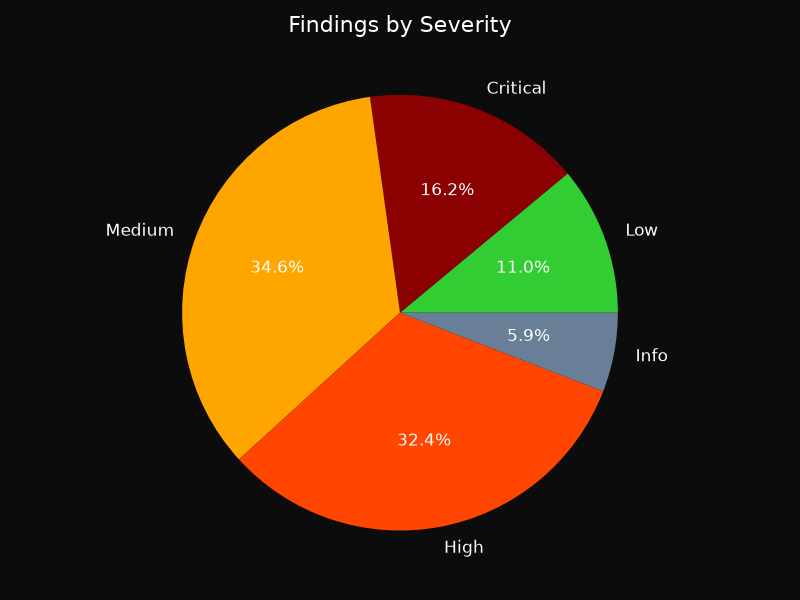
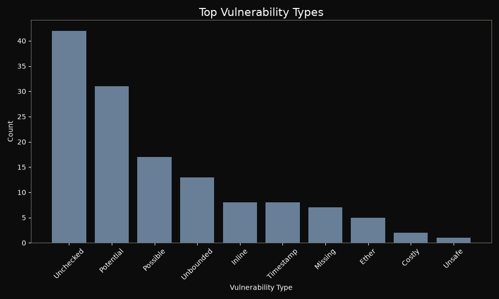

# Hawk-i Audit Report

**Generated:** 2026-07-23T13:27:44.084112Z

## Executive Summary

- **Mode:** minimal (AI: False, Sandbox: False)
- **Repository:** demo/damn-vulnerable-defi/src (local)
- **Contracts Scanned:** 42
- **Files Analyzed:** 53
- **Total Findings:** 136
- **Severity Breakdown:** Critical: 22, High: 44, Medium: 47, Low: 15, Info: 8
- **Simulation Success Rate:** N/A
- **Security Score:** 0/100 (Critical Risk)


> AI reasoning was not enabled during this scan.


> Exploit simulation was not executed.


## Vulnerability Breakdown

### Severity Distribution



### Vulnerability Types (Top 10)



### Severity Table

| Severity | Count |
|----------|-------|
| Critical | 22 |
| High     | 44 |
| Medium   | 47 |
| Low      | 15 |
| Info     | 8 |

## Detailed Findings

Each finding below shows exactly where the flaw is, the code responsible, a
plain explanation of why it is dangerous, its impact, and a concrete fix.


### F001 | Low: Costly operation inside a loop

- **Severity:** Low
- **Location:** `demo/damn-vulnerable-defi/src/the-rewarder/TheRewarderDistributor.sol:75`


**Vulnerable code**

```solidity
73 |     IERC20 token = tokens[i];
  74 |     if (distributions[token].remaining == 0) {
> 75 |         token.transfer(owner, token.balanceOf(address(this)));
  76 |     }
  77 | }
```

**What is wrong**

A loop body performs a gas-heavy operation on every iteration: an external call (`.call`/`.transfer`/`.send`) or a storage-array `.push`. Gas cost grows linearly with the iteration count, and external calls add untrusted code execution per element.

**Impact**

Once the iterated collection grows large enough, the transaction exceeds the block gas limit and the function becomes permanently uncallable (denial of service). With per-recipient transfers, a single reverting recipient can also block the entire batch.

**Recommended fix**

```solidity
Move to a pull-payment model (recipients withdraw individually), bound the iteration count, or process the collection in resumable batches instead of calling out / growing storage inside one unbounded loop.
```


---

### F002 | Low: Costly operation inside a loop

- **Severity:** Low
- **Location:** `demo/damn-vulnerable-defi/src/the-rewarder/TheRewarderDistributor.sol:116`


**Vulnerable code**

```solidity
114 |         if (!MerkleProof.verify(inputClaim.proof, root, leaf)) revert InvalidProof();
  115 |
> 116 |         inputTokens[inputClaim.tokenIndex].transfer(msg.sender, inputClaim.amount);
  117 |     }
  118 | }
```

**What is wrong**

A loop body performs a gas-heavy operation on every iteration: an external call (`.call`/`.transfer`/`.send`) or a storage-array `.push`. Gas cost grows linearly with the iteration count, and external calls add untrusted code execution per element.

**Impact**

Once the iterated collection grows large enough, the transaction exceeds the block gas limit and the function becomes permanently uncallable (denial of service). With per-recipient transfers, a single reverting recipient can also block the entire batch.

**Recommended fix**

```solidity
Move to a pull-payment model (recipients withdraw individually), bound the iteration count, or process the collection in resumable batches instead of calling out / growing storage inside one unbounded loop.
```


---

### F003 | Critical: Unsafe delegatecall

- **Severity:** Critical
- **Location:** `demo/damn-vulnerable-defi/src/unstoppable/UnstoppableVault.sol:125`


**Vulnerable code**

```solidity
123 | // Allow owner to execute arbitrary changes when paused
  124 | function execute(address target, bytes memory data) external onlyOwner whenPaused {
> 125 |     (bool success,) = target.delegatecall(data);
  126 |     require(success);
  127 | }
```

**What is wrong**

`delegatecall` executes code from another contract in the context of the caller. If the target address can be controlled by an attacker, they can manipulate the contract's storage and potentially drain funds or take over the contract.

**Impact**

An attacker can execute arbitrary code in the context of the vulnerable contract, leading to complete loss of funds or contract takeover.

**Recommended fix**

```solidity
// Never delegatecall into user supplied or unvalidated addresses.
// Whitelist implementations and align storage layouts.
address private immutable IMPLEMENTATION;

constructor(address impl) {
    require(impl != address(0), "Invalid implementation");
    IMPLEMENTATION = impl;
}

function _execute(bytes calldata data) internal {
    (bool ok, ) = IMPLEMENTATION.delegatecall(data);
    require(ok, "Delegatecall failed");
}

// For upgradeable contracts use the audited ERC1967/UUPS proxy from
// OpenZeppelin instead of hand rolling delegatecall.
```


---

### F004 | Medium: Unchecked ERC20 transfer

- **Severity:** Medium
- **Location:** `demo/damn-vulnerable-defi/src/curvy-puppet/CurvyPuppetLending.sol:58`


**Vulnerable code**

```solidity
56 |
  57 |     positions[msg.sender].collateralAmount = remainingCollateral;
> 58 |     IERC20(collateralAsset).transfer(msg.sender, amount);
  59 | }
  60 |
```

**What is wrong**

An ERC20 `transfer`/`transferFrom` call is executed as a bare statement, discarding its boolean return value. Many widely used tokens (e.g. USDT, BNB-chain BEP20s) signal failure by returning false instead of reverting, so the surrounding logic proceeds as if the tokens moved when they did not.

**Impact**

Accounting desynchronizes from real balances: deposits can be credited without tokens arriving, withdrawals marked paid without tokens leaving, enabling theft or permanent loss of user funds.

**Recommended fix**

```solidity
Wrap the call: `require(token.transfer(to, amount), "transfer failed");` or, better, use OpenZeppelin's SafeERC20 (`using SafeERC20 for IERC20;` then `token.safeTransfer(...)`), which also handles non-standard tokens that return no value.
```


---

### F005 | Medium: Unchecked ERC20 transfer

- **Severity:** Medium
- **Location:** `demo/damn-vulnerable-defi/src/curvy-puppet/CurvyPuppetLending.sol:82`


**Vulnerable code**

```solidity
80 |     // Update caller's position and transfer borrowed assets
  81 |     positions[msg.sender].borrowAmount += amount;
> 82 |     IERC20(borrowAsset).transfer(msg.sender, amount);
  83 | }
  84 |
```

**What is wrong**

An ERC20 `transfer`/`transferFrom` call is executed as a bare statement, discarding its boolean return value. Many widely used tokens (e.g. USDT, BNB-chain BEP20s) signal failure by returning false instead of reverting, so the surrounding logic proceeds as if the tokens moved when they did not.

**Impact**

Accounting desynchronizes from real balances: deposits can be credited without tokens arriving, withdrawals marked paid without tokens leaving, enabling theft or permanent loss of user funds.

**Recommended fix**

```solidity
Wrap the call: `require(token.transfer(to, amount), "transfer failed");` or, better, use OpenZeppelin's SafeERC20 (`using SafeERC20 for IERC20;` then `token.safeTransfer(...)`), which also handles non-standard tokens that return no value.
```


---

### F006 | Medium: Unchecked ERC20 transfer

- **Severity:** Medium
- **Location:** `demo/damn-vulnerable-defi/src/curvy-puppet/CurvyPuppetLending.sol:93`


**Vulnerable code**

```solidity
91 |         uint256 returnAmount = positions[msg.sender].collateralAmount;
  92 |         positions[msg.sender].collateralAmount = 0;
> 93 |         IERC20(collateralAsset).transfer(msg.sender, returnAmount);
  94 |     }
  95 | }
```

**What is wrong**

An ERC20 `transfer`/`transferFrom` call is executed as a bare statement, discarding its boolean return value. Many widely used tokens (e.g. USDT, BNB-chain BEP20s) signal failure by returning false instead of reverting, so the surrounding logic proceeds as if the tokens moved when they did not.

**Impact**

Accounting desynchronizes from real balances: deposits can be credited without tokens arriving, withdrawals marked paid without tokens leaving, enabling theft or permanent loss of user funds.

**Recommended fix**

```solidity
Wrap the call: `require(token.transfer(to, amount), "transfer failed");` or, better, use OpenZeppelin's SafeERC20 (`using SafeERC20 for IERC20;` then `token.safeTransfer(...)`), which also handles non-standard tokens that return no value.
```


---

### F007 | Medium: Unchecked ERC20 transfer

- **Severity:** Medium
- **Location:** `demo/damn-vulnerable-defi/src/curvy-puppet/CurvyPuppetLending.sol:108`


**Vulnerable code**

```solidity
106 |
  107 |     _pullAssets(borrowAsset, borrowAmount);
> 108 |     IERC20(collateralAsset).transfer(msg.sender, collateralAmount);
  109 | }
  110 |
```

**What is wrong**

An ERC20 `transfer`/`transferFrom` call is executed as a bare statement, discarding its boolean return value. Many widely used tokens (e.g. USDT, BNB-chain BEP20s) signal failure by returning false instead of reverting, so the surrounding logic proceeds as if the tokens moved when they did not.

**Impact**

Accounting desynchronizes from real balances: deposits can be credited without tokens arriving, withdrawals marked paid without tokens leaving, enabling theft or permanent loss of user funds.

**Recommended fix**

```solidity
Wrap the call: `require(token.transfer(to, amount), "transfer failed");` or, better, use OpenZeppelin's SafeERC20 (`using SafeERC20 for IERC20;` then `token.safeTransfer(...)`), which also handles non-standard tokens that return no value.
```


---

### F008 | Medium: Unchecked ERC20 transfer

- **Severity:** Medium
- **Location:** `demo/damn-vulnerable-defi/src/wallet-mining/WalletDeployer.sol:58`


**Vulnerable code**

```solidity
56 |
  57 | if (IERC20(gem).balanceOf(address(this)) >= pay) {
> 58 |     IERC20(gem).transfer(msg.sender, pay);
  59 | }
  60 | return true;
```

**What is wrong**

An ERC20 `transfer`/`transferFrom` call is executed as a bare statement, discarding its boolean return value. Many widely used tokens (e.g. USDT, BNB-chain BEP20s) signal failure by returning false instead of reverting, so the surrounding logic proceeds as if the tokens moved when they did not.

**Impact**

Accounting desynchronizes from real balances: deposits can be credited without tokens arriving, withdrawals marked paid without tokens leaving, enabling theft or permanent loss of user funds.

**Recommended fix**

```solidity
Wrap the call: `require(token.transfer(to, amount), "transfer failed");` or, better, use OpenZeppelin's SafeERC20 (`using SafeERC20 for IERC20;` then `token.safeTransfer(...)`), which also handles non-standard tokens that return no value.
```


---

### F009 | Medium: Unchecked ERC20 transfer

- **Severity:** Medium
- **Location:** `demo/damn-vulnerable-defi/src/selfie/SelfiePool.sol:59`


**Vulnerable code**

```solidity
57 | }
  58 |
> 59 | token.transfer(address(_receiver), _amount);
  60 | if (_receiver.onFlashLoan(msg.sender, _token, _amount, 0, _data) != CALLBACK_SUCCESS) {
  61 |     revert CallbackFailed();
```

**What is wrong**

An ERC20 `transfer`/`transferFrom` call is executed as a bare statement, discarding its boolean return value. Many widely used tokens (e.g. USDT, BNB-chain BEP20s) signal failure by returning false instead of reverting, so the surrounding logic proceeds as if the tokens moved when they did not.

**Impact**

Accounting desynchronizes from real balances: deposits can be credited without tokens arriving, withdrawals marked paid without tokens leaving, enabling theft or permanent loss of user funds.

**Recommended fix**

```solidity
Wrap the call: `require(token.transfer(to, amount), "transfer failed");` or, better, use OpenZeppelin's SafeERC20 (`using SafeERC20 for IERC20;` then `token.safeTransfer(...)`), which also handles non-standard tokens that return no value.
```


---

### F010 | Medium: Unchecked ERC20 transfer

- **Severity:** Medium
- **Location:** `demo/damn-vulnerable-defi/src/selfie/SelfiePool.sol:73`


**Vulnerable code**

```solidity
71 | function emergencyExit(address receiver) external onlyGovernance {
  72 |     uint256 amount = token.balanceOf(address(this));
> 73 |     token.transfer(receiver, amount);
  74 |
  75 |     emit EmergencyExit(receiver, amount);
```

**What is wrong**

An ERC20 `transfer`/`transferFrom` call is executed as a bare statement, discarding its boolean return value. Many widely used tokens (e.g. USDT, BNB-chain BEP20s) signal failure by returning false instead of reverting, so the surrounding logic proceeds as if the tokens moved when they did not.

**Impact**

Accounting desynchronizes from real balances: deposits can be credited without tokens arriving, withdrawals marked paid without tokens leaving, enabling theft or permanent loss of user funds.

**Recommended fix**

```solidity
Wrap the call: `require(token.transfer(to, amount), "transfer failed");` or, better, use OpenZeppelin's SafeERC20 (`using SafeERC20 for IERC20;` then `token.safeTransfer(...)`), which also handles non-standard tokens that return no value.
```


---

### F011 | Medium: Unchecked ERC20 transfer

- **Severity:** Medium
- **Location:** `demo/damn-vulnerable-defi/src/the-rewarder/TheRewarderDistributor.sol:75`


**Vulnerable code**

```solidity
73 |     IERC20 token = tokens[i];
  74 |     if (distributions[token].remaining == 0) {
> 75 |         token.transfer(owner, token.balanceOf(address(this)));
  76 |     }
  77 | }
```

**What is wrong**

An ERC20 `transfer`/`transferFrom` call is executed as a bare statement, discarding its boolean return value. Many widely used tokens (e.g. USDT, BNB-chain BEP20s) signal failure by returning false instead of reverting, so the surrounding logic proceeds as if the tokens moved when they did not.

**Impact**

Accounting desynchronizes from real balances: deposits can be credited without tokens arriving, withdrawals marked paid without tokens leaving, enabling theft or permanent loss of user funds.

**Recommended fix**

```solidity
Wrap the call: `require(token.transfer(to, amount), "transfer failed");` or, better, use OpenZeppelin's SafeERC20 (`using SafeERC20 for IERC20;` then `token.safeTransfer(...)`), which also handles non-standard tokens that return no value.
```


---

### F012 | Medium: Unchecked ERC20 transfer

- **Severity:** Medium
- **Location:** `demo/damn-vulnerable-defi/src/puppet-v2/PuppetV2Pool.sol:40`


**Vulnerable code**

```solidity
38 |
  39 | // Take the WETH
> 40 | _weth.transferFrom(msg.sender, address(this), amount);
  41 |
  42 | // internal accounting
```

**What is wrong**

An ERC20 `transfer`/`transferFrom` call is executed as a bare statement, discarding its boolean return value. Many widely used tokens (e.g. USDT, BNB-chain BEP20s) signal failure by returning false instead of reverting, so the surrounding logic proceeds as if the tokens moved when they did not.

**Impact**

Accounting desynchronizes from real balances: deposits can be credited without tokens arriving, withdrawals marked paid without tokens leaving, enabling theft or permanent loss of user funds.

**Recommended fix**

```solidity
Wrap the call: `require(token.transfer(to, amount), "transfer failed");` or, better, use OpenZeppelin's SafeERC20 (`using SafeERC20 for IERC20;` then `token.safeTransfer(...)`), which also handles non-standard tokens that return no value.
```


---

### F013 | Critical: Potential flash loan manipulation

- **Severity:** Critical
- **Location:** `demo/damn-vulnerable-defi/src/puppet-v2/UniswapV2Library.sol:44`


**Vulnerable code**

```solidity
42 | {
  43 |     (address token0,) = sortTokens(tokenA, tokenB);
> 44 |     (uint256 reserve0, uint256 reserve1,) = IUniswapV2Pair(pairFor(factory, tokenA, tokenB)).getReserves();
  45 |     (reserveA, reserveB) = tokenA == token0 ? (reserve0, reserve1) : (reserve1, reserve0);
  46 | }
```

**What is wrong**

Using spot prices derived from pool reserves in the same transaction allows an attacker to take a flash loan, manipulate the price, and profit before repaying the loan.

**Impact**

An attacker can drain funds by artificially inflating/deflating prices and trading against the protocol.

**Recommended fix**

```solidity
function swap(uint amountIn) public returns (uint) {
    uint price = getTwapPrice(); // use TWAP
    uint amountOut = amountIn * price / 1e18;
    // ...
}
```


---

### F014 | Low: Potential front-running via block.timestamp/number

- **Severity:** Low
- **Location:** `demo/damn-vulnerable-defi/src/DamnValuableStaking.sol:29`


**Vulnerable code**

```solidity
27 |     token = _dvt;
  28 |     rate = _rate;
> 29 |     lastUpdate = block.timestamp;
  30 | }
  31 |
```

**What is wrong**

Using `block.timestamp` or `block.number` for critical logic can allow miners or bots to front-run transactions by manipulating the block parameters or ordering.

**Impact**

Attackers can exploit front-running to gain unfair advantage, e.g., by seeing a pending trade and inserting their own transaction first.

**Recommended fix**

```solidity
// Add slippage protection and, where ordering matters, commit reveal.
function swap(uint amountIn, uint minAmountOut, uint deadline) external {
    require(block.timestamp <= deadline, "Expired");
    uint amountOut = _swap(amountIn);
    require(amountOut >= minAmountOut, "Slippage exceeded");
}

// Commit reveal for order sensitive actions:
// 1. commit(keccak256(abi.encode(value, salt)))
// 2. later reveal(value, salt) and verify the stored hash.
// Consider private mempools or batch auctions to remove ordering advantage.
```


---

### F015 | Low: Potential front-running via block.timestamp/number

- **Severity:** Low
- **Location:** `demo/damn-vulnerable-defi/src/curvy-puppet/CurvyPuppetOracle.sol:28`


**Vulnerable code**

```solidity
26 |
  27 | if (price.value == 0) revert UnsupportedAsset();
> 28 | if (block.timestamp > price.expiration) revert StalePrice();
  29 |
  30 | return price;
```

**What is wrong**

Using `block.timestamp` or `block.number` for critical logic can allow miners or bots to front-run transactions by manipulating the block parameters or ordering.

**Impact**

Attackers can exploit front-running to gain unfair advantage, e.g., by seeing a pending trade and inserting their own transaction first.

**Recommended fix**

```solidity
// Add slippage protection and, where ordering matters, commit reveal.
function swap(uint amountIn, uint minAmountOut, uint deadline) external {
    require(block.timestamp <= deadline, "Expired");
    uint amountOut = _swap(amountIn);
    require(amountOut >= minAmountOut, "Slippage exceeded");
}

// Commit reveal for order sensitive actions:
// 1. commit(keccak256(abi.encode(value, salt)))
// 2. later reveal(value, salt) and verify the stored hash.
// Consider private mempools or batch auctions to remove ordering advantage.
```


---

### F016 | Low: Potential front-running via block.timestamp/number

- **Severity:** Low
- **Location:** `demo/damn-vulnerable-defi/src/shards/ShardsNFTMarketplace.sol:131`


**Vulnerable code**

```solidity
129 |     rate: _currentRate,
  130 |     buyer: msg.sender,
> 131 |     timestamp: uint64(block.timestamp),
  132 |     cancelled: false
  133 | })
```

**What is wrong**

Using `block.timestamp` or `block.number` for critical logic can allow miners or bots to front-run transactions by manipulating the block parameters or ordering.

**Impact**

Attackers can exploit front-running to gain unfair advantage, e.g., by seeing a pending trade and inserting their own transaction first.

**Recommended fix**

```solidity
// Add slippage protection and, where ordering matters, commit reveal.
function swap(uint amountIn, uint minAmountOut, uint deadline) external {
    require(block.timestamp <= deadline, "Expired");
    uint amountOut = _swap(amountIn);
    require(amountOut >= minAmountOut, "Slippage exceeded");
}

// Commit reveal for order sensitive actions:
// 1. commit(keccak256(abi.encode(value, salt)))
// 2. later reveal(value, salt) and verify the stored hash.
// Consider private mempools or batch auctions to remove ordering advantage.
```


---

### F017 | Low: Potential front-running via block.timestamp/number

- **Severity:** Low
- **Location:** `demo/damn-vulnerable-defi/src/climber/ClimberVault.sol:43`


**Vulnerable code**

```solidity
41 |
  42 |     _setSweeper(sweeper);
> 43 |     _updateLastWithdrawalTimestamp(block.timestamp);
  44 | }
  45 |
```

**What is wrong**

Using `block.timestamp` or `block.number` for critical logic can allow miners or bots to front-run transactions by manipulating the block parameters or ordering.

**Impact**

Attackers can exploit front-running to gain unfair advantage, e.g., by seeing a pending trade and inserting their own transaction first.

**Recommended fix**

```solidity
// Add slippage protection and, where ordering matters, commit reveal.
function swap(uint amountIn, uint minAmountOut, uint deadline) external {
    require(block.timestamp <= deadline, "Expired");
    uint amountOut = _swap(amountIn);
    require(amountOut >= minAmountOut, "Slippage exceeded");
}

// Commit reveal for order sensitive actions:
// 1. commit(keccak256(abi.encode(value, salt)))
// 2. later reveal(value, salt) and verify the stored hash.
// Consider private mempools or batch auctions to remove ordering advantage.
```


---

### F018 | Low: Potential front-running via block.timestamp/number

- **Severity:** Low
- **Location:** `demo/damn-vulnerable-defi/src/climber/ClimberTimelock.sol:65`


**Vulnerable code**

```solidity
63 |     }
  64 |
> 65 |     operations[id].readyAtTimestamp = uint64(block.timestamp) + delay;
  66 |     operations[id].known = true;
  67 | }
```

**What is wrong**

Using `block.timestamp` or `block.number` for critical logic can allow miners or bots to front-run transactions by manipulating the block parameters or ordering.

**Impact**

Attackers can exploit front-running to gain unfair advantage, e.g., by seeing a pending trade and inserting their own transaction first.

**Recommended fix**

```solidity
// Add slippage protection and, where ordering matters, commit reveal.
function swap(uint amountIn, uint minAmountOut, uint deadline) external {
    require(block.timestamp <= deadline, "Expired");
    uint amountOut = _swap(amountIn);
    require(amountOut >= minAmountOut, "Slippage exceeded");
}

// Commit reveal for order sensitive actions:
// 1. commit(keccak256(abi.encode(value, salt)))
// 2. later reveal(value, salt) and verify the stored hash.
// Consider private mempools or batch auctions to remove ordering advantage.
```


---

### F019 | Low: Potential front-running via block.timestamp/number

- **Severity:** Low
- **Location:** `demo/damn-vulnerable-defi/src/climber/ClimberTimelockBase.sol:34`


**Vulnerable code**

```solidity
32 | if (op.executed) {
  33 |     state = OperationState.Executed;
> 34 | } else if (block.timestamp < op.readyAtTimestamp) {
  35 |     state = OperationState.Scheduled;
  36 | } else {
```

**What is wrong**

Using `block.timestamp` or `block.number` for critical logic can allow miners or bots to front-run transactions by manipulating the block parameters or ordering.

**Impact**

Attackers can exploit front-running to gain unfair advantage, e.g., by seeing a pending trade and inserting their own transaction first.

**Recommended fix**

```solidity
// Add slippage protection and, where ordering matters, commit reveal.
function swap(uint amountIn, uint minAmountOut, uint deadline) external {
    require(block.timestamp <= deadline, "Expired");
    uint amountOut = _swap(amountIn);
    require(amountOut >= minAmountOut, "Slippage exceeded");
}

// Commit reveal for order sensitive actions:
// 1. commit(keccak256(abi.encode(value, salt)))
// 2. later reveal(value, salt) and verify the stored hash.
// Consider private mempools or batch auctions to remove ordering advantage.
```


---

### F020 | Low: Potential front-running via block.timestamp/number

- **Severity:** Low
- **Location:** `demo/damn-vulnerable-defi/src/withdrawal/L2MessageStore.sol:18`


**Vulnerable code**

```solidity
16 |
  17 | function store(address target, bytes memory data) external {
> 18 |     bytes32 id = keccak256(abi.encode(nonce, msg.sender, target, block.timestamp, data));
  19 |
  20 |     messageStore[id] = true;
```

**What is wrong**

Using `block.timestamp` or `block.number` for critical logic can allow miners or bots to front-run transactions by manipulating the block parameters or ordering.

**Impact**

Attackers can exploit front-running to gain unfair advantage, e.g., by seeing a pending trade and inserting their own transaction first.

**Recommended fix**

```solidity
// Add slippage protection and, where ordering matters, commit reveal.
function swap(uint amountIn, uint minAmountOut, uint deadline) external {
    require(block.timestamp <= deadline, "Expired");
    uint amountOut = _swap(amountIn);
    require(amountOut >= minAmountOut, "Slippage exceeded");
}

// Commit reveal for order sensitive actions:
// 1. commit(keccak256(abi.encode(value, salt)))
// 2. later reveal(value, salt) and verify the stored hash.
// Consider private mempools or batch auctions to remove ordering advantage.
```


---

### F021 | Low: Potential front-running via block.timestamp/number

- **Severity:** Low
- **Location:** `demo/damn-vulnerable-defi/src/withdrawal/L1Gateway.sol:42`


**Vulnerable code**

```solidity
40 |     bytes32[] memory proof
  41 | ) external {
> 42 |     if (timestamp + DELAY > block.timestamp) revert EarlyWithdrawal();
  43 |
  44 |     bytes32 leaf = keccak256(abi.encode(nonce, l2Sender, target, timestamp, message));
```

**What is wrong**

Using `block.timestamp` or `block.number` for critical logic can allow miners or bots to front-run transactions by manipulating the block parameters or ordering.

**Impact**

Attackers can exploit front-running to gain unfair advantage, e.g., by seeing a pending trade and inserting their own transaction first.

**Recommended fix**

```solidity
// Add slippage protection and, where ordering matters, commit reveal.
function swap(uint amountIn, uint minAmountOut, uint deadline) external {
    require(block.timestamp <= deadline, "Expired");
    uint amountOut = _swap(amountIn);
    require(amountOut >= minAmountOut, "Slippage exceeded");
}

// Commit reveal for order sensitive actions:
// 1. commit(keccak256(abi.encode(value, salt)))
// 2. later reveal(value, salt) and verify the stored hash.
// Consider private mempools or batch auctions to remove ordering advantage.
```


---

### F022 | Low: Potential front-running via block.timestamp/number

- **Severity:** Low
- **Location:** `demo/damn-vulnerable-defi/src/abi-smuggling/SelfAuthorizedVault.sol:13`


**Vulnerable code**

```solidity
11 | uint256 public constant WAITING_PERIOD = 15 days;
  12 |
> 13 | uint256 private _lastWithdrawalTimestamp = block.timestamp;
  14 |
  15 | error TargetNotAllowed();
```

**What is wrong**

Using `block.timestamp` or `block.number` for critical logic can allow miners or bots to front-run transactions by manipulating the block parameters or ordering.

**Impact**

Attackers can exploit front-running to gain unfair advantage, e.g., by seeing a pending trade and inserting their own transaction first.

**Recommended fix**

```solidity
// Add slippage protection and, where ordering matters, commit reveal.
function swap(uint amountIn, uint minAmountOut, uint deadline) external {
    require(block.timestamp <= deadline, "Expired");
    uint amountOut = _swap(amountIn);
    require(amountOut >= minAmountOut, "Slippage exceeded");
}

// Commit reveal for order sensitive actions:
// 1. commit(keccak256(abi.encode(value, salt)))
// 2. later reveal(value, salt) and verify the stored hash.
// Consider private mempools or batch auctions to remove ordering advantage.
```


---

### F023 | Low: Potential front-running via block.timestamp/number

- **Severity:** Low
- **Location:** `demo/damn-vulnerable-defi/src/selfie/SimpleGovernance.sol:41`


**Vulnerable code**

```solidity
39 | target: target,
  40 | value: value,
> 41 | proposedAt: uint64(block.timestamp),
  42 | executedAt: 0,
  43 | data: data
```

**What is wrong**

Using `block.timestamp` or `block.number` for critical logic can allow miners or bots to front-run transactions by manipulating the block parameters or ordering.

**Impact**

Attackers can exploit front-running to gain unfair advantage, e.g., by seeing a pending trade and inserting their own transaction first.

**Recommended fix**

```solidity
// Add slippage protection and, where ordering matters, commit reveal.
function swap(uint amountIn, uint minAmountOut, uint deadline) external {
    require(block.timestamp <= deadline, "Expired");
    uint amountOut = _swap(amountIn);
    require(amountOut >= minAmountOut, "Slippage exceeded");
}

// Commit reveal for order sensitive actions:
// 1. commit(keccak256(abi.encode(value, salt)))
// 2. later reveal(value, salt) and verify the stored hash.
// Consider private mempools or batch auctions to remove ordering advantage.
```


---

### F024 | Low: Potential front-running via block.timestamp/number

- **Severity:** Low
- **Location:** `demo/damn-vulnerable-defi/src/unstoppable/UnstoppableVault.sol:23`


**Vulnerable code**

```solidity
21 | uint64 public constant GRACE_PERIOD = 30 days;
  22 |
> 23 | uint64 public immutable end = uint64(block.timestamp) + GRACE_PERIOD;
  24 |
  25 | address public feeRecipient;
```

**What is wrong**

Using `block.timestamp` or `block.number` for critical logic can allow miners or bots to front-run transactions by manipulating the block parameters or ordering.

**Impact**

Attackers can exploit front-running to gain unfair advantage, e.g., by seeing a pending trade and inserting their own transaction first.

**Recommended fix**

```solidity
// Add slippage protection and, where ordering matters, commit reveal.
function swap(uint amountIn, uint minAmountOut, uint deadline) external {
    require(block.timestamp <= deadline, "Expired");
    uint amountOut = _swap(amountIn);
    require(amountOut >= minAmountOut, "Slippage exceeded");
}

// Commit reveal for order sensitive actions:
// 1. commit(keccak256(abi.encode(value, salt)))
// 2. later reveal(value, salt) and verify the stored hash.
// Consider private mempools or batch auctions to remove ordering advantage.
```


---

### F025 | Low: Potential front-running via block.timestamp/number

- **Severity:** Low
- **Location:** `demo/damn-vulnerable-defi/src/puppet-v2/PuppetV2Pool.sol:47`


**Vulnerable code**

```solidity
45 |     require(_token.transfer(msg.sender, borrowAmount), "Transfer failed");
  46 |
> 47 |     emit Borrowed(msg.sender, amount, borrowAmount, block.timestamp);
  48 | }
  49 |
```

**What is wrong**

Using `block.timestamp` or `block.number` for critical logic can allow miners or bots to front-run transactions by manipulating the block parameters or ordering.

**Impact**

Attackers can exploit front-running to gain unfair advantage, e.g., by seeing a pending trade and inserting their own transaction first.

**Recommended fix**

```solidity
// Add slippage protection and, where ordering matters, commit reveal.
function swap(uint amountIn, uint minAmountOut, uint deadline) external {
    require(block.timestamp <= deadline, "Expired");
    uint amountOut = _swap(amountIn);
    require(amountOut >= minAmountOut, "Slippage exceeded");
}

// Commit reveal for order sensitive actions:
// 1. commit(keccak256(abi.encode(value, salt)))
// 2. later reveal(value, salt) and verify the stored hash.
// Consider private mempools or batch auctions to remove ordering advantage.
```


---

### F026 | Low: Potential front-running via block.timestamp/number

- **Severity:** Low
- **Location:** `demo/damn-vulnerable-defi/src/naive-receiver/BasicForwarder.sol:46`


**Vulnerable code**

```solidity
44 | function _checkRequest(Request calldata request, bytes calldata signature) private view {
  45 |     if (request.value != msg.value) revert InvalidValue();
> 46 |     if (block.timestamp > request.deadline) revert OldRequest();
  47 |     if (nonces[request.from] != request.nonce) revert InvalidNonce();
  48 |
```

**What is wrong**

Using `block.timestamp` or `block.number` for critical logic can allow miners or bots to front-run transactions by manipulating the block parameters or ordering.

**Impact**

Attackers can exploit front-running to gain unfair advantage, e.g., by seeing a pending trade and inserting their own transaction first.

**Recommended fix**

```solidity
// Add slippage protection and, where ordering matters, commit reveal.
function swap(uint amountIn, uint minAmountOut, uint deadline) external {
    require(block.timestamp <= deadline, "Expired");
    uint amountOut = _swap(amountIn);
    require(amountOut >= minAmountOut, "Slippage exceeded");
}

// Commit reveal for order sensitive actions:
// 1. commit(keccak256(abi.encode(value, salt)))
// 2. later reveal(value, salt) and verify the stored hash.
// Consider private mempools or batch auctions to remove ordering advantage.
```


---

### F027 | High: Potential gas griefing (unbounded loop)

- **Severity:** High
- **Location:** `demo/damn-vulnerable-defi/src/free-rider/FreeRiderNFTMarketplace.sol:84`


**Vulnerable code**

```solidity
82 |
  83 | function buyMany(uint256[] calldata tokenIds) external payable nonReentrant {
> 84 |     for (uint256 i = 0; i < tokenIds.length; ++i) {
  85 |         unchecked {
  86 |             _buyOne(tokenIds[i]);
```

**What is wrong**

If a contract performs operations that cost gas proportional to user-supplied data (e.g., iterating over an array), an attacker can cause the transaction to run out of gas or cost the victim a lot of gas.

**Impact**

An attacker can grief users by making their transactions fail or become extremely expensive, effectively blocking them.

**Recommended fix**

```solidity
// Limit loop iterations
uint maxIterations = 100;
for (uint i = 0; i < array.length && i < maxIterations; i++) {
    // process
}
```


---

### F028 | High: Potential gas griefing (unbounded loop)

- **Severity:** High
- **Location:** `demo/damn-vulnerable-defi/src/shards/ShardsNFTMarketplace.sol:205`


**Vulnerable code**

```solidity
203 | uint256 payment;
  204 |
> 205 | for (uint256 i = 0; i < _purchases.length; i++) {
  206 |     Purchase memory purchase = _purchases[i];
  207 |     if (purchase.cancelled) continue;
```

**What is wrong**

If a contract performs operations that cost gas proportional to user-supplied data (e.g., iterating over an array), an attacker can cause the transaction to run out of gas or cost the victim a lot of gas.

**Impact**

An attacker can grief users by making their transactions fail or become extremely expensive, effectively blocking them.

**Recommended fix**

```solidity
// Limit loop iterations
uint maxIterations = 100;
for (uint i = 0; i < array.length && i < maxIterations; i++) {
    // process
}
```


---

### F029 | High: Potential gas griefing (unbounded loop)

- **Severity:** High
- **Location:** `demo/damn-vulnerable-defi/src/wallet-mining/AuthorizerUpgradeable.sol:17`


**Vulnerable code**

```solidity
15 | function init(address[] memory _wards, address[] memory _aims) external {
  16 |     require(needsInit != 0, "cannot init");
> 17 |     for (uint256 i = 0; i < _wards.length; i++) {
  18 |         _rely(_wards[i], _aims[i]);
  19 |     }
```

**What is wrong**

If a contract performs operations that cost gas proportional to user-supplied data (e.g., iterating over an array), an attacker can cause the transaction to run out of gas or cost the victim a lot of gas.

**Impact**

An attacker can grief users by making their transactions fail or become extremely expensive, effectively blocking them.

**Recommended fix**

```solidity
// Limit loop iterations
uint maxIterations = 100;
for (uint i = 0; i < array.length && i < maxIterations; i++) {
    // process
}
```


---

### F030 | High: Potential gas griefing (unbounded loop)

- **Severity:** High
- **Location:** `demo/damn-vulnerable-defi/src/climber/ClimberTimelock.sol:90`


**Vulnerable code**

```solidity
88 | bytes32 id = getOperationId(targets, values, dataElements, salt);
  89 |
> 90 | for (uint8 i = 0; i < targets.length; ++i) {
  91 |     targets[i].functionCallWithValue(dataElements[i], values[i]);
  92 | }
```

**What is wrong**

If a contract performs operations that cost gas proportional to user-supplied data (e.g., iterating over an array), an attacker can cause the transaction to run out of gas or cost the victim a lot of gas.

**Impact**

An attacker can grief users by making their transactions fail or become extremely expensive, effectively blocking them.

**Recommended fix**

```solidity
// Limit loop iterations
uint maxIterations = 100;
for (uint i = 0; i < array.length && i < maxIterations; i++) {
    // process
}
```


---

### F031 | High: Potential gas griefing (unbounded loop)

- **Severity:** High
- **Location:** `demo/damn-vulnerable-defi/src/abi-smuggling/AuthorizedExecutor.sol:30`


**Vulnerable code**

```solidity
28 | }
  29 |
> 30 | for (uint256 i = 0; i < ids.length;) {
  31 |     unchecked {
  32 |         permissions[ids[i]] = true;
```

**What is wrong**

If a contract performs operations that cost gas proportional to user-supplied data (e.g., iterating over an array), an attacker can cause the transaction to run out of gas or cost the victim a lot of gas.

**Impact**

An attacker can grief users by making their transactions fail or become extremely expensive, effectively blocking them.

**Recommended fix**

```solidity
// Limit loop iterations
uint maxIterations = 100;
for (uint i = 0; i < array.length && i < maxIterations; i++) {
    // process
}
```


---

### F032 | High: Potential gas griefing (unbounded loop)

- **Severity:** High
- **Location:** `demo/damn-vulnerable-defi/src/the-rewarder/TheRewarderDistributor.sol:72`


**Vulnerable code**

```solidity
70 |
  71 | function clean(IERC20[] calldata tokens) external {
> 72 |     for (uint256 i = 0; i < tokens.length; i++) {
  73 |         IERC20 token = tokens[i];
  74 |         if (distributions[token].remaining == 0) {
```

**What is wrong**

If a contract performs operations that cost gas proportional to user-supplied data (e.g., iterating over an array), an attacker can cause the transaction to run out of gas or cost the victim a lot of gas.

**Impact**

An attacker can grief users by making their transactions fail or become extremely expensive, effectively blocking them.

**Recommended fix**

```solidity
// Limit loop iterations
uint maxIterations = 100;
for (uint i = 0; i < array.length && i < maxIterations; i++) {
    // process
}
```


---

### F033 | High: Potential gas griefing (unbounded loop)

- **Severity:** High
- **Location:** `demo/damn-vulnerable-defi/src/the-rewarder/TheRewarderDistributor.sol:87`


**Vulnerable code**

```solidity
85 | uint256 amount;
  86 |
> 87 | for (uint256 i = 0; i < inputClaims.length; i++) {
  88 |     inputClaim = inputClaims[i];
  89 |
```

**What is wrong**

If a contract performs operations that cost gas proportional to user-supplied data (e.g., iterating over an array), an attacker can cause the transaction to run out of gas or cost the victim a lot of gas.

**Impact**

An attacker can grief users by making their transactions fail or become extremely expensive, effectively blocking them.

**Recommended fix**

```solidity
// Limit loop iterations
uint maxIterations = 100;
for (uint i = 0; i < array.length && i < maxIterations; i++) {
    // process
}
```


---

### F034 | High: Potential gas griefing (unbounded loop)

- **Severity:** High
- **Location:** `demo/damn-vulnerable-defi/src/puppet-v2/UniswapV2Library.sol:91`


**Vulnerable code**

```solidity
89 | amounts = new uint256[](path.length);
  90 | amounts[0] = amountIn;
> 91 | for (uint256 i; i < path.length - 1; i++) {
  92 |     (uint256 reserveIn, uint256 reserveOut) = getReserves(factory, path[i], path[i + 1]);
  93 |     amounts[i + 1] = getAmountOut(amounts[i], reserveIn, reserveOut);
```

**What is wrong**

If a contract performs operations that cost gas proportional to user-supplied data (e.g., iterating over an array), an attacker can cause the transaction to run out of gas or cost the victim a lot of gas.

**Impact**

An attacker can grief users by making their transactions fail or become extremely expensive, effectively blocking them.

**Recommended fix**

```solidity
// Limit loop iterations
uint maxIterations = 100;
for (uint i = 0; i < array.length && i < maxIterations; i++) {
    // process
}
```


---

### F035 | High: Potential gas griefing (unbounded loop)

- **Severity:** High
- **Location:** `demo/damn-vulnerable-defi/src/puppet-v2/UniswapV2Library.sol:106`


**Vulnerable code**

```solidity
104 | amounts = new uint256[](path.length);
  105 | amounts[amounts.length - 1] = amountOut;
> 106 | for (uint256 i = path.length - 1; i > 0; i--) {
  107 |     (uint256 reserveIn, uint256 reserveOut) = getReserves(factory, path[i - 1], path[i]);
  108 |     amounts[i - 1] = getAmountIn(amounts[i], reserveIn, reserveOut);
```

**What is wrong**

If a contract performs operations that cost gas proportional to user-supplied data (e.g., iterating over an array), an attacker can cause the transaction to run out of gas or cost the victim a lot of gas.

**Impact**

An attacker can grief users by making their transactions fail or become extremely expensive, effectively blocking them.

**Recommended fix**

```solidity
// Limit loop iterations
uint maxIterations = 100;
for (uint i = 0; i < array.length && i < maxIterations; i++) {
    // process
}
```


---

### F036 | High: Potential gas griefing (unbounded loop)

- **Severity:** High
- **Location:** `demo/damn-vulnerable-defi/src/backdoor/WalletRegistry.sol:52`


**Vulnerable code**

```solidity
50 | token = IERC20(tokenAddress);
  51 |
> 52 | for (uint256 i = 0; i < initialBeneficiaries.length; ++i) {
  53 |     unchecked {
  54 |         beneficiaries[initialBeneficiaries[i]] = true;
```

**What is wrong**

If a contract performs operations that cost gas proportional to user-supplied data (e.g., iterating over an array), an attacker can cause the transaction to run out of gas or cost the victim a lot of gas.

**Impact**

An attacker can grief users by making their transactions fail or become extremely expensive, effectively blocking them.

**Recommended fix**

```solidity
// Limit loop iterations
uint maxIterations = 100;
for (uint i = 0; i < array.length && i < maxIterations; i++) {
    // process
}
```


---

### F037 | High: Potential gas griefing (unbounded loop)

- **Severity:** High
- **Location:** `demo/damn-vulnerable-defi/src/naive-receiver/Multicall.sol:11`


**Vulnerable code**

```solidity
9 | function multicall(bytes[] calldata data) external virtual returns (bytes[] memory results) {
  10 |     results = new bytes[](data.length);
> 11 |     for (uint256 i = 0; i < data.length; i++) {
  12 |         results[i] = Address.functionDelegateCall(address(this), data[i]);
  13 |     }
```

**What is wrong**

If a contract performs operations that cost gas proportional to user-supplied data (e.g., iterating over an array), an attacker can cause the transaction to run out of gas or cost the victim a lot of gas.

**Impact**

An attacker can grief users by making their transactions fail or become extremely expensive, effectively blocking them.

**Recommended fix**

```solidity
// Limit loop iterations
uint maxIterations = 100;
for (uint i = 0; i < array.length && i < maxIterations; i++) {
    // process
}
```


---

### F038 | High: Potential gas griefing (unbounded loop)

- **Severity:** High
- **Location:** `demo/damn-vulnerable-defi/src/compromised/TrustfulOracle.sol:28`


**Vulnerable code**

```solidity
26 |     revert NotEnoughSources();
  27 | }
> 28 | for (uint256 i = 0; i < sources.length;) {
  29 |     unchecked {
  30 |         _grantRole(TRUSTED_SOURCE_ROLE, sources[i]);
```

**What is wrong**

If a contract performs operations that cost gas proportional to user-supplied data (e.g., iterating over an array), an attacker can cause the transaction to run out of gas or cost the victim a lot of gas.

**Impact**

An attacker can grief users by making their transactions fail or become extremely expensive, effectively blocking them.

**Recommended fix**

```solidity
// Limit loop iterations
uint maxIterations = 100;
for (uint i = 0; i < array.length && i < maxIterations; i++) {
    // process
}
```


---

### F039 | High: Potential gas griefing (unbounded loop)

- **Severity:** High
- **Location:** `demo/damn-vulnerable-defi/src/compromised/TrustfulOracle.sol:46`


**Vulnerable code**

```solidity
44 | // Only allow one (symbol, price) per source
  45 | require(sources.length == symbols.length && symbols.length == prices.length);
> 46 | for (uint256 i = 0; i < sources.length;) {
  47 |     unchecked {
  48 |         _setPrice(sources[i], symbols[i], prices[i]);
```

**What is wrong**

If a contract performs operations that cost gas proportional to user-supplied data (e.g., iterating over an array), an attacker can cause the transaction to run out of gas or cost the victim a lot of gas.

**Impact**

An attacker can grief users by making their transactions fail or become extremely expensive, effectively blocking them.

**Recommended fix**

```solidity
// Limit loop iterations
uint maxIterations = 100;
for (uint i = 0; i < array.length && i < maxIterations; i++) {
    // process
}
```


---

### F040 | Info: Inline assembly used

- **Severity:** Info
- **Location:** `demo/damn-vulnerable-defi/src/free-rider/FreeRiderNFTMarketplace.sol:75`


**Vulnerable code**

```solidity
73 | offers[tokenId] = price;
  74 |
> 75 | assembly {
  76 |     // gas savings
  77 |     sstore(0x02, add(sload(0x02), 0x01))
```

**What is wrong**

The contract contains an inline `assembly` block. Assembly bypasses Solidity's type system, overflow checks and memory-safety guarantees, so any mistake inside the block goes undetected by the compiler.

**Impact**

Errors in hand-written assembly (wrong memory offsets, missing checks, unchecked external call results) can corrupt state or leak funds without any compiler warning. This is informational; assembly is often legitimate.

**Recommended fix**

```solidity
Prefer high-level Solidity where possible. If assembly is required, keep the block minimal, mark it `memory-safe` when applicable, document the invariants it relies on, and cover it with targeted tests.
```


---

### F041 | Info: Inline assembly used

- **Severity:** Info
- **Location:** `demo/damn-vulnerable-defi/src/wallet-mining/WalletDeployer.sol:64`


**Vulnerable code**

```solidity
62 |
  63 | function can(address u, address a) public view returns (bool y) {
> 64 |     assembly {
  65 |         let m := sload(0)
  66 |         if iszero(extcodesize(m)) { stop() }
```

**What is wrong**

The contract contains an inline `assembly` block. Assembly bypasses Solidity's type system, overflow checks and memory-safety guarantees, so any mistake inside the block goes undetected by the compiler.

**Impact**

Errors in hand-written assembly (wrong memory offsets, missing checks, unchecked external call results) can corrupt state or leak funds without any compiler warning. This is informational; assembly is often legitimate.

**Recommended fix**

```solidity
Prefer high-level Solidity where possible. If assembly is required, keep the block minimal, mark it `memory-safe` when applicable, document the invariants it relies on, and cover it with targeted tests.
```


---

### F042 | Info: Inline assembly used

- **Severity:** Info
- **Location:** `demo/damn-vulnerable-defi/src/withdrawal/L1Gateway.sol:64`


**Vulnerable code**

```solidity
62 | xSender = l2Sender;
  63 | bool success;
> 64 | assembly {
  65 |     success := call(gas(), target, 0, add(message, 0x20), mload(message), 0, 0) // call with 0 value. Don't copy returndata.
  66 | }
```

**What is wrong**

The contract contains an inline `assembly` block. Assembly bypasses Solidity's type system, overflow checks and memory-safety guarantees, so any mistake inside the block goes undetected by the compiler.

**Impact**

Errors in hand-written assembly (wrong memory offsets, missing checks, unchecked external call results) can corrupt state or leak funds without any compiler warning. This is informational; assembly is often legitimate.

**Recommended fix**

```solidity
Prefer high-level Solidity where possible. If assembly is required, keep the block minimal, mark it `memory-safe` when applicable, document the invariants it relies on, and cover it with targeted tests.
```


---

### F043 | Info: Inline assembly used

- **Severity:** Info
- **Location:** `demo/damn-vulnerable-defi/src/withdrawal/L1Forwarder.sol:61`


**Vulnerable code**

```solidity
59 | context = Context({l2Sender: l2Sender});
  60 | bool success;
> 61 | assembly {
  62 |     success := call(gas(), target, 0, add(message, 0x20), mload(message), 0, 0) // call with 0 value. Don't copy returndata.
  63 | }
```

**What is wrong**

The contract contains an inline `assembly` block. Assembly bypasses Solidity's type system, overflow checks and memory-safety guarantees, so any mistake inside the block goes undetected by the compiler.

**Impact**

Errors in hand-written assembly (wrong memory offsets, missing checks, unchecked external call results) can corrupt state or leak funds without any compiler warning. This is informational; assembly is often legitimate.

**Recommended fix**

```solidity
Prefer high-level Solidity where possible. If assembly is required, keep the block minimal, mark it `memory-safe` when applicable, document the invariants it relies on, and cover it with targeted tests.
```


---

### F044 | Info: Inline assembly used

- **Severity:** Info
- **Location:** `demo/damn-vulnerable-defi/src/abi-smuggling/AuthorizedExecutor.sol:50`


**Vulnerable code**

```solidity
48 | bytes4 selector;
  49 | uint256 calldataOffset = 4 + 32 * 3; // calldata position where `actionData` begins
> 50 | assembly {
  51 |     selector := calldataload(calldataOffset)
  52 | }
```

**What is wrong**

The contract contains an inline `assembly` block. Assembly bypasses Solidity's type system, overflow checks and memory-safety guarantees, so any mistake inside the block goes undetected by the compiler.

**Impact**

Errors in hand-written assembly (wrong memory offsets, missing checks, unchecked external call results) can corrupt state or leak funds without any compiler warning. This is informational; assembly is often legitimate.

**Recommended fix**

```solidity
Prefer high-level Solidity where possible. If assembly is required, keep the block minimal, mark it `memory-safe` when applicable, document the invariants it relies on, and cover it with targeted tests.
```


---

### F045 | Info: Inline assembly used

- **Severity:** Info
- **Location:** `demo/damn-vulnerable-defi/src/naive-receiver/BasicForwarder.sol:65`


**Vulnerable code**

```solidity
63 | bytes memory payload = abi.encodePacked(request.data, request.from);
  64 | uint256 forwardGas = request.gas;
> 65 | assembly {
  66 |     success := call(forwardGas, target, value, add(payload, 0x20), mload(payload), 0, 0) // don't copy returndata
  67 |     gasLeft := gas()
```

**What is wrong**

The contract contains an inline `assembly` block. Assembly bypasses Solidity's type system, overflow checks and memory-safety guarantees, so any mistake inside the block goes undetected by the compiler.

**Impact**

Errors in hand-written assembly (wrong memory offsets, missing checks, unchecked external call results) can corrupt state or leak funds without any compiler warning. This is informational; assembly is often legitimate.

**Recommended fix**

```solidity
Prefer high-level Solidity where possible. If assembly is required, keep the block minimal, mark it `memory-safe` when applicable, document the invariants it relies on, and cover it with targeted tests.
```


---

### F046 | Info: Inline assembly used

- **Severity:** Info
- **Location:** `demo/damn-vulnerable-defi/src/naive-receiver/BasicForwarder.sol:71`


**Vulnerable code**

```solidity
69 |
  70 | if (gasLeft < request.gas / 63) {
> 71 |     assembly {
  72 |         invalid()
  73 |     }
```

**What is wrong**

The contract contains an inline `assembly` block. Assembly bypasses Solidity's type system, overflow checks and memory-safety guarantees, so any mistake inside the block goes undetected by the compiler.

**Impact**

Errors in hand-written assembly (wrong memory offsets, missing checks, unchecked external call results) can corrupt state or leak funds without any compiler warning. This is informational; assembly is often legitimate.

**Recommended fix**

```solidity
Prefer high-level Solidity where possible. If assembly is required, keep the block minimal, mark it `memory-safe` when applicable, document the invariants it relies on, and cover it with targeted tests.
```


---

### F047 | Info: Inline assembly used

- **Severity:** Info
- **Location:** `demo/damn-vulnerable-defi/src/naive-receiver/FlashLoanReceiver.sol:19`


**Vulnerable code**

```solidity
17 |     returns (bytes32)
  18 | {
> 19 |     assembly {
  20 |         // gas savings
  21 |         if iszero(eq(sload(pool.slot), caller())) {
```

**What is wrong**

The contract contains an inline `assembly` block. Assembly bypasses Solidity's type system, overflow checks and memory-safety guarantees, so any mistake inside the block goes undetected by the compiler.

**Impact**

Errors in hand-written assembly (wrong memory offsets, missing checks, unchecked external call results) can corrupt state or leak funds without any compiler warning. This is informational; assembly is often legitimate.

**Recommended fix**

```solidity
Prefer high-level Solidity where possible. If assembly is required, keep the block minimal, mark it `memory-safe` when applicable, document the invariants it relies on, and cover it with targeted tests.
```


---

### F048 | High: Possible missing input validation

- **Severity:** High
- **Location:** `demo/damn-vulnerable-defi/src/DamnValuableStaking.sol:92`


**Vulnerable code**

```solidity
90 |
  91 |     function earned(address staker) public view returns (uint256) {
> 92 |         return balanceOf[staker] * (rewardsPerToken() - stakerRewardPerToken[staker]) / 1e18 + rewards[staker];
  93 |     }
  94 | }
```

**What is wrong**

User-supplied inputs should be validated to prevent out-of-bounds errors, integer overflows, or unexpected behavior. Missing checks can lead to vulnerabilities like underflows or access to invalid indices.

**Impact**

An attacker could supply values that cause array index errors, arithmetic issues, or bypass logic.

**Recommended fix**

```solidity
require(index < array.length, "Index out of bounds");
require(amount > 0, "Amount must be positive");
```


---

### F049 | High: Possible missing input validation

- **Severity:** High
- **Location:** `demo/damn-vulnerable-defi/src/free-rider/FreeRiderNFTMarketplace.sol:53`


**Vulnerable code**

```solidity
51 | for (uint256 i = 0; i < amount; ++i) {
  52 |     unchecked {
> 53 |         _offerOne(tokenIds[i], prices[i]);
  54 |     }
  55 | }
```

**What is wrong**

User-supplied inputs should be validated to prevent out-of-bounds errors, integer overflows, or unexpected behavior. Missing checks can lead to vulnerabilities like underflows or access to invalid indices.

**Impact**

An attacker could supply values that cause array index errors, arithmetic issues, or bypass logic.

**Recommended fix**

```solidity
require(index < array.length, "Index out of bounds");
require(amount > 0, "Amount must be positive");
```


---

### F050 | High: Possible missing input validation

- **Severity:** High
- **Location:** `demo/damn-vulnerable-defi/src/free-rider/FreeRiderNFTMarketplace.sol:53`


**Vulnerable code**

```solidity
51 | for (uint256 i = 0; i < amount; ++i) {
  52 |     unchecked {
> 53 |         _offerOne(tokenIds[i], prices[i]);
  54 |     }
  55 | }
```

**What is wrong**

User-supplied inputs should be validated to prevent out-of-bounds errors, integer overflows, or unexpected behavior. Missing checks can lead to vulnerabilities like underflows or access to invalid indices.

**Impact**

An attacker could supply values that cause array index errors, arithmetic issues, or bypass logic.

**Recommended fix**

```solidity
require(index < array.length, "Index out of bounds");
require(amount > 0, "Amount must be positive");
```


---

### F051 | High: Possible missing input validation

- **Severity:** High
- **Location:** `demo/damn-vulnerable-defi/src/shards/ShardsNFTMarketplace.sol:206`


**Vulnerable code**

```solidity
204 |
  205 | for (uint256 i = 0; i < _purchases.length; i++) {
> 206 |     Purchase memory purchase = _purchases[i];
  207 |     if (purchase.cancelled) continue;
  208 |     payment += purchase.shards.mulWadUp(purchase.rate);
```

**What is wrong**

User-supplied inputs should be validated to prevent out-of-bounds errors, integer overflows, or unexpected behavior. Missing checks can lead to vulnerabilities like underflows or access to invalid indices.

**Impact**

An attacker could supply values that cause array index errors, arithmetic issues, or bypass logic.

**Recommended fix**

```solidity
require(index < array.length, "Index out of bounds");
require(amount > 0, "Amount must be positive");
```


---

### F052 | High: Possible missing input validation

- **Severity:** High
- **Location:** `demo/damn-vulnerable-defi/src/wallet-mining/AuthorizerUpgradeable.sol:18`


**Vulnerable code**

```solidity
16 | require(needsInit != 0, "cannot init");
  17 | for (uint256 i = 0; i < _wards.length; i++) {
> 18 |     _rely(_wards[i], _aims[i]);
  19 | }
  20 | needsInit = 0;
```

**What is wrong**

User-supplied inputs should be validated to prevent out-of-bounds errors, integer overflows, or unexpected behavior. Missing checks can lead to vulnerabilities like underflows or access to invalid indices.

**Impact**

An attacker could supply values that cause array index errors, arithmetic issues, or bypass logic.

**Recommended fix**

```solidity
require(index < array.length, "Index out of bounds");
require(amount > 0, "Amount must be positive");
```


---

### F053 | High: Possible missing input validation

- **Severity:** High
- **Location:** `demo/damn-vulnerable-defi/src/wallet-mining/AuthorizerUpgradeable.sol:18`


**Vulnerable code**

```solidity
16 | require(needsInit != 0, "cannot init");
  17 | for (uint256 i = 0; i < _wards.length; i++) {
> 18 |     _rely(_wards[i], _aims[i]);
  19 | }
  20 | needsInit = 0;
```

**What is wrong**

User-supplied inputs should be validated to prevent out-of-bounds errors, integer overflows, or unexpected behavior. Missing checks can lead to vulnerabilities like underflows or access to invalid indices.

**Impact**

An attacker could supply values that cause array index errors, arithmetic issues, or bypass logic.

**Recommended fix**

```solidity
require(index < array.length, "Index out of bounds");
require(amount > 0, "Amount must be positive");
```


---

### F054 | High: Possible missing input validation

- **Severity:** High
- **Location:** `demo/damn-vulnerable-defi/src/climber/ClimberTimelock.sol:91`


**Vulnerable code**

```solidity
89 |
  90 | for (uint8 i = 0; i < targets.length; ++i) {
> 91 |     targets[i].functionCallWithValue(dataElements[i], values[i]);
  92 | }
  93 |
```

**What is wrong**

User-supplied inputs should be validated to prevent out-of-bounds errors, integer overflows, or unexpected behavior. Missing checks can lead to vulnerabilities like underflows or access to invalid indices.

**Impact**

An attacker could supply values that cause array index errors, arithmetic issues, or bypass logic.

**Recommended fix**

```solidity
require(index < array.length, "Index out of bounds");
require(amount > 0, "Amount must be positive");
```


---

### F055 | High: Possible missing input validation

- **Severity:** High
- **Location:** `demo/damn-vulnerable-defi/src/climber/ClimberTimelock.sol:91`


**Vulnerable code**

```solidity
89 |
  90 | for (uint8 i = 0; i < targets.length; ++i) {
> 91 |     targets[i].functionCallWithValue(dataElements[i], values[i]);
  92 | }
  93 |
```

**What is wrong**

User-supplied inputs should be validated to prevent out-of-bounds errors, integer overflows, or unexpected behavior. Missing checks can lead to vulnerabilities like underflows or access to invalid indices.

**Impact**

An attacker could supply values that cause array index errors, arithmetic issues, or bypass logic.

**Recommended fix**

```solidity
require(index < array.length, "Index out of bounds");
require(amount > 0, "Amount must be positive");
```


---

### F056 | High: Possible missing input validation

- **Severity:** High
- **Location:** `demo/damn-vulnerable-defi/src/climber/ClimberTimelock.sol:91`


**Vulnerable code**

```solidity
89 |
  90 | for (uint8 i = 0; i < targets.length; ++i) {
> 91 |     targets[i].functionCallWithValue(dataElements[i], values[i]);
  92 | }
  93 |
```

**What is wrong**

User-supplied inputs should be validated to prevent out-of-bounds errors, integer overflows, or unexpected behavior. Missing checks can lead to vulnerabilities like underflows or access to invalid indices.

**Impact**

An attacker could supply values that cause array index errors, arithmetic issues, or bypass logic.

**Recommended fix**

```solidity
require(index < array.length, "Index out of bounds");
require(amount > 0, "Amount must be positive");
```


---

### F057 | High: Possible missing input validation

- **Severity:** High
- **Location:** `demo/damn-vulnerable-defi/src/the-rewarder/TheRewarderDistributor.sol:73`


**Vulnerable code**

```solidity
71 | function clean(IERC20[] calldata tokens) external {
  72 |     for (uint256 i = 0; i < tokens.length; i++) {
> 73 |         IERC20 token = tokens[i];
  74 |         if (distributions[token].remaining == 0) {
  75 |             token.transfer(owner, token.balanceOf(address(this)));
```

**What is wrong**

User-supplied inputs should be validated to prevent out-of-bounds errors, integer overflows, or unexpected behavior. Missing checks can lead to vulnerabilities like underflows or access to invalid indices.

**Impact**

An attacker could supply values that cause array index errors, arithmetic issues, or bypass logic.

**Recommended fix**

```solidity
require(index < array.length, "Index out of bounds");
require(amount > 0, "Amount must be positive");
```


---

### F058 | High: Possible missing input validation

- **Severity:** High
- **Location:** `demo/damn-vulnerable-defi/src/the-rewarder/TheRewarderDistributor.sol:88`


**Vulnerable code**

```solidity
86 |
  87 | for (uint256 i = 0; i < inputClaims.length; i++) {
> 88 |     inputClaim = inputClaims[i];
  89 |
  90 |     uint256 wordPosition = inputClaim.batchNumber / 256;
```

**What is wrong**

User-supplied inputs should be validated to prevent out-of-bounds errors, integer overflows, or unexpected behavior. Missing checks can lead to vulnerabilities like underflows or access to invalid indices.

**Impact**

An attacker could supply values that cause array index errors, arithmetic issues, or bypass logic.

**Recommended fix**

```solidity
require(index < array.length, "Index out of bounds");
require(amount > 0, "Amount must be positive");
```


---

### F059 | High: Possible missing input validation

- **Severity:** High
- **Location:** `demo/damn-vulnerable-defi/src/puppet-v2/UniswapV2Library.sol:92`


**Vulnerable code**

```solidity
90 | amounts[0] = amountIn;
  91 | for (uint256 i; i < path.length - 1; i++) {
> 92 |     (uint256 reserveIn, uint256 reserveOut) = getReserves(factory, path[i], path[i + 1]);
  93 |     amounts[i + 1] = getAmountOut(amounts[i], reserveIn, reserveOut);
  94 | }
```

**What is wrong**

User-supplied inputs should be validated to prevent out-of-bounds errors, integer overflows, or unexpected behavior. Missing checks can lead to vulnerabilities like underflows or access to invalid indices.

**Impact**

An attacker could supply values that cause array index errors, arithmetic issues, or bypass logic.

**Recommended fix**

```solidity
require(index < array.length, "Index out of bounds");
require(amount > 0, "Amount must be positive");
```


---

### F060 | High: Possible missing input validation

- **Severity:** High
- **Location:** `demo/damn-vulnerable-defi/src/puppet-v2/UniswapV2Library.sol:93`


**Vulnerable code**

```solidity
91 |     for (uint256 i; i < path.length - 1; i++) {
  92 |         (uint256 reserveIn, uint256 reserveOut) = getReserves(factory, path[i], path[i + 1]);
> 93 |         amounts[i + 1] = getAmountOut(amounts[i], reserveIn, reserveOut);
  94 |     }
  95 | }
```

**What is wrong**

User-supplied inputs should be validated to prevent out-of-bounds errors, integer overflows, or unexpected behavior. Missing checks can lead to vulnerabilities like underflows or access to invalid indices.

**Impact**

An attacker could supply values that cause array index errors, arithmetic issues, or bypass logic.

**Recommended fix**

```solidity
require(index < array.length, "Index out of bounds");
require(amount > 0, "Amount must be positive");
```


---

### F061 | High: Possible missing input validation

- **Severity:** High
- **Location:** `demo/damn-vulnerable-defi/src/naive-receiver/Multicall.sol:12`


**Vulnerable code**

```solidity
10 | results = new bytes[](data.length);
  11 | for (uint256 i = 0; i < data.length; i++) {
> 12 |     results[i] = Address.functionDelegateCall(address(this), data[i]);
  13 | }
  14 | return results;
```

**What is wrong**

User-supplied inputs should be validated to prevent out-of-bounds errors, integer overflows, or unexpected behavior. Missing checks can lead to vulnerabilities like underflows or access to invalid indices.

**Impact**

An attacker could supply values that cause array index errors, arithmetic issues, or bypass logic.

**Recommended fix**

```solidity
require(index < array.length, "Index out of bounds");
require(amount > 0, "Amount must be positive");
```


---

### F062 | High: Possible missing input validation

- **Severity:** High
- **Location:** `demo/damn-vulnerable-defi/src/compromised/TrustfulOracle.sol:30`


**Vulnerable code**

```solidity
28 | for (uint256 i = 0; i < sources.length;) {
  29 |     unchecked {
> 30 |         _grantRole(TRUSTED_SOURCE_ROLE, sources[i]);
  31 |         ++i;
  32 |     }
```

**What is wrong**

User-supplied inputs should be validated to prevent out-of-bounds errors, integer overflows, or unexpected behavior. Missing checks can lead to vulnerabilities like underflows or access to invalid indices.

**Impact**

An attacker could supply values that cause array index errors, arithmetic issues, or bypass logic.

**Recommended fix**

```solidity
require(index < array.length, "Index out of bounds");
require(amount > 0, "Amount must be positive");
```


---

### F063 | High: Possible missing input validation

- **Severity:** High
- **Location:** `demo/damn-vulnerable-defi/src/compromised/TrustfulOracle.sol:48`


**Vulnerable code**

```solidity
46 | for (uint256 i = 0; i < sources.length;) {
  47 |     unchecked {
> 48 |         _setPrice(sources[i], symbols[i], prices[i]);
  49 |         ++i;
  50 |     }
```

**What is wrong**

User-supplied inputs should be validated to prevent out-of-bounds errors, integer overflows, or unexpected behavior. Missing checks can lead to vulnerabilities like underflows or access to invalid indices.

**Impact**

An attacker could supply values that cause array index errors, arithmetic issues, or bypass logic.

**Recommended fix**

```solidity
require(index < array.length, "Index out of bounds");
require(amount > 0, "Amount must be positive");
```


---

### F064 | High: Possible missing input validation

- **Severity:** High
- **Location:** `demo/damn-vulnerable-defi/src/compromised/TrustfulOracle.sol:48`


**Vulnerable code**

```solidity
46 | for (uint256 i = 0; i < sources.length;) {
  47 |     unchecked {
> 48 |         _setPrice(sources[i], symbols[i], prices[i]);
  49 |         ++i;
  50 |     }
```

**What is wrong**

User-supplied inputs should be validated to prevent out-of-bounds errors, integer overflows, or unexpected behavior. Missing checks can lead to vulnerabilities like underflows or access to invalid indices.

**Impact**

An attacker could supply values that cause array index errors, arithmetic issues, or bypass logic.

**Recommended fix**

```solidity
require(index < array.length, "Index out of bounds");
require(amount > 0, "Amount must be positive");
```


---

### F065 | Critical: Unchecked arithmetic may overflow

- **Severity:** Critical
- **Location:** `demo/damn-vulnerable-defi/src/free-rider/FreeRiderNFTMarketplace.sol:34`


**Vulnerable code**

```solidity
32 | for (uint256 i = 0; i < amount;) {
  33 |     _token.safeMint(msg.sender);
> 34 |     unchecked {
  35 |         ++i;
  36 |     }
```

**What is wrong**

Arithmetic inside `unchecked` blocks bypasses Solidity's built-in overflow checks. If the values are unbounded, this can lead to integer overflow/underflow vulnerabilities.

**Impact**

An attacker can manipulate arithmetic to cause unexpected behavior, such as inflating balances or breaking invariants.

**Recommended fix**

```solidity
unchecked {
    // Add explicit overflow check
    require(x <= type(uint256).max - y, "overflow");
    z = x + y;
}
```


---

### F066 | Critical: Unchecked arithmetic may overflow

- **Severity:** Critical
- **Location:** `demo/damn-vulnerable-defi/src/side-entrance/SideEntranceLenderPool.sol:20`


**Vulnerable code**

```solidity
18 |
  19 | function deposit() external payable {
> 20 |     unchecked {
  21 |         balances[msg.sender] += msg.value;
  22 |     }
```

**What is wrong**

Arithmetic inside `unchecked` blocks bypasses Solidity's built-in overflow checks. If the values are unbounded, this can lead to integer overflow/underflow vulnerabilities.

**Impact**

An attacker can manipulate arithmetic to cause unexpected behavior, such as inflating balances or breaking invariants.

**Recommended fix**

```solidity
unchecked {
    // Add explicit overflow check
    require(x <= type(uint256).max - y, "overflow");
    z = x + y;
}
```


---

### F067 | Critical: Unchecked arithmetic may overflow

- **Severity:** Critical
- **Location:** `demo/damn-vulnerable-defi/src/withdrawal/L2MessageStore.sol:24`


**Vulnerable code**

```solidity
22 | emit MessageStored(id, nonce, msg.sender, target, block.timestamp, data);
  23 |
> 24 | unchecked {
  25 |     nonce++;
  26 | }
```

**What is wrong**

Arithmetic inside `unchecked` blocks bypasses Solidity's built-in overflow checks. If the values are unbounded, this can lead to integer overflow/underflow vulnerabilities.

**Impact**

An attacker can manipulate arithmetic to cause unexpected behavior, such as inflating balances or breaking invariants.

**Recommended fix**

```solidity
unchecked {
    // Add explicit overflow check
    require(x <= type(uint256).max - y, "overflow");
    z = x + y;
}
```


---

### F068 | Critical: Unchecked arithmetic may overflow

- **Severity:** Critical
- **Location:** `demo/damn-vulnerable-defi/src/withdrawal/L2Handler.sol:28`


**Vulnerable code**

```solidity
26 | });
  27 |
> 28 | unchecked {
  29 |     nonce++;
  30 | }
```

**What is wrong**

Arithmetic inside `unchecked` blocks bypasses Solidity's built-in overflow checks. If the values are unbounded, this can lead to integer overflow/underflow vulnerabilities.

**Impact**

An attacker can manipulate arithmetic to cause unexpected behavior, such as inflating balances or breaking invariants.

**Recommended fix**

```solidity
unchecked {
    // Add explicit overflow check
    require(x <= type(uint256).max - y, "overflow");
    z = x + y;
}
```


---

### F069 | Critical: Unchecked arithmetic may overflow

- **Severity:** Critical
- **Location:** `demo/damn-vulnerable-defi/src/abi-smuggling/AuthorizedExecutor.sol:31`


**Vulnerable code**

```solidity
29 |
  30 | for (uint256 i = 0; i < ids.length;) {
> 31 |     unchecked {
  32 |         permissions[ids[i]] = true;
  33 |         ++i;
```

**What is wrong**

Arithmetic inside `unchecked` blocks bypasses Solidity's built-in overflow checks. If the values are unbounded, this can lead to integer overflow/underflow vulnerabilities.

**Impact**

An attacker can manipulate arithmetic to cause unexpected behavior, such as inflating balances or breaking invariants.

**Recommended fix**

```solidity
unchecked {
    // Add explicit overflow check
    require(x <= type(uint256).max - y, "overflow");
    z = x + y;
}
```


---

### F070 | Critical: Unchecked arithmetic may overflow

- **Severity:** Critical
- **Location:** `demo/damn-vulnerable-defi/src/puppet/PuppetPool.sol:38`


**Vulnerable code**

```solidity
36 |
  37 | if (msg.value > depositRequired) {
> 38 |     unchecked {
  39 |         payable(msg.sender).sendValue(msg.value - depositRequired);
  40 |     }
```

**What is wrong**

Arithmetic inside `unchecked` blocks bypasses Solidity's built-in overflow checks. If the values are unbounded, this can lead to integer overflow/underflow vulnerabilities.

**Impact**

An attacker can manipulate arithmetic to cause unexpected behavior, such as inflating balances or breaking invariants.

**Recommended fix**

```solidity
unchecked {
    // Add explicit overflow check
    require(x <= type(uint256).max - y, "overflow");
    z = x + y;
}
```


---

### F071 | Critical: Unchecked arithmetic may overflow

- **Severity:** Critical
- **Location:** `demo/damn-vulnerable-defi/src/puppet/PuppetPool.sol:43`


**Vulnerable code**

```solidity
41 | }
  42 |
> 43 | unchecked {
  44 |     deposits[msg.sender] += depositRequired;
  45 | }
```

**What is wrong**

Arithmetic inside `unchecked` blocks bypasses Solidity's built-in overflow checks. If the values are unbounded, this can lead to integer overflow/underflow vulnerabilities.

**Impact**

An attacker can manipulate arithmetic to cause unexpected behavior, such as inflating balances or breaking invariants.

**Recommended fix**

```solidity
unchecked {
    // Add explicit overflow check
    require(x <= type(uint256).max - y, "overflow");
    z = x + y;
}
```


---

### F072 | Critical: Unchecked arithmetic may overflow

- **Severity:** Critical
- **Location:** `demo/damn-vulnerable-defi/src/selfie/SimpleGovernance.sol:46`


**Vulnerable code**

```solidity
44 | });
  45 |
> 46 | unchecked {
  47 |     _actionCounter++;
  48 | }
```

**What is wrong**

Arithmetic inside `unchecked` blocks bypasses Solidity's built-in overflow checks. If the values are unbounded, this can lead to integer overflow/underflow vulnerabilities.

**Impact**

An attacker can manipulate arithmetic to cause unexpected behavior, such as inflating balances or breaking invariants.

**Recommended fix**

```solidity
unchecked {
    // Add explicit overflow check
    require(x <= type(uint256).max - y, "overflow");
    z = x + y;
}
```


---

### F073 | Critical: Unchecked arithmetic may overflow

- **Severity:** Critical
- **Location:** `demo/damn-vulnerable-defi/src/selfie/SimpleGovernance.sol:93`


**Vulnerable code**

```solidity
91 |
  92 | uint64 timeDelta;
> 93 | unchecked {
  94 |     timeDelta = uint64(block.timestamp) - actionToExecute.proposedAt;
  95 | }
```

**What is wrong**

Arithmetic inside `unchecked` blocks bypasses Solidity's built-in overflow checks. If the values are unbounded, this can lead to integer overflow/underflow vulnerabilities.

**Impact**

An attacker can manipulate arithmetic to cause unexpected behavior, such as inflating balances or breaking invariants.

**Recommended fix**

```solidity
unchecked {
    // Add explicit overflow check
    require(x <= type(uint256).max - y, "overflow");
    z = x + y;
}
```


---

### F074 | Critical: Unchecked arithmetic may overflow

- **Severity:** Critical
- **Location:** `demo/damn-vulnerable-defi/src/naive-receiver/FlashLoanReceiver.sol:30`


**Vulnerable code**

```solidity
28 |
  29 | uint256 amountToBeRepaid;
> 30 | unchecked {
  31 |     amountToBeRepaid = amount + fee;
  32 | }
```

**What is wrong**

Arithmetic inside `unchecked` blocks bypasses Solidity's built-in overflow checks. If the values are unbounded, this can lead to integer overflow/underflow vulnerabilities.

**Impact**

An attacker can manipulate arithmetic to cause unexpected behavior, such as inflating balances or breaking invariants.

**Recommended fix**

```solidity
unchecked {
    // Add explicit overflow check
    require(x <= type(uint256).max - y, "overflow");
    z = x + y;
}
```


---

### F075 | Critical: Unchecked arithmetic may overflow

- **Severity:** Critical
- **Location:** `demo/damn-vulnerable-defi/src/compromised/Exchange.sol:42`


**Vulnerable code**

```solidity
40 |
  41 | id = token.safeMint(msg.sender);
> 42 | unchecked {
  43 |     payable(msg.sender).sendValue(msg.value - price);
  44 | }
```

**What is wrong**

Arithmetic inside `unchecked` blocks bypasses Solidity's built-in overflow checks. If the values are unbounded, this can lead to integer overflow/underflow vulnerabilities.

**Impact**

An attacker can manipulate arithmetic to cause unexpected behavior, such as inflating balances or breaking invariants.

**Recommended fix**

```solidity
unchecked {
    // Add explicit overflow check
    require(x <= type(uint256).max - y, "overflow");
    z = x + y;
}
```


---

### F076 | Critical: Unchecked arithmetic may overflow

- **Severity:** Critical
- **Location:** `demo/damn-vulnerable-defi/src/compromised/TrustfulOracle.sol:29`


**Vulnerable code**

```solidity
27 | }
  28 | for (uint256 i = 0; i < sources.length;) {
> 29 |     unchecked {
  30 |         _grantRole(TRUSTED_SOURCE_ROLE, sources[i]);
  31 |         ++i;
```

**What is wrong**

Arithmetic inside `unchecked` blocks bypasses Solidity's built-in overflow checks. If the values are unbounded, this can lead to integer overflow/underflow vulnerabilities.

**Impact**

An attacker can manipulate arithmetic to cause unexpected behavior, such as inflating balances or breaking invariants.

**Recommended fix**

```solidity
unchecked {
    // Add explicit overflow check
    require(x <= type(uint256).max - y, "overflow");
    z = x + y;
}
```


---

### F077 | Critical: Unchecked arithmetic may overflow

- **Severity:** Critical
- **Location:** `demo/damn-vulnerable-defi/src/compromised/TrustfulOracle.sol:47`


**Vulnerable code**

```solidity
45 | require(sources.length == symbols.length && symbols.length == prices.length);
  46 | for (uint256 i = 0; i < sources.length;) {
> 47 |     unchecked {
  48 |         _setPrice(sources[i], symbols[i], prices[i]);
  49 |         ++i;
```

**What is wrong**

Arithmetic inside `unchecked` blocks bypasses Solidity's built-in overflow checks. If the values are unbounded, this can lead to integer overflow/underflow vulnerabilities.

**Impact**

An attacker can manipulate arithmetic to cause unexpected behavior, such as inflating balances or breaking invariants.

**Recommended fix**

```solidity
unchecked {
    // Add explicit overflow check
    require(x <= type(uint256).max - y, "overflow");
    z = x + y;
}
```


---

### F078 | Critical: Unchecked arithmetic may overflow

- **Severity:** Critical
- **Location:** `demo/damn-vulnerable-defi/src/compromised/TrustfulOracle.sol:69`


**Vulnerable code**

```solidity
67 | address source = getRoleMember(TRUSTED_SOURCE_ROLE, i);
  68 | prices[i] = getPriceBySource(symbol, source);
> 69 | unchecked {
  70 |     ++i;
  71 | }
```

**What is wrong**

Arithmetic inside `unchecked` blocks bypasses Solidity's built-in overflow checks. If the values are unbounded, this can lead to integer overflow/underflow vulnerabilities.

**Impact**

An attacker can manipulate arithmetic to cause unexpected behavior, such as inflating balances or breaking invariants.

**Recommended fix**

```solidity
unchecked {
    // Add explicit overflow check
    require(x <= type(uint256).max - y, "overflow");
    z = x + y;
}
```


---

### F079 | Medium: Ether can be locked in contract

- **Severity:** Medium
- **Location:** `demo/damn-vulnerable-defi/src/free-rider/FreeRiderNFTMarketplace.sol:9`


**Vulnerable code**

```solidity
7 | import {DamnValuableNFT} from "../DamnValuableNFT.sol";
   8 |
>  9 | contract FreeRiderNFTMarketplace is ReentrancyGuard {
  10 |     using Address for address payable;
  11 |
```

**What is wrong**

The contract accepts ether (via `receive()`, a payable `fallback`, or a payable function) but defines no code path that can ever move ether out - no `.transfer`/`.send`, no `{value: ...}` call, no `selfdestruct`. Every wei sent to it becomes permanently unrecoverable.

**Impact**

User or protocol funds sent to the contract are irreversibly frozen. There is no owner rescue, no upgrade hook, and no way to recover the balance short of redeploying and migrating.

**Recommended fix**

```solidity
Either remove the payable entry points if the contract is not meant to hold ether, or add an explicit withdrawal path, e.g. an access-controlled `function withdraw(address payable to) external onlyOwner { to.transfer(address(this).balance); }`.
```


---

### F080 | Medium: Ether can be locked in contract

- **Severity:** Medium
- **Location:** `demo/damn-vulnerable-defi/src/climber/ClimberTimelock.sol:22`


**Vulnerable code**

```solidity
20 |  * @author
  21 |  */
> 22 | contract ClimberTimelock is ClimberTimelockBase {
  23 |     using Address for address;
  24 |
```

**What is wrong**

The contract accepts ether (via `receive()`, a payable `fallback`, or a payable function) but defines no code path that can ever move ether out - no `.transfer`/`.send`, no `{value: ...}` call, no `selfdestruct`. Every wei sent to it becomes permanently unrecoverable.

**Impact**

User or protocol funds sent to the contract are irreversibly frozen. There is no owner rescue, no upgrade hook, and no way to recover the balance short of redeploying and migrating.

**Recommended fix**

```solidity
Either remove the payable entry points if the contract is not meant to hold ether, or add an explicit withdrawal path, e.g. an access-controlled `function withdraw(address payable to) external onlyOwner { to.transfer(address(this).balance); }`.
```


---

### F081 | Medium: Ether can be locked in contract

- **Severity:** Medium
- **Location:** `demo/damn-vulnerable-defi/src/withdrawal/L1Forwarder.sol:10`


**Vulnerable code**

```solidity
8 | import {L1Gateway} from "./L1Gateway.sol";
   9 |
> 10 | contract L1Forwarder is ReentrancyGuard, Ownable {
  11 |     using Address for address;
  12 |
```

**What is wrong**

The contract accepts ether (via `receive()`, a payable `fallback`, or a payable function) but defines no code path that can ever move ether out - no `.transfer`/`.send`, no `{value: ...}` call, no `selfdestruct`. Every wei sent to it becomes permanently unrecoverable.

**Impact**

User or protocol funds sent to the contract are irreversibly frozen. There is no owner rescue, no upgrade hook, and no way to recover the balance short of redeploying and migrating.

**Recommended fix**

```solidity
Either remove the payable entry points if the contract is not meant to hold ether, or add an explicit withdrawal path, e.g. an access-controlled `function withdraw(address payable to) external onlyOwner { to.transfer(address(this).balance); }`.
```


---

### F082 | Medium: Ether can be locked in contract

- **Severity:** Medium
- **Location:** `demo/damn-vulnerable-defi/src/naive-receiver/BasicForwarder.sol:13`


**Vulnerable code**

```solidity
11 | }
  12 |
> 13 | contract BasicForwarder is EIP712 {
  14 |     struct Request {
  15 |         address from;
```

**What is wrong**

The contract accepts ether (via `receive()`, a payable `fallback`, or a payable function) but defines no code path that can ever move ether out - no `.transfer`/`.send`, no `{value: ...}` call, no `selfdestruct`. Every wei sent to it becomes permanently unrecoverable.

**Impact**

User or protocol funds sent to the contract are irreversibly frozen. There is no owner rescue, no upgrade hook, and no way to recover the balance short of redeploying and migrating.

**Recommended fix**

```solidity
Either remove the payable entry points if the contract is not meant to hold ether, or add an explicit withdrawal path, e.g. an access-controlled `function withdraw(address payable to) external onlyOwner { to.transfer(address(this).balance); }`.
```


---

### F083 | Medium: Ether can be locked in contract

- **Severity:** Medium
- **Location:** `demo/damn-vulnerable-defi/src/compromised/Exchange.sol:10`


**Vulnerable code**

```solidity
8 | import {DamnValuableNFT} from "../DamnValuableNFT.sol";
   9 |
> 10 | contract Exchange is ReentrancyGuard {
  11 |     using Address for address payable;
  12 |
```

**What is wrong**

The contract accepts ether (via `receive()`, a payable `fallback`, or a payable function) but defines no code path that can ever move ether out - no `.transfer`/`.send`, no `{value: ...}` call, no `selfdestruct`. Every wei sent to it becomes permanently unrecoverable.

**Impact**

User or protocol funds sent to the contract are irreversibly frozen. There is no owner rescue, no upgrade hook, and no way to recover the balance short of redeploying and migrating.

**Recommended fix**

```solidity
Either remove the payable entry points if the contract is not meant to hold ether, or add an explicit withdrawal path, e.g. an access-controlled `function withdraw(address payable to) external onlyOwner { to.transfer(address(this).balance); }`.
```


---

### F084 | Critical: Potential oracle manipulation

- **Severity:** Critical
- **Location:** `demo/damn-vulnerable-defi/src/curvy-puppet/CurvyPuppetLending.sol:118`


**Vulnerable code**

```solidity
116 | function getCollateralValue(uint256 amount) public view returns (uint256) {
  117 |     if (amount == 0) return 0;
> 118 |     return amount.mulWadDown(oracle.getPrice(collateralAsset).value);
  119 | }
  120 |
```

**What is wrong**

Using a spot price from a single on-chain source (e.g., a pool's reserve ratio) without manipulation resistance allows attackers to temporarily skew the price with a large trade or flash loan, then profit from the distorted price.

**Impact**

An attacker can drain funds by manipulating the oracle and then trading against the protocol.

**Recommended fix**

```solidity
function getPrice() public view returns (uint256) {
    // Use a TWAP oracle instead
    uint256 price = twapOracle.consult(address(this), tokenA, tokenB, 3600);
    return price;
}
```


---

### F085 | Critical: Potential oracle manipulation

- **Severity:** Critical
- **Location:** `demo/damn-vulnerable-defi/src/curvy-puppet/CurvyPuppetLending.sol:134`


**Vulnerable code**

```solidity
132 |
  133 |     function _getLPTokenPrice() private view returns (uint256) {
> 134 |         return oracle.getPrice(curvePool.coins(0)).value.mulWadDown(curvePool.get_virtual_price());
  135 |     }
  136 | }
```

**What is wrong**

Using a spot price from a single on-chain source (e.g., a pool's reserve ratio) without manipulation resistance allows attackers to temporarily skew the price with a large trade or flash loan, then profit from the distorted price.

**Impact**

An attacker can drain funds by manipulating the oracle and then trading against the protocol.

**Recommended fix**

```solidity
function getPrice() public view returns (uint256) {
    // Use a TWAP oracle instead
    uint256 price = twapOracle.consult(address(this), tokenA, tokenB, 3600);
    return price;
}
```


---

### F086 | Critical: Potential oracle manipulation

- **Severity:** Critical
- **Location:** `demo/damn-vulnerable-defi/src/puppet-v2/UniswapV2Library.sol:44`


**Vulnerable code**

```solidity
42 | {
  43 |     (address token0,) = sortTokens(tokenA, tokenB);
> 44 |     (uint256 reserve0, uint256 reserve1,) = IUniswapV2Pair(pairFor(factory, tokenA, tokenB)).getReserves();
  45 |     (reserveA, reserveB) = tokenA == token0 ? (reserve0, reserve1) : (reserve1, reserve0);
  46 | }
```

**What is wrong**

Using a spot price from a single on-chain source (e.g., a pool's reserve ratio) without manipulation resistance allows attackers to temporarily skew the price with a large trade or flash loan, then profit from the distorted price.

**Impact**

An attacker can drain funds by manipulating the oracle and then trading against the protocol.

**Recommended fix**

```solidity
function getPrice() public view returns (uint256) {
    // Use a TWAP oracle instead
    uint256 price = twapOracle.consult(address(this), tokenA, tokenB, 3600);
    return price;
}
```


---

### F087 | Critical: Potential oracle manipulation

- **Severity:** Critical
- **Location:** `demo/damn-vulnerable-defi/src/puppet-v2/PuppetV2Pool.sol:58`


**Vulnerable code**

```solidity
56 | function _getOracleQuote(uint256 amount) private view returns (uint256) {
  57 |     (uint256 reservesWETH, uint256 reservesToken) =
> 58 |         UniswapV2Library.getReserves({factory: _uniswapFactory, tokenA: address(_weth), tokenB: address(_token)});
  59 |
  60 |     return UniswapV2Library.quote({amountA: amount * 10 ** 18, reserveA: reservesToken, reserveB: reservesWETH});
```

**What is wrong**

Using a spot price from a single on-chain source (e.g., a pool's reserve ratio) without manipulation resistance allows attackers to temporarily skew the price with a large trade or flash loan, then profit from the distorted price.

**Impact**

An attacker can drain funds by manipulating the oracle and then trading against the protocol.

**Recommended fix**

```solidity
function getPrice() public view returns (uint256) {
    // Use a TWAP oracle instead
    uint256 price = twapOracle.consult(address(this), tokenA, tokenB, 3600);
    return price;
}
```


---

### F088 | Critical: Missing nonce in permit (signature replay)

- **Severity:** Critical
- **Location:** `demo/damn-vulnerable-defi/src/puppet-v3/INonfungiblePositionManager.sol:83`
- **Function:** `permit`

**Vulnerable code**

```solidity
81 | function name() external view returns (string memory);
  82 | function ownerOf(uint256 tokenId) external view returns (address);
> 83 | function permit(address spender, uint256 tokenId, uint256 deadline, uint8 v, bytes32 r, bytes32 s)
  84 |     external
  85 |     payable;
```

**What is wrong**

EIP-2612 `permit` functions must include a nonce to prevent signature replay across chains or after the permit is used. Without proper nonce tracking, the same signature can be reused multiple times.

**Impact**

An attacker can replay a permit signature to spend tokens multiple times, draining user funds.

**Recommended fix**

```solidity
function permit(address owner, address spender, uint256 value, uint256 deadline, uint8 v, bytes32 r, bytes32 s) public {
    require(deadline >= block.timestamp, "Permit: expired");
    bytes32 structHash = keccak256(abi.encode(PERMIT_TYPEHASH, owner, spender, value, nonces[owner]++, deadline));
    // ...
}
```


---

### F089 | Medium: Timestamp dependency

- **Severity:** Medium
- **Location:** `demo/damn-vulnerable-defi/src/curvy-puppet/CurvyPuppetOracle.sol:28`


**Vulnerable code**

```solidity
26 |
  27 | if (price.value == 0) revert UnsupportedAsset();
> 28 | if (block.timestamp > price.expiration) revert StalePrice();
  29 |
  30 | return price;
```

**What is wrong**

Miners have some influence over `block.timestamp`. Using it for critical logic (e.g., time-based transitions, deadlines) can be manipulated within a range of about 15 seconds.

**Impact**

An attacker could manipulate timestamps to gain unfair advantages, such as delaying or accelerating time-sensitive operations.

**Recommended fix**

```solidity
// Do not use block.timestamp for randomness. Use a verifiable source.
import "@chainlink/contracts/src/v0.8/vrf/VRFConsumerBaseV2.sol";
// Request randomness from Chainlink VRF and act in the callback.

// If you only need coarse time gating, that is fine, but widen the
// tolerance so a few seconds of drift cannot be exploited:
uint256 public constant DURATION = 1 days;
uint256 public endTime;

function start() external {
    endTime = block.timestamp + DURATION;
}

function claim() external {
    require(block.timestamp >= endTime, "Not ended");
    // ...
}
```


---

### F090 | Medium: Timestamp dependency

- **Severity:** Medium
- **Location:** `demo/damn-vulnerable-defi/src/shards/ShardsNFTMarketplace.sol:153`


**Vulnerable code**

```solidity
151 | if (purchase.cancelled) revert AlreadyCancelled();
  152 | if (
> 153 |     purchase.timestamp + CANCEL_PERIOD_LENGTH < block.timestamp
  154 |         || block.timestamp > purchase.timestamp + TIME_BEFORE_CANCEL
  155 | ) revert BadTime();
```

**What is wrong**

Miners have some influence over `block.timestamp`. Using it for critical logic (e.g., time-based transitions, deadlines) can be manipulated within a range of about 15 seconds.

**Impact**

An attacker could manipulate timestamps to gain unfair advantages, such as delaying or accelerating time-sensitive operations.

**Recommended fix**

```solidity
// Do not use block.timestamp for randomness. Use a verifiable source.
import "@chainlink/contracts/src/v0.8/vrf/VRFConsumerBaseV2.sol";
// Request randomness from Chainlink VRF and act in the callback.

// If you only need coarse time gating, that is fine, but widen the
// tolerance so a few seconds of drift cannot be exploited:
uint256 public constant DURATION = 1 days;
uint256 public endTime;

function start() external {
    endTime = block.timestamp + DURATION;
}

function claim() external {
    require(block.timestamp >= endTime, "Not ended");
    // ...
}
```


---

### F091 | Medium: Timestamp dependency

- **Severity:** Medium
- **Location:** `demo/damn-vulnerable-defi/src/climber/ClimberVault.sol:52`


**Vulnerable code**

```solidity
50 | }
  51 |
> 52 | if (block.timestamp <= _lastWithdrawalTimestamp + WAITING_PERIOD) {
  53 |     revert InvalidWithdrawalTime();
  54 | }
```

**What is wrong**

Miners have some influence over `block.timestamp`. Using it for critical logic (e.g., time-based transitions, deadlines) can be manipulated within a range of about 15 seconds.

**Impact**

An attacker could manipulate timestamps to gain unfair advantages, such as delaying or accelerating time-sensitive operations.

**Recommended fix**

```solidity
// Do not use block.timestamp for randomness. Use a verifiable source.
import "@chainlink/contracts/src/v0.8/vrf/VRFConsumerBaseV2.sol";
// Request randomness from Chainlink VRF and act in the callback.

// If you only need coarse time gating, that is fine, but widen the
// tolerance so a few seconds of drift cannot be exploited:
uint256 public constant DURATION = 1 days;
uint256 public endTime;

function start() external {
    endTime = block.timestamp + DURATION;
}

function claim() external {
    require(block.timestamp >= endTime, "Not ended");
    // ...
}
```


---

### F092 | Medium: Timestamp dependency

- **Severity:** Medium
- **Location:** `demo/damn-vulnerable-defi/src/climber/ClimberTimelockBase.sol:34`


**Vulnerable code**

```solidity
32 | if (op.executed) {
  33 |     state = OperationState.Executed;
> 34 | } else if (block.timestamp < op.readyAtTimestamp) {
  35 |     state = OperationState.Scheduled;
  36 | } else {
```

**What is wrong**

Miners have some influence over `block.timestamp`. Using it for critical logic (e.g., time-based transitions, deadlines) can be manipulated within a range of about 15 seconds.

**Impact**

An attacker could manipulate timestamps to gain unfair advantages, such as delaying or accelerating time-sensitive operations.

**Recommended fix**

```solidity
// Do not use block.timestamp for randomness. Use a verifiable source.
import "@chainlink/contracts/src/v0.8/vrf/VRFConsumerBaseV2.sol";
// Request randomness from Chainlink VRF and act in the callback.

// If you only need coarse time gating, that is fine, but widen the
// tolerance so a few seconds of drift cannot be exploited:
uint256 public constant DURATION = 1 days;
uint256 public endTime;

function start() external {
    endTime = block.timestamp + DURATION;
}

function claim() external {
    require(block.timestamp >= endTime, "Not ended");
    // ...
}
```


---

### F093 | Medium: Timestamp dependency

- **Severity:** Medium
- **Location:** `demo/damn-vulnerable-defi/src/withdrawal/L1Gateway.sol:42`


**Vulnerable code**

```solidity
40 |     bytes32[] memory proof
  41 | ) external {
> 42 |     if (timestamp + DELAY > block.timestamp) revert EarlyWithdrawal();
  43 |
  44 |     bytes32 leaf = keccak256(abi.encode(nonce, l2Sender, target, timestamp, message));
```

**What is wrong**

Miners have some influence over `block.timestamp`. Using it for critical logic (e.g., time-based transitions, deadlines) can be manipulated within a range of about 15 seconds.

**Impact**

An attacker could manipulate timestamps to gain unfair advantages, such as delaying or accelerating time-sensitive operations.

**Recommended fix**

```solidity
// Do not use block.timestamp for randomness. Use a verifiable source.
import "@chainlink/contracts/src/v0.8/vrf/VRFConsumerBaseV2.sol";
// Request randomness from Chainlink VRF and act in the callback.

// If you only need coarse time gating, that is fine, but widen the
// tolerance so a few seconds of drift cannot be exploited:
uint256 public constant DURATION = 1 days;
uint256 public endTime;

function start() external {
    endTime = block.timestamp + DURATION;
}

function claim() external {
    require(block.timestamp >= endTime, "Not ended");
    // ...
}
```


---

### F094 | Medium: Timestamp dependency

- **Severity:** Medium
- **Location:** `demo/damn-vulnerable-defi/src/abi-smuggling/SelfAuthorizedVault.sol:38`


**Vulnerable code**

```solidity
36 | }
  37 |
> 38 | if (block.timestamp <= _lastWithdrawalTimestamp + WAITING_PERIOD) {
  39 |     revert WithdrawalWaitingPeriodNotEnded();
  40 | }
```

**What is wrong**

Miners have some influence over `block.timestamp`. Using it for critical logic (e.g., time-based transitions, deadlines) can be manipulated within a range of about 15 seconds.

**Impact**

An attacker could manipulate timestamps to gain unfair advantages, such as delaying or accelerating time-sensitive operations.

**Recommended fix**

```solidity
// Do not use block.timestamp for randomness. Use a verifiable source.
import "@chainlink/contracts/src/v0.8/vrf/VRFConsumerBaseV2.sol";
// Request randomness from Chainlink VRF and act in the callback.

// If you only need coarse time gating, that is fine, but widen the
// tolerance so a few seconds of drift cannot be exploited:
uint256 public constant DURATION = 1 days;
uint256 public endTime;

function start() external {
    endTime = block.timestamp + DURATION;
}

function claim() external {
    require(block.timestamp >= endTime, "Not ended");
    // ...
}
```


---

### F095 | Medium: Timestamp dependency

- **Severity:** Medium
- **Location:** `demo/damn-vulnerable-defi/src/unstoppable/UnstoppableVault.sol:61`


**Vulnerable code**

```solidity
59 | }
  60 |
> 61 | if (block.timestamp < end && _amount < maxFlashLoan(_token)) {
  62 |     return 0;
  63 | } else {
```

**What is wrong**

Miners have some influence over `block.timestamp`. Using it for critical logic (e.g., time-based transitions, deadlines) can be manipulated within a range of about 15 seconds.

**Impact**

An attacker could manipulate timestamps to gain unfair advantages, such as delaying or accelerating time-sensitive operations.

**Recommended fix**

```solidity
// Do not use block.timestamp for randomness. Use a verifiable source.
import "@chainlink/contracts/src/v0.8/vrf/VRFConsumerBaseV2.sol";
// Request randomness from Chainlink VRF and act in the callback.

// If you only need coarse time gating, that is fine, but widen the
// tolerance so a few seconds of drift cannot be exploited:
uint256 public constant DURATION = 1 days;
uint256 public endTime;

function start() external {
    endTime = block.timestamp + DURATION;
}

function claim() external {
    require(block.timestamp >= endTime, "Not ended");
    // ...
}
```


---

### F096 | Medium: Timestamp dependency

- **Severity:** Medium
- **Location:** `demo/damn-vulnerable-defi/src/naive-receiver/BasicForwarder.sol:46`


**Vulnerable code**

```solidity
44 | function _checkRequest(Request calldata request, bytes calldata signature) private view {
  45 |     if (request.value != msg.value) revert InvalidValue();
> 46 |     if (block.timestamp > request.deadline) revert OldRequest();
  47 |     if (nonces[request.from] != request.nonce) revert InvalidNonce();
  48 |
```

**What is wrong**

Miners have some influence over `block.timestamp`. Using it for critical logic (e.g., time-based transitions, deadlines) can be manipulated within a range of about 15 seconds.

**Impact**

An attacker could manipulate timestamps to gain unfair advantages, such as delaying or accelerating time-sensitive operations.

**Recommended fix**

```solidity
// Do not use block.timestamp for randomness. Use a verifiable source.
import "@chainlink/contracts/src/v0.8/vrf/VRFConsumerBaseV2.sol";
// Request randomness from Chainlink VRF and act in the callback.

// If you only need coarse time gating, that is fine, but widen the
// tolerance so a few seconds of drift cannot be exploited:
uint256 public constant DURATION = 1 days;
uint256 public endTime;

function start() external {
    endTime = block.timestamp + DURATION;
}

function claim() external {
    require(block.timestamp >= endTime, "Not ended");
    // ...
}
```


---

### F097 | Critical: tx.origin used for authentication

- **Severity:** Critical
- **Location:** `demo/damn-vulnerable-defi/src/free-rider/FreeRiderRecoveryManager.sol:45`


**Vulnerable code**

```solidity
43 | }
  44 |
> 45 | if (tx.origin != beneficiary) {
  46 |     revert OriginNotBeneficiary();
  47 | }
```

**What is wrong**

Using `tx.origin` for authentication is dangerous because it represents the original sender of the transaction. If a contract uses `tx.origin` to authorize critical actions, an attacker can trick a user into interacting with a malicious contract that then calls the vulnerable contract, appearing as if the user is calling directly.

**Impact**

An attacker can perform privileged actions on behalf of the user, such as stealing funds or changing ownership.

**Recommended fix**

```solidity
function withdraw() public {
    require(msg.sender == owner, "Not owner"); // use msg.sender
    // ...
}
```


---

### F098 | High: Use of tx.origin for authentication

- **Severity:** High
- **Location:** `demo/damn-vulnerable-defi/src/free-rider/FreeRiderRecoveryManager.sol:45`


**Vulnerable code**

```solidity
43 | }
  44 |
> 45 | if (tx.origin != beneficiary) {
  46 |     revert OriginNotBeneficiary();
  47 | }
```

**What is wrong**

Using `tx.origin` for authentication is dangerous because it represents the original sender of the transaction, which can be different from `msg.sender` in a chain of calls. An attacker can trick a contract into using the caller's `tx.origin` to bypass checks.

**Impact**

Phishing attacks can trick users into interacting with malicious contracts that then call the vulnerable contract, appearing as if the user is calling directly.

**Recommended fix**

```solidity
Use `msg.sender` instead of `tx.origin` for authentication. If you need to know the original sender, consider other patterns or clearly document the risks.
```


---

### F099 | High: Unbounded loop may cause gas exhaustion

- **Severity:** High
- **Location:** `demo/damn-vulnerable-defi/src/free-rider/FreeRiderNFTMarketplace.sol:84`


**Vulnerable code**

```solidity
82 |
  83 | function buyMany(uint256[] calldata tokenIds) external payable nonReentrant {
> 84 |     for (uint256 i = 0; i < tokenIds.length; ++i) {
  85 |         unchecked {
  86 |             _buyOne(tokenIds[i]);
```

**What is wrong**

Loops that iterate over dynamic arrays of unbounded length can exceed the block gas limit, causing the function to always revert and effectively locking funds.

**Impact**

An attacker could fill the array to make the function uncallable, leading to denial of service.

**Recommended fix**

```solidity
// Use pagination
function processItems(uint start, uint count) external {
    for (uint i = start; i < start + count && i < array.length; i++) {
        // process
    }
}
```


---

### F100 | High: Unbounded loop may cause gas exhaustion

- **Severity:** High
- **Location:** `demo/damn-vulnerable-defi/src/shards/ShardsNFTMarketplace.sol:205`


**Vulnerable code**

```solidity
203 | uint256 payment;
  204 |
> 205 | for (uint256 i = 0; i < _purchases.length; i++) {
  206 |     Purchase memory purchase = _purchases[i];
  207 |     if (purchase.cancelled) continue;
```

**What is wrong**

Loops that iterate over dynamic arrays of unbounded length can exceed the block gas limit, causing the function to always revert and effectively locking funds.

**Impact**

An attacker could fill the array to make the function uncallable, leading to denial of service.

**Recommended fix**

```solidity
// Use pagination
function processItems(uint start, uint count) external {
    for (uint i = start; i < start + count && i < array.length; i++) {
        // process
    }
}
```


---

### F101 | High: Unbounded loop may cause gas exhaustion

- **Severity:** High
- **Location:** `demo/damn-vulnerable-defi/src/wallet-mining/AuthorizerUpgradeable.sol:17`


**Vulnerable code**

```solidity
15 | function init(address[] memory _wards, address[] memory _aims) external {
  16 |     require(needsInit != 0, "cannot init");
> 17 |     for (uint256 i = 0; i < _wards.length; i++) {
  18 |         _rely(_wards[i], _aims[i]);
  19 |     }
```

**What is wrong**

Loops that iterate over dynamic arrays of unbounded length can exceed the block gas limit, causing the function to always revert and effectively locking funds.

**Impact**

An attacker could fill the array to make the function uncallable, leading to denial of service.

**Recommended fix**

```solidity
// Use pagination
function processItems(uint start, uint count) external {
    for (uint i = start; i < start + count && i < array.length; i++) {
        // process
    }
}
```


---

### F102 | High: Unbounded loop may cause gas exhaustion

- **Severity:** High
- **Location:** `demo/damn-vulnerable-defi/src/climber/ClimberTimelock.sol:90`


**Vulnerable code**

```solidity
88 | bytes32 id = getOperationId(targets, values, dataElements, salt);
  89 |
> 90 | for (uint8 i = 0; i < targets.length; ++i) {
  91 |     targets[i].functionCallWithValue(dataElements[i], values[i]);
  92 | }
```

**What is wrong**

Loops that iterate over dynamic arrays of unbounded length can exceed the block gas limit, causing the function to always revert and effectively locking funds.

**Impact**

An attacker could fill the array to make the function uncallable, leading to denial of service.

**Recommended fix**

```solidity
// Use pagination
function processItems(uint start, uint count) external {
    for (uint i = start; i < start + count && i < array.length; i++) {
        // process
    }
}
```


---

### F103 | High: Unbounded loop may cause gas exhaustion

- **Severity:** High
- **Location:** `demo/damn-vulnerable-defi/src/abi-smuggling/AuthorizedExecutor.sol:30`


**Vulnerable code**

```solidity
28 | }
  29 |
> 30 | for (uint256 i = 0; i < ids.length;) {
  31 |     unchecked {
  32 |         permissions[ids[i]] = true;
```

**What is wrong**

Loops that iterate over dynamic arrays of unbounded length can exceed the block gas limit, causing the function to always revert and effectively locking funds.

**Impact**

An attacker could fill the array to make the function uncallable, leading to denial of service.

**Recommended fix**

```solidity
// Use pagination
function processItems(uint start, uint count) external {
    for (uint i = start; i < start + count && i < array.length; i++) {
        // process
    }
}
```


---

### F104 | High: Unbounded loop may cause gas exhaustion

- **Severity:** High
- **Location:** `demo/damn-vulnerable-defi/src/the-rewarder/TheRewarderDistributor.sol:72`


**Vulnerable code**

```solidity
70 |
  71 | function clean(IERC20[] calldata tokens) external {
> 72 |     for (uint256 i = 0; i < tokens.length; i++) {
  73 |         IERC20 token = tokens[i];
  74 |         if (distributions[token].remaining == 0) {
```

**What is wrong**

Loops that iterate over dynamic arrays of unbounded length can exceed the block gas limit, causing the function to always revert and effectively locking funds.

**Impact**

An attacker could fill the array to make the function uncallable, leading to denial of service.

**Recommended fix**

```solidity
// Use pagination
function processItems(uint start, uint count) external {
    for (uint i = start; i < start + count && i < array.length; i++) {
        // process
    }
}
```


---

### F105 | High: Unbounded loop may cause gas exhaustion

- **Severity:** High
- **Location:** `demo/damn-vulnerable-defi/src/the-rewarder/TheRewarderDistributor.sol:87`


**Vulnerable code**

```solidity
85 | uint256 amount;
  86 |
> 87 | for (uint256 i = 0; i < inputClaims.length; i++) {
  88 |     inputClaim = inputClaims[i];
  89 |
```

**What is wrong**

Loops that iterate over dynamic arrays of unbounded length can exceed the block gas limit, causing the function to always revert and effectively locking funds.

**Impact**

An attacker could fill the array to make the function uncallable, leading to denial of service.

**Recommended fix**

```solidity
// Use pagination
function processItems(uint start, uint count) external {
    for (uint i = start; i < start + count && i < array.length; i++) {
        // process
    }
}
```


---

### F106 | High: Unbounded loop may cause gas exhaustion

- **Severity:** High
- **Location:** `demo/damn-vulnerable-defi/src/puppet-v2/UniswapV2Library.sol:91`


**Vulnerable code**

```solidity
89 | amounts = new uint256[](path.length);
  90 | amounts[0] = amountIn;
> 91 | for (uint256 i; i < path.length - 1; i++) {
  92 |     (uint256 reserveIn, uint256 reserveOut) = getReserves(factory, path[i], path[i + 1]);
  93 |     amounts[i + 1] = getAmountOut(amounts[i], reserveIn, reserveOut);
```

**What is wrong**

Loops that iterate over dynamic arrays of unbounded length can exceed the block gas limit, causing the function to always revert and effectively locking funds.

**Impact**

An attacker could fill the array to make the function uncallable, leading to denial of service.

**Recommended fix**

```solidity
// Use pagination
function processItems(uint start, uint count) external {
    for (uint i = start; i < start + count && i < array.length; i++) {
        // process
    }
}
```


---

### F107 | High: Unbounded loop may cause gas exhaustion

- **Severity:** High
- **Location:** `demo/damn-vulnerable-defi/src/puppet-v2/UniswapV2Library.sol:106`


**Vulnerable code**

```solidity
104 | amounts = new uint256[](path.length);
  105 | amounts[amounts.length - 1] = amountOut;
> 106 | for (uint256 i = path.length - 1; i > 0; i--) {
  107 |     (uint256 reserveIn, uint256 reserveOut) = getReserves(factory, path[i - 1], path[i]);
  108 |     amounts[i - 1] = getAmountIn(amounts[i], reserveIn, reserveOut);
```

**What is wrong**

Loops that iterate over dynamic arrays of unbounded length can exceed the block gas limit, causing the function to always revert and effectively locking funds.

**Impact**

An attacker could fill the array to make the function uncallable, leading to denial of service.

**Recommended fix**

```solidity
// Use pagination
function processItems(uint start, uint count) external {
    for (uint i = start; i < start + count && i < array.length; i++) {
        // process
    }
}
```


---

### F108 | High: Unbounded loop may cause gas exhaustion

- **Severity:** High
- **Location:** `demo/damn-vulnerable-defi/src/backdoor/WalletRegistry.sol:52`


**Vulnerable code**

```solidity
50 | token = IERC20(tokenAddress);
  51 |
> 52 | for (uint256 i = 0; i < initialBeneficiaries.length; ++i) {
  53 |     unchecked {
  54 |         beneficiaries[initialBeneficiaries[i]] = true;
```

**What is wrong**

Loops that iterate over dynamic arrays of unbounded length can exceed the block gas limit, causing the function to always revert and effectively locking funds.

**Impact**

An attacker could fill the array to make the function uncallable, leading to denial of service.

**Recommended fix**

```solidity
// Use pagination
function processItems(uint start, uint count) external {
    for (uint i = start; i < start + count && i < array.length; i++) {
        // process
    }
}
```


---

### F109 | High: Unbounded loop may cause gas exhaustion

- **Severity:** High
- **Location:** `demo/damn-vulnerable-defi/src/naive-receiver/Multicall.sol:11`


**Vulnerable code**

```solidity
9 | function multicall(bytes[] calldata data) external virtual returns (bytes[] memory results) {
  10 |     results = new bytes[](data.length);
> 11 |     for (uint256 i = 0; i < data.length; i++) {
  12 |         results[i] = Address.functionDelegateCall(address(this), data[i]);
  13 |     }
```

**What is wrong**

Loops that iterate over dynamic arrays of unbounded length can exceed the block gas limit, causing the function to always revert and effectively locking funds.

**Impact**

An attacker could fill the array to make the function uncallable, leading to denial of service.

**Recommended fix**

```solidity
// Use pagination
function processItems(uint start, uint count) external {
    for (uint i = start; i < start + count && i < array.length; i++) {
        // process
    }
}
```


---

### F110 | High: Unbounded loop may cause gas exhaustion

- **Severity:** High
- **Location:** `demo/damn-vulnerable-defi/src/compromised/TrustfulOracle.sol:28`


**Vulnerable code**

```solidity
26 |     revert NotEnoughSources();
  27 | }
> 28 | for (uint256 i = 0; i < sources.length;) {
  29 |     unchecked {
  30 |         _grantRole(TRUSTED_SOURCE_ROLE, sources[i]);
```

**What is wrong**

Loops that iterate over dynamic arrays of unbounded length can exceed the block gas limit, causing the function to always revert and effectively locking funds.

**Impact**

An attacker could fill the array to make the function uncallable, leading to denial of service.

**Recommended fix**

```solidity
// Use pagination
function processItems(uint start, uint count) external {
    for (uint i = start; i < start + count && i < array.length; i++) {
        // process
    }
}
```


---

### F111 | High: Unbounded loop may cause gas exhaustion

- **Severity:** High
- **Location:** `demo/damn-vulnerable-defi/src/compromised/TrustfulOracle.sol:46`


**Vulnerable code**

```solidity
44 | // Only allow one (symbol, price) per source
  45 | require(sources.length == symbols.length && symbols.length == prices.length);
> 46 | for (uint256 i = 0; i < sources.length;) {
  47 |     unchecked {
  48 |         _setPrice(sources[i], symbols[i], prices[i]);
```

**What is wrong**

Loops that iterate over dynamic arrays of unbounded length can exceed the block gas limit, causing the function to always revert and effectively locking funds.

**Impact**

An attacker could fill the array to make the function uncallable, leading to denial of service.

**Recommended fix**

```solidity
// Use pagination
function processItems(uint start, uint count) external {
    for (uint i = start; i < start + count && i < array.length; i++) {
        // process
    }
}
```


---

### F112 | Medium: Unchecked send/transfer

- **Severity:** Medium
- **Location:** `demo/damn-vulnerable-defi/src/DamnValuableStaking.sol:54`


**Vulnerable code**

```solidity
52 |     _updateReward(msg.sender);
  53 |     _updateReward(recipient);
> 54 |     return super.transfer(recipient, amount);
  55 | }
  56 |
```

**What is wrong**

`send()` and `transfer()` return a boolean indicating success. If you don't check this return value, the function may silently fail, leading to incorrect contract state.

**Impact**

Failed transfers could leave the contract in an inconsistent state, possibly locking funds or allowing users to withdraw more than they should.

**Recommended fix**

```solidity
// Always check the return value of low level calls and revert on failure.
function withdraw(uint256 amount) external {
    require(balances[msg.sender] >= amount, "Insufficient");
    balances[msg.sender] -= amount; // effects before interaction
    (bool ok, ) = msg.sender.call{value: amount}("");
    require(ok, "Transfer failed");
}

// Or use OpenZeppelin Address.sendValue, which reverts on failure:
// Address.sendValue(payable(msg.sender), amount);
```


---

### F113 | Medium: Unchecked send/transfer

- **Severity:** Medium
- **Location:** `demo/damn-vulnerable-defi/src/DamnValuableStaking.sol:69`


**Vulnerable code**

```solidity
67 |     _burn(msg.sender, amount);
  68 |
> 69 |     token.transfer(msg.sender, amount);
  70 |     return amount;
  71 | }
```

**What is wrong**

`send()` and `transfer()` return a boolean indicating success. If you don't check this return value, the function may silently fail, leading to incorrect contract state.

**Impact**

Failed transfers could leave the contract in an inconsistent state, possibly locking funds or allowing users to withdraw more than they should.

**Recommended fix**

```solidity
// Always check the return value of low level calls and revert on failure.
function withdraw(uint256 amount) external {
    require(balances[msg.sender] >= amount, "Insufficient");
    balances[msg.sender] -= amount; // effects before interaction
    (bool ok, ) = msg.sender.call{value: amount}("");
    require(ok, "Transfer failed");
}

// Or use OpenZeppelin Address.sendValue, which reverts on failure:
// Address.sendValue(payable(msg.sender), amount);
```


---

### F114 | Medium: Unchecked send/transfer

- **Severity:** Medium
- **Location:** `demo/damn-vulnerable-defi/src/DamnValuableStaking.sol:78`


**Vulnerable code**

```solidity
76 | if (reward > 0) {
  77 |     delete rewards[msg.sender];
> 78 |     token.transfer(msg.sender, reward);
  79 | }
  80 | return reward;
```

**What is wrong**

`send()` and `transfer()` return a boolean indicating success. If you don't check this return value, the function may silently fail, leading to incorrect contract state.

**Impact**

Failed transfers could leave the contract in an inconsistent state, possibly locking funds or allowing users to withdraw more than they should.

**Recommended fix**

```solidity
// Always check the return value of low level calls and revert on failure.
function withdraw(uint256 amount) external {
    require(balances[msg.sender] >= amount, "Insufficient");
    balances[msg.sender] -= amount; // effects before interaction
    (bool ok, ) = msg.sender.call{value: amount}("");
    require(ok, "Transfer failed");
}

// Or use OpenZeppelin Address.sendValue, which reverts on failure:
// Address.sendValue(payable(msg.sender), amount);
```


---

### F115 | Medium: Unchecked send/transfer

- **Severity:** Medium
- **Location:** `demo/damn-vulnerable-defi/src/curvy-puppet/CurvyPuppetLending.sol:58`


**Vulnerable code**

```solidity
56 |
  57 |     positions[msg.sender].collateralAmount = remainingCollateral;
> 58 |     IERC20(collateralAsset).transfer(msg.sender, amount);
  59 | }
  60 |
```

**What is wrong**

`send()` and `transfer()` return a boolean indicating success. If you don't check this return value, the function may silently fail, leading to incorrect contract state.

**Impact**

Failed transfers could leave the contract in an inconsistent state, possibly locking funds or allowing users to withdraw more than they should.

**Recommended fix**

```solidity
// Always check the return value of low level calls and revert on failure.
function withdraw(uint256 amount) external {
    require(balances[msg.sender] >= amount, "Insufficient");
    balances[msg.sender] -= amount; // effects before interaction
    (bool ok, ) = msg.sender.call{value: amount}("");
    require(ok, "Transfer failed");
}

// Or use OpenZeppelin Address.sendValue, which reverts on failure:
// Address.sendValue(payable(msg.sender), amount);
```


---

### F116 | Medium: Unchecked send/transfer

- **Severity:** Medium
- **Location:** `demo/damn-vulnerable-defi/src/curvy-puppet/CurvyPuppetLending.sol:82`


**Vulnerable code**

```solidity
80 |     // Update caller's position and transfer borrowed assets
  81 |     positions[msg.sender].borrowAmount += amount;
> 82 |     IERC20(borrowAsset).transfer(msg.sender, amount);
  83 | }
  84 |
```

**What is wrong**

`send()` and `transfer()` return a boolean indicating success. If you don't check this return value, the function may silently fail, leading to incorrect contract state.

**Impact**

Failed transfers could leave the contract in an inconsistent state, possibly locking funds or allowing users to withdraw more than they should.

**Recommended fix**

```solidity
// Always check the return value of low level calls and revert on failure.
function withdraw(uint256 amount) external {
    require(balances[msg.sender] >= amount, "Insufficient");
    balances[msg.sender] -= amount; // effects before interaction
    (bool ok, ) = msg.sender.call{value: amount}("");
    require(ok, "Transfer failed");
}

// Or use OpenZeppelin Address.sendValue, which reverts on failure:
// Address.sendValue(payable(msg.sender), amount);
```


---

### F117 | Medium: Unchecked send/transfer

- **Severity:** Medium
- **Location:** `demo/damn-vulnerable-defi/src/curvy-puppet/CurvyPuppetLending.sol:93`


**Vulnerable code**

```solidity
91 |         uint256 returnAmount = positions[msg.sender].collateralAmount;
  92 |         positions[msg.sender].collateralAmount = 0;
> 93 |         IERC20(collateralAsset).transfer(msg.sender, returnAmount);
  94 |     }
  95 | }
```

**What is wrong**

`send()` and `transfer()` return a boolean indicating success. If you don't check this return value, the function may silently fail, leading to incorrect contract state.

**Impact**

Failed transfers could leave the contract in an inconsistent state, possibly locking funds or allowing users to withdraw more than they should.

**Recommended fix**

```solidity
// Always check the return value of low level calls and revert on failure.
function withdraw(uint256 amount) external {
    require(balances[msg.sender] >= amount, "Insufficient");
    balances[msg.sender] -= amount; // effects before interaction
    (bool ok, ) = msg.sender.call{value: amount}("");
    require(ok, "Transfer failed");
}

// Or use OpenZeppelin Address.sendValue, which reverts on failure:
// Address.sendValue(payable(msg.sender), amount);
```


---

### F118 | Medium: Unchecked send/transfer

- **Severity:** Medium
- **Location:** `demo/damn-vulnerable-defi/src/curvy-puppet/CurvyPuppetLending.sol:108`


**Vulnerable code**

```solidity
106 |
  107 |     _pullAssets(borrowAsset, borrowAmount);
> 108 |     IERC20(collateralAsset).transfer(msg.sender, collateralAmount);
  109 | }
  110 |
```

**What is wrong**

`send()` and `transfer()` return a boolean indicating success. If you don't check this return value, the function may silently fail, leading to incorrect contract state.

**Impact**

Failed transfers could leave the contract in an inconsistent state, possibly locking funds or allowing users to withdraw more than they should.

**Recommended fix**

```solidity
// Always check the return value of low level calls and revert on failure.
function withdraw(uint256 amount) external {
    require(balances[msg.sender] >= amount, "Insufficient");
    balances[msg.sender] -= amount; // effects before interaction
    (bool ok, ) = msg.sender.call{value: amount}("");
    require(ok, "Transfer failed");
}

// Or use OpenZeppelin Address.sendValue, which reverts on failure:
// Address.sendValue(payable(msg.sender), amount);
```


---

### F119 | Medium: Unchecked send/transfer

- **Severity:** Medium
- **Location:** `demo/damn-vulnerable-defi/src/shards/ShardsNFTMarketplace.sol:163`


**Vulnerable code**

```solidity
161 |     emit Cancelled(offerId, purchaseIndex);
  162 |
> 163 |     paymentToken.transfer(buyer, purchase.shards.mulDivUp(purchase.rate, 1e6));
  164 | }
  165 |
```

**What is wrong**

`send()` and `transfer()` return a boolean indicating success. If you don't check this return value, the function may silently fail, leading to incorrect contract state.

**Impact**

Failed transfers could leave the contract in an inconsistent state, possibly locking funds or allowing users to withdraw more than they should.

**Recommended fix**

```solidity
// Always check the return value of low level calls and revert on failure.
function withdraw(uint256 amount) external {
    require(balances[msg.sender] >= amount, "Insufficient");
    balances[msg.sender] -= amount; // effects before interaction
    (bool ok, ) = msg.sender.call{value: amount}("");
    require(ok, "Transfer failed");
}

// Or use OpenZeppelin Address.sendValue, which reverts on failure:
// Address.sendValue(payable(msg.sender), amount);
```


---

### F120 | Medium: Unchecked send/transfer

- **Severity:** Medium
- **Location:** `demo/damn-vulnerable-defi/src/shards/ShardsNFTMarketplace.sol:215`


**Vulnerable code**

```solidity
213 |     offers[offerId].isOpen = false;
  214 |     emit ClosedOffer(offerId);
> 215 |     paymentToken.transfer(offer.seller, payment);
  216 | }
  217 |
```

**What is wrong**

`send()` and `transfer()` return a boolean indicating success. If you don't check this return value, the function may silently fail, leading to incorrect contract state.

**Impact**

Failed transfers could leave the contract in an inconsistent state, possibly locking funds or allowing users to withdraw more than they should.

**Recommended fix**

```solidity
// Always check the return value of low level calls and revert on failure.
function withdraw(uint256 amount) external {
    require(balances[msg.sender] >= amount, "Insufficient");
    balances[msg.sender] -= amount; // effects before interaction
    (bool ok, ) = msg.sender.call{value: amount}("");
    require(ok, "Transfer failed");
}

// Or use OpenZeppelin Address.sendValue, which reverts on failure:
// Address.sendValue(payable(msg.sender), amount);
```


---

### F121 | Medium: Unchecked send/transfer

- **Severity:** Medium
- **Location:** `demo/damn-vulnerable-defi/src/shards/ShardsFeeVault.sol:43`


**Vulnerable code**

```solidity
41 |         staking.withdraw(stakedAmount);
  42 |     }
> 43 |     token.transfer(receiver, unstakedAmount + rewards + stakedAmount);
  44 | }
  45 |
```

**What is wrong**

`send()` and `transfer()` return a boolean indicating success. If you don't check this return value, the function may silently fail, leading to incorrect contract state.

**Impact**

Failed transfers could leave the contract in an inconsistent state, possibly locking funds or allowing users to withdraw more than they should.

**Recommended fix**

```solidity
// Always check the return value of low level calls and revert on failure.
function withdraw(uint256 amount) external {
    require(balances[msg.sender] >= amount, "Insufficient");
    balances[msg.sender] -= amount; // effects before interaction
    (bool ok, ) = msg.sender.call{value: amount}("");
    require(ok, "Transfer failed");
}

// Or use OpenZeppelin Address.sendValue, which reverts on failure:
// Address.sendValue(payable(msg.sender), amount);
```


---

### F122 | Medium: Unchecked send/transfer

- **Severity:** Medium
- **Location:** `demo/damn-vulnerable-defi/src/wallet-mining/WalletDeployer.sol:58`


**Vulnerable code**

```solidity
56 |
  57 | if (IERC20(gem).balanceOf(address(this)) >= pay) {
> 58 |     IERC20(gem).transfer(msg.sender, pay);
  59 | }
  60 | return true;
```

**What is wrong**

`send()` and `transfer()` return a boolean indicating success. If you don't check this return value, the function may silently fail, leading to incorrect contract state.

**Impact**

Failed transfers could leave the contract in an inconsistent state, possibly locking funds or allowing users to withdraw more than they should.

**Recommended fix**

```solidity
// Always check the return value of low level calls and revert on failure.
function withdraw(uint256 amount) external {
    require(balances[msg.sender] >= amount, "Insufficient");
    balances[msg.sender] -= amount; // effects before interaction
    (bool ok, ) = msg.sender.call{value: amount}("");
    require(ok, "Transfer failed");
}

// Or use OpenZeppelin Address.sendValue, which reverts on failure:
// Address.sendValue(payable(msg.sender), amount);
```


---

### F123 | Medium: Unchecked send/transfer

- **Severity:** Medium
- **Location:** `demo/damn-vulnerable-defi/src/withdrawal/TokenBridge.sol:26`


**Vulnerable code**

```solidity
24 |     if (msg.sender != address(l1Forwarder) || l1Forwarder.getSender() == otherBridge) revert Unauthorized();
  25 |     totalDeposits -= amount;
> 26 |     token.transfer(receiver, amount);
  27 | }
  28 |
```

**What is wrong**

`send()` and `transfer()` return a boolean indicating success. If you don't check this return value, the function may silently fail, leading to incorrect contract state.

**Impact**

Failed transfers could leave the contract in an inconsistent state, possibly locking funds or allowing users to withdraw more than they should.

**Recommended fix**

```solidity
// Always check the return value of low level calls and revert on failure.
function withdraw(uint256 amount) external {
    require(balances[msg.sender] >= amount, "Insufficient");
    balances[msg.sender] -= amount; // effects before interaction
    (bool ok, ) = msg.sender.call{value: amount}("");
    require(ok, "Transfer failed");
}

// Or use OpenZeppelin Address.sendValue, which reverts on failure:
// Address.sendValue(payable(msg.sender), amount);
```


---

### F124 | Medium: Unchecked send/transfer

- **Severity:** Medium
- **Location:** `demo/damn-vulnerable-defi/src/selfie/SelfiePool.sol:59`


**Vulnerable code**

```solidity
57 | }
  58 |
> 59 | token.transfer(address(_receiver), _amount);
  60 | if (_receiver.onFlashLoan(msg.sender, _token, _amount, 0, _data) != CALLBACK_SUCCESS) {
  61 |     revert CallbackFailed();
```

**What is wrong**

`send()` and `transfer()` return a boolean indicating success. If you don't check this return value, the function may silently fail, leading to incorrect contract state.

**Impact**

Failed transfers could leave the contract in an inconsistent state, possibly locking funds or allowing users to withdraw more than they should.

**Recommended fix**

```solidity
// Always check the return value of low level calls and revert on failure.
function withdraw(uint256 amount) external {
    require(balances[msg.sender] >= amount, "Insufficient");
    balances[msg.sender] -= amount; // effects before interaction
    (bool ok, ) = msg.sender.call{value: amount}("");
    require(ok, "Transfer failed");
}

// Or use OpenZeppelin Address.sendValue, which reverts on failure:
// Address.sendValue(payable(msg.sender), amount);
```


---

### F125 | Medium: Unchecked send/transfer

- **Severity:** Medium
- **Location:** `demo/damn-vulnerable-defi/src/selfie/SelfiePool.sol:73`


**Vulnerable code**

```solidity
71 | function emergencyExit(address receiver) external onlyGovernance {
  72 |     uint256 amount = token.balanceOf(address(this));
> 73 |     token.transfer(receiver, amount);
  74 |
  75 |     emit EmergencyExit(receiver, amount);
```

**What is wrong**

`send()` and `transfer()` return a boolean indicating success. If you don't check this return value, the function may silently fail, leading to incorrect contract state.

**Impact**

Failed transfers could leave the contract in an inconsistent state, possibly locking funds or allowing users to withdraw more than they should.

**Recommended fix**

```solidity
// Always check the return value of low level calls and revert on failure.
function withdraw(uint256 amount) external {
    require(balances[msg.sender] >= amount, "Insufficient");
    balances[msg.sender] -= amount; // effects before interaction
    (bool ok, ) = msg.sender.call{value: amount}("");
    require(ok, "Transfer failed");
}

// Or use OpenZeppelin Address.sendValue, which reverts on failure:
// Address.sendValue(payable(msg.sender), amount);
```


---

### F126 | Medium: Unchecked send/transfer

- **Severity:** Medium
- **Location:** `demo/damn-vulnerable-defi/src/the-rewarder/TheRewarderDistributor.sol:75`


**Vulnerable code**

```solidity
73 |     IERC20 token = tokens[i];
  74 |     if (distributions[token].remaining == 0) {
> 75 |         token.transfer(owner, token.balanceOf(address(this)));
  76 |     }
  77 | }
```

**What is wrong**

`send()` and `transfer()` return a boolean indicating success. If you don't check this return value, the function may silently fail, leading to incorrect contract state.

**Impact**

Failed transfers could leave the contract in an inconsistent state, possibly locking funds or allowing users to withdraw more than they should.

**Recommended fix**

```solidity
// Always check the return value of low level calls and revert on failure.
function withdraw(uint256 amount) external {
    require(balances[msg.sender] >= amount, "Insufficient");
    balances[msg.sender] -= amount; // effects before interaction
    (bool ok, ) = msg.sender.call{value: amount}("");
    require(ok, "Transfer failed");
}

// Or use OpenZeppelin Address.sendValue, which reverts on failure:
// Address.sendValue(payable(msg.sender), amount);
```


---

### F127 | Medium: Unchecked send/transfer

- **Severity:** Medium
- **Location:** `demo/damn-vulnerable-defi/src/the-rewarder/TheRewarderDistributor.sol:116`


**Vulnerable code**

```solidity
114 |         if (!MerkleProof.verify(inputClaim.proof, root, leaf)) revert InvalidProof();
  115 |
> 116 |         inputTokens[inputClaim.tokenIndex].transfer(msg.sender, inputClaim.amount);
  117 |     }
  118 | }
```

**What is wrong**

`send()` and `transfer()` return a boolean indicating success. If you don't check this return value, the function may silently fail, leading to incorrect contract state.

**Impact**

Failed transfers could leave the contract in an inconsistent state, possibly locking funds or allowing users to withdraw more than they should.

**Recommended fix**

```solidity
// Always check the return value of low level calls and revert on failure.
function withdraw(uint256 amount) external {
    require(balances[msg.sender] >= amount, "Insufficient");
    balances[msg.sender] -= amount; // effects before interaction
    (bool ok, ) = msg.sender.call{value: amount}("");
    require(ok, "Transfer failed");
}

// Or use OpenZeppelin Address.sendValue, which reverts on failure:
// Address.sendValue(payable(msg.sender), amount);
```


---

### F128 | Medium: Unchecked send/transfer

- **Severity:** Medium
- **Location:** `demo/damn-vulnerable-defi/src/truster/TrusterLenderPool.sol:27`


**Vulnerable code**

```solidity
25 | uint256 balanceBefore = token.balanceOf(address(this));
  26 |
> 27 | token.transfer(borrower, amount);
  28 | target.functionCall(data);
  29 |
```

**What is wrong**

`send()` and `transfer()` return a boolean indicating success. If you don't check this return value, the function may silently fail, leading to incorrect contract state.

**Impact**

Failed transfers could leave the contract in an inconsistent state, possibly locking funds or allowing users to withdraw more than they should.

**Recommended fix**

```solidity
// Always check the return value of low level calls and revert on failure.
function withdraw(uint256 amount) external {
    require(balances[msg.sender] >= amount, "Insufficient");
    balances[msg.sender] -= amount; // effects before interaction
    (bool ok, ) = msg.sender.call{value: amount}("");
    require(ok, "Transfer failed");
}

// Or use OpenZeppelin Address.sendValue, which reverts on failure:
// Address.sendValue(payable(msg.sender), amount);
```


---

### F129 | Medium: Unchecked send/transfer

- **Severity:** Medium
- **Location:** `demo/damn-vulnerable-defi/src/naive-receiver/NaiveReceiverPool.sol:50`


**Vulnerable code**

```solidity
48 |
  49 | // Transfer WETH and handle control to receiver
> 50 | weth.transfer(address(receiver), amount);
  51 | totalDeposits -= amount;
  52 |
```

**What is wrong**

`send()` and `transfer()` return a boolean indicating success. If you don't check this return value, the function may silently fail, leading to incorrect contract state.

**Impact**

Failed transfers could leave the contract in an inconsistent state, possibly locking funds or allowing users to withdraw more than they should.

**Recommended fix**

```solidity
// Always check the return value of low level calls and revert on failure.
function withdraw(uint256 amount) external {
    require(balances[msg.sender] >= amount, "Insufficient");
    balances[msg.sender] -= amount; // effects before interaction
    (bool ok, ) = msg.sender.call{value: amount}("");
    require(ok, "Transfer failed");
}

// Or use OpenZeppelin Address.sendValue, which reverts on failure:
// Address.sendValue(payable(msg.sender), amount);
```


---

### F130 | Medium: Unchecked send/transfer

- **Severity:** Medium
- **Location:** `demo/damn-vulnerable-defi/src/naive-receiver/NaiveReceiverPool.sol:72`


**Vulnerable code**

```solidity
70 |
  71 |     // Transfer ETH to designated receiver
> 72 |     weth.transfer(receiver, amount);
  73 | }
  74 |
```

**What is wrong**

`send()` and `transfer()` return a boolean indicating success. If you don't check this return value, the function may silently fail, leading to incorrect contract state.

**Impact**

Failed transfers could leave the contract in an inconsistent state, possibly locking funds or allowing users to withdraw more than they should.

**Recommended fix**

```solidity
// Always check the return value of low level calls and revert on failure.
function withdraw(uint256 amount) external {
    require(balances[msg.sender] >= amount, "Insufficient");
    balances[msg.sender] -= amount; // effects before interaction
    (bool ok, ) = msg.sender.call{value: amount}("");
    require(ok, "Transfer failed");
}

// Or use OpenZeppelin Address.sendValue, which reverts on failure:
// Address.sendValue(payable(msg.sender), amount);
```


---

### F131 | Medium: Missing zero-address check

- **Severity:** Medium
- **Location:** `demo/damn-vulnerable-defi/src/withdrawal/L1Gateway.sol:34`
- **Function:** `finalizeWithdrawal`

**Vulnerable code**

```solidity
32 | }
  33 |
> 34 | function finalizeWithdrawal(
  35 |     uint256 nonce,
  36 |     address l2Sender,
```

**What is wrong**

When setting an address (e.g., owner, token recipient), it's important to check for the zero address (0x0). Otherwise, tokens could be sent to a burn address or ownership could be lost.

**Impact**

Tokens sent to zero address are permanently lost. Ownership could be transferred to zero address, locking the contract.

**Recommended fix**

```solidity
require(to != address(0), "Invalid address");
```


---

### F132 | Medium: Missing zero-address check

- **Severity:** Medium
- **Location:** `demo/damn-vulnerable-defi/src/withdrawal/L1Forwarder.sol:37`
- **Function:** `forwardMessage`

**Vulnerable code**

```solidity
35 | }
  36 |
> 37 | function forwardMessage(uint256 nonce, address l2Sender, address target, bytes memory message)
  38 |     external
  39 |     payable
```

**What is wrong**

When setting an address (e.g., owner, token recipient), it's important to check for the zero address (0x0). Otherwise, tokens could be sent to a burn address or ownership could be lost.

**Impact**

Tokens sent to zero address are permanently lost. Ownership could be transferred to zero address, locking the contract.

**Recommended fix**

```solidity
require(to != address(0), "Invalid address");
```


---

### F133 | Medium: Missing zero-address check

- **Severity:** Medium
- **Location:** `demo/damn-vulnerable-defi/src/puppet/PuppetPool.sol:30`
- **Function:** `borrow`

**Vulnerable code**

```solidity
28 |
  29 | // Allows borrowing tokens by first depositing two times their value in ETH
> 30 | function borrow(uint256 amount, address recipient) external payable nonReentrant {
  31 |     uint256 depositRequired = calculateDepositRequired(amount);
  32 |
```

**What is wrong**

When setting an address (e.g., owner, token recipient), it's important to check for the zero address (0x0). Otherwise, tokens could be sent to a burn address or ownership could be lost.

**Impact**

Tokens sent to zero address are permanently lost. Ownership could be transferred to zero address, locking the contract.

**Recommended fix**

```solidity
require(to != address(0), "Invalid address");
```


---

### F134 | Medium: Missing zero-address check

- **Severity:** Medium
- **Location:** `demo/damn-vulnerable-defi/src/truster/TrusterLenderPool.sol:20`
- **Function:** `flashLoan`

**Vulnerable code**

```solidity
18 | }
  19 |
> 20 | function flashLoan(uint256 amount, address borrower, address target, bytes calldata data)
  21 |     external
  22 |     nonReentrant
```

**What is wrong**

When setting an address (e.g., owner, token recipient), it's important to check for the zero address (0x0). Otherwise, tokens could be sent to a burn address or ownership could be lost.

**Impact**

Tokens sent to zero address are permanently lost. Ownership could be transferred to zero address, locking the contract.

**Recommended fix**

```solidity
require(to != address(0), "Invalid address");
```


---

### F135 | Medium: Missing zero-address check

- **Severity:** Medium
- **Location:** `demo/damn-vulnerable-defi/src/naive-receiver/NaiveReceiverPool.sol:66`
- **Function:** `withdraw`

**Vulnerable code**

```solidity
64 | }
  65 |
> 66 | function withdraw(uint256 amount, address payable receiver) external {
  67 |     // Reduce deposits
  68 |     deposits[_msgSender()] -= amount;
```

**What is wrong**

When setting an address (e.g., owner, token recipient), it's important to check for the zero address (0x0). Otherwise, tokens could be sent to a burn address or ownership could be lost.

**Impact**

Tokens sent to zero address are permanently lost. Ownership could be transferred to zero address, locking the contract.

**Recommended fix**

```solidity
require(to != address(0), "Invalid address");
```


---

### F136 | Medium: Missing zero-address check

- **Severity:** Medium
- **Location:** `demo/damn-vulnerable-defi/src/naive-receiver/FlashLoanReceiver.sol:15`
- **Function:** `onFlashLoan`

**Vulnerable code**

```solidity
13 | }
  14 |
> 15 | function onFlashLoan(address, address token, uint256 amount, uint256 fee, bytes calldata)
  16 |     external
  17 |     returns (bytes32)
```

**What is wrong**

When setting an address (e.g., owner, token recipient), it's important to check for the zero address (0x0). Otherwise, tokens could be sent to a burn address or ownership could be lost.

**Impact**

Tokens sent to zero address are permanently lost. Ownership could be transferred to zero address, locking the contract.

**Recommended fix**

```solidity
require(to != address(0), "Invalid address");
```


---


## Simulation Metrics

- **Success Rate:** N/A
- **Total Exploits Attempted:** 0


## Additional Security Modules

### Bytecode Verification


Not performed.


### Dependency Vulnerabilities


No vulnerable dependencies found or scan not run.


### Upgrade Safety


No upgrade safety issues detected.


### Formal Verification


No formal verification issues found or not run.


### Hawk-i Deep Agent Campaign


Deep agent not run.


---

*Report generated by Hawk-i v1.0.0*