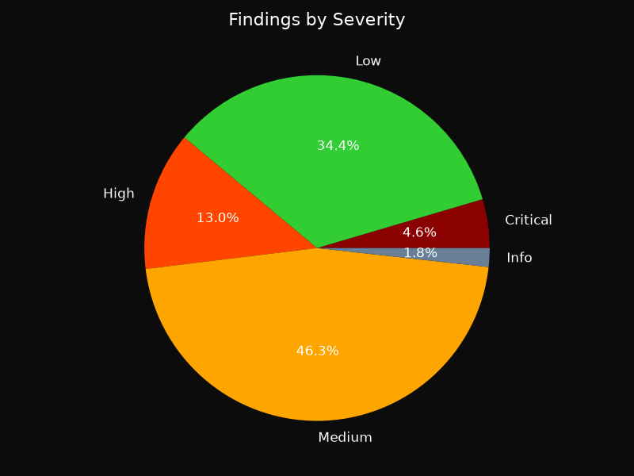
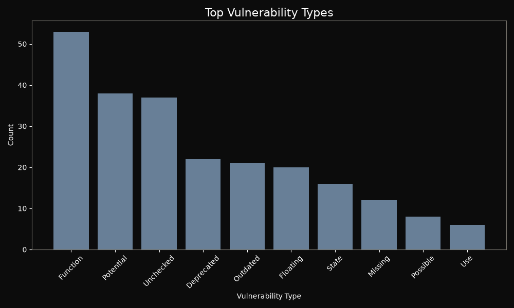

# Hawk-i Audit Report

**Generated:** 2026-07-23T13:27:41.131359Z

## Executive Summary

- **Mode:** minimal (AI: False, Sandbox: False)
- **Repository:** demo/not-so-smart-contracts (local)
- **Contracts Scanned:** 51
- **Files Analyzed:** 25
- **Total Findings:** 285
- **Severity Breakdown:** Critical: 13, High: 37, Medium: 132, Low: 98, Info: 5
- **Simulation Success Rate:** N/A
- **Security Score:** 0/100 (Critical Risk)


> AI reasoning was not enabled during this scan.


> Exploit simulation was not executed.


## Vulnerability Breakdown

### Severity Distribution



### Vulnerability Types (Top 10)



### Severity Table

| Severity | Count |
|----------|-------|
| Critical | 13 |
| High     | 37 |
| Medium   | 132 |
| Low      | 98 |
| Info     | 5 |

## Detailed Findings

Each finding below shows exactly where the flaw is, the code responsible, a
plain explanation of why it is dangerous, its impact, and a concrete fix.


### F001 | Critical: Missing access control on changeOwner

- **Severity:** Critical
- **Location:** `demo/not-so-smart-contracts/unprotected_function/Unprotected.sol:18`
- **Function:** `changeOwner`

**Vulnerable code**

```solidity
16 |
  17 | // This function should be protected
> 18 | function changeOwner(address _newOwner)
  19 |     public
  20 | {
```

**What is wrong**

Sensitive functions (e.g., `withdraw`, `setOwner`, `pause`) must be protected by access control modifiers like `onlyOwner`. Without such protection, any user can call these functions and compromise the contract.

**Impact**

An attacker can drain funds, change critical parameters, or take ownership of the contract.

**Recommended fix**

```solidity
function changeOwner() public onlyOwner {
    // function body remains
}
```


---

### F002 | Low: ERC20 approval race condition

- **Severity:** Low
- **Location:** `demo/not-so-smart-contracts/forced_ether_reception/coin.sol:113`
- **Function:** `approve`

**Vulnerable code**

```solidity
111 |  * @param _value the max amount they can spend
  112 |  */
> 113 | function approve(address _spender, uint256 _value) public
  114 |     returns (bool success) {
  115 |     allowance[msg.sender][_spender] = _value;
```

**What is wrong**

The standard ERC20 `approve` function is vulnerable to a race condition: if an owner changes allowance from N to M, and the spender submits a transfer before the new approval, they can spend N and then M, exceeding the intended limit.

**Impact**

An attacker can spend more tokens than allowed, leading to theft.

**Recommended fix**

```solidity
function approve(address spender, uint256 amount) public returns (bool) {
    require((amount == 0) || (allowance[msg.sender][spender] == 0), "Use increaseAllowance instead");
    allowance[msg.sender][spender] = amount;
    emit Approval(msg.sender, spender, amount);
    return true;
}
```


---

### F003 | Low: ERC20 approval race condition

- **Severity:** Low
- **Location:** `demo/not-so-smart-contracts/reentrancy/SpankChain_source_code/SpankChain.sol:90`
- **Function:** `approve`

**Vulnerable code**

```solidity
88 | }
  89 |
> 90 | function approve(address _spender, uint256 _value) returns (bool success) {
  91 |     allowed[msg.sender][_spender] = _value;
  92 |     Approval(msg.sender, _spender, _value);
```

**What is wrong**

The standard ERC20 `approve` function is vulnerable to a race condition: if an owner changes allowance from N to M, and the spender submits a transfer before the new approval, they can spend N and then M, exceeding the intended limit.

**Impact**

An attacker can spend more tokens than allowed, leading to theft.

**Recommended fix**

```solidity
function approve(address spender, uint256 amount) public returns (bool) {
    require((amount == 0) || (allowance[msg.sender][spender] == 0), "Use increaseAllowance instead");
    allowance[msg.sender][spender] = amount;
    emit Approval(msg.sender, spender, amount);
    return true;
}
```


---

### F004 | Low: ERC20 approval race condition

- **Severity:** Low
- **Location:** `demo/not-so-smart-contracts/reentrancy/SpankChain_source_code/SpankChain_Payment.sol:203`
- **Function:** `approve`

**Vulnerable code**

```solidity
201 | }
  202 |
> 203 | function approve(address _spender, uint256 _value) public returns (bool success) {
  204 |     allowed[msg.sender][_spender] = _value;
  205 |     emit Approval(msg.sender, _spender, _value);
```

**What is wrong**

The standard ERC20 `approve` function is vulnerable to a race condition: if an owner changes allowance from N to M, and the spender submits a transfer before the new approval, they can spend N and then M, exceeding the intended limit.

**Impact**

An attacker can spend more tokens than allowed, leading to theft.

**Recommended fix**

```solidity
function approve(address spender, uint256 amount) public returns (bool) {
    require((amount == 0) || (allowance[msg.sender][spender] == 0), "Use increaseAllowance instead");
    allowance[msg.sender][spender] = amount;
    emit Approval(msg.sender, spender, amount);
    return true;
}
```


---

### F005 | Low: ERC20 approval race condition

- **Severity:** Low
- **Location:** `demo/not-so-smart-contracts/reentrancy/DAO_source_code/DAO.sol:128`
- **Function:** `approve`

**Vulnerable code**

```solidity
126 | }
  127 |
> 128 | function approve(address _spender, uint256 _amount) returns (bool success) {
  129 |     allowed[msg.sender][_spender] = _amount;
  130 |     Approval(msg.sender, _spender, _amount);
```

**What is wrong**

The standard ERC20 `approve` function is vulnerable to a race condition: if an owner changes allowance from N to M, and the spender submits a transfer before the new approval, they can spend N and then M, exceeding the intended limit.

**Impact**

An attacker can spend more tokens than allowed, leading to theft.

**Recommended fix**

```solidity
function approve(address spender, uint256 amount) public returns (bool) {
    require((amount == 0) || (allowance[msg.sender][spender] == 0), "Use increaseAllowance instead");
    allowance[msg.sender][spender] = amount;
    emit Approval(msg.sender, spender, amount);
    return true;
}
```


---

### F006 | High: Arbitrary external call

- **Severity:** High
- **Location:** `demo/not-so-smart-contracts/reentrancy/SpankChain_source_code/SpankChain.sol:152`
- **Function:** `approveAndCall`

**Vulnerable code**

```solidity
150 |     //receiveApproval(address _from, uint256 _value, address _tokenContract, bytes _extraData)
  151 |     //it is assumed that when does this that the call *should* succeed, otherwise one would use vanilla approve instead.
> 152 |     require(_spender.call(bytes4(bytes32(sha3("receiveApproval(address,uint256,address,bytes)"))), msg.sender, _value, this, _extraData));
  153 |     return true;
  154 | }
```

**What is wrong**

A publicly reachable function performs a low-level `.call` or `.delegatecall` on an address that is supplied as a function parameter. The caller fully controls the call target (and often the calldata), so the contract can be made to execute arbitrary external code on the caller's behalf.

**Impact**

An attacker can point the call at any contract: drain tokens the contract holds or is approved to spend, spoof trusted callbacks, or (with delegatecall) execute attacker code in this contract's storage context and take it over completely.

**Recommended fix**

```solidity
Do not accept call targets from untrusted callers. Restrict targets to an allowlist or an immutable address, gate the function with strong access control (e.g. `onlyOwner`), and never expose `delegatecall` to a user-supplied address.
```


---

### F007 | High: Arbitrary external call

- **Severity:** High
- **Location:** `demo/not-so-smart-contracts/reentrancy/SpankChain_source_code/SpankChain_Payment.sol:253`
- **Function:** `approveAndCall`

**Vulnerable code**

```solidity
251 |     //receiveApproval(address _from, uint256 _value, address _tokenContract, bytes _extraData)
  252 |     //it is assumed that when does this that the call *should* succeed, otherwise one would use vanilla approve instead.
> 253 |     require(_spender.call(bytes4(bytes32(keccak256("receiveApproval(address,uint256,address,bytes)"))), msg.sender, _value, this, _extraData));
  254 |     return true;
  255 | }
```

**What is wrong**

A publicly reachable function performs a low-level `.call` or `.delegatecall` on an address that is supplied as a function parameter. The caller fully controls the call target (and often the calldata), so the contract can be made to execute arbitrary external code on the caller's behalf.

**Impact**

An attacker can point the call at any contract: drain tokens the contract holds or is approved to spend, spoof trusted callbacks, or (with delegatecall) execute attacker code in this contract's storage context and take it over completely.

**Recommended fix**

```solidity
Do not accept call targets from untrusted callers. Restrict targets to an allowlist or an immutable address, gate the function with strong access control (e.g. `onlyOwner`), and never expose `delegatecall` to a user-supplied address.
```


---

### F008 | High: Arbitrary external call

- **Severity:** High
- **Location:** `demo/not-so-smart-contracts/reentrancy/DAO_source_code/DAO.sol:199`
- **Function:** `payOut`

**Vulnerable code**

```solidity
197 | if (msg.sender != owner || msg.value > 0 || (payOwnerOnly && _recipient != owner))
  198 |     throw;
> 199 | if (_recipient.call.value(_amount)()) {
  200 |     PayOut(_recipient, _amount);
  201 |     return true;
```

**What is wrong**

A publicly reachable function performs a low-level `.call` or `.delegatecall` on an address that is supplied as a function parameter. The caller fully controls the call target (and often the calldata), so the contract can be made to execute arbitrary external code on the caller's behalf.

**Impact**

An attacker can point the call at any contract: drain tokens the contract holds or is approved to spend, spoof trusted callbacks, or (with delegatecall) execute attacker code in this contract's storage context and take it over completely.

**Recommended fix**

```solidity
Do not accept call targets from untrusted callers. Restrict targets to an allowlist or an immutable address, gate the function with strong access control (e.g. `onlyOwner`), and never expose `delegatecall` to a user-supplied address.
```


---

### F009 | High: Arbitrary external call

- **Severity:** High
- **Location:** `demo/not-so-smart-contracts/reentrancy/DAO_source_code/DAO.sol:1021`
- **Function:** `newContract`

**Vulnerable code**

```solidity
1019 | if (msg.sender != address(this) || !allowedRecipients[_newContract]) return;
  1020 | // move all ether
> 1021 | if (!_newContract.call.value(address(this).balance)()) {
  1022 |     throw;
  1023 | }
```

**What is wrong**

A publicly reachable function performs a low-level `.call` or `.delegatecall` on an address that is supplied as a function parameter. The caller fully controls the call target (and often the calldata), so the contract can be made to execute arbitrary external code on the caller's behalf.

**Impact**

An attacker can point the call at any contract: drain tokens the contract holds or is approved to spend, spoof trusted callbacks, or (with delegatecall) execute attacker code in this contract's storage context and take it over completely.

**Recommended fix**

```solidity
Do not accept call targets from untrusted callers. Restrict targets to an allowlist or an immutable address, gate the function with strong access control (e.g. `onlyOwner`), and never expose `delegatecall` to a user-supplied address.
```


---

### F010 | Medium: Direct array length assignment

- **Severity:** Medium
- **Location:** `demo/not-so-smart-contracts/unprotected_function/WalletLibrary_source_code/WalletLibrary.sol:298`


**Vulnerable code**

```solidity
296 |   // reset which owners have confirmed (none) - set our bitmap to 0.
  297 |   pending.ownersDone = 0;
> 298 |   pending.index = m_pendingIndex.length++;
  299 |   m_pendingIndex[pending.index] = _operation;
  300 | }
```

**What is wrong**

The contract writes directly to a storage array's `.length` (a pre-0.6 Solidity feature). Manually resizing arrays this way bypasses element initialization and bounds handling.

**Impact**

Growing the array exposes stale storage as live elements; an unchecked `length--` on an empty array underflows to 2**256-1, effectively making the whole storage space addressable and overwritable through the array.

**Recommended fix**

```solidity
Use `push()`/`pop()` to resize storage arrays (the only supported way since Solidity 0.6), and guard any shrink with an explicit emptiness check.
```


---

### F011 | Medium: Direct array length assignment

- **Severity:** Medium
- **Location:** `demo/not-so-smart-contracts/reentrancy/DAO_source_code/DAO.sol:718`


**Vulnerable code**

```solidity
716 | lastTimeMinQuorumMet = now;
  717 | minQuorumDivisor = 5; // sets the minimal quorum to 20%
> 718 | proposals.length = 1; // avoids a proposal with ID 0 because it is used
  719 |
  720 | allowedRecipients[address(this)] = true;
```

**What is wrong**

The contract writes directly to a storage array's `.length` (a pre-0.6 Solidity feature). Manually resizing arrays this way bypasses element initialization and bounds handling.

**Impact**

Growing the array exposes stale storage as live elements; an unchecked `length--` on an empty array underflows to 2**256-1, effectively making the whole storage space addressable and overwritable through the array.

**Recommended fix**

```solidity
Use `push()`/`pop()` to resize storage arrays (the only supported way since Solidity 0.6), and guard any shrink with an explicit emptiness check.
```


---

### F012 | Medium: Direct array length assignment

- **Severity:** Medium
- **Location:** `demo/not-so-smart-contracts/reentrancy/DAO_source_code/DAO.sol:778`


**Vulnerable code**

```solidity
776 |     throw;
  777 |
> 778 | _proposalID = proposals.length++;
  779 | Proposal p = proposals[_proposalID];
  780 | p.recipient = _recipient;
```

**What is wrong**

The contract writes directly to a storage array's `.length` (a pre-0.6 Solidity feature). Manually resizing arrays this way bypasses element initialization and bounds handling.

**Impact**

Growing the array exposes stale storage as live elements; an unchecked `length--` on an empty array underflows to 2**256-1, effectively making the whole storage space addressable and overwritable through the array.

**Recommended fix**

```solidity
Use `push()`/`pop()` to resize storage arrays (the only supported way since Solidity 0.6), and guard any shrink with an explicit emptiness check.
```


---

### F013 | Medium: Direct array length assignment

- **Severity:** Medium
- **Location:** `demo/not-so-smart-contracts/reentrancy/DAO_source_code/DAO.sol:789`


**Vulnerable code**

```solidity
787 | p.newCurator = _newCurator;
  788 | if (_newCurator)
> 789 |     p.splitData.length++;
  790 | p.creator = msg.sender;
  791 | p.proposalDeposit = msg.value;
```

**What is wrong**

The contract writes directly to a storage array's `.length` (a pre-0.6 Solidity feature). Manually resizing arrays this way bypasses element initialization and bounds handling.

**Impact**

Growing the array exposes stale storage as live elements; an unchecked `length--` on an empty array underflows to 2**256-1, effectively making the whole storage space addressable and overwritable through the array.

**Recommended fix**

```solidity
Use `push()`/`pop()` to resize storage arrays (the only supported way since Solidity 0.6), and guard any shrink with an explicit emptiness check.
```


---

### F014 | Low: Dependence on block.gaslimit

- **Severity:** Low
- **Location:** `demo/not-so-smart-contracts/honeypots/Lottery/Lottery.sol:35`


**Vulnerable code**

```solidity
33 | function OpenAddressLottery() {
  34 |     owner = msg.sender;
> 35 |     reseed(SeedComponents((uint)(block.coinbase), block.difficulty, block.gaslimit, block.timestamp)); //generate a quality random seed
  36 | }
  37 |
```

**What is wrong**

The contract reads `block.gaslimit`. Block producers adjust the gas limit within protocol bounds and its value varies across chains, so any check or computation built on it behaves unpredictably and can be nudged by validators.

**Impact**

Logic gated on `block.gaslimit` (batch sizing, pseudo-randomness, environment checks) can break after network upgrades or be influenced by block producers to steer contract behavior.

**Recommended fix**

```solidity
Replace `block.gaslimit` with an explicit, owner-configurable constant or parameter that expresses the intended bound directly.
```


---

### F015 | Low: Dependence on block.gaslimit

- **Severity:** Low
- **Location:** `demo/not-so-smart-contracts/honeypots/Lottery/Lottery.sol:56`


**Vulnerable code**

```solidity
54 |
  55 |     if(block.number-lastReseed>1000) //reseed if needed
> 56 |         reseed(SeedComponents((uint)(block.coinbase), block.difficulty, block.gaslimit, block.timestamp)); //generate a quality random seed
  57 | }
  58 |
```

**What is wrong**

The contract reads `block.gaslimit`. Block producers adjust the gas limit within protocol bounds and its value varies across chains, so any check or computation built on it behaves unpredictably and can be nudged by validators.

**Impact**

Logic gated on `block.gaslimit` (batch sizing, pseudo-randomness, environment checks) can break after network upgrades or be influenced by block producers to steer contract behavior.

**Recommended fix**

```solidity
Replace `block.gaslimit` with an explicit, owner-configurable constant or parameter that expresses the intended bound directly.
```


---

### F016 | High: Insecure randomness via blockhash

- **Severity:** High
- **Location:** `demo/not-so-smart-contracts/bad_randomness/theRun_source_code/theRun.sol:103`


**Vulnerable code**

```solidity
101 | uint256 y = salt * block.number / (salt % 5) ;
  102 | uint256 seed = block.number/3 + (salt % 300) + Last_Payout +y;
> 103 | uint256 h = uint256(block.blockhash(seed));
  104 |
  105 | return uint256((h / x)) % Max + 1; //random number between 1 and Max
```

**What is wrong**

Using `blockhash` or `block.blockhash` as a source of randomness is insecure because miners can influence it. They can choose to withhold blocks or manipulate the hash to their advantage.

**Impact**

An attacker could predict or manipulate the randomness, leading to unfair outcomes in games, lotteries, or other mechanisms that rely on unpredictable values.

**Recommended fix**

```solidity
// Use Chainlink VRF instead
uint256 randomness = requestRandomness(keyHash, fee);
```


---

### F017 | High: Insecure randomness via blockhash

- **Severity:** High
- **Location:** `demo/not-so-smart-contracts/honeypots/Lottery/Lottery.sol:35`


**Vulnerable code**

```solidity
33 | function OpenAddressLottery() {
  34 |     owner = msg.sender;
> 35 |     reseed(SeedComponents((uint)(block.coinbase), block.difficulty, block.gaslimit, block.timestamp)); //generate a quality random seed
  36 | }
  37 |
```

**What is wrong**

Using `blockhash` or `block.blockhash` as a source of randomness is insecure because miners can influence it. They can choose to withhold blocks or manipulate the hash to their advantage.

**Impact**

An attacker could predict or manipulate the randomness, leading to unfair outcomes in games, lotteries, or other mechanisms that rely on unpredictable values.

**Recommended fix**

```solidity
// Use Chainlink VRF instead
uint256 randomness = requestRandomness(keyHash, fee);
```


---

### F018 | High: Insecure randomness via blockhash

- **Severity:** High
- **Location:** `demo/not-so-smart-contracts/honeypots/Lottery/Lottery.sol:56`


**Vulnerable code**

```solidity
54 |
  55 |     if(block.number-lastReseed>1000) //reseed if needed
> 56 |         reseed(SeedComponents((uint)(block.coinbase), block.difficulty, block.gaslimit, block.timestamp)); //generate a quality random seed
  57 | }
  58 |
```

**What is wrong**

Using `blockhash` or `block.blockhash` as a source of randomness is insecure because miners can influence it. They can choose to withhold blocks or manipulate the hash to their advantage.

**Impact**

An attacker could predict or manipulate the randomness, leading to unfair outcomes in games, lotteries, or other mechanisms that rely on unpredictable values.

**Recommended fix**

```solidity
// Use Chainlink VRF instead
uint256 randomness = requestRandomness(keyHash, fee);
```


---

### F019 | High: Insecure randomness via blockhash

- **Severity:** High
- **Location:** `demo/not-so-smart-contracts/honeypots/Lottery/Lottery.sol:85`


**Vulnerable code**

```solidity
83 | SeedComponents s;
  84 | s.component1 = uint(msg.sender);
> 85 | s.component2 = uint256(block.blockhash(block.number - 1));
  86 | s.component3 = block.difficulty*(uint)(block.coinbase);
  87 | s.component4 = tx.gasprice * 7;
```

**What is wrong**

Using `blockhash` or `block.blockhash` as a source of randomness is insecure because miners can influence it. They can choose to withhold blocks or manipulate the hash to their advantage.

**Impact**

An attacker could predict or manipulate the randomness, leading to unfair outcomes in games, lotteries, or other mechanisms that rely on unpredictable values.

**Recommended fix**

```solidity
// Use Chainlink VRF instead
uint256 randomness = requestRandomness(keyHash, fee);
```


---

### F020 | High: Insecure randomness via blockhash

- **Severity:** High
- **Location:** `demo/not-so-smart-contracts/honeypots/Lottery/Lottery.sol:86`


**Vulnerable code**

```solidity
84 | s.component1 = uint(msg.sender);
  85 | s.component2 = uint256(block.blockhash(block.number - 1));
> 86 | s.component3 = block.difficulty*(uint)(block.coinbase);
  87 | s.component4 = tx.gasprice * 7;
  88 |
```

**What is wrong**

Using `blockhash` or `block.blockhash` as a source of randomness is insecure because miners can influence it. They can choose to withhold blocks or manipulate the hash to their advantage.

**Impact**

An attacker could predict or manipulate the randomness, leading to unfair outcomes in games, lotteries, or other mechanisms that rely on unpredictable values.

**Recommended fix**

```solidity
// Use Chainlink VRF instead
uint256 randomness = requestRandomness(keyHash, fee);
```


---

### F021 | Low: Centralized owner risk

- **Severity:** Low
- **Location:** `demo/not-so-smart-contracts/bad_randomness/theRun_source_code/theRun.sol:111`


**Vulnerable code**

```solidity
109 |
  110 | //---Contract management functions
> 111 | function ChangeOwnership(address _owner) onlyowner {
  112 |     admin = _owner;
  113 | }
```

**What is wrong**

This contract has a single owner with absolute control over critical functions (e.g., withdrawal, upgrades, pausing). While not an immediate vulnerability, it introduces centralization risk: if the owner's private key is compromised, the entire contract is compromised.

**Impact**

A compromised owner account can drain funds, pause the contract indefinitely, or upgrade to a malicious implementation.

**Recommended fix**

```solidity
// Replace the single owner with a multisig and a timelock.
// 1. Transfer ownership to a Gnosis Safe (M of N signers).
// 2. Route privileged calls through a TimelockController so users
//    can observe and exit before a change takes effect.
import "@openzeppelin/contracts/governance/TimelockController.sol";

// Deploy TimelockController(minDelay, proposers, executors, admin)
// then: ownable.transferOwnership(address(timelock));
// Privileged actions are now queued, delayed, and publicly visible.
```


---

### F022 | Low: Centralized owner risk

- **Severity:** Low
- **Location:** `demo/not-so-smart-contracts/wrong_constructor_name/Rubixi_source_code/Rubixi.sol:75`


**Vulnerable code**

```solidity
73 |
  74 | //Fee functions for creator
> 75 | function collectAllFees() onlyowner {
  76 |         if (collectedFees == 0) throw;
  77 |
```

**What is wrong**

This contract has a single owner with absolute control over critical functions (e.g., withdrawal, upgrades, pausing). While not an immediate vulnerability, it introduces centralization risk: if the owner's private key is compromised, the entire contract is compromised.

**Impact**

A compromised owner account can drain funds, pause the contract indefinitely, or upgrade to a malicious implementation.

**Recommended fix**

```solidity
// Replace the single owner with a multisig and a timelock.
// 1. Transfer ownership to a Gnosis Safe (M of N signers).
// 2. Route privileged calls through a TimelockController so users
//    can observe and exit before a change takes effect.
import "@openzeppelin/contracts/governance/TimelockController.sol";

// Deploy TimelockController(minDelay, proposers, executors, admin)
// then: ownable.transferOwnership(address(timelock));
// Privileged actions are now queued, delayed, and publicly visible.
```


---

### F023 | Low: Centralized owner risk

- **Severity:** Low
- **Location:** `demo/not-so-smart-contracts/unprotected_function/WalletLibrary_source_code/WalletLibrary.sol:135`


**Vulnerable code**

```solidity
133 |
  134 | // Replaces an owner `_from` with another `_to`.
> 135 | function changeOwner(address _from, address _to) onlymanyowners(sha3(msg.data)) external {
  136 |   if (isOwner(_to)) return;
  137 |   uint ownerIndex = m_ownerIndex[uint(_from)];
```

**What is wrong**

This contract has a single owner with absolute control over critical functions (e.g., withdrawal, upgrades, pausing). While not an immediate vulnerability, it introduces centralization risk: if the owner's private key is compromised, the entire contract is compromised.

**Impact**

A compromised owner account can drain funds, pause the contract indefinitely, or upgrade to a malicious implementation.

**Recommended fix**

```solidity
// Replace the single owner with a multisig and a timelock.
// 1. Transfer ownership to a Gnosis Safe (M of N signers).
// 2. Route privileged calls through a TimelockController so users
//    can observe and exit before a change takes effect.
import "@openzeppelin/contracts/governance/TimelockController.sol";

// Deploy TimelockController(minDelay, proposers, executors, admin)
// then: ownable.transferOwnership(address(timelock));
// Privileged actions are now queued, delayed, and publicly visible.
```


---

### F024 | Low: Centralized owner risk

- **Severity:** Low
- **Location:** `demo/not-so-smart-contracts/reentrancy/DAO_source_code/DAO.sol:165`


**Vulnerable code**

```solidity
163 | contract ManagedAccountInterface {
  164 |     // The only address with permission to withdraw from this account
> 165 |     address public owner;
  166 |     // If true, only the owner of the account can receive ether from it
  167 |     bool public payOwnerOnly;
```

**What is wrong**

This contract has a single owner with absolute control over critical functions (e.g., withdrawal, upgrades, pausing). While not an immediate vulnerability, it introduces centralization risk: if the owner's private key is compromised, the entire contract is compromised.

**Impact**

A compromised owner account can drain funds, pause the contract indefinitely, or upgrade to a malicious implementation.

**Recommended fix**

```solidity
// Replace the single owner with a multisig and a timelock.
// 1. Transfer ownership to a Gnosis Safe (M of N signers).
// 2. Route privileged calls through a TimelockController so users
//    can observe and exit before a change takes effect.
import "@openzeppelin/contracts/governance/TimelockController.sol";

// Deploy TimelockController(minDelay, proposers, executors, admin)
// then: ownable.transferOwnership(address(timelock));
// Privileged actions are now queued, delayed, and publicly visible.
```


---

### F025 | Low: Costly operation inside a loop

- **Severity:** Low
- **Location:** `demo/not-so-smart-contracts/denial_of_service/list_dos.sol:9`


**Vulnerable code**

```solidity
7 | function refundDos() public {
   8 |   for(uint i; i < refundAddresses.length; i++) {
>  9 |     require(refundAddresses[i].transfer(refundAmount[refundAddresses[i]]));
  10 |   }
  11 | }
```

**What is wrong**

A loop body performs a gas-heavy operation on every iteration: an external call (`.call`/`.transfer`/`.send`) or a storage-array `.push`. Gas cost grows linearly with the iteration count, and external calls add untrusted code execution per element.

**Impact**

Once the iterated collection grows large enough, the transaction exceeds the block gas limit and the function becomes permanently uncallable (denial of service). With per-recipient transfers, a single reverting recipient can also block the entire batch.

**Recommended fix**

```solidity
Move to a pull-payment model (recipients withdraw individually), bound the iteration count, or process the collection in resumable batches instead of calling out / growing storage inside one unbounded loop.
```


---

### F026 | Low: Costly operation inside a loop

- **Severity:** Low
- **Location:** `demo/not-so-smart-contracts/denial_of_service/list_dos.sol:36`


**Vulnerable code**

```solidity
34 | uint256 i = nextIdx;
  35 | while(i < refundAddresses.length && msg.gas > 200000) {
> 36 |   refundAddresses[i].transfer(refundAmount[i]);
  37 |   i++;
  38 | }
```

**What is wrong**

A loop body performs a gas-heavy operation on every iteration: an external call (`.call`/`.transfer`/`.send`) or a storage-array `.push`. Gas cost grows linearly with the iteration count, and external calls add untrusted code execution per element.

**Impact**

Once the iterated collection grows large enough, the transaction exceeds the block gas limit and the function becomes permanently uncallable (denial of service). With per-recipient transfers, a single reverting recipient can also block the entire batch.

**Recommended fix**

```solidity
Move to a pull-payment model (recipients withdraw individually), bound the iteration count, or process the collection in resumable batches instead of calling out / growing storage inside one unbounded loop.
```


---

### F027 | Low: Costly operation inside a loop

- **Severity:** Low
- **Location:** `demo/not-so-smart-contracts/bad_randomness/theRun_source_code/theRun.sol:86`


**Vulnerable code**

```solidity
84 | while ( Balance > players[Payout_id].payout ) {
  85 |     Last_Payout = players[Payout_id].payout;
> 86 |     players[Payout_id].addr.send(Last_Payout); //pay the man, please !
  87 |     Balance -= players[Payout_id].payout; //update the balance
  88 |     players[Payout_id].paid=true;
```

**What is wrong**

A loop body performs a gas-heavy operation on every iteration: an external call (`.call`/`.transfer`/`.send`) or a storage-array `.push`. Gas cost grows linearly with the iteration count, and external calls add untrusted code execution per element.

**Impact**

Once the iterated collection grows large enough, the transaction exceeds the block gas limit and the function becomes permanently uncallable (denial of service). With per-recipient transfers, a single reverting recipient can also block the entire batch.

**Recommended fix**

```solidity
Move to a pull-payment model (recipients withdraw individually), bound the iteration count, or process the collection in resumable batches instead of calling out / growing storage inside one unbounded loop.
```


---

### F028 | Low: Costly operation inside a loop

- **Severity:** Low
- **Location:** `demo/not-so-smart-contracts/wrong_constructor_name/Rubixi_source_code/Rubixi.sol:67`


**Vulnerable code**

```solidity
65 | while (balance > participants[payoutOrder].payout) {
  66 |         uint payoutToSend = participants[payoutOrder].payout;
> 67 |         participants[payoutOrder].etherAddress.send(payoutToSend);
  68 |
  69 |         balance -= participants[payoutOrder].payout;
```

**What is wrong**

A loop body performs a gas-heavy operation on every iteration: an external call (`.call`/`.transfer`/`.send`) or a storage-array `.push`. Gas cost grows linearly with the iteration count, and external calls add untrusted code execution per element.

**Impact**

Once the iterated collection grows large enough, the transaction exceeds the block gas limit and the function becomes permanently uncallable (denial of service). With per-recipient transfers, a single reverting recipient can also block the entire batch.

**Recommended fix**

```solidity
Move to a pull-payment model (recipients withdraw individually), bound the iteration count, or process the collection in resumable batches instead of calling out / growing storage inside one unbounded loop.
```


---

### F029 | Medium: Function without explicit visibility

- **Severity:** Medium
- **Location:** `demo/not-so-smart-contracts/integer_overflow/integer_overflow_1.sol:6`
- **Function:** `add`

**Vulnerable code**

```solidity
4 | uint private sellerBalance=0;
  5 |
> 6 | function add(uint value) returns (bool){
  7 |     sellerBalance += value; // possible overflow
  8 |
```

**What is wrong**

The file targets a pre-0.5 Solidity compiler, where a function declared without an explicit visibility keyword silently defaults to `public`. Functions intended as internal helpers become callable by anyone.

**Impact**

Anyone can invoke the implicitly-public function directly. If it mutates privileged state (the classic example being the Parity wallet's `initWallet`), an attacker can take over the contract or drain funds.

**Recommended fix**

```solidity
function _internalFunction() internal {
    // ...
}
```


---

### F030 | Medium: Function without explicit visibility

- **Severity:** Medium
- **Location:** `demo/not-so-smart-contracts/integer_overflow/integer_overflow_1.sol:13`
- **Function:** `safe_add`

**Vulnerable code**

```solidity
11 | }
  12 |
> 13 | function safe_add(uint value) returns (bool){
  14 |     require(value + sellerBalance >= sellerBalance);
  15 |     sellerBalance += value;
```

**What is wrong**

The file targets a pre-0.5 Solidity compiler, where a function declared without an explicit visibility keyword silently defaults to `public`. Functions intended as internal helpers become callable by anyone.

**Impact**

Anyone can invoke the implicitly-public function directly. If it mutates privileged state (the classic example being the Parity wallet's `initWallet`), an attacker can take over the contract or drain funds.

**Recommended fix**

```solidity
function _internalFunction() internal {
    // ...
}
```


---

### F031 | Medium: Function without explicit visibility

- **Severity:** Medium
- **Location:** `demo/not-so-smart-contracts/incorrect_interface/Bob.sol:10`
- **Function:** `set`

**Vulnerable code**

```solidity
8 |
   9 | contract Bob {
> 10 |     function set(Alice c){
  11 |         c.set(42);
  12 |     }
```

**What is wrong**

The file targets a pre-0.5 Solidity compiler, where a function declared without an explicit visibility keyword silently defaults to `public`. Functions intended as internal helpers become callable by anyone.

**Impact**

Anyone can invoke the implicitly-public function directly. If it mutates privileged state (the classic example being the Parity wallet's `initWallet`), an attacker can take over the contract or drain funds.

**Recommended fix**

```solidity
function _internalFunction() internal {
    // ...
}
```


---

### F032 | Medium: Function without explicit visibility

- **Severity:** Medium
- **Location:** `demo/not-so-smart-contracts/incorrect_interface/Bob.sol:14`
- **Function:** `set_fixed`

**Vulnerable code**

```solidity
12 | }
  13 |
> 14 | function set_fixed(Alice c){
  15 |     c.set_fixed(42);
  16 | }
```

**What is wrong**

The file targets a pre-0.5 Solidity compiler, where a function declared without an explicit visibility keyword silently defaults to `public`. Functions intended as internal helpers become callable by anyone.

**Impact**

Anyone can invoke the implicitly-public function directly. If it mutates privileged state (the classic example being the Parity wallet's `initWallet`), an attacker can take over the contract or drain funds.

**Recommended fix**

```solidity
function _internalFunction() internal {
    // ...
}
```


---

### F033 | Medium: Function without explicit visibility

- **Severity:** Medium
- **Location:** `demo/not-so-smart-contracts/incorrect_interface/Alice.sol:7`
- **Function:** `set`

**Vulnerable code**

```solidity
5 | int public val;
  6 |
> 7 | function set(int new_val){
  8 |     val = new_val;
  9 | }
```

**What is wrong**

The file targets a pre-0.5 Solidity compiler, where a function declared without an explicit visibility keyword silently defaults to `public`. Functions intended as internal helpers become callable by anyone.

**Impact**

Anyone can invoke the implicitly-public function directly. If it mutates privileged state (the classic example being the Parity wallet's `initWallet`), an attacker can take over the contract or drain funds.

**Recommended fix**

```solidity
function _internalFunction() internal {
    // ...
}
```


---

### F034 | Medium: Function without explicit visibility

- **Severity:** Medium
- **Location:** `demo/not-so-smart-contracts/incorrect_interface/Alice.sol:11`
- **Function:** `set_fixed`

**Vulnerable code**

```solidity
9 | }
  10 |
> 11 | function set_fixed(int new_val){
  12 |     val = new_val;
  13 | }
```

**What is wrong**

The file targets a pre-0.5 Solidity compiler, where a function declared without an explicit visibility keyword silently defaults to `public`. Functions intended as internal helpers become callable by anyone.

**Impact**

Anyone can invoke the implicitly-public function directly. If it mutates privileged state (the classic example being the Parity wallet's `initWallet`), an attacker can take over the contract or drain funds.

**Recommended fix**

```solidity
function _internalFunction() internal {
    // ...
}
```


---

### F035 | Medium: Function without explicit visibility

- **Severity:** Medium
- **Location:** `demo/not-so-smart-contracts/forced_ether_reception/coin.sol:179`
- **Function:** `migrate_and_destroy`

**Vulnerable code**

```solidity
177 |
  178 |    /* Migration function */
> 179 |    function migrate_and_destroy() onlyOwner {
  180 | assert(this.balance == totalSupply);                 // consistency check
  181 | suicide(owner);                                      // transfer the ether to the owner and kill the contract
```

**What is wrong**

The file targets a pre-0.5 Solidity compiler, where a function declared without an explicit visibility keyword silently defaults to `public`. Functions intended as internal helpers become callable by anyone.

**Impact**

Anyone can invoke the implicitly-public function directly. If it mutates privileged state (the classic example being the Parity wallet's `initWallet`), an attacker can take over the contract or drain funds.

**Recommended fix**

```solidity
function _internalFunction() internal {
    // ...
}
```


---

### F036 | Medium: Function without explicit visibility

- **Severity:** Medium
- **Location:** `demo/not-so-smart-contracts/race_condition/RaceCondition.sol:45`
- **Function:** `changePrice`

**Vulnerable code**

```solidity
43 | }
  44 |
> 45 | function changePrice(uint new_price){
  46 |     require(msg.sender == owner);
  47 |     price = new_price;
```

**What is wrong**

The file targets a pre-0.5 Solidity compiler, where a function declared without an explicit visibility keyword silently defaults to `public`. Functions intended as internal helpers become callable by anyone.

**Impact**

Anyone can invoke the implicitly-public function directly. If it mutates privileged state (the classic example being the Parity wallet's `initWallet`), an attacker can take over the contract or drain funds.

**Recommended fix**

```solidity
function _internalFunction() internal {
    // ...
}
```


---

### F037 | Medium: Function without explicit visibility

- **Severity:** Medium
- **Location:** `demo/not-so-smart-contracts/denial_of_service/auction.sol:9`
- **Function:** `bid`

**Vulnerable code**

```solidity
7 |
   8 | //Takes in bid, refunding the frontrunner if they are outbid
>  9 | function bid() payable {
  10 |   require(msg.value > currentBid);
  11 |
```

**What is wrong**

The file targets a pre-0.5 Solidity compiler, where a function declared without an explicit visibility keyword silently defaults to `public`. Functions intended as internal helpers become callable by anyone.

**Impact**

Anyone can invoke the implicitly-public function directly. If it mutates privileged state (the classic example being the Parity wallet's `initWallet`), an attacker can take over the contract or drain funds.

**Recommended fix**

```solidity
function _internalFunction() internal {
    // ...
}
```


---

### F038 | Medium: Function without explicit visibility

- **Severity:** Medium
- **Location:** `demo/not-so-smart-contracts/reentrancy/Reentrancy.sol:6`
- **Function:** `getBalance`

**Vulnerable code**

```solidity
4 | mapping (address => uint) userBalance;
  5 |
> 6 | function getBalance(address u) constant returns(uint){
  7 |     return userBalance[u];
  8 | }
```

**What is wrong**

The file targets a pre-0.5 Solidity compiler, where a function declared without an explicit visibility keyword silently defaults to `public`. Functions intended as internal helpers become callable by anyone.

**Impact**

Anyone can invoke the implicitly-public function directly. If it mutates privileged state (the classic example being the Parity wallet's `initWallet`), an attacker can take over the contract or drain funds.

**Recommended fix**

```solidity
function _internalFunction() internal {
    // ...
}
```


---

### F039 | Medium: Function without explicit visibility

- **Severity:** Medium
- **Location:** `demo/not-so-smart-contracts/reentrancy/Reentrancy.sol:10`
- **Function:** `addToBalance`

**Vulnerable code**

```solidity
8 | }
   9 |
> 10 | function addToBalance() payable{
  11 |     userBalance[msg.sender] += msg.value;
  12 | }
```

**What is wrong**

The file targets a pre-0.5 Solidity compiler, where a function declared without an explicit visibility keyword silently defaults to `public`. Functions intended as internal helpers become callable by anyone.

**Impact**

Anyone can invoke the implicitly-public function directly. If it mutates privileged state (the classic example being the Parity wallet's `initWallet`), an attacker can take over the contract or drain funds.

**Recommended fix**

```solidity
function _internalFunction() internal {
    // ...
}
```


---

### F040 | Medium: Function without explicit visibility

- **Severity:** Medium
- **Location:** `demo/not-so-smart-contracts/reentrancy/Reentrancy.sol:14`
- **Function:** `withdrawBalance`

**Vulnerable code**

```solidity
12 | }
  13 |
> 14 | function withdrawBalance(){
  15 |     // send userBalance[msg.sender] ethers to msg.sender
  16 |     // if mgs.sender is a contract, it will call its fallback function
```

**What is wrong**

The file targets a pre-0.5 Solidity compiler, where a function declared without an explicit visibility keyword silently defaults to `public`. Functions intended as internal helpers become callable by anyone.

**Impact**

Anyone can invoke the implicitly-public function directly. If it mutates privileged state (the classic example being the Parity wallet's `initWallet`), an attacker can take over the contract or drain funds.

**Recommended fix**

```solidity
function _internalFunction() internal {
    // ...
}
```


---

### F041 | Medium: Function without explicit visibility

- **Severity:** Medium
- **Location:** `demo/not-so-smart-contracts/reentrancy/Reentrancy.sol:23`
- **Function:** `withdrawBalance_fixed`

**Vulnerable code**

```solidity
21 | }
  22 |
> 23 | function withdrawBalance_fixed(){
  24 |     // to protect against re-entrancy, the state variable
  25 |     // has to be change before the call
```

**What is wrong**

The file targets a pre-0.5 Solidity compiler, where a function declared without an explicit visibility keyword silently defaults to `public`. Functions intended as internal helpers become callable by anyone.

**Impact**

Anyone can invoke the implicitly-public function directly. If it mutates privileged state (the classic example being the Parity wallet's `initWallet`), an attacker can take over the contract or drain funds.

**Recommended fix**

```solidity
function _internalFunction() internal {
    // ...
}
```


---

### F042 | Medium: Function without explicit visibility

- **Severity:** Medium
- **Location:** `demo/not-so-smart-contracts/reentrancy/Reentrancy.sol:33`
- **Function:** `withdrawBalance_fixed_2`

**Vulnerable code**

```solidity
31 | }
  32 |
> 33 | function withdrawBalance_fixed_2(){
  34 |     // send() and transfer() are safe against reentrancy
  35 |     // they do not transfer the remaining gas
```

**What is wrong**

The file targets a pre-0.5 Solidity compiler, where a function declared without an explicit visibility keyword silently defaults to `public`. Functions intended as internal helpers become callable by anyone.

**Impact**

Anyone can invoke the implicitly-public function directly. If it mutates privileged state (the classic example being the Parity wallet's `initWallet`), an attacker can take over the contract or drain funds.

**Recommended fix**

```solidity
function _internalFunction() internal {
    // ...
}
```


---

### F043 | Medium: Function without explicit visibility

- **Severity:** Medium
- **Location:** `demo/not-so-smart-contracts/reentrancy/ReentrancyExploit.sol:35`
- **Function:** `get_money`

**Vulnerable code**

```solidity
33 | }
  34 |
> 35 | function get_money(){
  36 |     suicide(owner);
  37 | }
```

**What is wrong**

The file targets a pre-0.5 Solidity compiler, where a function declared without an explicit visibility keyword silently defaults to `public`. Functions intended as internal helpers become callable by anyone.

**Impact**

Anyone can invoke the implicitly-public function directly. If it mutates privileged state (the classic example being the Parity wallet's `initWallet`), an attacker can take over the contract or drain funds.

**Recommended fix**

```solidity
function _internalFunction() internal {
    // ...
}
```


---

### F044 | Medium: Function without explicit visibility

- **Severity:** Medium
- **Location:** `demo/not-so-smart-contracts/honeypots/PrivateBank/PrivateBank.sol:11`
- **Function:** `Private_Bank`

**Vulnerable code**

```solidity
9 | Log TransferLog;
  10 |
> 11 | function Private_Bank(address _log)
  12 | {
  13 |     TransferLog = Log(_log);
```

**What is wrong**

The file targets a pre-0.5 Solidity compiler, where a function declared without an explicit visibility keyword silently defaults to `public`. Functions intended as internal helpers become callable by anyone.

**Impact**

Anyone can invoke the implicitly-public function directly. If it mutates privileged state (the classic example being the Parity wallet's `initWallet`), an attacker can take over the contract or drain funds.

**Recommended fix**

```solidity
function _internalFunction() internal {
    // ...
}
```


---

### F045 | Medium: Function without explicit visibility

- **Severity:** Medium
- **Location:** `demo/not-so-smart-contracts/honeypots/PrivateBank/PrivateBank.sol:27`
- **Function:** `CashOut`

**Vulnerable code**

```solidity
25 | }
  26 |
> 27 | function CashOut(uint _am)
  28 | {
  29 |     if(_am<=balances[msg.sender])
```

**What is wrong**

The file targets a pre-0.5 Solidity compiler, where a function declared without an explicit visibility keyword silently defaults to `public`. Functions intended as internal helpers become callable by anyone.

**Impact**

Anyone can invoke the implicitly-public function directly. If it mutates privileged state (the classic example being the Parity wallet's `initWallet`), an attacker can take over the contract or drain funds.

**Recommended fix**

```solidity
function _internalFunction() internal {
    // ...
}
```


---

### F046 | Medium: Function without explicit visibility

- **Severity:** Medium
- **Location:** `demo/not-so-smart-contracts/honeypots/Multiplicator/Multiplicator.sol:17`
- **Function:** `multiplicate`

**Vulnerable code**

```solidity
15 | }
  16 |
> 17 | function multiplicate(address adr)
  18 | payable
  19 | {
```

**What is wrong**

The file targets a pre-0.5 Solidity compiler, where a function declared without an explicit visibility keyword silently defaults to `public`. Functions intended as internal helpers become callable by anyone.

**Impact**

Anyone can invoke the implicitly-public function directly. If it mutates privileged state (the classic example being the Parity wallet's `initWallet`), an attacker can take over the contract or drain funds.

**Recommended fix**

```solidity
function _internalFunction() internal {
    // ...
}
```


---

### F047 | Medium: Function without explicit visibility

- **Severity:** Medium
- **Location:** `demo/not-so-smart-contracts/unchecked_external_call/KotET_source_code/KingOfTheEtherThrone.sol:65`
- **Function:** `KingOfTheEtherThrone`

**Vulnerable code**

```solidity
63 | // Create a new throne, with the creator as wizard and first ruler.
  64 | // Sets up some hopefully sensible defaults.
> 65 | function KingOfTheEtherThrone() {
  66 |     wizardAddress = msg.sender;
  67 |     currentClaimPrice = startingClaimPrice;
```

**What is wrong**

The file targets a pre-0.5 Solidity compiler, where a function declared without an explicit visibility keyword silently defaults to `public`. Functions intended as internal helpers become callable by anyone.

**Impact**

Anyone can invoke the implicitly-public function directly. If it mutates privileged state (the classic example being the Parity wallet's `initWallet`), an attacker can take over the contract or drain funds.

**Recommended fix**

```solidity
function _internalFunction() internal {
    // ...
}
```


---

### F048 | Medium: Function without explicit visibility

- **Severity:** Medium
- **Location:** `demo/not-so-smart-contracts/unchecked_external_call/KotET_source_code/KingOfTheEtherThrone.sol:76`
- **Function:** `numberOfMonarchs`

**Vulnerable code**

```solidity
74 | }
  75 |
> 76 | function numberOfMonarchs() constant returns (uint n) {
  77 |     return pastMonarchs.length;
  78 | }
```

**What is wrong**

The file targets a pre-0.5 Solidity compiler, where a function declared without an explicit visibility keyword silently defaults to `public`. Functions intended as internal helpers become callable by anyone.

**Impact**

Anyone can invoke the implicitly-public function directly. If it mutates privileged state (the classic example being the Parity wallet's `initWallet`), an attacker can take over the contract or drain funds.

**Recommended fix**

```solidity
function _internalFunction() internal {
    // ...
}
```


---

### F049 | Medium: Function without explicit visibility

- **Severity:** Medium
- **Location:** `demo/not-so-smart-contracts/unchecked_external_call/KotET_source_code/KingOfTheEtherThrone.sol:95`
- **Function:** `claimThrone`

**Vulnerable code**

```solidity
93 |
  94 | // Claim the throne for the given name by paying the currentClaimFee.
> 95 | function claimThrone(string name) {
  96 |
  97 |     uint valuePaid = msg.value;
```

**What is wrong**

The file targets a pre-0.5 Solidity compiler, where a function declared without an explicit visibility keyword silently defaults to `public`. Functions intended as internal helpers become callable by anyone.

**Impact**

Anyone can invoke the implicitly-public function directly. If it mutates privileged state (the classic example being the Parity wallet's `initWallet`), an attacker can take over the contract or drain funds.

**Recommended fix**

```solidity
function _internalFunction() internal {
    // ...
}
```


---

### F050 | Medium: Function without explicit visibility

- **Severity:** Medium
- **Location:** `demo/not-so-smart-contracts/unchecked_external_call/KotET_source_code/KingOfTheEtherThrone.sol:161`
- **Function:** `sweepCommission`

**Vulnerable code**

```solidity
159 |
  160 | // Used only by the wizard to collect his commission.
> 161 | function sweepCommission(uint amount) onlywizard {
  162 |     wizardAddress.send(amount);
  163 | }
```

**What is wrong**

The file targets a pre-0.5 Solidity compiler, where a function declared without an explicit visibility keyword silently defaults to `public`. Functions intended as internal helpers become callable by anyone.

**Impact**

Anyone can invoke the implicitly-public function directly. If it mutates privileged state (the classic example being the Parity wallet's `initWallet`), an attacker can take over the contract or drain funds.

**Recommended fix**

```solidity
function _internalFunction() internal {
    // ...
}
```


---

### F051 | Medium: Function without explicit visibility

- **Severity:** Medium
- **Location:** `demo/not-so-smart-contracts/unchecked_external_call/KotET_source_code/KingOfTheEtherThrone.sol:166`
- **Function:** `transferOwnership`

**Vulnerable code**

```solidity
164 |
  165 | // Used only by the wizard to collect his commission.
> 166 | function transferOwnership(address newOwner) onlywizard {
  167 |     wizardAddress = newOwner;
  168 | }
```

**What is wrong**

The file targets a pre-0.5 Solidity compiler, where a function declared without an explicit visibility keyword silently defaults to `public`. Functions intended as internal helpers become callable by anyone.

**Impact**

Anyone can invoke the implicitly-public function directly. If it mutates privileged state (the classic example being the Parity wallet's `initWallet`), an attacker can take over the contract or drain funds.

**Recommended fix**

```solidity
function _internalFunction() internal {
    // ...
}
```


---

### F052 | Medium: Function without explicit visibility

- **Severity:** Medium
- **Location:** `demo/not-so-smart-contracts/wrong_constructor_name/Rubixi_source_code/Rubixi.sol:16`
- **Function:** `DynamicPyramid`

**Vulnerable code**

```solidity
14 |
  15 | //Sets creator
> 16 | function DynamicPyramid() {
  17 |         creator = msg.sender;
  18 | }
```

**What is wrong**

The file targets a pre-0.5 Solidity compiler, where a function declared without an explicit visibility keyword silently defaults to `public`. Functions intended as internal helpers become callable by anyone.

**Impact**

Anyone can invoke the implicitly-public function directly. If it mutates privileged state (the classic example being the Parity wallet's `initWallet`), an attacker can take over the contract or drain funds.

**Recommended fix**

```solidity
function _internalFunction() internal {
    // ...
}
```


---

### F053 | Medium: Function without explicit visibility

- **Severity:** Medium
- **Location:** `demo/not-so-smart-contracts/wrong_constructor_name/Rubixi_source_code/Rubixi.sol:75`
- **Function:** `collectAllFees`

**Vulnerable code**

```solidity
73 |
  74 | //Fee functions for creator
> 75 | function collectAllFees() onlyowner {
  76 |         if (collectedFees == 0) throw;
  77 |
```

**What is wrong**

The file targets a pre-0.5 Solidity compiler, where a function declared without an explicit visibility keyword silently defaults to `public`. Functions intended as internal helpers become callable by anyone.

**Impact**

Anyone can invoke the implicitly-public function directly. If it mutates privileged state (the classic example being the Parity wallet's `initWallet`), an attacker can take over the contract or drain funds.

**Recommended fix**

```solidity
function _internalFunction() internal {
    // ...
}
```


---

### F054 | Medium: Function without explicit visibility

- **Severity:** Medium
- **Location:** `demo/not-so-smart-contracts/wrong_constructor_name/Rubixi_source_code/Rubixi.sol:82`
- **Function:** `collectFeesInEther`

**Vulnerable code**

```solidity
80 | }
  81 |
> 82 | function collectFeesInEther(uint _amt) onlyowner {
  83 |         _amt *= 1 ether;
  84 |         if (_amt > collectedFees) collectAllFees();
```

**What is wrong**

The file targets a pre-0.5 Solidity compiler, where a function declared without an explicit visibility keyword silently defaults to `public`. Functions intended as internal helpers become callable by anyone.

**Impact**

Anyone can invoke the implicitly-public function directly. If it mutates privileged state (the classic example being the Parity wallet's `initWallet`), an attacker can take over the contract or drain funds.

**Recommended fix**

```solidity
function _internalFunction() internal {
    // ...
}
```


---

### F055 | Medium: Function without explicit visibility

- **Severity:** Medium
- **Location:** `demo/not-so-smart-contracts/wrong_constructor_name/Rubixi_source_code/Rubixi.sol:92`
- **Function:** `collectPercentOfFees`

**Vulnerable code**

```solidity
90 | }
  91 |
> 92 | function collectPercentOfFees(uint _pcent) onlyowner {
  93 |         if (collectedFees == 0 || _pcent > 100) throw;
  94 |
```

**What is wrong**

The file targets a pre-0.5 Solidity compiler, where a function declared without an explicit visibility keyword silently defaults to `public`. Functions intended as internal helpers become callable by anyone.

**Impact**

Anyone can invoke the implicitly-public function directly. If it mutates privileged state (the classic example being the Parity wallet's `initWallet`), an attacker can take over the contract or drain funds.

**Recommended fix**

```solidity
function _internalFunction() internal {
    // ...
}
```


---

### F056 | Medium: Function without explicit visibility

- **Severity:** Medium
- **Location:** `demo/not-so-smart-contracts/wrong_constructor_name/Rubixi_source_code/Rubixi.sol:101`
- **Function:** `changeOwner`

**Vulnerable code**

```solidity
99 |
  100 | //Functions for changing variables related to the contract
> 101 | function changeOwner(address _owner) onlyowner {
  102 |         creator = _owner;
  103 | }
```

**What is wrong**

The file targets a pre-0.5 Solidity compiler, where a function declared without an explicit visibility keyword silently defaults to `public`. Functions intended as internal helpers become callable by anyone.

**Impact**

Anyone can invoke the implicitly-public function directly. If it mutates privileged state (the classic example being the Parity wallet's `initWallet`), an attacker can take over the contract or drain funds.

**Recommended fix**

```solidity
function _internalFunction() internal {
    // ...
}
```


---

### F057 | Medium: Function without explicit visibility

- **Severity:** Medium
- **Location:** `demo/not-so-smart-contracts/wrong_constructor_name/Rubixi_source_code/Rubixi.sol:105`
- **Function:** `changeMultiplier`

**Vulnerable code**

```solidity
103 | }
  104 |
> 105 | function changeMultiplier(uint _mult) onlyowner {
  106 |         if (_mult > 300 || _mult < 120) throw;
  107 |
```

**What is wrong**

The file targets a pre-0.5 Solidity compiler, where a function declared without an explicit visibility keyword silently defaults to `public`. Functions intended as internal helpers become callable by anyone.

**Impact**

Anyone can invoke the implicitly-public function directly. If it mutates privileged state (the classic example being the Parity wallet's `initWallet`), an attacker can take over the contract or drain funds.

**Recommended fix**

```solidity
function _internalFunction() internal {
    // ...
}
```


---

### F058 | Medium: Function without explicit visibility

- **Severity:** Medium
- **Location:** `demo/not-so-smart-contracts/wrong_constructor_name/Rubixi_source_code/Rubixi.sol:111`
- **Function:** `changeFeePercentage`

**Vulnerable code**

```solidity
109 | }
  110 |
> 111 | function changeFeePercentage(uint _fee) onlyowner {
  112 |         if (_fee > 10) throw;
  113 |
```

**What is wrong**

The file targets a pre-0.5 Solidity compiler, where a function declared without an explicit visibility keyword silently defaults to `public`. Functions intended as internal helpers become callable by anyone.

**Impact**

Anyone can invoke the implicitly-public function directly. If it mutates privileged state (the classic example being the Parity wallet's `initWallet`), an attacker can take over the contract or drain funds.

**Recommended fix**

```solidity
function _internalFunction() internal {
    // ...
}
```


---

### F059 | Medium: Function without explicit visibility

- **Severity:** Medium
- **Location:** `demo/not-so-smart-contracts/wrong_constructor_name/Rubixi_source_code/Rubixi.sol:118`
- **Function:** `currentMultiplier`

**Vulnerable code**

```solidity
116 |
  117 | //Functions to provide information to end-user using JSON interface or other interfaces
> 118 | function currentMultiplier() constant returns(uint multiplier, string info) {
  119 |         multiplier = pyramidMultiplier;
  120 |         info = 'This multiplier applies to you as soon as transaction is received, may be lowered to hasten payouts or increased if payouts are fast enough. Due to no float or decimals, multiplier is x100 for a fractional multiplier e.g. 250 is actually a 2.5x multiplier. Capped at 3x max and 1.2x min.';
```

**What is wrong**

The file targets a pre-0.5 Solidity compiler, where a function declared without an explicit visibility keyword silently defaults to `public`. Functions intended as internal helpers become callable by anyone.

**Impact**

Anyone can invoke the implicitly-public function directly. If it mutates privileged state (the classic example being the Parity wallet's `initWallet`), an attacker can take over the contract or drain funds.

**Recommended fix**

```solidity
function _internalFunction() internal {
    // ...
}
```


---

### F060 | Medium: Function without explicit visibility

- **Severity:** Medium
- **Location:** `demo/not-so-smart-contracts/wrong_constructor_name/Rubixi_source_code/Rubixi.sol:123`
- **Function:** `currentFeePercentage`

**Vulnerable code**

```solidity
121 | }
  122 |
> 123 | function currentFeePercentage() constant returns(uint fee, string info) {
  124 |         fee = feePercent;
  125 |         info = 'Shown in % form. Fee is halved(50%) for amounts equal or greater than 50 ethers. (Fee may change, but is capped to a maximum of 10%)';
```

**What is wrong**

The file targets a pre-0.5 Solidity compiler, where a function declared without an explicit visibility keyword silently defaults to `public`. Functions intended as internal helpers become callable by anyone.

**Impact**

Anyone can invoke the implicitly-public function directly. If it mutates privileged state (the classic example being the Parity wallet's `initWallet`), an attacker can take over the contract or drain funds.

**Recommended fix**

```solidity
function _internalFunction() internal {
    // ...
}
```


---

### F061 | Medium: Function without explicit visibility

- **Severity:** Medium
- **Location:** `demo/not-so-smart-contracts/wrong_constructor_name/Rubixi_source_code/Rubixi.sol:128`
- **Function:** `currentPyramidBalanceApproximately`

**Vulnerable code**

```solidity
126 | }
  127 |
> 128 | function currentPyramidBalanceApproximately() constant returns(uint pyramidBalance, string info) {
  129 |         pyramidBalance = balance / 1 ether;
  130 |         info = 'All balance values are measured in Ethers, note that due to no decimal placing, these values show up as integers only, within the contract itself you will get the exact decimal value you are supposed to';
```

**What is wrong**

The file targets a pre-0.5 Solidity compiler, where a function declared without an explicit visibility keyword silently defaults to `public`. Functions intended as internal helpers become callable by anyone.

**Impact**

Anyone can invoke the implicitly-public function directly. If it mutates privileged state (the classic example being the Parity wallet's `initWallet`), an attacker can take over the contract or drain funds.

**Recommended fix**

```solidity
function _internalFunction() internal {
    // ...
}
```


---

### F062 | Medium: Function without explicit visibility

- **Severity:** Medium
- **Location:** `demo/not-so-smart-contracts/wrong_constructor_name/Rubixi_source_code/Rubixi.sol:133`
- **Function:** `nextPayoutWhenPyramidBalanceTotalsApproximately`

**Vulnerable code**

```solidity
131 | }
  132 |
> 133 | function nextPayoutWhenPyramidBalanceTotalsApproximately() constant returns(uint balancePayout) {
  134 |         balancePayout = participants[payoutOrder].payout / 1 ether;
  135 | }
```

**What is wrong**

The file targets a pre-0.5 Solidity compiler, where a function declared without an explicit visibility keyword silently defaults to `public`. Functions intended as internal helpers become callable by anyone.

**Impact**

Anyone can invoke the implicitly-public function directly. If it mutates privileged state (the classic example being the Parity wallet's `initWallet`), an attacker can take over the contract or drain funds.

**Recommended fix**

```solidity
function _internalFunction() internal {
    // ...
}
```


---

### F063 | Medium: Function without explicit visibility

- **Severity:** Medium
- **Location:** `demo/not-so-smart-contracts/wrong_constructor_name/Rubixi_source_code/Rubixi.sol:137`
- **Function:** `feesSeperateFromBalanceApproximately`

**Vulnerable code**

```solidity
135 | }
  136 |
> 137 | function feesSeperateFromBalanceApproximately() constant returns(uint fees) {
  138 |         fees = collectedFees / 1 ether;
  139 | }
```

**What is wrong**

The file targets a pre-0.5 Solidity compiler, where a function declared without an explicit visibility keyword silently defaults to `public`. Functions intended as internal helpers become callable by anyone.

**Impact**

Anyone can invoke the implicitly-public function directly. If it mutates privileged state (the classic example being the Parity wallet's `initWallet`), an attacker can take over the contract or drain funds.

**Recommended fix**

```solidity
function _internalFunction() internal {
    // ...
}
```


---

### F064 | Medium: Function without explicit visibility

- **Severity:** Medium
- **Location:** `demo/not-so-smart-contracts/wrong_constructor_name/Rubixi_source_code/Rubixi.sol:141`
- **Function:** `totalParticipants`

**Vulnerable code**

```solidity
139 | }
  140 |
> 141 | function totalParticipants() constant returns(uint count) {
  142 |         count = participants.length;
  143 | }
```

**What is wrong**

The file targets a pre-0.5 Solidity compiler, where a function declared without an explicit visibility keyword silently defaults to `public`. Functions intended as internal helpers become callable by anyone.

**Impact**

Anyone can invoke the implicitly-public function directly. If it mutates privileged state (the classic example being the Parity wallet's `initWallet`), an attacker can take over the contract or drain funds.

**Recommended fix**

```solidity
function _internalFunction() internal {
    // ...
}
```


---

### F065 | Medium: Function without explicit visibility

- **Severity:** Medium
- **Location:** `demo/not-so-smart-contracts/wrong_constructor_name/Rubixi_source_code/Rubixi.sol:145`
- **Function:** `numberOfParticipantsWaitingForPayout`

**Vulnerable code**

```solidity
143 | }
  144 |
> 145 | function numberOfParticipantsWaitingForPayout() constant returns(uint count) {
  146 |         count = participants.length - payoutOrder;
  147 | }
```

**What is wrong**

The file targets a pre-0.5 Solidity compiler, where a function declared without an explicit visibility keyword silently defaults to `public`. Functions intended as internal helpers become callable by anyone.

**Impact**

Anyone can invoke the implicitly-public function directly. If it mutates privileged state (the classic example being the Parity wallet's `initWallet`), an attacker can take over the contract or drain funds.

**Recommended fix**

```solidity
function _internalFunction() internal {
    // ...
}
```


---

### F066 | Medium: Function without explicit visibility

- **Severity:** Medium
- **Location:** `demo/not-so-smart-contracts/wrong_constructor_name/Rubixi_source_code/Rubixi.sol:149`
- **Function:** `participantDetails`

**Vulnerable code**

```solidity
147 | }
  148 |
> 149 | function participantDetails(uint orderInPyramid) constant returns(address Address, uint Payout) {
  150 |         if (orderInPyramid <= participants.length) {
  151 |                 Address = participants[orderInPyramid].etherAddress;
```

**What is wrong**

The file targets a pre-0.5 Solidity compiler, where a function declared without an explicit visibility keyword silently defaults to `public`. Functions intended as internal helpers become callable by anyone.

**Impact**

Anyone can invoke the implicitly-public function directly. If it mutates privileged state (the classic example being the Parity wallet's `initWallet`), an attacker can take over the contract or drain funds.

**Recommended fix**

```solidity
function _internalFunction() internal {
    // ...
}
```


---

### F067 | Medium: Function without explicit visibility

- **Severity:** Medium
- **Location:** `demo/not-so-smart-contracts/unprotected_function/WalletLibrary_source_code/WalletLibrary.sol:108`
- **Function:** `initMultiowned`

**Vulnerable code**

```solidity
106 | // constructor is given number of sigs required to do protected "onlymanyowners" transactions
  107 | // as well as the selection of addresses capable of confirming them.
> 108 | function initMultiowned(address[] _owners, uint _required) {
  109 |   m_numOwners = _owners.length + 1;
  110 |   m_owners[1] = uint(msg.sender);
```

**What is wrong**

The file targets a pre-0.5 Solidity compiler, where a function declared without an explicit visibility keyword silently defaults to `public`. Functions intended as internal helpers become callable by anyone.

**Impact**

Anyone can invoke the implicitly-public function directly. If it mutates privileged state (the classic example being the Parity wallet's `initWallet`), an attacker can take over the contract or drain funds.

**Recommended fix**

```solidity
function _internalFunction() internal {
    // ...
}
```


---

### F068 | Medium: Function without explicit visibility

- **Severity:** Medium
- **Location:** `demo/not-so-smart-contracts/unprotected_function/WalletLibrary_source_code/WalletLibrary.sol:185`
- **Function:** `isOwner`

**Vulnerable code**

```solidity
183 | }
  184 |
> 185 | function isOwner(address _addr) constant returns (bool) {
  186 |   return m_ownerIndex[uint(_addr)] > 0;
  187 | }
```

**What is wrong**

The file targets a pre-0.5 Solidity compiler, where a function declared without an explicit visibility keyword silently defaults to `public`. Functions intended as internal helpers become callable by anyone.

**Impact**

Anyone can invoke the implicitly-public function directly. If it mutates privileged state (the classic example being the Parity wallet's `initWallet`), an attacker can take over the contract or drain funds.

**Recommended fix**

```solidity
function _internalFunction() internal {
    // ...
}
```


---

### F069 | Medium: Function without explicit visibility

- **Severity:** Medium
- **Location:** `demo/not-so-smart-contracts/unprotected_function/WalletLibrary_source_code/WalletLibrary.sol:202`
- **Function:** `initDaylimit`

**Vulnerable code**

```solidity
200 |
  201 | // constructor - stores initial daily limit and records the present day's index.
> 202 | function initDaylimit(uint _limit) {
  203 |   m_dailyLimit = _limit;
  204 |   m_lastDay = today();
```

**What is wrong**

The file targets a pre-0.5 Solidity compiler, where a function declared without an explicit visibility keyword silently defaults to `public`. Functions intended as internal helpers become callable by anyone.

**Impact**

Anyone can invoke the implicitly-public function directly. If it mutates privileged state (the classic example being the Parity wallet's `initWallet`), an attacker can take over the contract or drain funds.

**Recommended fix**

```solidity
function _internalFunction() internal {
    // ...
}
```


---

### F070 | Medium: Function without explicit visibility

- **Severity:** Medium
- **Location:** `demo/not-so-smart-contracts/unprotected_function/WalletLibrary_source_code/WalletLibrary.sol:217`
- **Function:** `initWallet`

**Vulnerable code**

```solidity
215 | // constructor - just pass on the owner array to the multiowned and
  216 | // the limit to daylimit
> 217 | function initWallet(address[] _owners, uint _required, uint _daylimit) {
  218 |   initDaylimit(_daylimit);
  219 |   initMultiowned(_owners, _required);
```

**What is wrong**

The file targets a pre-0.5 Solidity compiler, where a function declared without an explicit visibility keyword silently defaults to `public`. Functions intended as internal helpers become callable by anyone.

**Impact**

Anyone can invoke the implicitly-public function directly. If it mutates privileged state (the classic example being the Parity wallet's `initWallet`), an attacker can take over the contract or drain funds.

**Recommended fix**

```solidity
function _internalFunction() internal {
    // ...
}
```


---

### F071 | Medium: Function without explicit visibility

- **Severity:** Medium
- **Location:** `demo/not-so-smart-contracts/unprotected_function/WalletLibrary_source_code/WalletLibrary.sol:267`
- **Function:** `confirm`

**Vulnerable code**

```solidity
265 | // confirm a transaction through just the hash. we use the previous transactions map, m_txs, in order
  266 | // to determine the body of the transaction from the hash provided.
> 267 | function confirm(bytes32 _h) onlymanyowners(_h) returns (bool o_success) {
  268 |   if (m_txs[_h].to != 0 || m_txs[_h].value != 0 || m_txs[_h].data.length != 0) {
  269 |     address created;
```

**What is wrong**

The file targets a pre-0.5 Solidity compiler, where a function declared without an explicit visibility keyword silently defaults to `public`. Functions intended as internal helpers become callable by anyone.

**Impact**

Anyone can invoke the implicitly-public function directly. If it mutates privileged state (the classic example being the Parity wallet's `initWallet`), an attacker can take over the contract or drain funds.

**Recommended fix**

```solidity
function _internalFunction() internal {
    // ...
}
```


---

### F072 | Medium: Function without explicit visibility

- **Severity:** Medium
- **Location:** `demo/not-so-smart-contracts/unprotected_function/WalletLibrary_source_code/WalletLibrary.sol:400`
- **Function:** `Wallet`

**Vulnerable code**

```solidity
398 | // WALLET CONSTRUCTOR
  399 | //   calls the `initWallet` method of the Library in this context
> 400 | function Wallet(address[] _owners, uint _required, uint _daylimit) {
  401 |   // Signature of the Wallet Library's init function
  402 |   bytes4 sig = bytes4(sha3("initWallet(address[],uint256,uint256)"));
```

**What is wrong**

The file targets a pre-0.5 Solidity compiler, where a function declared without an explicit visibility keyword silently defaults to `public`. Functions intended as internal helpers become callable by anyone.

**Impact**

Anyone can invoke the implicitly-public function directly. If it mutates privileged state (the classic example being the Parity wallet's `initWallet`), an attacker can take over the contract or drain funds.

**Recommended fix**

```solidity
function _internalFunction() internal {
    // ...
}
```


---

### F073 | Medium: Function without explicit visibility

- **Severity:** Medium
- **Location:** `demo/not-so-smart-contracts/unprotected_function/WalletLibrary_source_code/WalletLibrary.sol:434`
- **Function:** `getOwner`

**Vulnerable code**

```solidity
432 |
  433 | // Gets an owner by 0-indexed position (using numOwners as the count)
> 434 | function getOwner(uint ownerIndex) constant returns (address) {
  435 |   return address(m_owners[ownerIndex + 1]);
  436 | }
```

**What is wrong**

The file targets a pre-0.5 Solidity compiler, where a function declared without an explicit visibility keyword silently defaults to `public`. Functions intended as internal helpers become callable by anyone.

**Impact**

Anyone can invoke the implicitly-public function directly. If it mutates privileged state (the classic example being the Parity wallet's `initWallet`), an attacker can take over the contract or drain funds.

**Recommended fix**

```solidity
function _internalFunction() internal {
    // ...
}
```


---

### F074 | Medium: Function without explicit visibility

- **Severity:** Medium
- **Location:** `demo/not-so-smart-contracts/unprotected_function/WalletLibrary_source_code/WalletLibrary.sol:444`
- **Function:** `isOwner`

**Vulnerable code**

```solidity
442 | }
  443 |
> 444 | function isOwner(address _addr) constant returns (bool) {
  445 |   return _walletLibrary.delegatecall(msg.data);
  446 | }
```

**What is wrong**

The file targets a pre-0.5 Solidity compiler, where a function declared without an explicit visibility keyword silently defaults to `public`. Functions intended as internal helpers become callable by anyone.

**Impact**

Anyone can invoke the implicitly-public function directly. If it mutates privileged state (the classic example being the Parity wallet's `initWallet`), an attacker can take over the contract or drain funds.

**Recommended fix**

```solidity
function _internalFunction() internal {
    // ...
}
```


---

### F075 | Medium: Function without explicit visibility

- **Severity:** Medium
- **Location:** `demo/not-so-smart-contracts/reentrancy/SpankChain_source_code/SpankChain.sol:63`
- **Function:** `transfer`

**Vulnerable code**

```solidity
61 | contract StandardToken is Token {
  62 |
> 63 |     function transfer(address _to, uint256 _value) returns (bool success) {
  64 |         //Default assumes totalSupply can't be over max (2^256 - 1).
  65 |         //If your token leaves out totalSupply and can issue more tokens as time goes on, you need to check if it doesn't wrap.
```

**What is wrong**

The file targets a pre-0.5 Solidity compiler, where a function declared without an explicit visibility keyword silently defaults to `public`. Functions intended as internal helpers become callable by anyone.

**Impact**

Anyone can invoke the implicitly-public function directly. If it mutates privileged state (the classic example being the Parity wallet's `initWallet`), an attacker can take over the contract or drain funds.

**Recommended fix**

```solidity
function _internalFunction() internal {
    // ...
}
```


---

### F076 | Medium: Function without explicit visibility

- **Severity:** Medium
- **Location:** `demo/not-so-smart-contracts/reentrancy/SpankChain_source_code/SpankChain.sol:75`
- **Function:** `transferFrom`

**Vulnerable code**

```solidity
73 | }
  74 |
> 75 | function transferFrom(address _from, address _to, uint256 _value) returns (bool success) {
  76 |     //same as above. Replace this line with the following if you want to protect against wrapping uints.
  77 |     //require(balances[_from] >= _value && allowed[_from][msg.sender] >= _value && balances[_to] + _value > balances[_to]);
```

**What is wrong**

The file targets a pre-0.5 Solidity compiler, where a function declared without an explicit visibility keyword silently defaults to `public`. Functions intended as internal helpers become callable by anyone.

**Impact**

Anyone can invoke the implicitly-public function directly. If it mutates privileged state (the classic example being the Parity wallet's `initWallet`), an attacker can take over the contract or drain funds.

**Recommended fix**

```solidity
function _internalFunction() internal {
    // ...
}
```


---

### F077 | Medium: Function without explicit visibility

- **Severity:** Medium
- **Location:** `demo/not-so-smart-contracts/reentrancy/SpankChain_source_code/SpankChain.sol:86`
- **Function:** `balanceOf`

**Vulnerable code**

```solidity
84 | }
  85 |
> 86 | function balanceOf(address _owner) constant returns (uint256 balance) {
  87 |     return balances[_owner];
  88 | }
```

**What is wrong**

The file targets a pre-0.5 Solidity compiler, where a function declared without an explicit visibility keyword silently defaults to `public`. Functions intended as internal helpers become callable by anyone.

**Impact**

Anyone can invoke the implicitly-public function directly. If it mutates privileged state (the classic example being the Parity wallet's `initWallet`), an attacker can take over the contract or drain funds.

**Recommended fix**

```solidity
function _internalFunction() internal {
    // ...
}
```


---

### F078 | Medium: Function without explicit visibility

- **Severity:** Medium
- **Location:** `demo/not-so-smart-contracts/reentrancy/SpankChain_source_code/SpankChain.sol:90`
- **Function:** `approve`

**Vulnerable code**

```solidity
88 | }
  89 |
> 90 | function approve(address _spender, uint256 _value) returns (bool success) {
  91 |     allowed[msg.sender][_spender] = _value;
  92 |     Approval(msg.sender, _spender, _value);
```

**What is wrong**

The file targets a pre-0.5 Solidity compiler, where a function declared without an explicit visibility keyword silently defaults to `public`. Functions intended as internal helpers become callable by anyone.

**Impact**

Anyone can invoke the implicitly-public function directly. If it mutates privileged state (the classic example being the Parity wallet's `initWallet`), an attacker can take over the contract or drain funds.

**Recommended fix**

```solidity
function _internalFunction() internal {
    // ...
}
```


---

### F079 | Medium: Function without explicit visibility

- **Severity:** Medium
- **Location:** `demo/not-so-smart-contracts/reentrancy/SpankChain_source_code/SpankChain.sol:96`
- **Function:** `allowance`

**Vulnerable code**

```solidity
94 | }
  95 |
> 96 | function allowance(address _owner, address _spender) constant returns (uint256 remaining) {
  97 |   return allowed[_owner][_spender];
  98 | }
```

**What is wrong**

The file targets a pre-0.5 Solidity compiler, where a function declared without an explicit visibility keyword silently defaults to `public`. Functions intended as internal helpers become callable by anyone.

**Impact**

Anyone can invoke the implicitly-public function directly. If it mutates privileged state (the classic example being the Parity wallet's `initWallet`), an attacker can take over the contract or drain funds.

**Recommended fix**

```solidity
function _internalFunction() internal {
    // ...
}
```


---

### F080 | Medium: Function without explicit visibility

- **Severity:** Medium
- **Location:** `demo/not-so-smart-contracts/reentrancy/SpankChain_source_code/SpankChain.sol:131`
- **Function:** `HumanStandardToken`

**Vulnerable code**

```solidity
129 | string public version = 'H0.1';       //human 0.1 standard. Just an arbitrary versioning scheme.
  130 |
> 131 | function HumanStandardToken(
  132 |     uint256 _initialAmount,
  133 |     string _tokenName,
```

**What is wrong**

The file targets a pre-0.5 Solidity compiler, where a function declared without an explicit visibility keyword silently defaults to `public`. Functions intended as internal helpers become callable by anyone.

**Impact**

Anyone can invoke the implicitly-public function directly. If it mutates privileged state (the classic example being the Parity wallet's `initWallet`), an attacker can take over the contract or drain funds.

**Recommended fix**

```solidity
function _internalFunction() internal {
    // ...
}
```


---

### F081 | Medium: Function without explicit visibility

- **Severity:** Medium
- **Location:** `demo/not-so-smart-contracts/reentrancy/SpankChain_source_code/SpankChain.sol:145`
- **Function:** `approveAndCall`

**Vulnerable code**

```solidity
143 |
  144 | /* Approves and then calls the receiving contract */
> 145 | function approveAndCall(address _spender, uint256 _value, bytes _extraData) returns (bool success) {
  146 |     allowed[msg.sender][_spender] = _value;
  147 |     Approval(msg.sender, _spender, _value);
```

**What is wrong**

The file targets a pre-0.5 Solidity compiler, where a function declared without an explicit visibility keyword silently defaults to `public`. Functions intended as internal helpers become callable by anyone.

**Impact**

Anyone can invoke the implicitly-public function directly. If it mutates privileged state (the classic example being the Parity wallet's `initWallet`), an attacker can take over the contract or drain funds.

**Recommended fix**

```solidity
function _internalFunction() internal {
    // ...
}
```


---

### F082 | Critical: Unsafe delegatecall

- **Severity:** Critical
- **Location:** `demo/not-so-smart-contracts/unprotected_function/WalletLibrary_source_code/WalletLibrary.sol:430`


**Vulnerable code**

```solidity
428 |     Deposit(msg.sender, msg.value);
  429 |   else if (msg.data.length > 0)
> 430 |     _walletLibrary.delegatecall(msg.data);
  431 | }
  432 |
```

**What is wrong**

`delegatecall` executes code from another contract in the context of the caller. If the target address can be controlled by an attacker, they can manipulate the contract's storage and potentially drain funds or take over the contract.

**Impact**

An attacker can execute arbitrary code in the context of the vulnerable contract, leading to complete loss of funds or contract takeover.

**Recommended fix**

```solidity
// Never delegatecall into user supplied or unvalidated addresses.
// Whitelist implementations and align storage layouts.
address private immutable IMPLEMENTATION;

constructor(address impl) {
    require(impl != address(0), "Invalid implementation");
    IMPLEMENTATION = impl;
}

function _execute(bytes calldata data) internal {
    (bool ok, ) = IMPLEMENTATION.delegatecall(data);
    require(ok, "Delegatecall failed");
}

// For upgradeable contracts use the audited ERC1967/UUPS proxy from
// OpenZeppelin instead of hand rolling delegatecall.
```


---

### F083 | Critical: Unsafe delegatecall

- **Severity:** Critical
- **Location:** `demo/not-so-smart-contracts/unprotected_function/WalletLibrary_source_code/WalletLibrary.sol:441`


**Vulnerable code**

```solidity
439 |
  440 | function hasConfirmed(bytes32 _operation, address _owner) external constant returns (bool) {
> 441 |   return _walletLibrary.delegatecall(msg.data);
  442 | }
  443 |
```

**What is wrong**

`delegatecall` executes code from another contract in the context of the caller. If the target address can be controlled by an attacker, they can manipulate the contract's storage and potentially drain funds or take over the contract.

**Impact**

An attacker can execute arbitrary code in the context of the vulnerable contract, leading to complete loss of funds or contract takeover.

**Recommended fix**

```solidity
// Never delegatecall into user supplied or unvalidated addresses.
// Whitelist implementations and align storage layouts.
address private immutable IMPLEMENTATION;

constructor(address impl) {
    require(impl != address(0), "Invalid implementation");
    IMPLEMENTATION = impl;
}

function _execute(bytes calldata data) internal {
    (bool ok, ) = IMPLEMENTATION.delegatecall(data);
    require(ok, "Delegatecall failed");
}

// For upgradeable contracts use the audited ERC1967/UUPS proxy from
// OpenZeppelin instead of hand rolling delegatecall.
```


---

### F084 | Critical: Unsafe delegatecall

- **Severity:** Critical
- **Location:** `demo/not-so-smart-contracts/unprotected_function/WalletLibrary_source_code/WalletLibrary.sol:445`


**Vulnerable code**

```solidity
443 |
  444 | function isOwner(address _addr) constant returns (bool) {
> 445 |   return _walletLibrary.delegatecall(msg.data);
  446 | }
  447 |
```

**What is wrong**

`delegatecall` executes code from another contract in the context of the caller. If the target address can be controlled by an attacker, they can manipulate the contract's storage and potentially drain funds or take over the contract.

**Impact**

An attacker can execute arbitrary code in the context of the vulnerable contract, leading to complete loss of funds or contract takeover.

**Recommended fix**

```solidity
// Never delegatecall into user supplied or unvalidated addresses.
// Whitelist implementations and align storage layouts.
address private immutable IMPLEMENTATION;

constructor(address impl) {
    require(impl != address(0), "Invalid implementation");
    IMPLEMENTATION = impl;
}

function _execute(bytes calldata data) internal {
    (bool ok, ) = IMPLEMENTATION.delegatecall(data);
    require(ok, "Delegatecall failed");
}

// For upgradeable contracts use the audited ERC1967/UUPS proxy from
// OpenZeppelin instead of hand rolling delegatecall.
```


---

### F085 | Low: Deprecated Solidity construct

- **Severity:** Low
- **Location:** `demo/not-so-smart-contracts/variable shadowing/inherited_state.sol:3`


**Vulnerable code**

```solidity
1 | contract Suicidal {
  2 |   address owner;
> 3 |   function suicide() public returns (address) {
  4 |     require(owner == msg.sender);
  5 |     selfdestruct(owner);
```

**What is wrong**

The contract uses a deprecated Solidity construct (`throw`, `sha3`, `suicide`, `var`, `block.blockhash` or `now`). These constructs have been superseded and removed in modern compiler versions, and their presence signals stale, unmaintained code that cannot compile on current toolchains.

**Impact**

Deprecated constructs block compiler upgrades, may behave subtly differently from their replacements (e.g. `throw` consumes all remaining gas), and keep the contract tied to old compilers with known bugs.

**Recommended fix**

```solidity
Replace deprecated constructs with their modern equivalents: `throw` -> `revert()`, `sha3()` -> `keccak256()`, `suicide()` -> `selfdestruct()`, `var` -> explicit types, `block.blockhash()` -> `blockhash()`, `now` -> `block.timestamp`.
```


---

### F086 | Low: Deprecated Solidity construct

- **Severity:** Low
- **Location:** `demo/not-so-smart-contracts/forced_ether_reception/coin.sol:181`


**Vulnerable code**

```solidity
179 |     function migrate_and_destroy() onlyOwner {
  180 | 	assert(this.balance == totalSupply);                 // consistency check
> 181 | 	suicide(owner);                                      // transfer the ether to the owner and kill the contract
  182 |     }
  183 | }
```

**What is wrong**

The contract uses a deprecated Solidity construct (`throw`, `sha3`, `suicide`, `var`, `block.blockhash` or `now`). These constructs have been superseded and removed in modern compiler versions, and their presence signals stale, unmaintained code that cannot compile on current toolchains.

**Impact**

Deprecated constructs block compiler upgrades, may behave subtly differently from their replacements (e.g. `throw` consumes all remaining gas), and keep the contract tied to old compilers with known bugs.

**Recommended fix**

```solidity
Replace deprecated constructs with their modern equivalents: `throw` -> `revert()`, `sha3()` -> `keccak256()`, `suicide()` -> `selfdestruct()`, `var` -> explicit types, `block.blockhash()` -> `blockhash()`, `now` -> `block.timestamp`.
```


---

### F087 | Low: Deprecated Solidity construct

- **Severity:** Low
- **Location:** `demo/not-so-smart-contracts/reentrancy/Reentrancy.sol:18`


**Vulnerable code**

```solidity
16 | // if mgs.sender is a contract, it will call its fallback function
  17 | if( ! (msg.sender.call.value(userBalance[msg.sender])() ) ){
> 18 |     throw;
  19 | }
  20 | userBalance[msg.sender] = 0;
```

**What is wrong**

The contract uses a deprecated Solidity construct (`throw`, `sha3`, `suicide`, `var`, `block.blockhash` or `now`). These constructs have been superseded and removed in modern compiler versions, and their presence signals stale, unmaintained code that cannot compile on current toolchains.

**Impact**

Deprecated constructs block compiler upgrades, may behave subtly differently from their replacements (e.g. `throw` consumes all remaining gas), and keep the contract tied to old compilers with known bugs.

**Recommended fix**

```solidity
Replace deprecated constructs with their modern equivalents: `throw` -> `revert()`, `sha3()` -> `keccak256()`, `suicide()` -> `selfdestruct()`, `var` -> explicit types, `block.blockhash()` -> `blockhash()`, `now` -> `block.timestamp`.
```


---

### F088 | Low: Deprecated Solidity construct

- **Severity:** Low
- **Location:** `demo/not-so-smart-contracts/reentrancy/ReentrancyExploit.sol:15`


**Vulnerable code**

```solidity
13 |     vulnerable_contract = _vulnerable_contract ;
  14 |     // call addToBalance with msg.value ethers
> 15 |     require(vulnerable_contract.call.value(msg.value)(bytes4(sha3("addToBalance()"))));
  16 | }
  17 |
```

**What is wrong**

The contract uses a deprecated Solidity construct (`throw`, `sha3`, `suicide`, `var`, `block.blockhash` or `now`). These constructs have been superseded and removed in modern compiler versions, and their presence signals stale, unmaintained code that cannot compile on current toolchains.

**Impact**

Deprecated constructs block compiler upgrades, may behave subtly differently from their replacements (e.g. `throw` consumes all remaining gas), and keep the contract tied to old compilers with known bugs.

**Recommended fix**

```solidity
Replace deprecated constructs with their modern equivalents: `throw` -> `revert()`, `sha3()` -> `keccak256()`, `suicide()` -> `selfdestruct()`, `var` -> explicit types, `block.blockhash()` -> `blockhash()`, `now` -> `block.timestamp`.
```


---

### F089 | Low: Deprecated Solidity construct

- **Severity:** Low
- **Location:** `demo/not-so-smart-contracts/reentrancy/ReentrancyExploit.sol:36`


**Vulnerable code**

```solidity
34 |
  35 | function get_money(){
> 36 |     suicide(owner);
  37 | }
  38 |
```

**What is wrong**

The contract uses a deprecated Solidity construct (`throw`, `sha3`, `suicide`, `var`, `block.blockhash` or `now`). These constructs have been superseded and removed in modern compiler versions, and their presence signals stale, unmaintained code that cannot compile on current toolchains.

**Impact**

Deprecated constructs block compiler upgrades, may behave subtly differently from their replacements (e.g. `throw` consumes all remaining gas), and keep the contract tied to old compilers with known bugs.

**Recommended fix**

```solidity
Replace deprecated constructs with their modern equivalents: `throw` -> `revert()`, `sha3()` -> `keccak256()`, `suicide()` -> `selfdestruct()`, `var` -> explicit types, `block.blockhash()` -> `blockhash()`, `now` -> `block.timestamp`.
```


---

### F090 | Low: Deprecated Solidity construct

- **Severity:** Low
- **Location:** `demo/not-so-smart-contracts/bad_randomness/theRun_source_code/theRun.sol:125`


**Vulnerable code**

```solidity
123 | //Fee functions for creator
  124 | function CollectAllFees() onlyowner {
> 125 |     if (fees == 0) throw;
  126 |     admin.send(fees);
  127 |     feeFrac-=1;
```

**What is wrong**

The contract uses a deprecated Solidity construct (`throw`, `sha3`, `suicide`, `var`, `block.blockhash` or `now`). These constructs have been superseded and removed in modern compiler versions, and their presence signals stale, unmaintained code that cannot compile on current toolchains.

**Impact**

Deprecated constructs block compiler upgrades, may behave subtly differently from their replacements (e.g. `throw` consumes all remaining gas), and keep the contract tied to old compilers with known bugs.

**Recommended fix**

```solidity
Replace deprecated constructs with their modern equivalents: `throw` -> `revert()`, `sha3()` -> `keccak256()`, `suicide()` -> `selfdestruct()`, `var` -> explicit types, `block.blockhash()` -> `blockhash()`, `now` -> `block.timestamp`.
```


---

### F091 | Low: Deprecated Solidity construct

- **Severity:** Low
- **Location:** `demo/not-so-smart-contracts/bad_randomness/theRun_source_code/theRun.sol:103`


**Vulnerable code**

```solidity
101 | uint256 y = salt * block.number / (salt % 5) ;
  102 | uint256 seed = block.number/3 + (salt % 300) + Last_Payout +y;
> 103 | uint256 h = uint256(block.blockhash(seed));
  104 |
  105 | return uint256((h / x)) % Max + 1; //random number between 1 and Max
```

**What is wrong**

The contract uses a deprecated Solidity construct (`throw`, `sha3`, `suicide`, `var`, `block.blockhash` or `now`). These constructs have been superseded and removed in modern compiler versions, and their presence signals stale, unmaintained code that cannot compile on current toolchains.

**Impact**

Deprecated constructs block compiler upgrades, may behave subtly differently from their replacements (e.g. `throw` consumes all remaining gas), and keep the contract tied to old compilers with known bugs.

**Recommended fix**

```solidity
Replace deprecated constructs with their modern equivalents: `throw` -> `revert()`, `sha3()` -> `keccak256()`, `suicide()` -> `selfdestruct()`, `var` -> explicit types, `block.blockhash()` -> `blockhash()`, `now` -> `block.timestamp`.
```


---

### F092 | Low: Deprecated Solidity construct

- **Severity:** Low
- **Location:** `demo/not-so-smart-contracts/honeypots/VarLoop/VarLoop.sol:24`


**Vulnerable code**

```solidity
22 | {
  23 |
> 24 |     var i1 = 1;
  25 |     var i2 = 0;
  26 |     var amX2 = msg.value*2;
```

**What is wrong**

The contract uses a deprecated Solidity construct (`throw`, `sha3`, `suicide`, `var`, `block.blockhash` or `now`). These constructs have been superseded and removed in modern compiler versions, and their presence signals stale, unmaintained code that cannot compile on current toolchains.

**Impact**

Deprecated constructs block compiler upgrades, may behave subtly differently from their replacements (e.g. `throw` consumes all remaining gas), and keep the contract tied to old compilers with known bugs.

**Recommended fix**

```solidity
Replace deprecated constructs with their modern equivalents: `throw` -> `revert()`, `sha3()` -> `keccak256()`, `suicide()` -> `selfdestruct()`, `var` -> explicit types, `block.blockhash()` -> `blockhash()`, `now` -> `block.timestamp`.
```


---

### F093 | Low: Deprecated Solidity construct

- **Severity:** Low
- **Location:** `demo/not-so-smart-contracts/honeypots/PrivateBank/PrivateBank.sol:63`


**Vulnerable code**

```solidity
61 | {
  62 |     LastMsg.Sender = _adr;
> 63 |     LastMsg.Time = now;
  64 |     LastMsg.Val = _val;
  65 |     LastMsg.Data = _data;
```

**What is wrong**

The contract uses a deprecated Solidity construct (`throw`, `sha3`, `suicide`, `var`, `block.blockhash` or `now`). These constructs have been superseded and removed in modern compiler versions, and their presence signals stale, unmaintained code that cannot compile on current toolchains.

**Impact**

Deprecated constructs block compiler upgrades, may behave subtly differently from their replacements (e.g. `throw` consumes all remaining gas), and keep the contract tied to old compilers with known bugs.

**Recommended fix**

```solidity
Replace deprecated constructs with their modern equivalents: `throw` -> `revert()`, `sha3()` -> `keccak256()`, `suicide()` -> `selfdestruct()`, `var` -> explicit types, `block.blockhash()` -> `blockhash()`, `now` -> `block.timestamp`.
```


---

### F094 | Low: Deprecated Solidity construct

- **Severity:** Low
- **Location:** `demo/not-so-smart-contracts/honeypots/GiftBox/GiftBox.sol:15`


**Vulnerable code**

```solidity
13 | function() public payable{}
  14 |
> 15 | function GetHash(bytes pass) public constant returns (bytes32) {return sha3(pass);}
  16 |
  17 | function SetPass(bytes32 hash)
```

**What is wrong**

The contract uses a deprecated Solidity construct (`throw`, `sha3`, `suicide`, `var`, `block.blockhash` or `now`). These constructs have been superseded and removed in modern compiler versions, and their presence signals stale, unmaintained code that cannot compile on current toolchains.

**Impact**

Deprecated constructs block compiler upgrades, may behave subtly differently from their replacements (e.g. `throw` consumes all remaining gas), and keep the contract tied to old compilers with known bugs.

**Recommended fix**

```solidity
Replace deprecated constructs with their modern equivalents: `throw` -> `revert()`, `sha3()` -> `keccak256()`, `suicide()` -> `selfdestruct()`, `var` -> explicit types, `block.blockhash()` -> `blockhash()`, `now` -> `block.timestamp`.
```


---

### F095 | Low: Deprecated Solidity construct

- **Severity:** Low
- **Location:** `demo/not-so-smart-contracts/honeypots/Lottery/Lottery.sol:85`


**Vulnerable code**

```solidity
83 | SeedComponents s;
  84 | s.component1 = uint(msg.sender);
> 85 | s.component2 = uint256(block.blockhash(block.number - 1));
  86 | s.component3 = block.difficulty*(uint)(block.coinbase);
  87 | s.component4 = tx.gasprice * 7;
```

**What is wrong**

The contract uses a deprecated Solidity construct (`throw`, `sha3`, `suicide`, `var`, `block.blockhash` or `now`). These constructs have been superseded and removed in modern compiler versions, and their presence signals stale, unmaintained code that cannot compile on current toolchains.

**Impact**

Deprecated constructs block compiler upgrades, may behave subtly differently from their replacements (e.g. `throw` consumes all remaining gas), and keep the contract tied to old compilers with known bugs.

**Recommended fix**

```solidity
Replace deprecated constructs with their modern equivalents: `throw` -> `revert()`, `sha3()` -> `keccak256()`, `suicide()` -> `selfdestruct()`, `var` -> explicit types, `block.blockhash()` -> `blockhash()`, `now` -> `block.timestamp`.
```


---

### F096 | Low: Deprecated Solidity construct

- **Severity:** Low
- **Location:** `demo/not-so-smart-contracts/wrong_constructor_name/Rubixi_source_code/Rubixi.sol:76`


**Vulnerable code**

```solidity
74 | //Fee functions for creator
  75 | function collectAllFees() onlyowner {
> 76 |         if (collectedFees == 0) throw;
  77 |
  78 |         creator.send(collectedFees);
```

**What is wrong**

The contract uses a deprecated Solidity construct (`throw`, `sha3`, `suicide`, `var`, `block.blockhash` or `now`). These constructs have been superseded and removed in modern compiler versions, and their presence signals stale, unmaintained code that cannot compile on current toolchains.

**Impact**

Deprecated constructs block compiler upgrades, may behave subtly differently from their replacements (e.g. `throw` consumes all remaining gas), and keep the contract tied to old compilers with known bugs.

**Recommended fix**

```solidity
Replace deprecated constructs with their modern equivalents: `throw` -> `revert()`, `sha3()` -> `keccak256()`, `suicide()` -> `selfdestruct()`, `var` -> explicit types, `block.blockhash()` -> `blockhash()`, `now` -> `block.timestamp`.
```


---

### F097 | Low: Deprecated Solidity construct

- **Severity:** Low
- **Location:** `demo/not-so-smart-contracts/unprotected_function/WalletLibrary_source_code/WalletLibrary.sol:240`


**Vulnerable code**

```solidity
238 | } else {
  239 |   if (!_to.call.value(_value)(_data))
> 240 |     throw;
  241 | }
  242 | SingleTransact(msg.sender, _value, _to, _data, created);
```

**What is wrong**

The contract uses a deprecated Solidity construct (`throw`, `sha3`, `suicide`, `var`, `block.blockhash` or `now`). These constructs have been superseded and removed in modern compiler versions, and their presence signals stale, unmaintained code that cannot compile on current toolchains.

**Impact**

Deprecated constructs block compiler upgrades, may behave subtly differently from their replacements (e.g. `throw` consumes all remaining gas), and keep the contract tied to old compilers with known bugs.

**Recommended fix**

```solidity
Replace deprecated constructs with their modern equivalents: `throw` -> `revert()`, `sha3()` -> `keccak256()`, `suicide()` -> `selfdestruct()`, `var` -> explicit types, `block.blockhash()` -> `blockhash()`, `now` -> `block.timestamp`.
```


---

### F098 | Low: Deprecated Solidity construct

- **Severity:** Low
- **Location:** `demo/not-so-smart-contracts/unprotected_function/WalletLibrary_source_code/WalletLibrary.sol:135`


**Vulnerable code**

```solidity
133 |
  134 | // Replaces an owner `_from` with another `_to`.
> 135 | function changeOwner(address _from, address _to) onlymanyowners(sha3(msg.data)) external {
  136 |   if (isOwner(_to)) return;
  137 |   uint ownerIndex = m_ownerIndex[uint(_from)];
```

**What is wrong**

The contract uses a deprecated Solidity construct (`throw`, `sha3`, `suicide`, `var`, `block.blockhash` or `now`). These constructs have been superseded and removed in modern compiler versions, and their presence signals stale, unmaintained code that cannot compile on current toolchains.

**Impact**

Deprecated constructs block compiler upgrades, may behave subtly differently from their replacements (e.g. `throw` consumes all remaining gas), and keep the contract tied to old compilers with known bugs.

**Recommended fix**

```solidity
Replace deprecated constructs with their modern equivalents: `throw` -> `revert()`, `sha3()` -> `keccak256()`, `suicide()` -> `selfdestruct()`, `var` -> explicit types, `block.blockhash()` -> `blockhash()`, `now` -> `block.timestamp`.
```


---

### F099 | Low: Deprecated Solidity construct

- **Severity:** Low
- **Location:** `demo/not-so-smart-contracts/unprotected_function/WalletLibrary_source_code/WalletLibrary.sol:224`


**Vulnerable code**

```solidity
222 | // kills the contract sending everything to `_to`.
  223 | function kill(address _to) onlymanyowners(sha3(msg.data)) external {
> 224 |   suicide(_to);
  225 | }
  226 |
```

**What is wrong**

The contract uses a deprecated Solidity construct (`throw`, `sha3`, `suicide`, `var`, `block.blockhash` or `now`). These constructs have been superseded and removed in modern compiler versions, and their presence signals stale, unmaintained code that cannot compile on current toolchains.

**Impact**

Deprecated constructs block compiler upgrades, may behave subtly differently from their replacements (e.g. `throw` consumes all remaining gas), and keep the contract tied to old compilers with known bugs.

**Recommended fix**

```solidity
Replace deprecated constructs with their modern equivalents: `throw` -> `revert()`, `sha3()` -> `keccak256()`, `suicide()` -> `selfdestruct()`, `var` -> explicit types, `block.blockhash()` -> `blockhash()`, `now` -> `block.timestamp`.
```


---

### F100 | Low: Deprecated Solidity construct

- **Severity:** Low
- **Location:** `demo/not-so-smart-contracts/unprotected_function/WalletLibrary_source_code/WalletLibrary.sol:126`


**Vulnerable code**

```solidity
124 | if (ownerIndex == 0) return;
  125 | uint ownerIndexBit = 2**ownerIndex;
> 126 | var pending = m_pending[_operation];
  127 | if (pending.ownersDone & ownerIndexBit > 0) {
  128 |   pending.yetNeeded++;
```

**What is wrong**

The contract uses a deprecated Solidity construct (`throw`, `sha3`, `suicide`, `var`, `block.blockhash` or `now`). These constructs have been superseded and removed in modern compiler versions, and their presence signals stale, unmaintained code that cannot compile on current toolchains.

**Impact**

Deprecated constructs block compiler upgrades, may behave subtly differently from their replacements (e.g. `throw` consumes all remaining gas), and keep the contract tied to old compilers with known bugs.

**Recommended fix**

```solidity
Replace deprecated constructs with their modern equivalents: `throw` -> `revert()`, `sha3()` -> `keccak256()`, `suicide()` -> `selfdestruct()`, `var` -> explicit types, `block.blockhash()` -> `blockhash()`, `now` -> `block.timestamp`.
```


---

### F101 | Low: Deprecated Solidity construct

- **Severity:** Low
- **Location:** `demo/not-so-smart-contracts/unprotected_function/WalletLibrary_source_code/WalletLibrary.sol:355`


**Vulnerable code**

```solidity
353 |
  354 | // determines today's index.
> 355 | function today() private constant returns (uint) { return now / 1 days; }
  356 |
  357 | function clearPending() internal {
```

**What is wrong**

The contract uses a deprecated Solidity construct (`throw`, `sha3`, `suicide`, `var`, `block.blockhash` or `now`). These constructs have been superseded and removed in modern compiler versions, and their presence signals stale, unmaintained code that cannot compile on current toolchains.

**Impact**

Deprecated constructs block compiler upgrades, may behave subtly differently from their replacements (e.g. `throw` consumes all remaining gas), and keep the contract tied to old compilers with known bugs.

**Recommended fix**

```solidity
Replace deprecated constructs with their modern equivalents: `throw` -> `revert()`, `sha3()` -> `keccak256()`, `suicide()` -> `selfdestruct()`, `var` -> explicit types, `block.blockhash()` -> `blockhash()`, `now` -> `block.timestamp`.
```


---

### F102 | Low: Deprecated Solidity construct

- **Severity:** Low
- **Location:** `demo/not-so-smart-contracts/reentrancy/SpankChain_source_code/SpankChain.sol:152`


**Vulnerable code**

```solidity
150 |     //receiveApproval(address _from, uint256 _value, address _tokenContract, bytes _extraData)
  151 |     //it is assumed that when does this that the call *should* succeed, otherwise one would use vanilla approve instead.
> 152 |     require(_spender.call(bytes4(bytes32(sha3("receiveApproval(address,uint256,address,bytes)"))), msg.sender, _value, this, _extraData));
  153 |     return true;
  154 | }
```

**What is wrong**

The contract uses a deprecated Solidity construct (`throw`, `sha3`, `suicide`, `var`, `block.blockhash` or `now`). These constructs have been superseded and removed in modern compiler versions, and their presence signals stale, unmaintained code that cannot compile on current toolchains.

**Impact**

Deprecated constructs block compiler upgrades, may behave subtly differently from their replacements (e.g. `throw` consumes all remaining gas), and keep the contract tied to old compilers with known bugs.

**Recommended fix**

```solidity
Replace deprecated constructs with their modern equivalents: `throw` -> `revert()`, `sha3()` -> `keccak256()`, `suicide()` -> `selfdestruct()`, `var` -> explicit types, `block.blockhash()` -> `blockhash()`, `now` -> `block.timestamp`.
```


---

### F103 | Low: Deprecated Solidity construct

- **Severity:** Low
- **Location:** `demo/not-so-smart-contracts/reentrancy/SpankChain_source_code/SpankChain_Payment.sol:408`


**Vulnerable code**

```solidity
406 | // is close flag, lc state sequence, number open vc, vc root hash, partyA...
  407 | //Channels[_lcID].stateHash = keccak256(uint256(0), uint256(0), uint256(0), bytes32(0x0), bytes32(msg.sender), bytes32(_partyI), balanceA, balanceI);
> 408 | Channels[_lcID].LCopenTimeout = now + _confirmTime;
  409 | Channels[_lcID].initialDeposit = _balances;
  410 |
```

**What is wrong**

The contract uses a deprecated Solidity construct (`throw`, `sha3`, `suicide`, `var`, `block.blockhash` or `now`). These constructs have been superseded and removed in modern compiler versions, and their presence signals stale, unmaintained code that cannot compile on current toolchains.

**Impact**

Deprecated constructs block compiler upgrades, may behave subtly differently from their replacements (e.g. `throw` consumes all remaining gas), and keep the contract tied to old compilers with known bugs.

**Recommended fix**

```solidity
Replace deprecated constructs with their modern equivalents: `throw` -> `revert()`, `sha3()` -> `keccak256()`, `suicide()` -> `selfdestruct()`, `var` -> explicit types, `block.blockhash()` -> `blockhash()`, `now` -> `block.timestamp`.
```


---

### F104 | Low: Deprecated Solidity construct

- **Severity:** Low
- **Location:** `demo/not-so-smart-contracts/reentrancy/DAO_source_code/DAO.sol:91`


**Vulnerable code**

```solidity
89 | // Protects users by preventing the execution of method calls that
  90 | // inadvertently also transferred ether
> 91 | modifier noEther() {if (msg.value > 0) throw; _}
  92 |
  93 | function balanceOf(address _owner) constant returns (uint256 balance) {
```

**What is wrong**

The contract uses a deprecated Solidity construct (`throw`, `sha3`, `suicide`, `var`, `block.blockhash` or `now`). These constructs have been superseded and removed in modern compiler versions, and their presence signals stale, unmaintained code that cannot compile on current toolchains.

**Impact**

Deprecated constructs block compiler upgrades, may behave subtly differently from their replacements (e.g. `throw` consumes all remaining gas), and keep the contract tied to old compilers with known bugs.

**Recommended fix**

```solidity
Replace deprecated constructs with their modern equivalents: `throw` -> `revert()`, `sha3()` -> `keccak256()`, `suicide()` -> `selfdestruct()`, `var` -> explicit types, `block.blockhash()` -> `blockhash()`, `now` -> `block.timestamp`.
```


---

### F105 | Low: Deprecated Solidity construct

- **Severity:** Low
- **Location:** `demo/not-so-smart-contracts/reentrancy/DAO_source_code/DAO.sol:783`


**Vulnerable code**

```solidity
781 | p.amount = _amount;
  782 | p.description = _description;
> 783 | p.proposalHash = sha3(_recipient, _amount, _transactionData);
  784 | p.votingDeadline = now + _debatingPeriod;
  785 | p.open = true;
```

**What is wrong**

The contract uses a deprecated Solidity construct (`throw`, `sha3`, `suicide`, `var`, `block.blockhash` or `now`). These constructs have been superseded and removed in modern compiler versions, and their presence signals stale, unmaintained code that cannot compile on current toolchains.

**Impact**

Deprecated constructs block compiler upgrades, may behave subtly differently from their replacements (e.g. `throw` consumes all remaining gas), and keep the contract tied to old compilers with known bugs.

**Recommended fix**

```solidity
Replace deprecated constructs with their modern equivalents: `throw` -> `revert()`, `sha3()` -> `keccak256()`, `suicide()` -> `selfdestruct()`, `var` -> explicit types, `block.blockhash()` -> `blockhash()`, `now` -> `block.timestamp`.
```


---

### F106 | Low: Deprecated Solidity construct

- **Severity:** Low
- **Location:** `demo/not-so-smart-contracts/reentrancy/DAO_source_code/DAO.sol:298`


**Vulnerable code**

```solidity
296 |
  297 | function createTokenProxy(address _tokenHolder) returns (bool success) {
> 298 |     if (now < closingTime && msg.value > 0
  299 |         && (privateCreation == 0 || privateCreation == msg.sender)) {
  300 |
```

**What is wrong**

The contract uses a deprecated Solidity construct (`throw`, `sha3`, `suicide`, `var`, `block.blockhash` or `now`). These constructs have been superseded and removed in modern compiler versions, and their presence signals stale, unmaintained code that cannot compile on current toolchains.

**Impact**

Deprecated constructs block compiler upgrades, may behave subtly differently from their replacements (e.g. `throw` consumes all remaining gas), and keep the contract tied to old compilers with known bugs.

**Recommended fix**

```solidity
Replace deprecated constructs with their modern equivalents: `throw` -> `revert()`, `sha3()` -> `keccak256()`, `suicide()` -> `selfdestruct()`, `var` -> explicit types, `block.blockhash()` -> `blockhash()`, `now` -> `block.timestamp`.
```


---

### F107 | Medium: Division before multiplication

- **Severity:** Medium
- **Location:** `demo/not-so-smart-contracts/bad_randomness/theRun_source_code/theRun.sol:133`


**Vulnerable code**

```solidity
131 | function GetAndReduceFeesByFraction(uint p) onlyowner {
  132 |     if (fees == 0) feeFrac-=1; //Reduce fees.
> 133 |     admin.send(fees / 1000 * p);//send a percent of fees
  134 |     fees -= fees / 1000 * p;
  135 | }
```

**What is wrong**

Solidity integer division truncates toward zero, so performing a division before a multiplication (e.g. `a / b * c`) discards the remainder before it can be scaled back up, producing a smaller result than the mathematically equivalent `a * c / b`.

**Impact**

Accumulated rounding errors can systematically short-change users in reward, share, or price calculations, and in edge cases truncate small amounts to zero.

**Recommended fix**

```solidity
Reorder the arithmetic so multiplications happen before divisions (`a * c / b` instead of `a / b * c`), or use a higher-precision fixed-point library.
```


---

### F108 | Medium: Division before multiplication

- **Severity:** Medium
- **Location:** `demo/not-so-smart-contracts/bad_randomness/theRun_source_code/theRun.sol:134`


**Vulnerable code**

```solidity
132 |     if (fees == 0) feeFrac-=1; //Reduce fees.
  133 |     admin.send(fees / 1000 * p);//send a percent of fees
> 134 |     fees -= fees / 1000 * p;
  135 | }
  136 |
```

**What is wrong**

Solidity integer division truncates toward zero, so performing a division before a multiplication (e.g. `a / b * c`) discards the remainder before it can be scaled back up, producing a smaller result than the mathematically equivalent `a * c / b`.

**Impact**

Accumulated rounding errors can systematically short-change users in reward, share, or price calculations, and in edge cases truncate small amounts to zero.

**Recommended fix**

```solidity
Reorder the arithmetic so multiplications happen before divisions (`a * c / b` instead of `a / b * c`), or use a higher-precision fixed-point library.
```


---

### F109 | Medium: Division before multiplication

- **Severity:** Medium
- **Location:** `demo/not-so-smart-contracts/wrong_constructor_name/Rubixi_source_code/Rubixi.sol:95`


**Vulnerable code**

```solidity
93 | if (collectedFees == 0 || _pcent > 100) throw;
  94 |
> 95 | uint feesToCollect = collectedFees / 100 * _pcent;
  96 | creator.send(feesToCollect);
  97 | collectedFees -= feesToCollect;
```

**What is wrong**

Solidity integer division truncates toward zero, so performing a division before a multiplication (e.g. `a / b * c`) discards the remainder before it can be scaled back up, producing a smaller result than the mathematically equivalent `a * c / b`.

**Impact**

Accumulated rounding errors can systematically short-change users in reward, share, or price calculations, and in edge cases truncate small amounts to zero.

**Recommended fix**

```solidity
Reorder the arithmetic so multiplications happen before divisions (`a * c / b` instead of `a / b * c`), or use a higher-precision fixed-point library.
```


---

### F110 | Medium: Division before multiplication

- **Severity:** Medium
- **Location:** `demo/not-so-smart-contracts/reentrancy/DAO_source_code/DAO.sol:1173`


**Vulnerable code**

```solidity
1171 |     // minimum of 20% and maximum of 53.33%
  1172 |     return totalSupply / minQuorumDivisor +
> 1173 |         (_value * totalSupply) / (3 * (actualBalance() + rewardToken[address(this)]));
  1174 | }
  1175 |
```

**What is wrong**

Solidity integer division truncates toward zero, so performing a division before a multiplication (e.g. `a / b * c`) discards the remainder before it can be scaled back up, producing a smaller result than the mathematically equivalent `a * c / b`.

**Impact**

Accumulated rounding errors can systematically short-change users in reward, share, or price calculations, and in edge cases truncate small amounts to zero.

**Recommended fix**

```solidity
Reorder the arithmetic so multiplications happen before divisions (`a * c / b` instead of `a / b * c`), or use a higher-precision fixed-point library.
```


---

### F111 | High: Potential DoS via unchecked external call

- **Severity:** High
- **Location:** `demo/not-so-smart-contracts/reentrancy/DAO_source_code/DAO.sol:302`


**Vulnerable code**

```solidity
300 |
  301 | uint token = (msg.value * 20) / divisor();
> 302 | extraBalance.call.value(msg.value - token)();
  303 | balances[_tokenHolder] += token;
  304 | totalSupply += token;
```

**What is wrong**

If a function can be forced to revert by an attacker (e.g., by making an external call that fails, or by manipulating state), it can lead to denial of service, locking funds or preventing legitimate use.

**Impact**

An attacker could block critical contract functionality, such as withdrawals or governance votes, causing financial loss or governance paralysis.

**Recommended fix**

```solidity
// Use pull pattern: record withdrawal instead of sending directly
function withdraw() external {
    uint amount = pendingWithdrawals[msg.sender];
    pendingWithdrawals[msg.sender] = 0;
    (bool success, ) = msg.sender.call{value: amount}("");
    if (!success) {
        pendingWithdrawals[msg.sender] = amount; // revert and retry later
    }
}
```


---

### F112 | High: ecrecover result not validated

- **Severity:** High
- **Location:** `demo/not-so-smart-contracts/reentrancy/SpankChain_source_code/SpankChain_Payment.sol:81`
- **Function:** `recoverSigner`

**Vulnerable code**

```solidity
79 |         return 0x0;
  80 |     }
> 81 |     return ecrecover(prefixedHash, v, r, s);
  82 | }
  83 |
```

**What is wrong**

`ecrecover` returns `address(0)` instead of reverting when the signature is invalid. This function uses the recovered address without ever comparing it to `address(0)`, so a malformed signature yields the zero address as a 'valid' signer.

**Impact**

An attacker can submit garbage signatures that recover to `address(0)` and impersonate unset owners/signers (storage defaults to zero), forging approvals, permits, or governance votes.

**Recommended fix**

```solidity
After recovery, add `require(recovered != address(0), "invalid signature")` before trusting the address, or use OpenZeppelin's ECDSA library which reverts on invalid signatures.
```


---

### F113 | Medium: Unchecked ERC20 transfer

- **Severity:** Medium
- **Location:** `demo/not-so-smart-contracts/race_condition/RaceCondition.sol:39`


**Vulnerable code**

```solidity
37 | // we assume that the RaceCondition contract
  38 | // has enough allowance
> 39 | token.transferFrom(msg.sender, owner, price);
  40 |
  41 | price = new_price;
```

**What is wrong**

An ERC20 `transfer`/`transferFrom` call is executed as a bare statement, discarding its boolean return value. Many widely used tokens (e.g. USDT, BNB-chain BEP20s) signal failure by returning false instead of reverting, so the surrounding logic proceeds as if the tokens moved when they did not.

**Impact**

Accounting desynchronizes from real balances: deposits can be credited without tokens arriving, withdrawals marked paid without tokens leaving, enabling theft or permanent loss of user funds.

**Recommended fix**

```solidity
Wrap the call: `require(token.transfer(to, amount), "transfer failed");` or, better, use OpenZeppelin's SafeERC20 (`using SafeERC20 for IERC20;` then `token.safeTransfer(...)`), which also handles non-standard tokens that return no value.
```


---

### F114 | Low: Floating pragma

- **Severity:** Low
- **Location:** `demo/not-so-smart-contracts/integer_overflow/integer_overflow_1.sol:1`


**Vulnerable code**

```solidity
> 1 | pragma solidity ^0.4.15;
  2 |
  3 | contract Overflow {
```

**What is wrong**

The contract uses a floating pragma (a version range such as `^0.8.0` or `>=0.6.0`). The exact compiler version used for deployment is therefore not locked, so the contract may be compiled with a newer compiler than it was tested with, potentially introducing behavioral differences or new bugs.

**Impact**

Deployments become non-reproducible: different compiler versions can produce different bytecode, and an untested compiler release may contain bugs or changed semantics that affect the contract.

**Recommended fix**

```solidity
Pin the pragma to the exact compiler version the contract was tested with, e.g. `pragma solidity 0.8.24;` instead of `pragma solidity ^0.8.24;`.
```


---

### F115 | Low: Floating pragma

- **Severity:** Low
- **Location:** `demo/not-so-smart-contracts/incorrect_interface/Bob.sol:2`


**Vulnerable code**

```solidity
1 |
> 2 | pragma solidity ^0.4.15;
  3 |
  4 | contract Alice {
```

**What is wrong**

The contract uses a floating pragma (a version range such as `^0.8.0` or `>=0.6.0`). The exact compiler version used for deployment is therefore not locked, so the contract may be compiled with a newer compiler than it was tested with, potentially introducing behavioral differences or new bugs.

**Impact**

Deployments become non-reproducible: different compiler versions can produce different bytecode, and an untested compiler release may contain bugs or changed semantics that affect the contract.

**Recommended fix**

```solidity
Pin the pragma to the exact compiler version the contract was tested with, e.g. `pragma solidity 0.8.24;` instead of `pragma solidity ^0.8.24;`.
```


---

### F116 | Low: Floating pragma

- **Severity:** Low
- **Location:** `demo/not-so-smart-contracts/incorrect_interface/Alice.sol:2`


**Vulnerable code**

```solidity
1 |
> 2 | pragma solidity ^0.4.15;
  3 |
  4 | contract Alice {
```

**What is wrong**

The contract uses a floating pragma (a version range such as `^0.8.0` or `>=0.6.0`). The exact compiler version used for deployment is therefore not locked, so the contract may be compiled with a newer compiler than it was tested with, potentially introducing behavioral differences or new bugs.

**Impact**

Deployments become non-reproducible: different compiler versions can produce different bytecode, and an untested compiler release may contain bugs or changed semantics that affect the contract.

**Recommended fix**

```solidity
Pin the pragma to the exact compiler version the contract was tested with, e.g. `pragma solidity 0.8.24;` instead of `pragma solidity ^0.8.24;`.
```


---

### F117 | Low: Floating pragma

- **Severity:** Low
- **Location:** `demo/not-so-smart-contracts/forced_ether_reception/coin.sol:3`


**Vulnerable code**

```solidity
1 | // taken from https://www.ethereum.org/token#the-coin (4/9/2018)
  2 |
> 3 | pragma solidity ^0.4.16;
  4 |
  5 | contract owned {
```

**What is wrong**

The contract uses a floating pragma (a version range such as `^0.8.0` or `>=0.6.0`). The exact compiler version used for deployment is therefore not locked, so the contract may be compiled with a newer compiler than it was tested with, potentially introducing behavioral differences or new bugs.

**Impact**

Deployments become non-reproducible: different compiler versions can produce different bytecode, and an untested compiler release may contain bugs or changed semantics that affect the contract.

**Recommended fix**

```solidity
Pin the pragma to the exact compiler version the contract was tested with, e.g. `pragma solidity 0.8.24;` instead of `pragma solidity ^0.8.24;`.
```


---

### F118 | Low: Floating pragma

- **Severity:** Low
- **Location:** `demo/not-so-smart-contracts/race_condition/RaceCondition.sol:1`


**Vulnerable code**

```solidity
> 1 | pragma solidity ^0.4.16;
  2 |
  3 | // https://github.com/ethereum/EIPs/issues/20
```

**What is wrong**

The contract uses a floating pragma (a version range such as `^0.8.0` or `>=0.6.0`). The exact compiler version used for deployment is therefore not locked, so the contract may be compiled with a newer compiler than it was tested with, potentially introducing behavioral differences or new bugs.

**Impact**

Deployments become non-reproducible: different compiler versions can produce different bytecode, and an untested compiler release may contain bugs or changed semantics that affect the contract.

**Recommended fix**

```solidity
Pin the pragma to the exact compiler version the contract was tested with, e.g. `pragma solidity 0.8.24;` instead of `pragma solidity ^0.8.24;`.
```


---

### F119 | Low: Floating pragma

- **Severity:** Low
- **Location:** `demo/not-so-smart-contracts/denial_of_service/auction.sol:1`


**Vulnerable code**

```solidity
> 1 | pragma solidity ^0.4.15;
  2 |
  3 | //Auction susceptible to DoS attack
```

**What is wrong**

The contract uses a floating pragma (a version range such as `^0.8.0` or `>=0.6.0`). The exact compiler version used for deployment is therefore not locked, so the contract may be compiled with a newer compiler than it was tested with, potentially introducing behavioral differences or new bugs.

**Impact**

Deployments become non-reproducible: different compiler versions can produce different bytecode, and an untested compiler release may contain bugs or changed semantics that affect the contract.

**Recommended fix**

```solidity
Pin the pragma to the exact compiler version the contract was tested with, e.g. `pragma solidity 0.8.24;` instead of `pragma solidity ^0.8.24;`.
```


---

### F120 | Low: Floating pragma

- **Severity:** Low
- **Location:** `demo/not-so-smart-contracts/denial_of_service/list_dos.sol:1`


**Vulnerable code**

```solidity
> 1 | pragma solidity ^0.4.15;
  2 |
  3 | contract CrowdFundBad {
```

**What is wrong**

The contract uses a floating pragma (a version range such as `^0.8.0` or `>=0.6.0`). The exact compiler version used for deployment is therefore not locked, so the contract may be compiled with a newer compiler than it was tested with, potentially introducing behavioral differences or new bugs.

**Impact**

Deployments become non-reproducible: different compiler versions can produce different bytecode, and an untested compiler release may contain bugs or changed semantics that affect the contract.

**Recommended fix**

```solidity
Pin the pragma to the exact compiler version the contract was tested with, e.g. `pragma solidity 0.8.24;` instead of `pragma solidity ^0.8.24;`.
```


---

### F121 | Low: Floating pragma

- **Severity:** Low
- **Location:** `demo/not-so-smart-contracts/wrong_constructor_name/incorrect_constructor.sol:1`


**Vulnerable code**

```solidity
> 1 | pragma solidity ^0.4.15;
  2 |
  3 | contract Missing{
```

**What is wrong**

The contract uses a floating pragma (a version range such as `^0.8.0` or `>=0.6.0`). The exact compiler version used for deployment is therefore not locked, so the contract may be compiled with a newer compiler than it was tested with, potentially introducing behavioral differences or new bugs.

**Impact**

Deployments become non-reproducible: different compiler versions can produce different bytecode, and an untested compiler release may contain bugs or changed semantics that affect the contract.

**Recommended fix**

```solidity
Pin the pragma to the exact compiler version the contract was tested with, e.g. `pragma solidity 0.8.24;` instead of `pragma solidity ^0.8.24;`.
```


---

### F122 | Low: Floating pragma

- **Severity:** Low
- **Location:** `demo/not-so-smart-contracts/unprotected_function/Unprotected.sol:1`


**Vulnerable code**

```solidity
> 1 | pragma solidity ^0.4.15;
  2 |
  3 | contract Unprotected{
```

**What is wrong**

The contract uses a floating pragma (a version range such as `^0.8.0` or `>=0.6.0`). The exact compiler version used for deployment is therefore not locked, so the contract may be compiled with a newer compiler than it was tested with, potentially introducing behavioral differences or new bugs.

**Impact**

Deployments become non-reproducible: different compiler versions can produce different bytecode, and an untested compiler release may contain bugs or changed semantics that affect the contract.

**Recommended fix**

```solidity
Pin the pragma to the exact compiler version the contract was tested with, e.g. `pragma solidity 0.8.24;` instead of `pragma solidity ^0.8.24;`.
```


---

### F123 | Low: Floating pragma

- **Severity:** Low
- **Location:** `demo/not-so-smart-contracts/reentrancy/Reentrancy.sol:1`


**Vulnerable code**

```solidity
> 1 | pragma solidity ^0.4.15;
  2 |
  3 | contract Reentrance {
```

**What is wrong**

The contract uses a floating pragma (a version range such as `^0.8.0` or `>=0.6.0`). The exact compiler version used for deployment is therefore not locked, so the contract may be compiled with a newer compiler than it was tested with, potentially introducing behavioral differences or new bugs.

**Impact**

Deployments become non-reproducible: different compiler versions can produce different bytecode, and an untested compiler release may contain bugs or changed semantics that affect the contract.

**Recommended fix**

```solidity
Pin the pragma to the exact compiler version the contract was tested with, e.g. `pragma solidity 0.8.24;` instead of `pragma solidity ^0.8.24;`.
```


---

### F124 | Low: Floating pragma

- **Severity:** Low
- **Location:** `demo/not-so-smart-contracts/reentrancy/ReentrancyExploit.sol:1`


**Vulnerable code**

```solidity
> 1 | pragma solidity ^0.4.15;
  2 |
  3 | contract ReentranceExploit {
```

**What is wrong**

The contract uses a floating pragma (a version range such as `^0.8.0` or `>=0.6.0`). The exact compiler version used for deployment is therefore not locked, so the contract may be compiled with a newer compiler than it was tested with, potentially introducing behavioral differences or new bugs.

**Impact**

Deployments become non-reproducible: different compiler versions can produce different bytecode, and an untested compiler release may contain bugs or changed semantics that affect the contract.

**Recommended fix**

```solidity
Pin the pragma to the exact compiler version the contract was tested with, e.g. `pragma solidity 0.8.24;` instead of `pragma solidity ^0.8.24;`.
```


---

### F125 | Low: Floating pragma

- **Severity:** Low
- **Location:** `demo/not-so-smart-contracts/honeypots/VarLoop/VarLoop.sol:1`


**Vulnerable code**

```solidity
> 1 | pragma solidity ^0.4.18;
  2 |
  3 | contract Test1
```

**What is wrong**

The contract uses a floating pragma (a version range such as `^0.8.0` or `>=0.6.0`). The exact compiler version used for deployment is therefore not locked, so the contract may be compiled with a newer compiler than it was tested with, potentially introducing behavioral differences or new bugs.

**Impact**

Deployments become non-reproducible: different compiler versions can produce different bytecode, and an untested compiler release may contain bugs or changed semantics that affect the contract.

**Recommended fix**

```solidity
Pin the pragma to the exact compiler version the contract was tested with, e.g. `pragma solidity 0.8.24;` instead of `pragma solidity ^0.8.24;`.
```


---

### F126 | Low: Floating pragma

- **Severity:** Low
- **Location:** `demo/not-so-smart-contracts/honeypots/PrivateBank/PrivateBank.sol:1`


**Vulnerable code**

```solidity
> 1 | pragma solidity ^0.4.19;
  2 |
  3 | contract Private_Bank
```

**What is wrong**

The contract uses a floating pragma (a version range such as `^0.8.0` or `>=0.6.0`). The exact compiler version used for deployment is therefore not locked, so the contract may be compiled with a newer compiler than it was tested with, potentially introducing behavioral differences or new bugs.

**Impact**

Deployments become non-reproducible: different compiler versions can produce different bytecode, and an untested compiler release may contain bugs or changed semantics that affect the contract.

**Recommended fix**

```solidity
Pin the pragma to the exact compiler version the contract was tested with, e.g. `pragma solidity 0.8.24;` instead of `pragma solidity ^0.8.24;`.
```


---

### F127 | Low: Floating pragma

- **Severity:** Low
- **Location:** `demo/not-so-smart-contracts/honeypots/KOTH/KOTH.sol:1`


**Vulnerable code**

```solidity
> 1 | pragma solidity ^0.4.19;
  2 | //
  3 | //Live TEST ---- Please Do NOT use! Thanks! ----
```

**What is wrong**

The contract uses a floating pragma (a version range such as `^0.8.0` or `>=0.6.0`). The exact compiler version used for deployment is therefore not locked, so the contract may be compiled with a newer compiler than it was tested with, potentially introducing behavioral differences or new bugs.

**Impact**

Deployments become non-reproducible: different compiler versions can produce different bytecode, and an untested compiler release may contain bugs or changed semantics that affect the contract.

**Recommended fix**

```solidity
Pin the pragma to the exact compiler version the contract was tested with, e.g. `pragma solidity 0.8.24;` instead of `pragma solidity ^0.8.24;`.
```


---

### F128 | Low: Floating pragma

- **Severity:** Low
- **Location:** `demo/not-so-smart-contracts/honeypots/GiftBox/GiftBox.sol:1`


**Vulnerable code**

```solidity
> 1 | pragma solidity ^0.4.19;
  2 |
  3 | contract NEW_YEARS_GIFT
```

**What is wrong**

The contract uses a floating pragma (a version range such as `^0.8.0` or `>=0.6.0`). The exact compiler version used for deployment is therefore not locked, so the contract may be compiled with a newer compiler than it was tested with, potentially introducing behavioral differences or new bugs.

**Impact**

Deployments become non-reproducible: different compiler versions can produce different bytecode, and an untested compiler release may contain bugs or changed semantics that affect the contract.

**Recommended fix**

```solidity
Pin the pragma to the exact compiler version the contract was tested with, e.g. `pragma solidity 0.8.24;` instead of `pragma solidity ^0.8.24;`.
```


---

### F129 | Low: Floating pragma

- **Severity:** Low
- **Location:** `demo/not-so-smart-contracts/honeypots/Multiplicator/Multiplicator.sol:1`


**Vulnerable code**

```solidity
> 1 | pragma solidity ^0.4.18;
  2 |
  3 | contract Multiplicator
```

**What is wrong**

The contract uses a floating pragma (a version range such as `^0.8.0` or `>=0.6.0`). The exact compiler version used for deployment is therefore not locked, so the contract may be compiled with a newer compiler than it was tested with, potentially introducing behavioral differences or new bugs.

**Impact**

Deployments become non-reproducible: different compiler versions can produce different bytecode, and an untested compiler release may contain bugs or changed semantics that affect the contract.

**Recommended fix**

```solidity
Pin the pragma to the exact compiler version the contract was tested with, e.g. `pragma solidity 0.8.24;` instead of `pragma solidity ^0.8.24;`.
```


---

### F130 | Low: Floating pragma

- **Severity:** Low
- **Location:** `demo/not-so-smart-contracts/unchecked_external_call/KotET_source_code/KingOfTheEtherThrone.sol:16`


**Vulnerable code**

```solidity
14 | // TODO - add bitcoin bridge so agents can pay in bitcoin?
  15 | // TODO - maybe allow different return payment address?
> 16 | pragma solidity ^0.4.19;
  17 |
  18 | contract KingOfTheEtherThrone {
```

**What is wrong**

The contract uses a floating pragma (a version range such as `^0.8.0` or `>=0.6.0`). The exact compiler version used for deployment is therefore not locked, so the contract may be compiled with a newer compiler than it was tested with, potentially introducing behavioral differences or new bugs.

**Impact**

Deployments become non-reproducible: different compiler versions can produce different bytecode, and an untested compiler release may contain bugs or changed semantics that affect the contract.

**Recommended fix**

```solidity
Pin the pragma to the exact compiler version the contract was tested with, e.g. `pragma solidity 0.8.24;` instead of `pragma solidity ^0.8.24;`.
```


---

### F131 | Low: Floating pragma

- **Severity:** Low
- **Location:** `demo/not-so-smart-contracts/wrong_constructor_name/Rubixi_source_code/Rubixi.sol:2`


**Vulnerable code**

```solidity
1 | // 0xe82719202e5965Cf5D9B6673B7503a3b92DE20be#code
> 2 | pragma solidity ^0.4.15;
  3 |
  4 | contract Rubixi {
```

**What is wrong**

The contract uses a floating pragma (a version range such as `^0.8.0` or `>=0.6.0`). The exact compiler version used for deployment is therefore not locked, so the contract may be compiled with a newer compiler than it was tested with, potentially introducing behavioral differences or new bugs.

**Impact**

Deployments become non-reproducible: different compiler versions can produce different bytecode, and an untested compiler release may contain bugs or changed semantics that affect the contract.

**Recommended fix**

```solidity
Pin the pragma to the exact compiler version the contract was tested with, e.g. `pragma solidity 0.8.24;` instead of `pragma solidity ^0.8.24;`.
```


---

### F132 | Low: Floating pragma

- **Severity:** Low
- **Location:** `demo/not-so-smart-contracts/unprotected_function/WalletLibrary_source_code/WalletLibrary.sol:13`


**Vulnerable code**

```solidity
11 | // interior is executed.
  12 |
> 13 | pragma solidity ^0.4.9;
  14 |
  15 | contract WalletEvents {
```

**What is wrong**

The contract uses a floating pragma (a version range such as `^0.8.0` or `>=0.6.0`). The exact compiler version used for deployment is therefore not locked, so the contract may be compiled with a newer compiler than it was tested with, potentially introducing behavioral differences or new bugs.

**Impact**

Deployments become non-reproducible: different compiler versions can produce different bytecode, and an untested compiler release may contain bugs or changed semantics that affect the contract.

**Recommended fix**

```solidity
Pin the pragma to the exact compiler version the contract was tested with, e.g. `pragma solidity 0.8.24;` instead of `pragma solidity ^0.8.24;`.
```


---

### F133 | Low: Floating pragma

- **Severity:** Low
- **Location:** `demo/not-so-smart-contracts/reentrancy/SpankChain_source_code/SpankChain_Payment.sol:3`


**Vulnerable code**

```solidity
1 | // https://etherscan.io/address/0xf91546835f756da0c10cfa0cda95b15577b84aa7#code
  2 |
> 3 | pragma solidity ^0.4.23;
  4 | // produced by the Solididy File Flattener (c) David Appleton 2018
  5 | // contact : dave@akomba.com
```

**What is wrong**

The contract uses a floating pragma (a version range such as `^0.8.0` or `>=0.6.0`). The exact compiler version used for deployment is therefore not locked, so the contract may be compiled with a newer compiler than it was tested with, potentially introducing behavioral differences or new bugs.

**Impact**

Deployments become non-reproducible: different compiler versions can produce different bytecode, and an untested compiler release may contain bugs or changed semantics that affect the contract.

**Recommended fix**

```solidity
Pin the pragma to the exact compiler version the contract was tested with, e.g. `pragma solidity 0.8.24;` instead of `pragma solidity ^0.8.24;`.
```


---

### F134 | Low: Potential front-running via block.timestamp/number

- **Severity:** Low
- **Location:** `demo/not-so-smart-contracts/bad_randomness/theRun_source_code/theRun.sol:96`


**Vulnerable code**

```solidity
94 |
  95 |
> 96 | uint256 constant private salt =  block.timestamp;
  97 |
  98 | function random(uint Max) constant private returns (uint256 result){
```

**What is wrong**

Using `block.timestamp` or `block.number` for critical logic can allow miners or bots to front-run transactions by manipulating the block parameters or ordering.

**Impact**

Attackers can exploit front-running to gain unfair advantage, e.g., by seeing a pending trade and inserting their own transaction first.

**Recommended fix**

```solidity
// Add slippage protection and, where ordering matters, commit reveal.
function swap(uint amountIn, uint minAmountOut, uint deadline) external {
    require(block.timestamp <= deadline, "Expired");
    uint amountOut = _swap(amountIn);
    require(amountOut >= minAmountOut, "Slippage exceeded");
}

// Commit reveal for order sensitive actions:
// 1. commit(keccak256(abi.encode(value, salt)))
// 2. later reveal(value, salt) and verify the stored hash.
// Consider private mempools or batch auctions to remove ordering advantage.
```


---

### F135 | Low: Potential front-running via block.timestamp/number

- **Severity:** Low
- **Location:** `demo/not-so-smart-contracts/honeypots/Lottery/Lottery.sol:35`


**Vulnerable code**

```solidity
33 | function OpenAddressLottery() {
  34 |     owner = msg.sender;
> 35 |     reseed(SeedComponents((uint)(block.coinbase), block.difficulty, block.gaslimit, block.timestamp)); //generate a quality random seed
  36 | }
  37 |
```

**What is wrong**

Using `block.timestamp` or `block.number` for critical logic can allow miners or bots to front-run transactions by manipulating the block parameters or ordering.

**Impact**

Attackers can exploit front-running to gain unfair advantage, e.g., by seeing a pending trade and inserting their own transaction first.

**Recommended fix**

```solidity
// Add slippage protection and, where ordering matters, commit reveal.
function swap(uint amountIn, uint minAmountOut, uint deadline) external {
    require(block.timestamp <= deadline, "Expired");
    uint amountOut = _swap(amountIn);
    require(amountOut >= minAmountOut, "Slippage exceeded");
}

// Commit reveal for order sensitive actions:
// 1. commit(keccak256(abi.encode(value, salt)))
// 2. later reveal(value, salt) and verify the stored hash.
// Consider private mempools or batch auctions to remove ordering advantage.
```


---

### F136 | Low: Potential front-running via block.timestamp/number

- **Severity:** Low
- **Location:** `demo/not-so-smart-contracts/unchecked_external_call/KotET_source_code/KingOfTheEtherThrone.sol:28`


**Vulnerable code**

```solidity
26 |     // How much did they pay to become monarch?
  27 |     uint claimPrice;
> 28 |     // When did their rule start (based on block.timestamp)?
  29 |     uint coronationTimestamp;
  30 | }
```

**What is wrong**

Using `block.timestamp` or `block.number` for critical logic can allow miners or bots to front-run transactions by manipulating the block parameters or ordering.

**Impact**

Attackers can exploit front-running to gain unfair advantage, e.g., by seeing a pending trade and inserting their own transaction first.

**Recommended fix**

```solidity
// Add slippage protection and, where ordering matters, commit reveal.
function swap(uint amountIn, uint minAmountOut, uint deadline) external {
    require(block.timestamp <= deadline, "Expired");
    uint amountOut = _swap(amountIn);
    require(amountOut >= minAmountOut, "Slippage exceeded");
}

// Commit reveal for order sensitive actions:
// 1. commit(keccak256(abi.encode(value, salt)))
// 2. later reveal(value, salt) and verify the stored hash.
// Consider private mempools or batch auctions to remove ordering advantage.
```


---

### F137 | Low: Potential front-running via block.timestamp/number

- **Severity:** Low
- **Location:** `demo/not-so-smart-contracts/unprotected_function/WalletLibrary_source_code/WalletLibrary.sol:245`


**Vulnerable code**

```solidity
243 | } else {
  244 |   // determine our operation hash.
> 245 |   o_hash = sha3(msg.data, block.number);
  246 |   // store if it's new
  247 |   if (m_txs[o_hash].to == 0 && m_txs[o_hash].value == 0 && m_txs[o_hash].data.length == 0) {
```

**What is wrong**

Using `block.timestamp` or `block.number` for critical logic can allow miners or bots to front-run transactions by manipulating the block parameters or ordering.

**Impact**

Attackers can exploit front-running to gain unfair advantage, e.g., by seeing a pending trade and inserting their own transaction first.

**Recommended fix**

```solidity
// Add slippage protection and, where ordering matters, commit reveal.
function swap(uint amountIn, uint minAmountOut, uint deadline) external {
    require(block.timestamp <= deadline, "Expired");
    uint amountOut = _swap(amountIn);
    require(amountOut >= minAmountOut, "Slippage exceeded");
}

// Commit reveal for order sensitive actions:
// 1. commit(keccak256(abi.encode(value, salt)))
// 2. later reveal(value, salt) and verify the stored hash.
// Consider private mempools or batch auctions to remove ordering advantage.
```


---

### F138 | High: Potential gas griefing (unbounded loop)

- **Severity:** High
- **Location:** `demo/not-so-smart-contracts/denial_of_service/list_dos.sol:8`


**Vulnerable code**

```solidity
6 |
   7 | function refundDos() public {
>  8 |   for(uint i; i < refundAddresses.length; i++) {
   9 |     require(refundAddresses[i].transfer(refundAmount[refundAddresses[i]]));
  10 |   }
```

**What is wrong**

If a contract performs operations that cost gas proportional to user-supplied data (e.g., iterating over an array), an attacker can cause the transaction to run out of gas or cost the victim a lot of gas.

**Impact**

An attacker can grief users by making their transactions fail or become extremely expensive, effectively blocking them.

**Recommended fix**

```solidity
// Limit loop iterations
uint maxIterations = 100;
for (uint i = 0; i < array.length && i < maxIterations; i++) {
    // process
}
```


---

### F139 | High: Potential gas griefing (unbounded loop)

- **Severity:** High
- **Location:** `demo/not-so-smart-contracts/denial_of_service/list_dos.sol:35`


**Vulnerable code**

```solidity
33 | function refundSafe() public {
  34 |   uint256 i = nextIdx;
> 35 |   while(i < refundAddresses.length && msg.gas > 200000) {
  36 |     refundAddresses[i].transfer(refundAmount[i]);
  37 |     i++;
```

**What is wrong**

If a contract performs operations that cost gas proportional to user-supplied data (e.g., iterating over an array), an attacker can cause the transaction to run out of gas or cost the victim a lot of gas.

**Impact**

An attacker can grief users by making their transactions fail or become extremely expensive, effectively blocking them.

**Recommended fix**

```solidity
// Limit loop iterations
uint maxIterations = 100;
for (uint i = 0; i < array.length && i < maxIterations; i++) {
    // process
}
```


---

### F140 | High: Potential gas griefing (unbounded loop)

- **Severity:** High
- **Location:** `demo/not-so-smart-contracts/unprotected_function/WalletLibrary_source_code/WalletLibrary.sol:112`


**Vulnerable code**

```solidity
110 | m_owners[1] = uint(msg.sender);
  111 | m_ownerIndex[uint(msg.sender)] = 1;
> 112 | for (uint i = 0; i < _owners.length; ++i)
  113 | {
  114 |   m_owners[2 + i] = uint(_owners[i]);
```

**What is wrong**

If a contract performs operations that cost gas proportional to user-supplied data (e.g., iterating over an array), an attacker can cause the transaction to run out of gas or cost the victim a lot of gas.

**Impact**

An attacker can grief users by making their transactions fail or become extremely expensive, effectively blocking them.

**Recommended fix**

```solidity
// Limit loop iterations
uint maxIterations = 100;
for (uint i = 0; i < array.length && i < maxIterations; i++) {
    // process
}
```


---

### F141 | High: Potential gas griefing (unbounded loop)

- **Severity:** High
- **Location:** `demo/not-so-smart-contracts/reentrancy/SpankChain_source_code/SpankChain_Payment.sol:815`


**Vulnerable code**

```solidity
813 | bytes32 proofElem;
  814 |
> 815 | for (uint256 i = 64; i <= _proof.length; i += 32) {
  816 |     assembly { proofElem := mload(add(_proof, i)) }
  817 |
```

**What is wrong**

If a contract performs operations that cost gas proportional to user-supplied data (e.g., iterating over an array), an attacker can cause the transaction to run out of gas or cost the victim a lot of gas.

**Impact**

An attacker can grief users by making their transactions fail or become extremely expensive, effectively blocking them.

**Recommended fix**

```solidity
// Limit loop iterations
uint maxIterations = 100;
for (uint i = 0; i < array.length && i < maxIterations; i++) {
    // process
}
```


---

### F142 | Critical: Governance vote manipulation via flash loan

- **Severity:** Critical
- **Location:** `demo/not-so-smart-contracts/reentrancy/DAO_source_code/DAO.sol:694`


**Vulnerable code**

```solidity
692 | // Modifier that allows only shareholders to vote and create new proposals
  693 | modifier onlyTokenholders {
> 694 |     if (balanceOf(msg.sender) == 0) throw;
  695 |         _
  696 | }
```

**What is wrong**

If voting power is based on token balance at the time of voting, an attacker can borrow tokens via flash loan, vote, and return the tokens, gaining undue influence.

**Impact**

An attacker can pass malicious proposals or block legitimate ones, compromising the DAO.

**Recommended fix**

```solidity
function vote(uint proposalId, uint support) public {
    uint votes = token.getPastVotes(msg.sender, block.number - 1);
    _vote(proposalId, support, votes);
}
```


---

### F143 | Medium: Hardcoded address

- **Severity:** Medium
- **Location:** `demo/not-so-smart-contracts/unprotected_function/WalletLibrary_source_code/WalletLibrary.sol:371`


**Vulnerable code**

```solidity
369 |
  370 | // FIELDS
> 371 | address constant _walletLibrary = 0xcafecafecafecafecafecafecafecafecafecafe;
  372 |
  373 | // the number of owners that must confirm the same operation before it is run.
```

**What is wrong**

Hardcoding an address (e.g., owner, admin) in the contract code makes it immutable and reduces trust. If the private key is compromised, the contract cannot be updated.

**Impact**

If the hardcoded address is compromised, the attacker gains permanent control over the contract. Also, the contract cannot be upgraded to change ownership.

**Recommended fix**

```solidity
address public owner;
constructor(address _owner) {
    require(_owner != address(0), "Invalid owner");
    owner = _owner;
}
```


---

### F144 | Info: Inline assembly used

- **Severity:** Info
- **Location:** `demo/not-so-smart-contracts/unprotected_function/WalletLibrary_source_code/WalletLibrary.sol:259`


**Vulnerable code**

```solidity
257 |
  258 | function create(uint _value, bytes _code) internal returns (address o_addr) {
> 259 |   assembly {
  260 |     o_addr := create(_value, add(_code, 0x20), mload(_code))
  261 |     jumpi(invalidJumpLabel, iszero(extcodesize(o_addr)))
```

**What is wrong**

The contract contains an inline `assembly` block. Assembly bypasses Solidity's type system, overflow checks and memory-safety guarantees, so any mistake inside the block goes undetected by the compiler.

**Impact**

Errors in hand-written assembly (wrong memory offsets, missing checks, unchecked external call results) can corrupt state or leak funds without any compiler warning. This is informational; assembly is often legitimate.

**Recommended fix**

```solidity
Prefer high-level Solidity where possible. If assembly is required, keep the block minimal, mark it `memory-safe` when applicable, document the invariants it relies on, and cover it with targeted tests.
```


---

### F145 | Info: Inline assembly used

- **Severity:** Info
- **Location:** `demo/not-so-smart-contracts/unprotected_function/WalletLibrary_source_code/WalletLibrary.sol:411`


**Vulnerable code**

```solidity
409 | uint argsize = (2 + argarraysize) * 32;
  410 |
> 411 | assembly {
  412 |   // Add the signature first to memory
  413 |   mstore(0x0, sig)
```

**What is wrong**

The contract contains an inline `assembly` block. Assembly bypasses Solidity's type system, overflow checks and memory-safety guarantees, so any mistake inside the block goes undetected by the compiler.

**Impact**

Errors in hand-written assembly (wrong memory offsets, missing checks, unchecked external call results) can corrupt state or leak funds without any compiler warning. This is informational; assembly is often legitimate.

**Recommended fix**

```solidity
Prefer high-level Solidity where possible. If assembly is required, keep the block minimal, mark it `memory-safe` when applicable, document the invariants it relies on, and cover it with targeted tests.
```


---

### F146 | Info: Inline assembly used

- **Severity:** Info
- **Location:** `demo/not-so-smart-contracts/reentrancy/SpankChain_source_code/SpankChain_Payment.sol:70`


**Vulnerable code**

```solidity
68 | uint8 v;
  69 | bytes memory sig = hexstrToBytes(substring(_sig, 2, 132));
> 70 | assembly {
  71 |     r := mload(add(sig, 32))
  72 |     s := mload(add(sig, 64))
```

**What is wrong**

The contract contains an inline `assembly` block. Assembly bypasses Solidity's type system, overflow checks and memory-safety guarantees, so any mistake inside the block goes undetected by the compiler.

**Impact**

Errors in hand-written assembly (wrong memory offsets, missing checks, unchecked external call results) can corrupt state or leak funds without any compiler warning. This is informational; assembly is often legitimate.

**Recommended fix**

```solidity
Prefer high-level Solidity where possible. If assembly is required, keep the block minimal, mark it `memory-safe` when applicable, document the invariants it relies on, and cover it with targeted tests.
```


---

### F147 | Info: Inline assembly used

- **Severity:** Info
- **Location:** `demo/not-so-smart-contracts/reentrancy/SpankChain_source_code/SpankChain_Payment.sol:128`


**Vulnerable code**

```solidity
126 | function uintToBytes32(uint _uint) public pure returns (bytes b) {
  127 |     b = new bytes(32);
> 128 |     assembly {mstore(add(b, 32), _uint)}
  129 | }
  130 |
```

**What is wrong**

The contract contains an inline `assembly` block. Assembly bypasses Solidity's type system, overflow checks and memory-safety guarantees, so any mistake inside the block goes undetected by the compiler.

**Impact**

Errors in hand-written assembly (wrong memory offsets, missing checks, unchecked external call results) can corrupt state or leak funds without any compiler warning. This is informational; assembly is often legitimate.

**Recommended fix**

```solidity
Prefer high-level Solidity where possible. If assembly is required, keep the block minimal, mark it `memory-safe` when applicable, document the invariants it relies on, and cover it with targeted tests.
```


---

### F148 | Info: Inline assembly used

- **Severity:** Info
- **Location:** `demo/not-so-smart-contracts/reentrancy/SpankChain_source_code/SpankChain_Payment.sol:816`


**Vulnerable code**

```solidity
814 |
  815 | for (uint256 i = 64; i <= _proof.length; i += 32) {
> 816 |     assembly { proofElem := mload(add(_proof, i)) }
  817 |
  818 |     if (cursor < proofElem) {
```

**What is wrong**

The contract contains an inline `assembly` block. Assembly bypasses Solidity's type system, overflow checks and memory-safety guarantees, so any mistake inside the block goes undetected by the compiler.

**Impact**

Errors in hand-written assembly (wrong memory offsets, missing checks, unchecked external call results) can corrupt state or leak funds without any compiler warning. This is informational; assembly is often legitimate.

**Recommended fix**

```solidity
Prefer high-level Solidity where possible. If assembly is required, keep the block minimal, mark it `memory-safe` when applicable, document the invariants it relies on, and cover it with targeted tests.
```


---

### F149 | High: Possible missing input validation

- **Severity:** High
- **Location:** `demo/not-so-smart-contracts/denial_of_service/list_dos.sol:36`


**Vulnerable code**

```solidity
34 | uint256 i = nextIdx;
  35 | while(i < refundAddresses.length && msg.gas > 200000) {
> 36 |   refundAddresses[i].transfer(refundAmount[i]);
  37 |   i++;
  38 | }
```

**What is wrong**

User-supplied inputs should be validated to prevent out-of-bounds errors, integer overflows, or unexpected behavior. Missing checks can lead to vulnerabilities like underflows or access to invalid indices.

**Impact**

An attacker could supply values that cause array index errors, arithmetic issues, or bypass logic.

**Recommended fix**

```solidity
require(index < array.length, "Index out of bounds");
require(amount > 0, "Amount must be positive");
```


---

### F150 | High: Possible missing input validation

- **Severity:** High
- **Location:** `demo/not-so-smart-contracts/bad_randomness/theRun_source_code/theRun.sol:74`


**Vulnerable code**

```solidity
72 |
  73 | // Winning the Pot :) Condition : paying at least 1 people with deposit > 2 ether and having luck !
> 74 | if(  ( deposit > 1 ether ) && (deposit > players[Payout_id].payout) ){
  75 |     uint roll = random(100); //take a random number between 1 & 100
  76 |     if( roll % 10 == 0 ){ //if lucky : Chances : 1 out of 10 !
```

**What is wrong**

User-supplied inputs should be validated to prevent out-of-bounds errors, integer overflows, or unexpected behavior. Missing checks can lead to vulnerabilities like underflows or access to invalid indices.

**Impact**

An attacker could supply values that cause array index errors, arithmetic issues, or bypass logic.

**Recommended fix**

```solidity
require(index < array.length, "Index out of bounds");
require(amount > 0, "Amount must be positive");
```


---

### F151 | High: Possible missing input validation

- **Severity:** High
- **Location:** `demo/not-so-smart-contracts/wrong_constructor_name/Rubixi_source_code/Rubixi.sol:65`


**Vulnerable code**

```solidity
63 |
  64 | //Pays earlier participiants if balance sufficient
> 65 | while (balance > participants[payoutOrder].payout) {
  66 |         uint payoutToSend = participants[payoutOrder].payout;
  67 |         participants[payoutOrder].etherAddress.send(payoutToSend);
```

**What is wrong**

User-supplied inputs should be validated to prevent out-of-bounds errors, integer overflows, or unexpected behavior. Missing checks can lead to vulnerabilities like underflows or access to invalid indices.

**Impact**

An attacker could supply values that cause array index errors, arithmetic issues, or bypass logic.

**Recommended fix**

```solidity
require(index < array.length, "Index out of bounds");
require(amount > 0, "Amount must be positive");
```


---

### F152 | High: Possible missing input validation

- **Severity:** High
- **Location:** `demo/not-so-smart-contracts/unprotected_function/WalletLibrary_source_code/WalletLibrary.sol:114`


**Vulnerable code**

```solidity
112 | for (uint i = 0; i < _owners.length; ++i)
  113 | {
> 114 |   m_owners[2 + i] = uint(_owners[i]);
  115 |   m_ownerIndex[uint(_owners[i])] = 2 + i;
  116 | }
```

**What is wrong**

User-supplied inputs should be validated to prevent out-of-bounds errors, integer overflows, or unexpected behavior. Missing checks can lead to vulnerabilities like underflows or access to invalid indices.

**Impact**

An attacker could supply values that cause array index errors, arithmetic issues, or bypass logic.

**Recommended fix**

```solidity
require(index < array.length, "Index out of bounds");
require(amount > 0, "Amount must be positive");
```


---

### F153 | High: Possible missing input validation

- **Severity:** High
- **Location:** `demo/not-so-smart-contracts/unprotected_function/WalletLibrary_source_code/WalletLibrary.sol:326`


**Vulnerable code**

```solidity
324 | while (free < m_numOwners)
  325 | {
> 326 |   while (free < m_numOwners && m_owners[free] != 0) free++;
  327 |   while (m_numOwners > 1 && m_owners[m_numOwners] == 0) m_numOwners--;
  328 |   if (free < m_numOwners && m_owners[m_numOwners] != 0 && m_owners[free] == 0)
```

**What is wrong**

User-supplied inputs should be validated to prevent out-of-bounds errors, integer overflows, or unexpected behavior. Missing checks can lead to vulnerabilities like underflows or access to invalid indices.

**Impact**

An attacker could supply values that cause array index errors, arithmetic issues, or bypass logic.

**Recommended fix**

```solidity
require(index < array.length, "Index out of bounds");
require(amount > 0, "Amount must be positive");
```


---

### F154 | High: Possible missing input validation

- **Severity:** High
- **Location:** `demo/not-so-smart-contracts/unprotected_function/WalletLibrary_source_code/WalletLibrary.sol:361`


**Vulnerable code**

```solidity
359 |
  360 | for (uint i = 0; i < length; ++i) {
> 361 |   delete m_txs[m_pendingIndex[i]];
  362 |
  363 |   if (m_pendingIndex[i] != 0)
```

**What is wrong**

User-supplied inputs should be validated to prevent out-of-bounds errors, integer overflows, or unexpected behavior. Missing checks can lead to vulnerabilities like underflows or access to invalid indices.

**Impact**

An attacker could supply values that cause array index errors, arithmetic issues, or bypass logic.

**Recommended fix**

```solidity
require(index < array.length, "Index out of bounds");
require(amount > 0, "Amount must be positive");
```


---

### F155 | High: Possible missing input validation

- **Severity:** High
- **Location:** `demo/not-so-smart-contracts/reentrancy/SpankChain_source_code/SpankChain_Payment.sol:169`


**Vulnerable code**

```solidity
167 | bytes memory result = new bytes(_endIndex - _startIndex);
  168 | for (uint i = _startIndex; i < _endIndex; i++) {
> 169 |     result[i - _startIndex] = strBytes[i];
  170 | }
  171 | return string(result);
```

**What is wrong**

User-supplied inputs should be validated to prevent out-of-bounds errors, integer overflows, or unexpected behavior. Missing checks can lead to vulnerabilities like underflows or access to invalid indices.

**Impact**

An attacker could supply values that cause array index errors, arithmetic issues, or bypass logic.

**Recommended fix**

```solidity
require(index < array.length, "Index out of bounds");
require(amount > 0, "Amount must be positive");
```


---

### F156 | High: Possible missing input validation

- **Severity:** High
- **Location:** `demo/not-so-smart-contracts/reentrancy/DAO_source_code/DAO.sol:779`


**Vulnerable code**

```solidity
777 |
  778 | _proposalID = proposals.length++;
> 779 | Proposal p = proposals[_proposalID];
  780 | p.recipient = _recipient;
  781 | p.amount = _amount;
```

**What is wrong**

User-supplied inputs should be validated to prevent out-of-bounds errors, integer overflows, or unexpected behavior. Missing checks can lead to vulnerabilities like underflows or access to invalid indices.

**Impact**

An attacker could supply values that cause array index errors, arithmetic issues, or bypass logic.

**Recommended fix**

```solidity
require(index < array.length, "Index out of bounds");
require(amount > 0, "Amount must be positive");
```


---

### F157 | Medium: Potential integer overflow/underflow

- **Severity:** Medium
- **Location:** `demo/not-so-smart-contracts/integer_overflow/integer_overflow_1.sol:7`


**Vulnerable code**

```solidity
5 |
  6 | function add(uint value) returns (bool){
> 7 |     sellerBalance += value; // possible overflow
  8 |
  9 |     // possible auditor assert
```

**What is wrong**

Arithmetic operations in Solidity versions prior to 0.8.0 can overflow/underflow silently, leading to incorrect balances or logic. Even in 0.8.x, `unchecked` blocks can reintroduce overflow.

**Impact**

An attacker could manipulate arithmetic to gain unexpected tokens or break contract invariants.

**Recommended fix**

```solidity
// Use Solidity >= 0.8.0 so arithmetic reverts on overflow by default.
pragma solidity ^0.8.20;

function transfer(address to, uint256 amount) external {
    // These now revert automatically on underflow/overflow:
    balances[msg.sender] -= amount;
    balances[to] += amount;
}

// For Solidity < 0.8, use OpenZeppelin SafeMath:
// using SafeMath for uint256;
// balances[msg.sender] = balances[msg.sender].sub(amount);
// Only use unchecked { } when you have proven the bounds are safe.
```


---

### F158 | Medium: Potential integer overflow/underflow

- **Severity:** Medium
- **Location:** `demo/not-so-smart-contracts/forced_ether_reception/coin.sol:1`


**Vulnerable code**

```solidity
> 1 | // taken from https://www.ethereum.org/token#the-coin (4/9/2018)
  2 |
  3 | pragma solidity ^0.4.16;
```

**What is wrong**

Arithmetic operations in Solidity versions prior to 0.8.0 can overflow/underflow silently, leading to incorrect balances or logic. Even in 0.8.x, `unchecked` blocks can reintroduce overflow.

**Impact**

An attacker could manipulate arithmetic to gain unexpected tokens or break contract invariants.

**Recommended fix**

```solidity
// Use Solidity >= 0.8.0 so arithmetic reverts on overflow by default.
pragma solidity ^0.8.20;

function transfer(address to, uint256 amount) external {
    // These now revert automatically on underflow/overflow:
    balances[msg.sender] -= amount;
    balances[to] += amount;
}

// For Solidity < 0.8, use OpenZeppelin SafeMath:
// using SafeMath for uint256;
// balances[msg.sender] = balances[msg.sender].sub(amount);
// Only use unchecked { } when you have proven the bounds are safe.
```


---

### F159 | Medium: Potential integer overflow/underflow

- **Severity:** Medium
- **Location:** `demo/not-so-smart-contracts/race_condition/RaceCondition.sol:3`


**Vulnerable code**

```solidity
1 | pragma solidity ^0.4.16;
  2 |
> 3 | // https://github.com/ethereum/EIPs/issues/20
  4 | contract ERC20 {
  5 |     function totalSupply() constant returns (uint totalSupply);
```

**What is wrong**

Arithmetic operations in Solidity versions prior to 0.8.0 can overflow/underflow silently, leading to incorrect balances or logic. Even in 0.8.x, `unchecked` blocks can reintroduce overflow.

**Impact**

An attacker could manipulate arithmetic to gain unexpected tokens or break contract invariants.

**Recommended fix**

```solidity
// Use Solidity >= 0.8.0 so arithmetic reverts on overflow by default.
pragma solidity ^0.8.20;

function transfer(address to, uint256 amount) external {
    // These now revert automatically on underflow/overflow:
    balances[msg.sender] -= amount;
    balances[to] += amount;
}

// For Solidity < 0.8, use OpenZeppelin SafeMath:
// using SafeMath for uint256;
// balances[msg.sender] = balances[msg.sender].sub(amount);
// Only use unchecked { } when you have proven the bounds are safe.
```


---

### F160 | Medium: Potential integer overflow/underflow

- **Severity:** Medium
- **Location:** `demo/not-so-smart-contracts/denial_of_service/auction.sol:3`


**Vulnerable code**

```solidity
1 | pragma solidity ^0.4.15;
  2 |
> 3 | //Auction susceptible to DoS attack
  4 | contract DosAuction {
  5 |   address currentFrontrunner;
```

**What is wrong**

Arithmetic operations in Solidity versions prior to 0.8.0 can overflow/underflow silently, leading to incorrect balances or logic. Even in 0.8.x, `unchecked` blocks can reintroduce overflow.

**Impact**

An attacker could manipulate arithmetic to gain unexpected tokens or break contract invariants.

**Recommended fix**

```solidity
// Use Solidity >= 0.8.0 so arithmetic reverts on overflow by default.
pragma solidity ^0.8.20;

function transfer(address to, uint256 amount) external {
    // These now revert automatically on underflow/overflow:
    balances[msg.sender] -= amount;
    balances[to] += amount;
}

// For Solidity < 0.8, use OpenZeppelin SafeMath:
// using SafeMath for uint256;
// balances[msg.sender] = balances[msg.sender].sub(amount);
// Only use unchecked { } when you have proven the bounds are safe.
```


---

### F161 | Medium: Potential integer overflow/underflow

- **Severity:** Medium
- **Location:** `demo/not-so-smart-contracts/denial_of_service/list_dos.sol:8`


**Vulnerable code**

```solidity
6 |
   7 | function refundDos() public {
>  8 |   for(uint i; i < refundAddresses.length; i++) {
   9 |     require(refundAddresses[i].transfer(refundAmount[refundAddresses[i]]));
  10 |   }
```

**What is wrong**

Arithmetic operations in Solidity versions prior to 0.8.0 can overflow/underflow silently, leading to incorrect balances or logic. Even in 0.8.x, `unchecked` blocks can reintroduce overflow.

**Impact**

An attacker could manipulate arithmetic to gain unexpected tokens or break contract invariants.

**Recommended fix**

```solidity
// Use Solidity >= 0.8.0 so arithmetic reverts on overflow by default.
pragma solidity ^0.8.20;

function transfer(address to, uint256 amount) external {
    // These now revert automatically on underflow/overflow:
    balances[msg.sender] -= amount;
    balances[to] += amount;
}

// For Solidity < 0.8, use OpenZeppelin SafeMath:
// using SafeMath for uint256;
// balances[msg.sender] = balances[msg.sender].sub(amount);
// Only use unchecked { } when you have proven the bounds are safe.
```


---

### F162 | Medium: Potential integer overflow/underflow

- **Severity:** Medium
- **Location:** `demo/not-so-smart-contracts/wrong_constructor_name/incorrect_constructor.sol:11`


**Vulnerable code**

```solidity
9 | }
  10 |
> 11 | // The name of the constructor should be Missing
  12 | // Anyone can call the IamMissing once the contract is deployed
  13 | function IamMissing()
```

**What is wrong**

Arithmetic operations in Solidity versions prior to 0.8.0 can overflow/underflow silently, leading to incorrect balances or logic. Even in 0.8.x, `unchecked` blocks can reintroduce overflow.

**Impact**

An attacker could manipulate arithmetic to gain unexpected tokens or break contract invariants.

**Recommended fix**

```solidity
// Use Solidity >= 0.8.0 so arithmetic reverts on overflow by default.
pragma solidity ^0.8.20;

function transfer(address to, uint256 amount) external {
    // These now revert automatically on underflow/overflow:
    balances[msg.sender] -= amount;
    balances[to] += amount;
}

// For Solidity < 0.8, use OpenZeppelin SafeMath:
// using SafeMath for uint256;
// balances[msg.sender] = balances[msg.sender].sub(amount);
// Only use unchecked { } when you have proven the bounds are safe.
```


---

### F163 | Medium: Potential integer overflow/underflow

- **Severity:** Medium
- **Location:** `demo/not-so-smart-contracts/unprotected_function/Unprotected.sol:17`


**Vulnerable code**

```solidity
15 | }
  16 |
> 17 | // This function should be protected
  18 | function changeOwner(address _newOwner)
  19 |     public
```

**What is wrong**

Arithmetic operations in Solidity versions prior to 0.8.0 can overflow/underflow silently, leading to incorrect balances or logic. Even in 0.8.x, `unchecked` blocks can reintroduce overflow.

**Impact**

An attacker could manipulate arithmetic to gain unexpected tokens or break contract invariants.

**Recommended fix**

```solidity
// Use Solidity >= 0.8.0 so arithmetic reverts on overflow by default.
pragma solidity ^0.8.20;

function transfer(address to, uint256 amount) external {
    // These now revert automatically on underflow/overflow:
    balances[msg.sender] -= amount;
    balances[to] += amount;
}

// For Solidity < 0.8, use OpenZeppelin SafeMath:
// using SafeMath for uint256;
// balances[msg.sender] = balances[msg.sender].sub(amount);
// Only use unchecked { } when you have proven the bounds are safe.
```


---

### F164 | Medium: Potential integer overflow/underflow

- **Severity:** Medium
- **Location:** `demo/not-so-smart-contracts/reentrancy/Reentrancy.sol:11`


**Vulnerable code**

```solidity
9 |
  10 | function addToBalance() payable{
> 11 |     userBalance[msg.sender] += msg.value;
  12 | }
  13 |
```

**What is wrong**

Arithmetic operations in Solidity versions prior to 0.8.0 can overflow/underflow silently, leading to incorrect balances or logic. Even in 0.8.x, `unchecked` blocks can reintroduce overflow.

**Impact**

An attacker could manipulate arithmetic to gain unexpected tokens or break contract invariants.

**Recommended fix**

```solidity
// Use Solidity >= 0.8.0 so arithmetic reverts on overflow by default.
pragma solidity ^0.8.20;

function transfer(address to, uint256 amount) external {
    // These now revert automatically on underflow/overflow:
    balances[msg.sender] -= amount;
    balances[to] += amount;
}

// For Solidity < 0.8, use OpenZeppelin SafeMath:
// using SafeMath for uint256;
// balances[msg.sender] = balances[msg.sender].sub(amount);
// Only use unchecked { } when you have proven the bounds are safe.
```


---

### F165 | Medium: Potential integer overflow/underflow

- **Severity:** Medium
- **Location:** `demo/not-so-smart-contracts/reentrancy/ReentrancyExploit.sol:14`


**Vulnerable code**

```solidity
12 | function deposit(address _vulnerable_contract) public payable{
  13 |     vulnerable_contract = _vulnerable_contract ;
> 14 |     // call addToBalance with msg.value ethers
  15 |     require(vulnerable_contract.call.value(msg.value)(bytes4(sha3("addToBalance()"))));
  16 | }
```

**What is wrong**

Arithmetic operations in Solidity versions prior to 0.8.0 can overflow/underflow silently, leading to incorrect balances or logic. Even in 0.8.x, `unchecked` blocks can reintroduce overflow.

**Impact**

An attacker could manipulate arithmetic to gain unexpected tokens or break contract invariants.

**Recommended fix**

```solidity
// Use Solidity >= 0.8.0 so arithmetic reverts on overflow by default.
pragma solidity ^0.8.20;

function transfer(address to, uint256 amount) external {
    // These now revert automatically on underflow/overflow:
    balances[msg.sender] -= amount;
    balances[to] += amount;
}

// For Solidity < 0.8, use OpenZeppelin SafeMath:
// using SafeMath for uint256;
// balances[msg.sender] = balances[msg.sender].sub(amount);
// Only use unchecked { } when you have proven the bounds are safe.
```


---

### F166 | Medium: Potential integer overflow/underflow

- **Severity:** Medium
- **Location:** `demo/not-so-smart-contracts/bad_randomness/theRun_source_code/theRun.sol:6`


**Vulnerable code**

```solidity
4 | uint private Last_Payout = 0;
  5 | uint private WinningPot = 0;
> 6 | uint private Min_multiplier = 1100; //110%
  7 |
  8 |
```

**What is wrong**

Arithmetic operations in Solidity versions prior to 0.8.0 can overflow/underflow silently, leading to incorrect balances or logic. Even in 0.8.x, `unchecked` blocks can reintroduce overflow.

**Impact**

An attacker could manipulate arithmetic to gain unexpected tokens or break contract invariants.

**Recommended fix**

```solidity
// Use Solidity >= 0.8.0 so arithmetic reverts on overflow by default.
pragma solidity ^0.8.20;

function transfer(address to, uint256 amount) external {
    // These now revert automatically on underflow/overflow:
    balances[msg.sender] -= amount;
    balances[to] += amount;
}

// For Solidity < 0.8, use OpenZeppelin SafeMath:
// using SafeMath for uint256;
// balances[msg.sender] = balances[msg.sender].sub(amount);
// Only use unchecked { } when you have proven the bounds are safe.
```


---

### F167 | Medium: Potential integer overflow/underflow

- **Severity:** Medium
- **Location:** `demo/not-so-smart-contracts/honeypots/VarLoop/VarLoop.sol:26`


**Vulnerable code**

```solidity
24 | var i1 = 1;
  25 | var i2 = 0;
> 26 | var amX2 = msg.value*2;
  27 |
  28 | while(true)
```

**What is wrong**

Arithmetic operations in Solidity versions prior to 0.8.0 can overflow/underflow silently, leading to incorrect balances or logic. Even in 0.8.x, `unchecked` blocks can reintroduce overflow.

**Impact**

An attacker could manipulate arithmetic to gain unexpected tokens or break contract invariants.

**Recommended fix**

```solidity
// Use Solidity >= 0.8.0 so arithmetic reverts on overflow by default.
pragma solidity ^0.8.20;

function transfer(address to, uint256 amount) external {
    // These now revert automatically on underflow/overflow:
    balances[msg.sender] -= amount;
    balances[to] += amount;
}

// For Solidity < 0.8, use OpenZeppelin SafeMath:
// using SafeMath for uint256;
// balances[msg.sender] = balances[msg.sender].sub(amount);
// Only use unchecked { } when you have proven the bounds are safe.
```


---

### F168 | Medium: Potential integer overflow/underflow

- **Severity:** Medium
- **Location:** `demo/not-so-smart-contracts/honeypots/PrivateBank/PrivateBank.sol:22`


**Vulnerable code**

```solidity
20 | if(msg.value >= MinDeposit)
  21 | {
> 22 |     balances[msg.sender]+=msg.value;
  23 |     TransferLog.AddMessage(msg.sender,msg.value,"Deposit");
  24 | }
```

**What is wrong**

Arithmetic operations in Solidity versions prior to 0.8.0 can overflow/underflow silently, leading to incorrect balances or logic. Even in 0.8.x, `unchecked` blocks can reintroduce overflow.

**Impact**

An attacker could manipulate arithmetic to gain unexpected tokens or break contract invariants.

**Recommended fix**

```solidity
// Use Solidity >= 0.8.0 so arithmetic reverts on overflow by default.
pragma solidity ^0.8.20;

function transfer(address to, uint256 amount) external {
    // These now revert automatically on underflow/overflow:
    balances[msg.sender] -= amount;
    balances[to] += amount;
}

// For Solidity < 0.8, use OpenZeppelin SafeMath:
// using SafeMath for uint256;
// balances[msg.sender] = balances[msg.sender].sub(amount);
// Only use unchecked { } when you have proven the bounds are safe.
```


---

### F169 | Medium: Potential integer overflow/underflow

- **Severity:** Medium
- **Location:** `demo/not-so-smart-contracts/honeypots/KOTH/KOTH.sol:2`


**Vulnerable code**

```solidity
1 | pragma solidity ^0.4.19;
> 2 | //
  3 | //Live TEST ---- Please Do NOT use! Thanks! ----
  4 | //
```

**What is wrong**

Arithmetic operations in Solidity versions prior to 0.8.0 can overflow/underflow silently, leading to incorrect balances or logic. Even in 0.8.x, `unchecked` blocks can reintroduce overflow.

**Impact**

An attacker could manipulate arithmetic to gain unexpected tokens or break contract invariants.

**Recommended fix**

```solidity
// Use Solidity >= 0.8.0 so arithmetic reverts on overflow by default.
pragma solidity ^0.8.20;

function transfer(address to, uint256 amount) external {
    // These now revert automatically on underflow/overflow:
    balances[msg.sender] -= amount;
    balances[to] += amount;
}

// For Solidity < 0.8, use OpenZeppelin SafeMath:
// using SafeMath for uint256;
// balances[msg.sender] = balances[msg.sender].sub(amount);
// Only use unchecked { } when you have proven the bounds are safe.
```


---

### F170 | Medium: Potential integer overflow/underflow

- **Severity:** Medium
- **Location:** `demo/not-so-smart-contracts/honeypots/Lottery/Lottery.sol:1`


**Vulnerable code**

```solidity
> 1 | /*
  2 |  * This is a distributed lottery that chooses random addresses as lucky addresses. If these
  3 |  * participate, they get the jackpot: 7 times the price of their bet.
```

**What is wrong**

Arithmetic operations in Solidity versions prior to 0.8.0 can overflow/underflow silently, leading to incorrect balances or logic. Even in 0.8.x, `unchecked` blocks can reintroduce overflow.

**Impact**

An attacker could manipulate arithmetic to gain unexpected tokens or break contract invariants.

**Recommended fix**

```solidity
// Use Solidity >= 0.8.0 so arithmetic reverts on overflow by default.
pragma solidity ^0.8.20;

function transfer(address to, uint256 amount) external {
    // These now revert automatically on underflow/overflow:
    balances[msg.sender] -= amount;
    balances[to] += amount;
}

// For Solidity < 0.8, use OpenZeppelin SafeMath:
// using SafeMath for uint256;
// balances[msg.sender] = balances[msg.sender].sub(amount);
// Only use unchecked { } when you have proven the bounds are safe.
```


---

### F171 | Medium: Potential integer overflow/underflow

- **Severity:** Medium
- **Location:** `demo/not-so-smart-contracts/honeypots/Multiplicator/Multiplicator.sol:22`


**Vulnerable code**

```solidity
20 |     if(msg.value>=this.balance)
  21 |     {
> 22 |         adr.transfer(this.balance+msg.value);
  23 |     }
  24 | }
```

**What is wrong**

Arithmetic operations in Solidity versions prior to 0.8.0 can overflow/underflow silently, leading to incorrect balances or logic. Even in 0.8.x, `unchecked` blocks can reintroduce overflow.

**Impact**

An attacker could manipulate arithmetic to gain unexpected tokens or break contract invariants.

**Recommended fix**

```solidity
// Use Solidity >= 0.8.0 so arithmetic reverts on overflow by default.
pragma solidity ^0.8.20;

function transfer(address to, uint256 amount) external {
    // These now revert automatically on underflow/overflow:
    balances[msg.sender] -= amount;
    balances[to] += amount;
}

// For Solidity < 0.8, use OpenZeppelin SafeMath:
// using SafeMath for uint256;
// balances[msg.sender] = balances[msg.sender].sub(amount);
// Only use unchecked { } when you have proven the bounds are safe.
```


---

### F172 | Medium: Potential integer overflow/underflow

- **Severity:** Medium
- **Location:** `demo/not-so-smart-contracts/unchecked_external_call/KotET_source_code/KingOfTheEtherThrone.sol:1`


**Vulnerable code**

```solidity
> 1 | // A chain-game contract that maintains a 'throne' which agents may pay to rule.
  2 | // See www.kingoftheether.com & https://github.com/kieranelby/KingOfTheEtherThrone .
  3 | // (c) Kieran Elby 2016. All rights reserved.
```

**What is wrong**

Arithmetic operations in Solidity versions prior to 0.8.0 can overflow/underflow silently, leading to incorrect balances or logic. Even in 0.8.x, `unchecked` blocks can reintroduce overflow.

**Impact**

An attacker could manipulate arithmetic to gain unexpected tokens or break contract invariants.

**Recommended fix**

```solidity
// Use Solidity >= 0.8.0 so arithmetic reverts on overflow by default.
pragma solidity ^0.8.20;

function transfer(address to, uint256 amount) external {
    // These now revert automatically on underflow/overflow:
    balances[msg.sender] -= amount;
    balances[to] += amount;
}

// For Solidity < 0.8, use OpenZeppelin SafeMath:
// using SafeMath for uint256;
// balances[msg.sender] = balances[msg.sender].sub(amount);
// Only use unchecked { } when you have proven the bounds are safe.
```


---

### F173 | Medium: Potential integer overflow/underflow

- **Severity:** Medium
- **Location:** `demo/not-so-smart-contracts/wrong_constructor_name/Rubixi_source_code/Rubixi.sol:1`


**Vulnerable code**

```solidity
> 1 | // 0xe82719202e5965Cf5D9B6673B7503a3b92DE20be#code
  2 | pragma solidity ^0.4.15;
  3 |
```

**What is wrong**

Arithmetic operations in Solidity versions prior to 0.8.0 can overflow/underflow silently, leading to incorrect balances or logic. Even in 0.8.x, `unchecked` blocks can reintroduce overflow.

**Impact**

An attacker could manipulate arithmetic to gain unexpected tokens or break contract invariants.

**Recommended fix**

```solidity
// Use Solidity >= 0.8.0 so arithmetic reverts on overflow by default.
pragma solidity ^0.8.20;

function transfer(address to, uint256 amount) external {
    // These now revert automatically on underflow/overflow:
    balances[msg.sender] -= amount;
    balances[to] += amount;
}

// For Solidity < 0.8, use OpenZeppelin SafeMath:
// using SafeMath for uint256;
// balances[msg.sender] = balances[msg.sender].sub(amount);
// Only use unchecked { } when you have proven the bounds are safe.
```


---

### F174 | Medium: Potential integer overflow/underflow

- **Severity:** Medium
- **Location:** `demo/not-so-smart-contracts/unprotected_function/WalletLibrary_source_code/WalletLibrary.sol:1`


**Vulnerable code**

```solidity
> 1 | // 0xa657491c1e7f16adb39b9b60e87bbb8d93988bc3#code
  2 | //sol Wallet
  3 | // Multi-sig, daily-limited account proxy/wallet.
```

**What is wrong**

Arithmetic operations in Solidity versions prior to 0.8.0 can overflow/underflow silently, leading to incorrect balances or logic. Even in 0.8.x, `unchecked` blocks can reintroduce overflow.

**Impact**

An attacker could manipulate arithmetic to gain unexpected tokens or break contract invariants.

**Recommended fix**

```solidity
// Use Solidity >= 0.8.0 so arithmetic reverts on overflow by default.
pragma solidity ^0.8.20;

function transfer(address to, uint256 amount) external {
    // These now revert automatically on underflow/overflow:
    balances[msg.sender] -= amount;
    balances[to] += amount;
}

// For Solidity < 0.8, use OpenZeppelin SafeMath:
// using SafeMath for uint256;
// balances[msg.sender] = balances[msg.sender].sub(amount);
// Only use unchecked { } when you have proven the bounds are safe.
```


---

### F175 | Medium: Potential integer overflow/underflow

- **Severity:** Medium
- **Location:** `demo/not-so-smart-contracts/reentrancy/SpankChain_source_code/SpankChain.sol:1`


**Vulnerable code**

```solidity
> 1 | // https://etherscan.io/address/0x42d6622dece394b54999fbd73d108123806f6a18#code
  2 |
  3 | // Abstract contract for the full ERC 20 Token standard
```

**What is wrong**

Arithmetic operations in Solidity versions prior to 0.8.0 can overflow/underflow silently, leading to incorrect balances or logic. Even in 0.8.x, `unchecked` blocks can reintroduce overflow.

**Impact**

An attacker could manipulate arithmetic to gain unexpected tokens or break contract invariants.

**Recommended fix**

```solidity
// Use Solidity >= 0.8.0 so arithmetic reverts on overflow by default.
pragma solidity ^0.8.20;

function transfer(address to, uint256 amount) external {
    // These now revert automatically on underflow/overflow:
    balances[msg.sender] -= amount;
    balances[to] += amount;
}

// For Solidity < 0.8, use OpenZeppelin SafeMath:
// using SafeMath for uint256;
// balances[msg.sender] = balances[msg.sender].sub(amount);
// Only use unchecked { } when you have proven the bounds are safe.
```


---

### F176 | Medium: Potential integer overflow/underflow

- **Severity:** Medium
- **Location:** `demo/not-so-smart-contracts/reentrancy/SpankChain_source_code/SpankChain_Payment.sol:1`


**Vulnerable code**

```solidity
> 1 | // https://etherscan.io/address/0xf91546835f756da0c10cfa0cda95b15577b84aa7#code
  2 |
  3 | pragma solidity ^0.4.23;
```

**What is wrong**

Arithmetic operations in Solidity versions prior to 0.8.0 can overflow/underflow silently, leading to incorrect balances or logic. Even in 0.8.x, `unchecked` blocks can reintroduce overflow.

**Impact**

An attacker could manipulate arithmetic to gain unexpected tokens or break contract invariants.

**Recommended fix**

```solidity
// Use Solidity >= 0.8.0 so arithmetic reverts on overflow by default.
pragma solidity ^0.8.20;

function transfer(address to, uint256 amount) external {
    // These now revert automatically on underflow/overflow:
    balances[msg.sender] -= amount;
    balances[to] += amount;
}

// For Solidity < 0.8, use OpenZeppelin SafeMath:
// using SafeMath for uint256;
// balances[msg.sender] = balances[msg.sender].sub(amount);
// Only use unchecked { } when you have proven the bounds are safe.
```


---

### F177 | Medium: Potential integer overflow/underflow

- **Severity:** Medium
- **Location:** `demo/not-so-smart-contracts/reentrancy/DAO_source_code/DAO.sol:1`


**Vulnerable code**

```solidity
> 1 | // 0xbb9bc244d798123fde783fcc1c72d3bb8c189413#code
  2 |
  3 | /*
```

**What is wrong**

Arithmetic operations in Solidity versions prior to 0.8.0 can overflow/underflow silently, leading to incorrect balances or logic. Even in 0.8.x, `unchecked` blocks can reintroduce overflow.

**Impact**

An attacker could manipulate arithmetic to gain unexpected tokens or break contract invariants.

**Recommended fix**

```solidity
// Use Solidity >= 0.8.0 so arithmetic reverts on overflow by default.
pragma solidity ^0.8.20;

function transfer(address to, uint256 amount) external {
    // These now revert automatically on underflow/overflow:
    balances[msg.sender] -= amount;
    balances[to] += amount;
}

// For Solidity < 0.8, use OpenZeppelin SafeMath:
// using SafeMath for uint256;
// balances[msg.sender] = balances[msg.sender].sub(amount);
// Only use unchecked { } when you have proven the bounds are safe.
```


---

### F178 | Medium: Ether can be locked in contract

- **Severity:** Medium
- **Location:** `demo/not-so-smart-contracts/race_condition/RaceCondition.sol:15`


**Vulnerable code**

```solidity
13 | }
  14 |
> 15 | contract RaceCondition{
  16 |     address private owner;
  17 |     uint public price;
```

**What is wrong**

The contract accepts ether (via `receive()`, a payable `fallback`, or a payable function) but defines no code path that can ever move ether out - no `.transfer`/`.send`, no `{value: ...}` call, no `selfdestruct`. Every wei sent to it becomes permanently unrecoverable.

**Impact**

User or protocol funds sent to the contract are irreversibly frozen. There is no owner rescue, no upgrade hook, and no way to recover the balance short of redeploying and migrating.

**Recommended fix**

```solidity
Either remove the payable entry points if the contract is not meant to hold ether, or add an explicit withdrawal path, e.g. an access-controlled `function withdraw(address payable to) external onlyOwner { to.transfer(address(this).balance); }`.
```


---

### F179 | Low: State change without event

- **Severity:** Low
- **Location:** `demo/not-so-smart-contracts/variable shadowing/inherited_state.sol:11`
- **Function:** `C`

**Vulnerable code**

```solidity
9 |   address owner;
  10 |   function C() {
> 11 |     owner = msg.sender;
  12 |   }
  13 | }
```

**What is wrong**

A privileged function changes an ownership/admin state variable without emitting an event. Off-chain infrastructure (monitors, indexers, alerting) relies on events to observe critical configuration changes; a silent ownership or admin handover is invisible to them.

**Impact**

A malicious or compromised admin can transfer control of the contract without leaving an easily observable on-chain trail, delaying detection and incident response.

**Recommended fix**

```solidity
Emit a dedicated event for every admin/ownership change, e.g. `emit OwnershipTransferred(oldOwner, newOwner);` immediately after the assignment, or inherit OpenZeppelin's `Ownable` which does this for you.
```


---

### F180 | Low: State change without event

- **Severity:** Low
- **Location:** `demo/not-so-smart-contracts/forced_ether_reception/coin.sol:9`
- **Function:** `owned`

**Vulnerable code**

```solidity
7 |
   8 | function owned() public {
>  9 |     owner = msg.sender;
  10 | }
  11 |
```

**What is wrong**

A privileged function changes an ownership/admin state variable without emitting an event. Off-chain infrastructure (monitors, indexers, alerting) relies on events to observe critical configuration changes; a silent ownership or admin handover is invisible to them.

**Impact**

A malicious or compromised admin can transfer control of the contract without leaving an easily observable on-chain trail, delaying detection and incident response.

**Recommended fix**

```solidity
Emit a dedicated event for every admin/ownership change, e.g. `emit OwnershipTransferred(oldOwner, newOwner);` immediately after the assignment, or inherit OpenZeppelin's `Ownable` which does this for you.
```


---

### F181 | Low: State change without event

- **Severity:** Low
- **Location:** `demo/not-so-smart-contracts/forced_ether_reception/coin.sol:18`
- **Function:** `transferOwnership`

**Vulnerable code**

```solidity
16 |
  17 |     function transferOwnership(address newOwner) onlyOwner public {
> 18 |         owner = newOwner;
  19 |     }
  20 | }
```

**What is wrong**

A privileged function changes an ownership/admin state variable without emitting an event. Off-chain infrastructure (monitors, indexers, alerting) relies on events to observe critical configuration changes; a silent ownership or admin handover is invisible to them.

**Impact**

A malicious or compromised admin can transfer control of the contract without leaving an easily observable on-chain trail, delaying detection and incident response.

**Recommended fix**

```solidity
Emit a dedicated event for every admin/ownership change, e.g. `emit OwnershipTransferred(oldOwner, newOwner);` immediately after the assignment, or inherit OpenZeppelin's `Ownable` which does this for you.
```


---

### F182 | Low: State change without event

- **Severity:** Low
- **Location:** `demo/not-so-smart-contracts/race_condition/RaceCondition.sol:21`
- **Function:** `RaceCondition`

**Vulnerable code**

```solidity
19 |
  20 | function RaceCondition(uint _price, ERC20 _token)
> 21 |     public
  22 | {
  23 |     owner = msg.sender;
```

**What is wrong**

A privileged function changes an ownership/admin state variable without emitting an event. Off-chain infrastructure (monitors, indexers, alerting) relies on events to observe critical configuration changes; a silent ownership or admin handover is invisible to them.

**Impact**

A malicious or compromised admin can transfer control of the contract without leaving an easily observable on-chain trail, delaying detection and incident response.

**Recommended fix**

```solidity
Emit a dedicated event for every admin/ownership change, e.g. `emit OwnershipTransferred(oldOwner, newOwner);` immediately after the assignment, or inherit OpenZeppelin's `Ownable` which does this for you.
```


---

### F183 | Low: State change without event

- **Severity:** Low
- **Location:** `demo/not-so-smart-contracts/race_condition/RaceCondition.sol:40`
- **Function:** `buy`

**Vulnerable code**

```solidity
38 | // has enough allowance
  39 | token.transferFrom(msg.sender, owner, price);
> 40 |
  41 | price = new_price;
  42 | owner = msg.sender;
```

**What is wrong**

A privileged function changes an ownership/admin state variable without emitting an event. Off-chain infrastructure (monitors, indexers, alerting) relies on events to observe critical configuration changes; a silent ownership or admin handover is invisible to them.

**Impact**

A malicious or compromised admin can transfer control of the contract without leaving an easily observable on-chain trail, delaying detection and incident response.

**Recommended fix**

```solidity
Emit a dedicated event for every admin/ownership change, e.g. `emit OwnershipTransferred(oldOwner, newOwner);` immediately after the assignment, or inherit OpenZeppelin's `Ownable` which does this for you.
```


---

### F184 | Low: State change without event

- **Severity:** Low
- **Location:** `demo/not-so-smart-contracts/wrong_constructor_name/incorrect_constructor.sol:14`
- **Function:** `IamMissing`

**Vulnerable code**

```solidity
12 | // Anyone can call the IamMissing once the contract is deployed
  13 | function IamMissing()
> 14 |     public
  15 | {
  16 |     owner = msg.sender;
```

**What is wrong**

A privileged function changes an ownership/admin state variable without emitting an event. Off-chain infrastructure (monitors, indexers, alerting) relies on events to observe critical configuration changes; a silent ownership or admin handover is invisible to them.

**Impact**

A malicious or compromised admin can transfer control of the contract without leaving an easily observable on-chain trail, delaying detection and incident response.

**Recommended fix**

```solidity
Emit a dedicated event for every admin/ownership change, e.g. `emit OwnershipTransferred(oldOwner, newOwner);` immediately after the assignment, or inherit OpenZeppelin's `Ownable` which does this for you.
```


---

### F185 | Low: State change without event

- **Severity:** Low
- **Location:** `demo/not-so-smart-contracts/unprotected_function/Unprotected.sol:12`
- **Function:** `Unprotected`

**Vulnerable code**

```solidity
10 |
  11 | function Unprotected()
> 12 |     public
  13 | {
  14 |     owner = msg.sender;
```

**What is wrong**

A privileged function changes an ownership/admin state variable without emitting an event. Off-chain infrastructure (monitors, indexers, alerting) relies on events to observe critical configuration changes; a silent ownership or admin handover is invisible to them.

**Impact**

A malicious or compromised admin can transfer control of the contract without leaving an easily observable on-chain trail, delaying detection and incident response.

**Recommended fix**

```solidity
Emit a dedicated event for every admin/ownership change, e.g. `emit OwnershipTransferred(oldOwner, newOwner);` immediately after the assignment, or inherit OpenZeppelin's `Ownable` which does this for you.
```


---

### F186 | Low: State change without event

- **Severity:** Low
- **Location:** `demo/not-so-smart-contracts/unprotected_function/Unprotected.sol:19`
- **Function:** `changeOwner`

**Vulnerable code**

```solidity
17 | // This function should be protected
  18 | function changeOwner(address _newOwner)
> 19 |     public
  20 | {
  21 |    owner = _newOwner;
```

**What is wrong**

A privileged function changes an ownership/admin state variable without emitting an event. Off-chain infrastructure (monitors, indexers, alerting) relies on events to observe critical configuration changes; a silent ownership or admin handover is invisible to them.

**Impact**

A malicious or compromised admin can transfer control of the contract without leaving an easily observable on-chain trail, delaying detection and incident response.

**Recommended fix**

```solidity
Emit a dedicated event for every admin/ownership change, e.g. `emit OwnershipTransferred(oldOwner, newOwner);` immediately after the assignment, or inherit OpenZeppelin's `Ownable` which does this for you.
```


---

### F187 | Low: State change without event

- **Severity:** Low
- **Location:** `demo/not-so-smart-contracts/unprotected_function/Unprotected.sol:25`
- **Function:** `changeOwner_fixed`

**Vulnerable code**

```solidity
23 |
  24 | function changeOwner_fixed(address _newOwner)
> 25 |     public
  26 |     onlyowner
  27 | {
```

**What is wrong**

A privileged function changes an ownership/admin state variable without emitting an event. Off-chain infrastructure (monitors, indexers, alerting) relies on events to observe critical configuration changes; a silent ownership or admin handover is invisible to them.

**Impact**

A malicious or compromised admin can transfer control of the contract without leaving an easily observable on-chain trail, delaying detection and incident response.

**Recommended fix**

```solidity
Emit a dedicated event for every admin/ownership change, e.g. `emit OwnershipTransferred(oldOwner, newOwner);` immediately after the assignment, or inherit OpenZeppelin's `Ownable` which does this for you.
```


---

### F188 | Low: State change without event

- **Severity:** Low
- **Location:** `demo/not-so-smart-contracts/reentrancy/ReentrancyExploit.sol:9`
- **Function:** `ReentranceExploit`

**Vulnerable code**

```solidity
7 |
   8 | function ReentranceExploit() public{
>  9 |     owner = msg.sender;
  10 | }
  11 |
```

**What is wrong**

A privileged function changes an ownership/admin state variable without emitting an event. Off-chain infrastructure (monitors, indexers, alerting) relies on events to observe critical configuration changes; a silent ownership or admin handover is invisible to them.

**Impact**

A malicious or compromised admin can transfer control of the contract without leaving an easily observable on-chain trail, delaying detection and incident response.

**Recommended fix**

```solidity
Emit a dedicated event for every admin/ownership change, e.g. `emit OwnershipTransferred(oldOwner, newOwner);` immediately after the assignment, or inherit OpenZeppelin's `Ownable` which does this for you.
```


---

### F189 | Low: State change without event

- **Severity:** Low
- **Location:** `demo/not-so-smart-contracts/bad_randomness/theRun_source_code/theRun.sol:20`
- **Function:** `theRun`

**Vulnerable code**

```solidity
18 |
  19 | function theRun() {
> 20 |     admin = msg.sender;
  21 | }
  22 |
```

**What is wrong**

A privileged function changes an ownership/admin state variable without emitting an event. Off-chain infrastructure (monitors, indexers, alerting) relies on events to observe critical configuration changes; a silent ownership or admin handover is invisible to them.

**Impact**

A malicious or compromised admin can transfer control of the contract without leaving an easily observable on-chain trail, delaying detection and incident response.

**Recommended fix**

```solidity
Emit a dedicated event for every admin/ownership change, e.g. `emit OwnershipTransferred(oldOwner, newOwner);` immediately after the assignment, or inherit OpenZeppelin's `Ownable` which does this for you.
```


---

### F190 | Low: State change without event

- **Severity:** Low
- **Location:** `demo/not-so-smart-contracts/bad_randomness/theRun_source_code/theRun.sol:112`
- **Function:** `ChangeOwnership`

**Vulnerable code**

```solidity
110 | //---Contract management functions
  111 | function ChangeOwnership(address _owner) onlyowner {
> 112 |     admin = _owner;
  113 | }
  114 | function WatchBalance() constant returns(uint TotalBalance) {
```

**What is wrong**

A privileged function changes an ownership/admin state variable without emitting an event. Off-chain infrastructure (monitors, indexers, alerting) relies on events to observe critical configuration changes; a silent ownership or admin handover is invisible to them.

**Impact**

A malicious or compromised admin can transfer control of the contract without leaving an easily observable on-chain trail, delaying detection and incident response.

**Recommended fix**

```solidity
Emit a dedicated event for every admin/ownership change, e.g. `emit OwnershipTransferred(oldOwner, newOwner);` immediately after the assignment, or inherit OpenZeppelin's `Ownable` which does this for you.
```


---

### F191 | Low: State change without event

- **Severity:** Low
- **Location:** `demo/not-so-smart-contracts/honeypots/KOTH/KOTH.sol:7`
- **Function:** `Ownable`

**Vulnerable code**

```solidity
5 | contract Ownable {
  6 |     address public owner;
> 7 |     function Ownable() public {owner = msg.sender;}
  8 |     modifier onlyOwner() {require(msg.sender == owner); _;
  9 |     }
```

**What is wrong**

A privileged function changes an ownership/admin state variable without emitting an event. Off-chain infrastructure (monitors, indexers, alerting) relies on events to observe critical configuration changes; a silent ownership or admin handover is invisible to them.

**Impact**

A malicious or compromised admin can transfer control of the contract without leaving an easily observable on-chain trail, delaying detection and incident response.

**Recommended fix**

```solidity
Emit a dedicated event for every admin/ownership change, e.g. `emit OwnershipTransferred(oldOwner, newOwner);` immediately after the assignment, or inherit OpenZeppelin's `Ownable` which does this for you.
```


---

### F192 | Low: State change without event

- **Severity:** Low
- **Location:** `demo/not-so-smart-contracts/honeypots/KOTH/KOTH.sol:22`
- **Function:** `Stake`

**Vulnerable code**

```solidity
20 | // if you own the largest stake in a company, you own a company
  21 | if (msg.value > largestStake) {
> 22 |     owner = msg.sender;
  23 |     largestStake = msg.value;
  24 | }
```

**What is wrong**

A privileged function changes an ownership/admin state variable without emitting an event. Off-chain infrastructure (monitors, indexers, alerting) relies on events to observe critical configuration changes; a silent ownership or admin handover is invisible to them.

**Impact**

A malicious or compromised admin can transfer control of the contract without leaving an easily observable on-chain trail, delaying detection and incident response.

**Recommended fix**

```solidity
Emit a dedicated event for every admin/ownership change, e.g. `emit OwnershipTransferred(oldOwner, newOwner);` immediately after the assignment, or inherit OpenZeppelin's `Ownable` which does this for you.
```


---

### F193 | Low: State change without event

- **Severity:** Low
- **Location:** `demo/not-so-smart-contracts/honeypots/Lottery/Lottery.sol:34`
- **Function:** `OpenAddressLottery`

**Vulnerable code**

```solidity
32 |
  33 | function OpenAddressLottery() {
> 34 |     owner = msg.sender;
  35 |     reseed(SeedComponents((uint)(block.coinbase), block.difficulty, block.gaslimit, block.timestamp)); //generate a quality random seed
  36 | }
```

**What is wrong**

A privileged function changes an ownership/admin state variable without emitting an event. Off-chain infrastructure (monitors, indexers, alerting) relies on events to observe critical configuration changes; a silent ownership or admin handover is invisible to them.

**Impact**

A malicious or compromised admin can transfer control of the contract without leaving an easily observable on-chain trail, delaying detection and incident response.

**Recommended fix**

```solidity
Emit a dedicated event for every admin/ownership change, e.g. `emit OwnershipTransferred(oldOwner, newOwner);` immediately after the assignment, or inherit OpenZeppelin's `Ownable` which does this for you.
```


---

### F194 | Low: State change without event

- **Severity:** Low
- **Location:** `demo/not-so-smart-contracts/reentrancy/DAO_source_code/DAO.sol:185`
- **Function:** `ManagedAccount`

**Vulnerable code**

```solidity
183 | // The constructor sets the owner of the account
  184 | function ManagedAccount(address _owner, bool _payOwnerOnly) {
> 185 |     owner = _owner;
  186 |     payOwnerOnly = _payOwnerOnly;
  187 | }
```

**What is wrong**

A privileged function changes an ownership/admin state variable without emitting an event. Off-chain infrastructure (monitors, indexers, alerting) relies on events to observe critical configuration changes; a silent ownership or admin handover is invisible to them.

**Impact**

A malicious or compromised admin can transfer control of the contract without leaving an easily observable on-chain trail, delaying detection and incident response.

**Recommended fix**

```solidity
Emit a dedicated event for every admin/ownership change, e.g. `emit OwnershipTransferred(oldOwner, newOwner);` immediately after the assignment, or inherit OpenZeppelin's `Ownable` which does this for you.
```


---

### F195 | Low: Outdated Solidity version

- **Severity:** Low
- **Location:** `demo/not-so-smart-contracts/integer_overflow/integer_overflow_1.sol:1`


**Vulnerable code**

```solidity
> 1 | pragma solidity ^0.4.15;
  2 |
  3 | contract Overflow {
```

**What is wrong**

The contract targets a Solidity compiler older than 0.8. Pre-0.8 compilers do not perform automatic arithmetic overflow/underflow checks and lack numerous compiler bug fixes and safety improvements introduced since.

**Impact**

Arithmetic silently wraps on overflow/underflow unless a library like SafeMath is used consistently, and the contract remains exposed to known bugs fixed in newer compiler releases.

**Recommended fix**

```solidity
Upgrade the contract to a modern compiler, e.g. `pragma solidity 0.8.24;`, and re-test: 0.8+ reverts on arithmetic overflow/underflow by default.
```


---

### F196 | Low: Outdated Solidity version

- **Severity:** Low
- **Location:** `demo/not-so-smart-contracts/incorrect_interface/Bob.sol:2`


**Vulnerable code**

```solidity
1 |
> 2 | pragma solidity ^0.4.15;
  3 |
  4 | contract Alice {
```

**What is wrong**

The contract targets a Solidity compiler older than 0.8. Pre-0.8 compilers do not perform automatic arithmetic overflow/underflow checks and lack numerous compiler bug fixes and safety improvements introduced since.

**Impact**

Arithmetic silently wraps on overflow/underflow unless a library like SafeMath is used consistently, and the contract remains exposed to known bugs fixed in newer compiler releases.

**Recommended fix**

```solidity
Upgrade the contract to a modern compiler, e.g. `pragma solidity 0.8.24;`, and re-test: 0.8+ reverts on arithmetic overflow/underflow by default.
```


---

### F197 | Low: Outdated Solidity version

- **Severity:** Low
- **Location:** `demo/not-so-smart-contracts/incorrect_interface/Alice.sol:2`


**Vulnerable code**

```solidity
1 |
> 2 | pragma solidity ^0.4.15;
  3 |
  4 | contract Alice {
```

**What is wrong**

The contract targets a Solidity compiler older than 0.8. Pre-0.8 compilers do not perform automatic arithmetic overflow/underflow checks and lack numerous compiler bug fixes and safety improvements introduced since.

**Impact**

Arithmetic silently wraps on overflow/underflow unless a library like SafeMath is used consistently, and the contract remains exposed to known bugs fixed in newer compiler releases.

**Recommended fix**

```solidity
Upgrade the contract to a modern compiler, e.g. `pragma solidity 0.8.24;`, and re-test: 0.8+ reverts on arithmetic overflow/underflow by default.
```


---

### F198 | Low: Outdated Solidity version

- **Severity:** Low
- **Location:** `demo/not-so-smart-contracts/forced_ether_reception/coin.sol:3`


**Vulnerable code**

```solidity
1 | // taken from https://www.ethereum.org/token#the-coin (4/9/2018)
  2 |
> 3 | pragma solidity ^0.4.16;
  4 |
  5 | contract owned {
```

**What is wrong**

The contract targets a Solidity compiler older than 0.8. Pre-0.8 compilers do not perform automatic arithmetic overflow/underflow checks and lack numerous compiler bug fixes and safety improvements introduced since.

**Impact**

Arithmetic silently wraps on overflow/underflow unless a library like SafeMath is used consistently, and the contract remains exposed to known bugs fixed in newer compiler releases.

**Recommended fix**

```solidity
Upgrade the contract to a modern compiler, e.g. `pragma solidity 0.8.24;`, and re-test: 0.8+ reverts on arithmetic overflow/underflow by default.
```


---

### F199 | Low: Outdated Solidity version

- **Severity:** Low
- **Location:** `demo/not-so-smart-contracts/race_condition/RaceCondition.sol:1`


**Vulnerable code**

```solidity
> 1 | pragma solidity ^0.4.16;
  2 |
  3 | // https://github.com/ethereum/EIPs/issues/20
```

**What is wrong**

The contract targets a Solidity compiler older than 0.8. Pre-0.8 compilers do not perform automatic arithmetic overflow/underflow checks and lack numerous compiler bug fixes and safety improvements introduced since.

**Impact**

Arithmetic silently wraps on overflow/underflow unless a library like SafeMath is used consistently, and the contract remains exposed to known bugs fixed in newer compiler releases.

**Recommended fix**

```solidity
Upgrade the contract to a modern compiler, e.g. `pragma solidity 0.8.24;`, and re-test: 0.8+ reverts on arithmetic overflow/underflow by default.
```


---

### F200 | Low: Outdated Solidity version

- **Severity:** Low
- **Location:** `demo/not-so-smart-contracts/denial_of_service/auction.sol:1`


**Vulnerable code**

```solidity
> 1 | pragma solidity ^0.4.15;
  2 |
  3 | //Auction susceptible to DoS attack
```

**What is wrong**

The contract targets a Solidity compiler older than 0.8. Pre-0.8 compilers do not perform automatic arithmetic overflow/underflow checks and lack numerous compiler bug fixes and safety improvements introduced since.

**Impact**

Arithmetic silently wraps on overflow/underflow unless a library like SafeMath is used consistently, and the contract remains exposed to known bugs fixed in newer compiler releases.

**Recommended fix**

```solidity
Upgrade the contract to a modern compiler, e.g. `pragma solidity 0.8.24;`, and re-test: 0.8+ reverts on arithmetic overflow/underflow by default.
```


---

### F201 | Low: Outdated Solidity version

- **Severity:** Low
- **Location:** `demo/not-so-smart-contracts/denial_of_service/list_dos.sol:1`


**Vulnerable code**

```solidity
> 1 | pragma solidity ^0.4.15;
  2 |
  3 | contract CrowdFundBad {
```

**What is wrong**

The contract targets a Solidity compiler older than 0.8. Pre-0.8 compilers do not perform automatic arithmetic overflow/underflow checks and lack numerous compiler bug fixes and safety improvements introduced since.

**Impact**

Arithmetic silently wraps on overflow/underflow unless a library like SafeMath is used consistently, and the contract remains exposed to known bugs fixed in newer compiler releases.

**Recommended fix**

```solidity
Upgrade the contract to a modern compiler, e.g. `pragma solidity 0.8.24;`, and re-test: 0.8+ reverts on arithmetic overflow/underflow by default.
```


---

### F202 | Low: Outdated Solidity version

- **Severity:** Low
- **Location:** `demo/not-so-smart-contracts/wrong_constructor_name/incorrect_constructor.sol:1`


**Vulnerable code**

```solidity
> 1 | pragma solidity ^0.4.15;
  2 |
  3 | contract Missing{
```

**What is wrong**

The contract targets a Solidity compiler older than 0.8. Pre-0.8 compilers do not perform automatic arithmetic overflow/underflow checks and lack numerous compiler bug fixes and safety improvements introduced since.

**Impact**

Arithmetic silently wraps on overflow/underflow unless a library like SafeMath is used consistently, and the contract remains exposed to known bugs fixed in newer compiler releases.

**Recommended fix**

```solidity
Upgrade the contract to a modern compiler, e.g. `pragma solidity 0.8.24;`, and re-test: 0.8+ reverts on arithmetic overflow/underflow by default.
```


---

### F203 | Low: Outdated Solidity version

- **Severity:** Low
- **Location:** `demo/not-so-smart-contracts/unprotected_function/Unprotected.sol:1`


**Vulnerable code**

```solidity
> 1 | pragma solidity ^0.4.15;
  2 |
  3 | contract Unprotected{
```

**What is wrong**

The contract targets a Solidity compiler older than 0.8. Pre-0.8 compilers do not perform automatic arithmetic overflow/underflow checks and lack numerous compiler bug fixes and safety improvements introduced since.

**Impact**

Arithmetic silently wraps on overflow/underflow unless a library like SafeMath is used consistently, and the contract remains exposed to known bugs fixed in newer compiler releases.

**Recommended fix**

```solidity
Upgrade the contract to a modern compiler, e.g. `pragma solidity 0.8.24;`, and re-test: 0.8+ reverts on arithmetic overflow/underflow by default.
```


---

### F204 | Low: Outdated Solidity version

- **Severity:** Low
- **Location:** `demo/not-so-smart-contracts/reentrancy/Reentrancy.sol:1`


**Vulnerable code**

```solidity
> 1 | pragma solidity ^0.4.15;
  2 |
  3 | contract Reentrance {
```

**What is wrong**

The contract targets a Solidity compiler older than 0.8. Pre-0.8 compilers do not perform automatic arithmetic overflow/underflow checks and lack numerous compiler bug fixes and safety improvements introduced since.

**Impact**

Arithmetic silently wraps on overflow/underflow unless a library like SafeMath is used consistently, and the contract remains exposed to known bugs fixed in newer compiler releases.

**Recommended fix**

```solidity
Upgrade the contract to a modern compiler, e.g. `pragma solidity 0.8.24;`, and re-test: 0.8+ reverts on arithmetic overflow/underflow by default.
```


---

### F205 | Low: Outdated Solidity version

- **Severity:** Low
- **Location:** `demo/not-so-smart-contracts/reentrancy/ReentrancyExploit.sol:1`


**Vulnerable code**

```solidity
> 1 | pragma solidity ^0.4.15;
  2 |
  3 | contract ReentranceExploit {
```

**What is wrong**

The contract targets a Solidity compiler older than 0.8. Pre-0.8 compilers do not perform automatic arithmetic overflow/underflow checks and lack numerous compiler bug fixes and safety improvements introduced since.

**Impact**

Arithmetic silently wraps on overflow/underflow unless a library like SafeMath is used consistently, and the contract remains exposed to known bugs fixed in newer compiler releases.

**Recommended fix**

```solidity
Upgrade the contract to a modern compiler, e.g. `pragma solidity 0.8.24;`, and re-test: 0.8+ reverts on arithmetic overflow/underflow by default.
```


---

### F206 | Low: Outdated Solidity version

- **Severity:** Low
- **Location:** `demo/not-so-smart-contracts/honeypots/VarLoop/VarLoop.sol:1`


**Vulnerable code**

```solidity
> 1 | pragma solidity ^0.4.18;
  2 |
  3 | contract Test1
```

**What is wrong**

The contract targets a Solidity compiler older than 0.8. Pre-0.8 compilers do not perform automatic arithmetic overflow/underflow checks and lack numerous compiler bug fixes and safety improvements introduced since.

**Impact**

Arithmetic silently wraps on overflow/underflow unless a library like SafeMath is used consistently, and the contract remains exposed to known bugs fixed in newer compiler releases.

**Recommended fix**

```solidity
Upgrade the contract to a modern compiler, e.g. `pragma solidity 0.8.24;`, and re-test: 0.8+ reverts on arithmetic overflow/underflow by default.
```


---

### F207 | Low: Outdated Solidity version

- **Severity:** Low
- **Location:** `demo/not-so-smart-contracts/honeypots/PrivateBank/PrivateBank.sol:1`


**Vulnerable code**

```solidity
> 1 | pragma solidity ^0.4.19;
  2 |
  3 | contract Private_Bank
```

**What is wrong**

The contract targets a Solidity compiler older than 0.8. Pre-0.8 compilers do not perform automatic arithmetic overflow/underflow checks and lack numerous compiler bug fixes and safety improvements introduced since.

**Impact**

Arithmetic silently wraps on overflow/underflow unless a library like SafeMath is used consistently, and the contract remains exposed to known bugs fixed in newer compiler releases.

**Recommended fix**

```solidity
Upgrade the contract to a modern compiler, e.g. `pragma solidity 0.8.24;`, and re-test: 0.8+ reverts on arithmetic overflow/underflow by default.
```


---

### F208 | Low: Outdated Solidity version

- **Severity:** Low
- **Location:** `demo/not-so-smart-contracts/honeypots/KOTH/KOTH.sol:1`


**Vulnerable code**

```solidity
> 1 | pragma solidity ^0.4.19;
  2 | //
  3 | //Live TEST ---- Please Do NOT use! Thanks! ----
```

**What is wrong**

The contract targets a Solidity compiler older than 0.8. Pre-0.8 compilers do not perform automatic arithmetic overflow/underflow checks and lack numerous compiler bug fixes and safety improvements introduced since.

**Impact**

Arithmetic silently wraps on overflow/underflow unless a library like SafeMath is used consistently, and the contract remains exposed to known bugs fixed in newer compiler releases.

**Recommended fix**

```solidity
Upgrade the contract to a modern compiler, e.g. `pragma solidity 0.8.24;`, and re-test: 0.8+ reverts on arithmetic overflow/underflow by default.
```


---

### F209 | Low: Outdated Solidity version

- **Severity:** Low
- **Location:** `demo/not-so-smart-contracts/honeypots/GiftBox/GiftBox.sol:1`


**Vulnerable code**

```solidity
> 1 | pragma solidity ^0.4.19;
  2 |
  3 | contract NEW_YEARS_GIFT
```

**What is wrong**

The contract targets a Solidity compiler older than 0.8. Pre-0.8 compilers do not perform automatic arithmetic overflow/underflow checks and lack numerous compiler bug fixes and safety improvements introduced since.

**Impact**

Arithmetic silently wraps on overflow/underflow unless a library like SafeMath is used consistently, and the contract remains exposed to known bugs fixed in newer compiler releases.

**Recommended fix**

```solidity
Upgrade the contract to a modern compiler, e.g. `pragma solidity 0.8.24;`, and re-test: 0.8+ reverts on arithmetic overflow/underflow by default.
```


---

### F210 | Low: Outdated Solidity version

- **Severity:** Low
- **Location:** `demo/not-so-smart-contracts/honeypots/Multiplicator/Multiplicator.sol:1`


**Vulnerable code**

```solidity
> 1 | pragma solidity ^0.4.18;
  2 |
  3 | contract Multiplicator
```

**What is wrong**

The contract targets a Solidity compiler older than 0.8. Pre-0.8 compilers do not perform automatic arithmetic overflow/underflow checks and lack numerous compiler bug fixes and safety improvements introduced since.

**Impact**

Arithmetic silently wraps on overflow/underflow unless a library like SafeMath is used consistently, and the contract remains exposed to known bugs fixed in newer compiler releases.

**Recommended fix**

```solidity
Upgrade the contract to a modern compiler, e.g. `pragma solidity 0.8.24;`, and re-test: 0.8+ reverts on arithmetic overflow/underflow by default.
```


---

### F211 | Low: Outdated Solidity version

- **Severity:** Low
- **Location:** `demo/not-so-smart-contracts/unchecked_external_call/KotET_source_code/KingOfTheEtherThrone.sol:16`


**Vulnerable code**

```solidity
14 | // TODO - add bitcoin bridge so agents can pay in bitcoin?
  15 | // TODO - maybe allow different return payment address?
> 16 | pragma solidity ^0.4.19;
  17 |
  18 | contract KingOfTheEtherThrone {
```

**What is wrong**

The contract targets a Solidity compiler older than 0.8. Pre-0.8 compilers do not perform automatic arithmetic overflow/underflow checks and lack numerous compiler bug fixes and safety improvements introduced since.

**Impact**

Arithmetic silently wraps on overflow/underflow unless a library like SafeMath is used consistently, and the contract remains exposed to known bugs fixed in newer compiler releases.

**Recommended fix**

```solidity
Upgrade the contract to a modern compiler, e.g. `pragma solidity 0.8.24;`, and re-test: 0.8+ reverts on arithmetic overflow/underflow by default.
```


---

### F212 | Low: Outdated Solidity version

- **Severity:** Low
- **Location:** `demo/not-so-smart-contracts/wrong_constructor_name/Rubixi_source_code/Rubixi.sol:2`


**Vulnerable code**

```solidity
1 | // 0xe82719202e5965Cf5D9B6673B7503a3b92DE20be#code
> 2 | pragma solidity ^0.4.15;
  3 |
  4 | contract Rubixi {
```

**What is wrong**

The contract targets a Solidity compiler older than 0.8. Pre-0.8 compilers do not perform automatic arithmetic overflow/underflow checks and lack numerous compiler bug fixes and safety improvements introduced since.

**Impact**

Arithmetic silently wraps on overflow/underflow unless a library like SafeMath is used consistently, and the contract remains exposed to known bugs fixed in newer compiler releases.

**Recommended fix**

```solidity
Upgrade the contract to a modern compiler, e.g. `pragma solidity 0.8.24;`, and re-test: 0.8+ reverts on arithmetic overflow/underflow by default.
```


---

### F213 | Low: Outdated Solidity version

- **Severity:** Low
- **Location:** `demo/not-so-smart-contracts/unprotected_function/WalletLibrary_source_code/WalletLibrary.sol:13`


**Vulnerable code**

```solidity
11 | // interior is executed.
  12 |
> 13 | pragma solidity ^0.4.9;
  14 |
  15 | contract WalletEvents {
```

**What is wrong**

The contract targets a Solidity compiler older than 0.8. Pre-0.8 compilers do not perform automatic arithmetic overflow/underflow checks and lack numerous compiler bug fixes and safety improvements introduced since.

**Impact**

Arithmetic silently wraps on overflow/underflow unless a library like SafeMath is used consistently, and the contract remains exposed to known bugs fixed in newer compiler releases.

**Recommended fix**

```solidity
Upgrade the contract to a modern compiler, e.g. `pragma solidity 0.8.24;`, and re-test: 0.8+ reverts on arithmetic overflow/underflow by default.
```


---

### F214 | Low: Outdated Solidity version

- **Severity:** Low
- **Location:** `demo/not-so-smart-contracts/reentrancy/SpankChain_source_code/SpankChain.sol:5`


**Vulnerable code**

```solidity
3 | // Abstract contract for the full ERC 20 Token standard
  4 | // https://github.com/ethereum/EIPs/issues/20
> 5 | pragma solidity 0.4.15;
  6 |
  7 | contract Token {
```

**What is wrong**

The contract targets a Solidity compiler older than 0.8. Pre-0.8 compilers do not perform automatic arithmetic overflow/underflow checks and lack numerous compiler bug fixes and safety improvements introduced since.

**Impact**

Arithmetic silently wraps on overflow/underflow unless a library like SafeMath is used consistently, and the contract remains exposed to known bugs fixed in newer compiler releases.

**Recommended fix**

```solidity
Upgrade the contract to a modern compiler, e.g. `pragma solidity 0.8.24;`, and re-test: 0.8+ reverts on arithmetic overflow/underflow by default.
```


---

### F215 | Low: Outdated Solidity version

- **Severity:** Low
- **Location:** `demo/not-so-smart-contracts/reentrancy/SpankChain_source_code/SpankChain_Payment.sol:3`


**Vulnerable code**

```solidity
1 | // https://etherscan.io/address/0xf91546835f756da0c10cfa0cda95b15577b84aa7#code
  2 |
> 3 | pragma solidity ^0.4.23;
  4 | // produced by the Solididy File Flattener (c) David Appleton 2018
  5 | // contact : dave@akomba.com
```

**What is wrong**

The contract targets a Solidity compiler older than 0.8. Pre-0.8 compilers do not perform automatic arithmetic overflow/underflow checks and lack numerous compiler bug fixes and safety improvements introduced since.

**Impact**

Arithmetic silently wraps on overflow/underflow unless a library like SafeMath is used consistently, and the contract remains exposed to known bugs fixed in newer compiler releases.

**Recommended fix**

```solidity
Upgrade the contract to a modern compiler, e.g. `pragma solidity 0.8.24;`, and re-test: 0.8+ reverts on arithmetic overflow/underflow by default.
```


---

### F216 | Critical: Potential reentrancy vulnerability

- **Severity:** Critical
- **Location:** `demo/not-so-smart-contracts/reentrancy/Reentrancy.sol:17`
- **Function:** `withdrawBalance`

**Vulnerable code**

```solidity
15 | // send userBalance[msg.sender] ethers to msg.sender
  16 | // if mgs.sender is a contract, it will call its fallback function
> 17 | if( ! (msg.sender.call.value(userBalance[msg.sender])() ) ){
  18 |     throw;
  19 | }
```

**What is wrong**

Reentrancy occurs when a function makes an external call before updating its own state. The external call can invoke the same function again, leading to recursive calls and draining funds.

**Impact**

An attacker can steal all funds from the contract by recursively calling the vulnerable function.

**Recommended fix**

```solidity
function withdrawBalance() public nonReentrant {
    // Checks-Effects-Interactions pattern
    uint amount = balances[msg.sender];
    balances[msg.sender] = 0;
    (bool success, ) = msg.sender.call{value: amount}("");
    require(success, "Transfer failed");
}
```


---

### F217 | Critical: Potential reentrancy vulnerability

- **Severity:** Critical
- **Location:** `demo/not-so-smart-contracts/honeypots/PrivateBank/PrivateBank.sol:31`
- **Function:** `CashOut`

**Vulnerable code**

```solidity
29 | if(_am<=balances[msg.sender])
  30 | {
> 31 |
  32 |     if(msg.sender.call.value(_am)())
  33 |     {
```

**What is wrong**

Reentrancy occurs when a function makes an external call before updating its own state. The external call can invoke the same function again, leading to recursive calls and draining funds.

**Impact**

An attacker can steal all funds from the contract by recursively calling the vulnerable function.

**Recommended fix**

```solidity
function CashOut() public nonReentrant {
    // Checks-Effects-Interactions pattern
    uint amount = balances[msg.sender];
    balances[msg.sender] = 0;
    (bool success, ) = msg.sender.call{value: amount}("");
    require(success, "Transfer failed");
}
```


---

### F218 | Critical: Potential reentrancy vulnerability

- **Severity:** Critical
- **Location:** `demo/not-so-smart-contracts/unprotected_function/WalletLibrary_source_code/WalletLibrary.sol:239`
- **Function:** `execute`

**Vulnerable code**

```solidity
237 |   created = create(_value, _data);
  238 | } else {
> 239 |   if (!_to.call.value(_value)(_data))
  240 |     throw;
  241 | }
```

**What is wrong**

Reentrancy occurs when a function makes an external call before updating its own state. The external call can invoke the same function again, leading to recursive calls and draining funds.

**Impact**

An attacker can steal all funds from the contract by recursively calling the vulnerable function.

**Recommended fix**

```solidity
function execute() public nonReentrant {
    // Checks-Effects-Interactions pattern
    uint amount = balances[msg.sender];
    balances[msg.sender] = 0;
    (bool success, ) = msg.sender.call{value: amount}("");
    require(success, "Transfer failed");
}
```


---

### F219 | Critical: Potential reentrancy vulnerability

- **Severity:** Critical
- **Location:** `demo/not-so-smart-contracts/reentrancy/DAO_source_code/DAO.sol:302`
- **Function:** `createTokenProxy`

**Vulnerable code**

```solidity
300 |
  301 | uint token = (msg.value * 20) / divisor();
> 302 | extraBalance.call.value(msg.value - token)();
  303 | balances[_tokenHolder] += token;
  304 | totalSupply += token;
```

**What is wrong**

Reentrancy occurs when a function makes an external call before updating its own state. The external call can invoke the same function again, leading to recursive calls and draining funds.

**Impact**

An attacker can steal all funds from the contract by recursively calling the vulnerable function.

**Recommended fix**

```solidity
function createTokenProxy() public nonReentrant {
    // Checks-Effects-Interactions pattern
    uint amount = balances[msg.sender];
    balances[msg.sender] = 0;
    (bool success, ) = msg.sender.call{value: amount}("");
    require(success, "Transfer failed");
}
```


---

### F220 | Critical: Potential reentrancy vulnerability

- **Severity:** Critical
- **Location:** `demo/not-so-smart-contracts/reentrancy/DAO_source_code/DAO.sol:323`
- **Function:** `refund`

**Vulnerable code**

```solidity
321 |
  322 | // Execute refund
> 323 | if (msg.sender.call.value(weiGiven[msg.sender])()) {
  324 |     Refund(msg.sender, weiGiven[msg.sender]);
  325 |     totalSupply -= balances[msg.sender];
```

**What is wrong**

Reentrancy occurs when a function makes an external call before updating its own state. The external call can invoke the same function again, leading to recursive calls and draining funds.

**Impact**

An attacker can steal all funds from the contract by recursively calling the vulnerable function.

**Recommended fix**

```solidity
function refund() public nonReentrant {
    // Checks-Effects-Interactions pattern
    uint amount = balances[msg.sender];
    balances[msg.sender] = 0;
    (bool success, ) = msg.sender.call{value: amount}("");
    require(success, "Transfer failed");
}
```


---

### F221 | Critical: Potential reentrancy vulnerability

- **Severity:** Critical
- **Location:** `demo/not-so-smart-contracts/reentrancy/DAO_source_code/DAO.sol:908`
- **Function:** `executeProposal`

**Vulnerable code**

```solidity
906 |         minQuorumDivisor = 5;
  907 | }
> 908 |
  909 | // Execute result
  910 | if (quorum >= minQuorum(p.amount) && p.yea > p.nay && proposalCheck) {
```

**What is wrong**

Reentrancy occurs when a function makes an external call before updating its own state. The external call can invoke the same function again, leading to recursive calls and draining funds.

**Impact**

An attacker can steal all funds from the contract by recursively calling the vulnerable function.

**Recommended fix**

```solidity
function executeProposal() public nonReentrant {
    // Checks-Effects-Interactions pattern
    uint amount = balances[msg.sender];
    balances[msg.sender] = 0;
    (bool success, ) = msg.sender.call{value: amount}("");
    require(success, "Transfer failed");
}
```


---

### F222 | Critical: Potential reentrancy vulnerability

- **Severity:** Critical
- **Location:** `demo/not-so-smart-contracts/reentrancy/DAO_source_code/DAO.sol:1021`
- **Function:** `newContract`

**Vulnerable code**

```solidity
1019 | if (msg.sender != address(this) || !allowedRecipients[_newContract]) return;
  1020 | // move all ether
> 1021 | if (!_newContract.call.value(address(this).balance)()) {
  1022 |     throw;
  1023 | }
```

**What is wrong**

Reentrancy occurs when a function makes an external call before updating its own state. The external call can invoke the same function again, leading to recursive calls and draining funds.

**Impact**

An attacker can steal all funds from the contract by recursively calling the vulnerable function.

**Recommended fix**

```solidity
function newContract() public nonReentrant {
    // Checks-Effects-Interactions pattern
    uint amount = balances[msg.sender];
    balances[msg.sender] = 0;
    (bool success, ) = msg.sender.call{value: amount}("");
    require(success, "Transfer failed");
}
```


---

### F223 | High: Missing nonce in signature verification

- **Severity:** High
- **Location:** `demo/not-so-smart-contracts/reentrancy/SpankChain_source_code/SpankChain_Payment.sol:81`


**Vulnerable code**

```solidity
79 |         return 0x0;
  80 |     }
> 81 |     return ecrecover(prefixedHash, v, r, s);
  82 | }
  83 |
```

**What is wrong**

When using signatures for authorization, a nonce should be included and tracked to prevent replay attacks. If the same signature can be used multiple times, an attacker can reuse it.

**Impact**

An attacker can replay a valid signature to perform actions multiple times, such as withdrawing funds multiple times.

**Recommended fix**

```solidity
uint256 nonce = nonces[owner]++;
bytes32 hash = keccak256(abi.encodePacked(owner, amount, nonce, deadline));
require(usedNonces[hash] == false, "Signature already used");
usedNonces[hash] = true;
```


---

### F224 | High: Use of selfdestruct

- **Severity:** High
- **Location:** `demo/not-so-smart-contracts/variable shadowing/inherited_state.sol:3`


**Vulnerable code**

```solidity
1 | contract Suicidal {
  2 |   address owner;
> 3 |   function suicide() public returns (address) {
  4 |     require(owner == msg.sender);
  5 |     selfdestruct(owner);
```

**What is wrong**

The contract contains a `selfdestruct` (or legacy `suicide`) call. Selfdestruct removes the contract code from the chain and force-sends its entire balance to the target address. If the call is reachable by an attacker, or triggered by mistake, the contract and any funds routed through it are permanently destroyed.

**Impact**

Anyone able to reach the selfdestruct path can permanently disable the contract, brick every dependent integration, and redirect the remaining balance. Since EIP-6780 the semantics also differ between chains, making behavior unpredictable.

**Recommended fix**

```solidity
Remove the `selfdestruct` call. If a kill-switch is genuinely required, replace it with a pausable pattern (e.g. OpenZeppelin `Pausable`) plus an owner-gated withdrawal function.
```


---

### F225 | High: Use of selfdestruct

- **Severity:** High
- **Location:** `demo/not-so-smart-contracts/variable shadowing/inherited_state.sol:5`


**Vulnerable code**

```solidity
3 |   function suicide() public returns (address) {
  4 |     require(owner == msg.sender);
> 5 |     selfdestruct(owner);
  6 |   }
  7 | }
```

**What is wrong**

The contract contains a `selfdestruct` (or legacy `suicide`) call. Selfdestruct removes the contract code from the chain and force-sends its entire balance to the target address. If the call is reachable by an attacker, or triggered by mistake, the contract and any funds routed through it are permanently destroyed.

**Impact**

Anyone able to reach the selfdestruct path can permanently disable the contract, brick every dependent integration, and redirect the remaining balance. Since EIP-6780 the semantics also differ between chains, making behavior unpredictable.

**Recommended fix**

```solidity
Remove the `selfdestruct` call. If a kill-switch is genuinely required, replace it with a pausable pattern (e.g. OpenZeppelin `Pausable`) plus an owner-gated withdrawal function.
```


---

### F226 | High: Use of selfdestruct

- **Severity:** High
- **Location:** `demo/not-so-smart-contracts/forced_ether_reception/coin.sol:181`


**Vulnerable code**

```solidity
179 |     function migrate_and_destroy() onlyOwner {
  180 | 	assert(this.balance == totalSupply);                 // consistency check
> 181 | 	suicide(owner);                                      // transfer the ether to the owner and kill the contract
  182 |     }
  183 | }
```

**What is wrong**

The contract contains a `selfdestruct` (or legacy `suicide`) call. Selfdestruct removes the contract code from the chain and force-sends its entire balance to the target address. If the call is reachable by an attacker, or triggered by mistake, the contract and any funds routed through it are permanently destroyed.

**Impact**

Anyone able to reach the selfdestruct path can permanently disable the contract, brick every dependent integration, and redirect the remaining balance. Since EIP-6780 the semantics also differ between chains, making behavior unpredictable.

**Recommended fix**

```solidity
Remove the `selfdestruct` call. If a kill-switch is genuinely required, replace it with a pausable pattern (e.g. OpenZeppelin `Pausable`) plus an owner-gated withdrawal function.
```


---

### F227 | High: Use of selfdestruct

- **Severity:** High
- **Location:** `demo/not-so-smart-contracts/reentrancy/ReentrancyExploit.sol:36`


**Vulnerable code**

```solidity
34 |
  35 | function get_money(){
> 36 |     suicide(owner);
  37 | }
  38 |
```

**What is wrong**

The contract contains a `selfdestruct` (or legacy `suicide`) call. Selfdestruct removes the contract code from the chain and force-sends its entire balance to the target address. If the call is reachable by an attacker, or triggered by mistake, the contract and any funds routed through it are permanently destroyed.

**Impact**

Anyone able to reach the selfdestruct path can permanently disable the contract, brick every dependent integration, and redirect the remaining balance. Since EIP-6780 the semantics also differ between chains, making behavior unpredictable.

**Recommended fix**

```solidity
Remove the `selfdestruct` call. If a kill-switch is genuinely required, replace it with a pausable pattern (e.g. OpenZeppelin `Pausable`) plus an owner-gated withdrawal function.
```


---

### F228 | High: Use of selfdestruct

- **Severity:** High
- **Location:** `demo/not-so-smart-contracts/honeypots/Lottery/Lottery.sol:77`


**Vulnerable code**

```solidity
75 |     require(msg.sender==owner);
  76 |
> 77 |     selfdestruct(msg.sender);
  78 | }
  79 |
```

**What is wrong**

The contract contains a `selfdestruct` (or legacy `suicide`) call. Selfdestruct removes the contract code from the chain and force-sends its entire balance to the target address. If the call is reachable by an attacker, or triggered by mistake, the contract and any funds routed through it are permanently destroyed.

**Impact**

Anyone able to reach the selfdestruct path can permanently disable the contract, brick every dependent integration, and redirect the remaining balance. Since EIP-6780 the semantics also differ between chains, making behavior unpredictable.

**Recommended fix**

```solidity
Remove the `selfdestruct` call. If a kill-switch is genuinely required, replace it with a pausable pattern (e.g. OpenZeppelin `Pausable`) plus an owner-gated withdrawal function.
```


---

### F229 | High: Use of selfdestruct

- **Severity:** High
- **Location:** `demo/not-so-smart-contracts/unprotected_function/WalletLibrary_source_code/WalletLibrary.sol:224`


**Vulnerable code**

```solidity
222 | // kills the contract sending everything to `_to`.
  223 | function kill(address _to) onlymanyowners(sha3(msg.data)) external {
> 224 |   suicide(_to);
  225 | }
  226 |
```

**What is wrong**

The contract contains a `selfdestruct` (or legacy `suicide`) call. Selfdestruct removes the contract code from the chain and force-sends its entire balance to the target address. If the call is reachable by an attacker, or triggered by mistake, the contract and any funds routed through it are permanently destroyed.

**Impact**

Anyone able to reach the selfdestruct path can permanently disable the contract, brick every dependent integration, and redirect the remaining balance. Since EIP-6780 the semantics also differ between chains, making behavior unpredictable.

**Recommended fix**

```solidity
Remove the `selfdestruct` call. If a kill-switch is genuinely required, replace it with a pausable pattern (e.g. OpenZeppelin `Pausable`) plus an owner-gated withdrawal function.
```


---

### F230 | High: Potential signature malleability

- **Severity:** High
- **Location:** `demo/not-so-smart-contracts/reentrancy/SpankChain_source_code/SpankChain_Payment.sol:81`


**Vulnerable code**

```solidity
79 |         return 0x0;
  80 |     }
> 81 |     return ecrecover(prefixedHash, v, r, s);
  82 | }
  83 |
```

**What is wrong**

The `ecrecover` function returns an address, but signatures can be malleable: there exist multiple valid signatures for the same message and private key. If the contract does not prevent reuse, an attacker could replay a modified signature.

**Impact**

An attacker could reuse a signature multiple times or craft a different signature that still passes, leading to replay attacks.

**Recommended fix**

```solidity
// Use OpenZeppelin's ECDSA
using ECDSA for bytes32;
address signer = hash.toEthSignedMessageHash().recover(signature);
require(signer == expectedSigner, "Invalid signature");
```


---

### F231 | Medium: Strict equality on contract balance

- **Severity:** Medium
- **Location:** `demo/not-so-smart-contracts/forced_ether_reception/coin.sol:180`


**Vulnerable code**

```solidity
178 |    /* Migration function */
  179 |    function migrate_and_destroy() onlyOwner {
> 180 | assert(this.balance == totalSupply);                 // consistency check
  181 | suicide(owner);                                      // transfer the ether to the owner and kill the contract
  182 |    }
```

**What is wrong**

The code compares an ether balance with strict equality (`==`). A contract's balance can be changed by anyone without triggering any of its code: `selfdestruct` force-sends, funding the address before deployment, or block-reward accrual. The assumed exact value therefore cannot be relied on.

**Impact**

An attacker can force-send 1 wei to make the strict equality permanently false (or prematurely true), wedging state machines, blocking withdrawals/settlements, or unlocking logic that should have stayed closed.

**Recommended fix**

```solidity
Replace strict equality with an inequality that tolerates extra ether, e.g. `require(address(this).balance >= expected)`, or track deposits in a dedicated accounting variable updated only by the contract's own logic.
```


---

### F232 | Low: Dependence on tx.gasprice

- **Severity:** Low
- **Location:** `demo/not-so-smart-contracts/honeypots/Lottery/Lottery.sol:87`


**Vulnerable code**

```solidity
85 | s.component2 = uint256(block.blockhash(block.number - 1));
  86 | s.component3 = block.difficulty*(uint)(block.coinbase);
> 87 | s.component4 = tx.gasprice * 7;
  88 |
  89 | reseed(s); //reseed
```

**What is wrong**

The contract reads `tx.gasprice`, a value chosen freely by the transaction sender. Any refund, reward, or access decision derived from it is under the caller's control, and post-EIP-1559 its meaning differs across networks.

**Impact**

A caller can set an arbitrary gas price to inflate gas-based refunds or rewards, or to slip past gas-price-based bot protections.

**Recommended fix**

```solidity
Remove logic that depends on `tx.gasprice`; if gas compensation is required, cap it with a contract-controlled constant instead of trusting the sender-supplied price.
```


---

### F233 | High: Unbounded loop may cause gas exhaustion

- **Severity:** High
- **Location:** `demo/not-so-smart-contracts/denial_of_service/list_dos.sol:8`


**Vulnerable code**

```solidity
6 |
   7 | function refundDos() public {
>  8 |   for(uint i; i < refundAddresses.length; i++) {
   9 |     require(refundAddresses[i].transfer(refundAmount[refundAddresses[i]]));
  10 |   }
```

**What is wrong**

Loops that iterate over dynamic arrays of unbounded length can exceed the block gas limit, causing the function to always revert and effectively locking funds.

**Impact**

An attacker could fill the array to make the function uncallable, leading to denial of service.

**Recommended fix**

```solidity
// Use pagination
function processItems(uint start, uint count) external {
    for (uint i = start; i < start + count && i < array.length; i++) {
        // process
    }
}
```


---

### F234 | High: Unbounded loop may cause gas exhaustion

- **Severity:** High
- **Location:** `demo/not-so-smart-contracts/denial_of_service/list_dos.sol:35`


**Vulnerable code**

```solidity
33 | function refundSafe() public {
  34 |   uint256 i = nextIdx;
> 35 |   while(i < refundAddresses.length && msg.gas > 200000) {
  36 |     refundAddresses[i].transfer(refundAmount[i]);
  37 |     i++;
```

**What is wrong**

Loops that iterate over dynamic arrays of unbounded length can exceed the block gas limit, causing the function to always revert and effectively locking funds.

**Impact**

An attacker could fill the array to make the function uncallable, leading to denial of service.

**Recommended fix**

```solidity
// Use pagination
function processItems(uint start, uint count) external {
    for (uint i = start; i < start + count && i < array.length; i++) {
        // process
    }
}
```


---

### F235 | High: Unbounded loop may cause gas exhaustion

- **Severity:** High
- **Location:** `demo/not-so-smart-contracts/unprotected_function/WalletLibrary_source_code/WalletLibrary.sol:112`


**Vulnerable code**

```solidity
110 | m_owners[1] = uint(msg.sender);
  111 | m_ownerIndex[uint(msg.sender)] = 1;
> 112 | for (uint i = 0; i < _owners.length; ++i)
  113 | {
  114 |   m_owners[2 + i] = uint(_owners[i]);
```

**What is wrong**

Loops that iterate over dynamic arrays of unbounded length can exceed the block gas limit, causing the function to always revert and effectively locking funds.

**Impact**

An attacker could fill the array to make the function uncallable, leading to denial of service.

**Recommended fix**

```solidity
// Use pagination
function processItems(uint start, uint count) external {
    for (uint i = start; i < start + count && i < array.length; i++) {
        // process
    }
}
```


---

### F236 | High: Unbounded loop may cause gas exhaustion

- **Severity:** High
- **Location:** `demo/not-so-smart-contracts/reentrancy/SpankChain_source_code/SpankChain_Payment.sol:815`


**Vulnerable code**

```solidity
813 | bytes32 proofElem;
  814 |
> 815 | for (uint256 i = 64; i <= _proof.length; i += 32) {
  816 |     assembly { proofElem := mload(add(_proof, i)) }
  817 |
```

**What is wrong**

Loops that iterate over dynamic arrays of unbounded length can exceed the block gas limit, causing the function to always revert and effectively locking funds.

**Impact**

An attacker could fill the array to make the function uncallable, leading to denial of service.

**Recommended fix**

```solidity
// Use pagination
function processItems(uint start, uint count) external {
    for (uint i = start; i < start + count && i < array.length; i++) {
        // process
    }
}
```


---

### F237 | Medium: Unchecked send/transfer

- **Severity:** Medium
- **Location:** `demo/not-so-smart-contracts/denial_of_service/auction.sol:51`


**Vulnerable code**

```solidity
49 |     refunds[msg.sender] = 0;
  50 |
> 51 |     msg.sender.send(refund);
  52 |   }
  53 | }
```

**What is wrong**

`send()` and `transfer()` return a boolean indicating success. If you don't check this return value, the function may silently fail, leading to incorrect contract state.

**Impact**

Failed transfers could leave the contract in an inconsistent state, possibly locking funds or allowing users to withdraw more than they should.

**Recommended fix**

```solidity
// Always check the return value of low level calls and revert on failure.
function withdraw(uint256 amount) external {
    require(balances[msg.sender] >= amount, "Insufficient");
    balances[msg.sender] -= amount; // effects before interaction
    (bool ok, ) = msg.sender.call{value: amount}("");
    require(ok, "Transfer failed");
}

// Or use OpenZeppelin Address.sendValue, which reverts on failure:
// Address.sendValue(payable(msg.sender), amount);
```


---

### F238 | Medium: Unchecked send/transfer

- **Severity:** Medium
- **Location:** `demo/not-so-smart-contracts/denial_of_service/list_dos.sol:21`


**Vulnerable code**

```solidity
19 |     uint refund = refundAmount[msg.sender];
  20 |     refundAmount[msg.sender] = 0;
> 21 |     msg.sender.transfer(refund);
  22 |   }
  23 | }
```

**What is wrong**

`send()` and `transfer()` return a boolean indicating success. If you don't check this return value, the function may silently fail, leading to incorrect contract state.

**Impact**

Failed transfers could leave the contract in an inconsistent state, possibly locking funds or allowing users to withdraw more than they should.

**Recommended fix**

```solidity
// Always check the return value of low level calls and revert on failure.
function withdraw(uint256 amount) external {
    require(balances[msg.sender] >= amount, "Insufficient");
    balances[msg.sender] -= amount; // effects before interaction
    (bool ok, ) = msg.sender.call{value: amount}("");
    require(ok, "Transfer failed");
}

// Or use OpenZeppelin Address.sendValue, which reverts on failure:
// Address.sendValue(payable(msg.sender), amount);
```


---

### F239 | Medium: Unchecked send/transfer

- **Severity:** Medium
- **Location:** `demo/not-so-smart-contracts/denial_of_service/list_dos.sol:36`


**Vulnerable code**

```solidity
34 | uint256 i = nextIdx;
  35 | while(i < refundAddresses.length && msg.gas > 200000) {
> 36 |   refundAddresses[i].transfer(refundAmount[i]);
  37 |   i++;
  38 | }
```

**What is wrong**

`send()` and `transfer()` return a boolean indicating success. If you don't check this return value, the function may silently fail, leading to incorrect contract state.

**Impact**

Failed transfers could leave the contract in an inconsistent state, possibly locking funds or allowing users to withdraw more than they should.

**Recommended fix**

```solidity
// Always check the return value of low level calls and revert on failure.
function withdraw(uint256 amount) external {
    require(balances[msg.sender] >= amount, "Insufficient");
    balances[msg.sender] -= amount; // effects before interaction
    (bool ok, ) = msg.sender.call{value: amount}("");
    require(ok, "Transfer failed");
}

// Or use OpenZeppelin Address.sendValue, which reverts on failure:
// Address.sendValue(payable(msg.sender), amount);
```


---

### F240 | Medium: Unchecked send/transfer

- **Severity:** Medium
- **Location:** `demo/not-so-smart-contracts/wrong_constructor_name/incorrect_constructor.sol:23`


**Vulnerable code**

```solidity
21 |         onlyowner
  22 |     {
> 23 |        owner.transfer(this.balance);
  24 |     }
  25 | }
```

**What is wrong**

`send()` and `transfer()` return a boolean indicating success. If you don't check this return value, the function may silently fail, leading to incorrect contract state.

**Impact**

Failed transfers could leave the contract in an inconsistent state, possibly locking funds or allowing users to withdraw more than they should.

**Recommended fix**

```solidity
// Always check the return value of low level calls and revert on failure.
function withdraw(uint256 amount) external {
    require(balances[msg.sender] >= amount, "Insufficient");
    balances[msg.sender] -= amount; // effects before interaction
    (bool ok, ) = msg.sender.call{value: amount}("");
    require(ok, "Transfer failed");
}

// Or use OpenZeppelin Address.sendValue, which reverts on failure:
// Address.sendValue(payable(msg.sender), amount);
```


---

### F241 | Medium: Unchecked send/transfer

- **Severity:** Medium
- **Location:** `demo/not-so-smart-contracts/reentrancy/Reentrancy.sol:38`


**Vulnerable code**

```solidity
36 |     // and they give just enough gas to execute few instructions
  37 |     // in the fallback function (no further call possible)
> 38 |     msg.sender.transfer(userBalance[msg.sender]);
  39 |     userBalance[msg.sender] = 0;
  40 | }
```

**What is wrong**

`send()` and `transfer()` return a boolean indicating success. If you don't check this return value, the function may silently fail, leading to incorrect contract state.

**Impact**

Failed transfers could leave the contract in an inconsistent state, possibly locking funds or allowing users to withdraw more than they should.

**Recommended fix**

```solidity
// Always check the return value of low level calls and revert on failure.
function withdraw(uint256 amount) external {
    require(balances[msg.sender] >= amount, "Insufficient");
    balances[msg.sender] -= amount; // effects before interaction
    (bool ok, ) = msg.sender.call{value: amount}("");
    require(ok, "Transfer failed");
}

// Or use OpenZeppelin Address.sendValue, which reverts on failure:
// Address.sendValue(payable(msg.sender), amount);
```


---

### F242 | Medium: Unchecked send/transfer

- **Severity:** Medium
- **Location:** `demo/not-so-smart-contracts/bad_randomness/theRun_source_code/theRun.sol:42`


**Vulnerable code**

```solidity
40 | uint deposit=msg.value;
  41 | if (msg.value < 500 finney) { //only participation with >1 ether accepted
> 42 |         msg.sender.send(msg.value);
  43 |         return;
  44 | }
```

**What is wrong**

`send()` and `transfer()` return a boolean indicating success. If you don't check this return value, the function may silently fail, leading to incorrect contract state.

**Impact**

Failed transfers could leave the contract in an inconsistent state, possibly locking funds or allowing users to withdraw more than they should.

**Recommended fix**

```solidity
// Always check the return value of low level calls and revert on failure.
function withdraw(uint256 amount) external {
    require(balances[msg.sender] >= amount, "Insufficient");
    balances[msg.sender] -= amount; // effects before interaction
    (bool ok, ) = msg.sender.call{value: amount}("");
    require(ok, "Transfer failed");
}

// Or use OpenZeppelin Address.sendValue, which reverts on failure:
// Address.sendValue(payable(msg.sender), amount);
```


---

### F243 | Medium: Unchecked send/transfer

- **Severity:** Medium
- **Location:** `demo/not-so-smart-contracts/bad_randomness/theRun_source_code/theRun.sol:46`


**Vulnerable code**

```solidity
44 | }
  45 | if (msg.value > 20 ether) { //only participation with <20 ether accepted
> 46 |         msg.sender.send(msg.value- (20 ether));
  47 |         deposit=20 ether;
  48 | }
```

**What is wrong**

`send()` and `transfer()` return a boolean indicating success. If you don't check this return value, the function may silently fail, leading to incorrect contract state.

**Impact**

Failed transfers could leave the contract in an inconsistent state, possibly locking funds or allowing users to withdraw more than they should.

**Recommended fix**

```solidity
// Always check the return value of low level calls and revert on failure.
function withdraw(uint256 amount) external {
    require(balances[msg.sender] >= amount, "Insufficient");
    balances[msg.sender] -= amount; // effects before interaction
    (bool ok, ) = msg.sender.call{value: amount}("");
    require(ok, "Transfer failed");
}

// Or use OpenZeppelin Address.sendValue, which reverts on failure:
// Address.sendValue(payable(msg.sender), amount);
```


---

### F244 | Medium: Unchecked send/transfer

- **Severity:** Medium
- **Location:** `demo/not-so-smart-contracts/bad_randomness/theRun_source_code/theRun.sol:77`


**Vulnerable code**

```solidity
75 | uint roll = random(100); //take a random number between 1 & 100
  76 | if( roll % 10 == 0 ){ //if lucky : Chances : 1 out of 10 !
> 77 |     msg.sender.send(WinningPot); // Bravo !
  78 |     WinningPot=0;
  79 | }
```

**What is wrong**

`send()` and `transfer()` return a boolean indicating success. If you don't check this return value, the function may silently fail, leading to incorrect contract state.

**Impact**

Failed transfers could leave the contract in an inconsistent state, possibly locking funds or allowing users to withdraw more than they should.

**Recommended fix**

```solidity
// Always check the return value of low level calls and revert on failure.
function withdraw(uint256 amount) external {
    require(balances[msg.sender] >= amount, "Insufficient");
    balances[msg.sender] -= amount; // effects before interaction
    (bool ok, ) = msg.sender.call{value: amount}("");
    require(ok, "Transfer failed");
}

// Or use OpenZeppelin Address.sendValue, which reverts on failure:
// Address.sendValue(payable(msg.sender), amount);
```


---

### F245 | Medium: Unchecked send/transfer

- **Severity:** Medium
- **Location:** `demo/not-so-smart-contracts/bad_randomness/theRun_source_code/theRun.sol:86`


**Vulnerable code**

```solidity
84 | while ( Balance > players[Payout_id].payout ) {
  85 |     Last_Payout = players[Payout_id].payout;
> 86 |     players[Payout_id].addr.send(Last_Payout); //pay the man, please !
  87 |     Balance -= players[Payout_id].payout; //update the balance
  88 |     players[Payout_id].paid=true;
```

**What is wrong**

`send()` and `transfer()` return a boolean indicating success. If you don't check this return value, the function may silently fail, leading to incorrect contract state.

**Impact**

Failed transfers could leave the contract in an inconsistent state, possibly locking funds or allowing users to withdraw more than they should.

**Recommended fix**

```solidity
// Always check the return value of low level calls and revert on failure.
function withdraw(uint256 amount) external {
    require(balances[msg.sender] >= amount, "Insufficient");
    balances[msg.sender] -= amount; // effects before interaction
    (bool ok, ) = msg.sender.call{value: amount}("");
    require(ok, "Transfer failed");
}

// Or use OpenZeppelin Address.sendValue, which reverts on failure:
// Address.sendValue(payable(msg.sender), amount);
```


---

### F246 | Medium: Unchecked send/transfer

- **Severity:** Medium
- **Location:** `demo/not-so-smart-contracts/bad_randomness/theRun_source_code/theRun.sol:126`


**Vulnerable code**

```solidity
124 | function CollectAllFees() onlyowner {
  125 |     if (fees == 0) throw;
> 126 |     admin.send(fees);
  127 |     feeFrac-=1;
  128 |     fees = 0;
```

**What is wrong**

`send()` and `transfer()` return a boolean indicating success. If you don't check this return value, the function may silently fail, leading to incorrect contract state.

**Impact**

Failed transfers could leave the contract in an inconsistent state, possibly locking funds or allowing users to withdraw more than they should.

**Recommended fix**

```solidity
// Always check the return value of low level calls and revert on failure.
function withdraw(uint256 amount) external {
    require(balances[msg.sender] >= amount, "Insufficient");
    balances[msg.sender] -= amount; // effects before interaction
    (bool ok, ) = msg.sender.call{value: amount}("");
    require(ok, "Transfer failed");
}

// Or use OpenZeppelin Address.sendValue, which reverts on failure:
// Address.sendValue(payable(msg.sender), amount);
```


---

### F247 | Medium: Unchecked send/transfer

- **Severity:** Medium
- **Location:** `demo/not-so-smart-contracts/bad_randomness/theRun_source_code/theRun.sol:133`


**Vulnerable code**

```solidity
131 | function GetAndReduceFeesByFraction(uint p) onlyowner {
  132 |     if (fees == 0) feeFrac-=1; //Reduce fees.
> 133 |     admin.send(fees / 1000 * p);//send a percent of fees
  134 |     fees -= fees / 1000 * p;
  135 | }
```

**What is wrong**

`send()` and `transfer()` return a boolean indicating success. If you don't check this return value, the function may silently fail, leading to incorrect contract state.

**Impact**

Failed transfers could leave the contract in an inconsistent state, possibly locking funds or allowing users to withdraw more than they should.

**Recommended fix**

```solidity
// Always check the return value of low level calls and revert on failure.
function withdraw(uint256 amount) external {
    require(balances[msg.sender] >= amount, "Insufficient");
    balances[msg.sender] -= amount; // effects before interaction
    (bool ok, ) = msg.sender.call{value: amount}("");
    require(ok, "Transfer failed");
}

// Or use OpenZeppelin Address.sendValue, which reverts on failure:
// Address.sendValue(payable(msg.sender), amount);
```


---

### F248 | Medium: Unchecked send/transfer

- **Severity:** Medium
- **Location:** `demo/not-so-smart-contracts/honeypots/VarLoop/VarLoop.sol:12`


**Vulnerable code**

```solidity
10 | {
  11 |     require(msg.sender==owner);
> 12 |     owner.transfer(this.balance);
  13 | }
  14 |
```

**What is wrong**

`send()` and `transfer()` return a boolean indicating success. If you don't check this return value, the function may silently fail, leading to incorrect contract state.

**Impact**

Failed transfers could leave the contract in an inconsistent state, possibly locking funds or allowing users to withdraw more than they should.

**Recommended fix**

```solidity
// Always check the return value of low level calls and revert on failure.
function withdraw(uint256 amount) external {
    require(balances[msg.sender] >= amount, "Insufficient");
    balances[msg.sender] -= amount; // effects before interaction
    (bool ok, ) = msg.sender.call{value: amount}("");
    require(ok, "Transfer failed");
}

// Or use OpenZeppelin Address.sendValue, which reverts on failure:
// Address.sendValue(payable(msg.sender), amount);
```


---

### F249 | Medium: Unchecked send/transfer

- **Severity:** Medium
- **Location:** `demo/not-so-smart-contracts/honeypots/VarLoop/VarLoop.sol:36`


**Vulnerable code**

```solidity
34 |             i1++;
  35 |         }
> 36 |         msg.sender.transfer(i2);
  37 |     }
  38 | }
```

**What is wrong**

`send()` and `transfer()` return a boolean indicating success. If you don't check this return value, the function may silently fail, leading to incorrect contract state.

**Impact**

Failed transfers could leave the contract in an inconsistent state, possibly locking funds or allowing users to withdraw more than they should.

**Recommended fix**

```solidity
// Always check the return value of low level calls and revert on failure.
function withdraw(uint256 amount) external {
    require(balances[msg.sender] >= amount, "Insufficient");
    balances[msg.sender] -= amount; // effects before interaction
    (bool ok, ) = msg.sender.call{value: amount}("");
    require(ok, "Transfer failed");
}

// Or use OpenZeppelin Address.sendValue, which reverts on failure:
// Address.sendValue(payable(msg.sender), amount);
```


---

### F250 | Medium: Unchecked send/transfer

- **Severity:** Medium
- **Location:** `demo/not-so-smart-contracts/honeypots/KOTH/KOTH.sol:29`


**Vulnerable code**

```solidity
27 |     function withdraw() public onlyOwner {
  28 |         // only owner can withdraw funds
> 29 |         msg.sender.transfer(this.balance);
  30 |     }
  31 | }
```

**What is wrong**

`send()` and `transfer()` return a boolean indicating success. If you don't check this return value, the function may silently fail, leading to incorrect contract state.

**Impact**

Failed transfers could leave the contract in an inconsistent state, possibly locking funds or allowing users to withdraw more than they should.

**Recommended fix**

```solidity
// Always check the return value of low level calls and revert on failure.
function withdraw(uint256 amount) external {
    require(balances[msg.sender] >= amount, "Insufficient");
    balances[msg.sender] -= amount; // effects before interaction
    (bool ok, ) = msg.sender.call{value: amount}("");
    require(ok, "Transfer failed");
}

// Or use OpenZeppelin Address.sendValue, which reverts on failure:
// Address.sendValue(payable(msg.sender), amount);
```


---

### F251 | Medium: Unchecked send/transfer

- **Severity:** Medium
- **Location:** `demo/not-so-smart-contracts/honeypots/GiftBox/GiftBox.sol:44`


**Vulnerable code**

```solidity
42 | if(hashPass == sha3(pass))
  43 | {
> 44 |     msg.sender.transfer(this.balance);
  45 |     return message;
  46 | }
```

**What is wrong**

`send()` and `transfer()` return a boolean indicating success. If you don't check this return value, the function may silently fail, leading to incorrect contract state.

**Impact**

Failed transfers could leave the contract in an inconsistent state, possibly locking funds or allowing users to withdraw more than they should.

**Recommended fix**

```solidity
// Always check the return value of low level calls and revert on failure.
function withdraw(uint256 amount) external {
    require(balances[msg.sender] >= amount, "Insufficient");
    balances[msg.sender] -= amount; // effects before interaction
    (bool ok, ) = msg.sender.call{value: amount}("");
    require(ok, "Transfer failed");
}

// Or use OpenZeppelin Address.sendValue, which reverts on failure:
// Address.sendValue(payable(msg.sender), amount);
```


---

### F252 | Medium: Unchecked send/transfer

- **Severity:** Medium
- **Location:** `demo/not-so-smart-contracts/honeypots/GiftBox/GiftBox.sol:55`


**Vulnerable code**

```solidity
53 | if(msg.sender==sender)
  54 | {
> 55 |     sender.transfer(this.balance);
  56 |     message="";
  57 | }
```

**What is wrong**

`send()` and `transfer()` return a boolean indicating success. If you don't check this return value, the function may silently fail, leading to incorrect contract state.

**Impact**

Failed transfers could leave the contract in an inconsistent state, possibly locking funds or allowing users to withdraw more than they should.

**Recommended fix**

```solidity
// Always check the return value of low level calls and revert on failure.
function withdraw(uint256 amount) external {
    require(balances[msg.sender] >= amount, "Insufficient");
    balances[msg.sender] -= amount; // effects before interaction
    (bool ok, ) = msg.sender.call{value: amount}("");
    require(ok, "Transfer failed");
}

// Or use OpenZeppelin Address.sendValue, which reverts on failure:
// Address.sendValue(payable(msg.sender), amount);
```


---

### F253 | Medium: Unchecked send/transfer

- **Severity:** Medium
- **Location:** `demo/not-so-smart-contracts/honeypots/Lottery/Lottery.sol:52`


**Vulnerable code**

```solidity
50 |     if(win>this.balance) //if the balance isnt sufficient...
  51 |         win=this.balance; //...send everything we've got
> 52 |     msg.sender.transfer(win);
  53 | }
  54 |
```

**What is wrong**

`send()` and `transfer()` return a boolean indicating success. If you don't check this return value, the function may silently fail, leading to incorrect contract state.

**Impact**

Failed transfers could leave the contract in an inconsistent state, possibly locking funds or allowing users to withdraw more than they should.

**Recommended fix**

```solidity
// Always check the return value of low level calls and revert on failure.
function withdraw(uint256 amount) external {
    require(balances[msg.sender] >= amount, "Insufficient");
    balances[msg.sender] -= amount; // effects before interaction
    (bool ok, ) = msg.sender.call{value: amount}("");
    require(ok, "Transfer failed");
}

// Or use OpenZeppelin Address.sendValue, which reverts on failure:
// Address.sendValue(payable(msg.sender), amount);
```


---

### F254 | Medium: Unchecked send/transfer

- **Severity:** Medium
- **Location:** `demo/not-so-smart-contracts/honeypots/Multiplicator/Multiplicator.sol:14`


**Vulnerable code**

```solidity
12 | {
  13 |     require(msg.sender == Owner);
> 14 |     Owner.transfer(this.balance);
  15 | }
  16 |
```

**What is wrong**

`send()` and `transfer()` return a boolean indicating success. If you don't check this return value, the function may silently fail, leading to incorrect contract state.

**Impact**

Failed transfers could leave the contract in an inconsistent state, possibly locking funds or allowing users to withdraw more than they should.

**Recommended fix**

```solidity
// Always check the return value of low level calls and revert on failure.
function withdraw(uint256 amount) external {
    require(balances[msg.sender] >= amount, "Insufficient");
    balances[msg.sender] -= amount; // effects before interaction
    (bool ok, ) = msg.sender.call{value: amount}("");
    require(ok, "Transfer failed");
}

// Or use OpenZeppelin Address.sendValue, which reverts on failure:
// Address.sendValue(payable(msg.sender), amount);
```


---

### F255 | Medium: Unchecked send/transfer

- **Severity:** Medium
- **Location:** `demo/not-so-smart-contracts/honeypots/Multiplicator/Multiplicator.sol:22`


**Vulnerable code**

```solidity
20 |     if(msg.value>=this.balance)
  21 |     {
> 22 |         adr.transfer(this.balance+msg.value);
  23 |     }
  24 | }
```

**What is wrong**

`send()` and `transfer()` return a boolean indicating success. If you don't check this return value, the function may silently fail, leading to incorrect contract state.

**Impact**

Failed transfers could leave the contract in an inconsistent state, possibly locking funds or allowing users to withdraw more than they should.

**Recommended fix**

```solidity
// Always check the return value of low level calls and revert on failure.
function withdraw(uint256 amount) external {
    require(balances[msg.sender] >= amount, "Insufficient");
    balances[msg.sender] -= amount; // effects before interaction
    (bool ok, ) = msg.sender.call{value: amount}("");
    require(ok, "Transfer failed");
}

// Or use OpenZeppelin Address.sendValue, which reverts on failure:
// Address.sendValue(payable(msg.sender), amount);
```


---

### F256 | Medium: Unchecked send/transfer

- **Severity:** Medium
- **Location:** `demo/not-so-smart-contracts/unchecked_external_call/KotET_source_code/KingOfTheEtherThrone.sol:101`


**Vulnerable code**

```solidity
99 | // If they paid too little, reject claim and refund their money.
  100 | if (valuePaid < currentClaimPrice) {
> 101 |     msg.sender.send(valuePaid);
  102 |     return;
  103 | }
```

**What is wrong**

`send()` and `transfer()` return a boolean indicating success. If you don't check this return value, the function may silently fail, leading to incorrect contract state.

**Impact**

Failed transfers could leave the contract in an inconsistent state, possibly locking funds or allowing users to withdraw more than they should.

**Recommended fix**

```solidity
// Always check the return value of low level calls and revert on failure.
function withdraw(uint256 amount) external {
    require(balances[msg.sender] >= amount, "Insufficient");
    balances[msg.sender] -= amount; // effects before interaction
    (bool ok, ) = msg.sender.call{value: amount}("");
    require(ok, "Transfer failed");
}

// Or use OpenZeppelin Address.sendValue, which reverts on failure:
// Address.sendValue(payable(msg.sender), amount);
```


---

### F257 | Medium: Unchecked send/transfer

- **Severity:** Medium
- **Location:** `demo/not-so-smart-contracts/unchecked_external_call/KotET_source_code/KingOfTheEtherThrone.sol:108`


**Vulnerable code**

```solidity
106 | if (valuePaid > currentClaimPrice) {
  107 |     uint excessPaid = valuePaid - currentClaimPrice;
> 108 |     msg.sender.send(excessPaid);
  109 |     valuePaid = valuePaid - excessPaid;
  110 | }
```

**What is wrong**

`send()` and `transfer()` return a boolean indicating success. If you don't check this return value, the function may silently fail, leading to incorrect contract state.

**Impact**

Failed transfers could leave the contract in an inconsistent state, possibly locking funds or allowing users to withdraw more than they should.

**Recommended fix**

```solidity
// Always check the return value of low level calls and revert on failure.
function withdraw(uint256 amount) external {
    require(balances[msg.sender] >= amount, "Insufficient");
    balances[msg.sender] -= amount; // effects before interaction
    (bool ok, ) = msg.sender.call{value: amount}("");
    require(ok, "Transfer failed");
}

// Or use OpenZeppelin Address.sendValue, which reverts on failure:
// Address.sendValue(payable(msg.sender), amount);
```


---

### F258 | Medium: Unchecked send/transfer

- **Severity:** Medium
- **Location:** `demo/not-so-smart-contracts/unchecked_external_call/KotET_source_code/KingOfTheEtherThrone.sol:121`


**Vulnerable code**

```solidity
119 |
  120 | if (currentMonarch.etherAddress != wizardAddress) {
> 121 |     currentMonarch.etherAddress.send(compensation);
  122 | } else {
  123 |     // When the throne is vacant, the fee accumulates for the wizard.
```

**What is wrong**

`send()` and `transfer()` return a boolean indicating success. If you don't check this return value, the function may silently fail, leading to incorrect contract state.

**Impact**

Failed transfers could leave the contract in an inconsistent state, possibly locking funds or allowing users to withdraw more than they should.

**Recommended fix**

```solidity
// Always check the return value of low level calls and revert on failure.
function withdraw(uint256 amount) external {
    require(balances[msg.sender] >= amount, "Insufficient");
    balances[msg.sender] -= amount; // effects before interaction
    (bool ok, ) = msg.sender.call{value: amount}("");
    require(ok, "Transfer failed");
}

// Or use OpenZeppelin Address.sendValue, which reverts on failure:
// Address.sendValue(payable(msg.sender), amount);
```


---

### F259 | Medium: Unchecked send/transfer

- **Severity:** Medium
- **Location:** `demo/not-so-smart-contracts/unchecked_external_call/KotET_source_code/KingOfTheEtherThrone.sol:162`


**Vulnerable code**

```solidity
160 | // Used only by the wizard to collect his commission.
  161 | function sweepCommission(uint amount) onlywizard {
> 162 |     wizardAddress.send(amount);
  163 | }
  164 |
```

**What is wrong**

`send()` and `transfer()` return a boolean indicating success. If you don't check this return value, the function may silently fail, leading to incorrect contract state.

**Impact**

Failed transfers could leave the contract in an inconsistent state, possibly locking funds or allowing users to withdraw more than they should.

**Recommended fix**

```solidity
// Always check the return value of low level calls and revert on failure.
function withdraw(uint256 amount) external {
    require(balances[msg.sender] >= amount, "Insufficient");
    balances[msg.sender] -= amount; // effects before interaction
    (bool ok, ) = msg.sender.call{value: amount}("");
    require(ok, "Transfer failed");
}

// Or use OpenZeppelin Address.sendValue, which reverts on failure:
// Address.sendValue(payable(msg.sender), amount);
```


---

### F260 | Medium: Unchecked send/transfer

- **Severity:** Medium
- **Location:** `demo/not-so-smart-contracts/wrong_constructor_name/Rubixi_source_code/Rubixi.sol:67`


**Vulnerable code**

```solidity
65 | while (balance > participants[payoutOrder].payout) {
  66 |         uint payoutToSend = participants[payoutOrder].payout;
> 67 |         participants[payoutOrder].etherAddress.send(payoutToSend);
  68 |
  69 |         balance -= participants[payoutOrder].payout;
```

**What is wrong**

`send()` and `transfer()` return a boolean indicating success. If you don't check this return value, the function may silently fail, leading to incorrect contract state.

**Impact**

Failed transfers could leave the contract in an inconsistent state, possibly locking funds or allowing users to withdraw more than they should.

**Recommended fix**

```solidity
// Always check the return value of low level calls and revert on failure.
function withdraw(uint256 amount) external {
    require(balances[msg.sender] >= amount, "Insufficient");
    balances[msg.sender] -= amount; // effects before interaction
    (bool ok, ) = msg.sender.call{value: amount}("");
    require(ok, "Transfer failed");
}

// Or use OpenZeppelin Address.sendValue, which reverts on failure:
// Address.sendValue(payable(msg.sender), amount);
```


---

### F261 | Medium: Unchecked send/transfer

- **Severity:** Medium
- **Location:** `demo/not-so-smart-contracts/wrong_constructor_name/Rubixi_source_code/Rubixi.sol:78`


**Vulnerable code**

```solidity
76 |         if (collectedFees == 0) throw;
  77 |
> 78 |         creator.send(collectedFees);
  79 |         collectedFees = 0;
  80 | }
```

**What is wrong**

`send()` and `transfer()` return a boolean indicating success. If you don't check this return value, the function may silently fail, leading to incorrect contract state.

**Impact**

Failed transfers could leave the contract in an inconsistent state, possibly locking funds or allowing users to withdraw more than they should.

**Recommended fix**

```solidity
// Always check the return value of low level calls and revert on failure.
function withdraw(uint256 amount) external {
    require(balances[msg.sender] >= amount, "Insufficient");
    balances[msg.sender] -= amount; // effects before interaction
    (bool ok, ) = msg.sender.call{value: amount}("");
    require(ok, "Transfer failed");
}

// Or use OpenZeppelin Address.sendValue, which reverts on failure:
// Address.sendValue(payable(msg.sender), amount);
```


---

### F262 | Medium: Unchecked send/transfer

- **Severity:** Medium
- **Location:** `demo/not-so-smart-contracts/wrong_constructor_name/Rubixi_source_code/Rubixi.sol:88`


**Vulnerable code**

```solidity
86 |         if (collectedFees == 0) throw;
  87 |
> 88 |         creator.send(_amt);
  89 |         collectedFees -= _amt;
  90 | }
```

**What is wrong**

`send()` and `transfer()` return a boolean indicating success. If you don't check this return value, the function may silently fail, leading to incorrect contract state.

**Impact**

Failed transfers could leave the contract in an inconsistent state, possibly locking funds or allowing users to withdraw more than they should.

**Recommended fix**

```solidity
// Always check the return value of low level calls and revert on failure.
function withdraw(uint256 amount) external {
    require(balances[msg.sender] >= amount, "Insufficient");
    balances[msg.sender] -= amount; // effects before interaction
    (bool ok, ) = msg.sender.call{value: amount}("");
    require(ok, "Transfer failed");
}

// Or use OpenZeppelin Address.sendValue, which reverts on failure:
// Address.sendValue(payable(msg.sender), amount);
```


---

### F263 | Medium: Unchecked send/transfer

- **Severity:** Medium
- **Location:** `demo/not-so-smart-contracts/wrong_constructor_name/Rubixi_source_code/Rubixi.sol:96`


**Vulnerable code**

```solidity
94 |
  95 |         uint feesToCollect = collectedFees / 100 * _pcent;
> 96 |         creator.send(feesToCollect);
  97 |         collectedFees -= feesToCollect;
  98 | }
```

**What is wrong**

`send()` and `transfer()` return a boolean indicating success. If you don't check this return value, the function may silently fail, leading to incorrect contract state.

**Impact**

Failed transfers could leave the contract in an inconsistent state, possibly locking funds or allowing users to withdraw more than they should.

**Recommended fix**

```solidity
// Always check the return value of low level calls and revert on failure.
function withdraw(uint256 amount) external {
    require(balances[msg.sender] >= amount, "Insufficient");
    balances[msg.sender] -= amount; // effects before interaction
    (bool ok, ) = msg.sender.call{value: amount}("");
    require(ok, "Transfer failed");
}

// Or use OpenZeppelin Address.sendValue, which reverts on failure:
// Address.sendValue(payable(msg.sender), amount);
```


---

### F264 | Medium: Unchecked send/transfer

- **Severity:** Medium
- **Location:** `demo/not-so-smart-contracts/reentrancy/SpankChain_source_code/SpankChain_Payment.sol:419`


**Vulnerable code**

```solidity
417 |
  418 | if(Channels[_lcID].initialDeposit[0] != 0) {
> 419 |     Channels[_lcID].partyAddresses[0].transfer(Channels[_lcID].ethBalances[0]);
  420 | }
  421 | if(Channels[_lcID].initialDeposit[1] != 0) {
```

**What is wrong**

`send()` and `transfer()` return a boolean indicating success. If you don't check this return value, the function may silently fail, leading to incorrect contract state.

**Impact**

Failed transfers could leave the contract in an inconsistent state, possibly locking funds or allowing users to withdraw more than they should.

**Recommended fix**

```solidity
// Always check the return value of low level calls and revert on failure.
function withdraw(uint256 amount) external {
    require(balances[msg.sender] >= amount, "Insufficient");
    balances[msg.sender] -= amount; // effects before interaction
    (bool ok, ) = msg.sender.call{value: amount}("");
    require(ok, "Transfer failed");
}

// Or use OpenZeppelin Address.sendValue, which reverts on failure:
// Address.sendValue(payable(msg.sender), amount);
```


---

### F265 | Medium: Unchecked send/transfer

- **Severity:** Medium
- **Location:** `demo/not-so-smart-contracts/reentrancy/SpankChain_source_code/SpankChain_Payment.sol:526`


**Vulnerable code**

```solidity
524 |
  525 | if(_balances[0] != 0 || _balances[1] != 0) {
> 526 |     Channels[_lcID].partyAddresses[0].transfer(_balances[0]);
  527 |     Channels[_lcID].partyAddresses[1].transfer(_balances[1]);
  528 | }
```

**What is wrong**

`send()` and `transfer()` return a boolean indicating success. If you don't check this return value, the function may silently fail, leading to incorrect contract state.

**Impact**

Failed transfers could leave the contract in an inconsistent state, possibly locking funds or allowing users to withdraw more than they should.

**Recommended fix**

```solidity
// Always check the return value of low level calls and revert on failure.
function withdraw(uint256 amount) external {
    require(balances[msg.sender] >= amount, "Insufficient");
    balances[msg.sender] -= amount; // effects before interaction
    (bool ok, ) = msg.sender.call{value: amount}("");
    require(ok, "Transfer failed");
}

// Or use OpenZeppelin Address.sendValue, which reverts on failure:
// Address.sendValue(payable(msg.sender), amount);
```


---

### F266 | Medium: Unchecked send/transfer

- **Severity:** Medium
- **Location:** `demo/not-so-smart-contracts/reentrancy/SpankChain_source_code/SpankChain_Payment.sol:527`


**Vulnerable code**

```solidity
525 | if(_balances[0] != 0 || _balances[1] != 0) {
  526 |     Channels[_lcID].partyAddresses[0].transfer(_balances[0]);
> 527 |     Channels[_lcID].partyAddresses[1].transfer(_balances[1]);
  528 | }
  529 |
```

**What is wrong**

`send()` and `transfer()` return a boolean indicating success. If you don't check this return value, the function may silently fail, leading to incorrect contract state.

**Impact**

Failed transfers could leave the contract in an inconsistent state, possibly locking funds or allowing users to withdraw more than they should.

**Recommended fix**

```solidity
// Always check the return value of low level calls and revert on failure.
function withdraw(uint256 amount) external {
    require(balances[msg.sender] >= amount, "Insufficient");
    balances[msg.sender] -= amount; // effects before interaction
    (bool ok, ) = msg.sender.call{value: amount}("");
    require(ok, "Transfer failed");
}

// Or use OpenZeppelin Address.sendValue, which reverts on failure:
// Address.sendValue(payable(msg.sender), amount);
```


---

### F267 | Medium: Unchecked send/transfer

- **Severity:** Medium
- **Location:** `demo/not-so-smart-contracts/reentrancy/SpankChain_source_code/SpankChain_Payment.sol:790`


**Vulnerable code**

```solidity
788 |
  789 | if(ethbalanceA != 0 || ethbalanceI != 0) {
> 790 |     channel.partyAddresses[0].transfer(ethbalanceA);
  791 |     channel.partyAddresses[1].transfer(ethbalanceI);
  792 | }
```

**What is wrong**

`send()` and `transfer()` return a boolean indicating success. If you don't check this return value, the function may silently fail, leading to incorrect contract state.

**Impact**

Failed transfers could leave the contract in an inconsistent state, possibly locking funds or allowing users to withdraw more than they should.

**Recommended fix**

```solidity
// Always check the return value of low level calls and revert on failure.
function withdraw(uint256 amount) external {
    require(balances[msg.sender] >= amount, "Insufficient");
    balances[msg.sender] -= amount; // effects before interaction
    (bool ok, ) = msg.sender.call{value: amount}("");
    require(ok, "Transfer failed");
}

// Or use OpenZeppelin Address.sendValue, which reverts on failure:
// Address.sendValue(payable(msg.sender), amount);
```


---

### F268 | Medium: Unchecked send/transfer

- **Severity:** Medium
- **Location:** `demo/not-so-smart-contracts/reentrancy/SpankChain_source_code/SpankChain_Payment.sol:791`


**Vulnerable code**

```solidity
789 | if(ethbalanceA != 0 || ethbalanceI != 0) {
  790 |     channel.partyAddresses[0].transfer(ethbalanceA);
> 791 |     channel.partyAddresses[1].transfer(ethbalanceI);
  792 | }
  793 |
```

**What is wrong**

`send()` and `transfer()` return a boolean indicating success. If you don't check this return value, the function may silently fail, leading to incorrect contract state.

**Impact**

Failed transfers could leave the contract in an inconsistent state, possibly locking funds or allowing users to withdraw more than they should.

**Recommended fix**

```solidity
// Always check the return value of low level calls and revert on failure.
function withdraw(uint256 amount) external {
    require(balances[msg.sender] >= amount, "Insufficient");
    balances[msg.sender] -= amount; // effects before interaction
    (bool ok, ) = msg.sender.call{value: amount}("");
    require(ok, "Transfer failed");
}

// Or use OpenZeppelin Address.sendValue, which reverts on failure:
// Address.sendValue(payable(msg.sender), amount);
```


---

### F269 | Medium: Unchecked send/transfer

- **Severity:** Medium
- **Location:** `demo/not-so-smart-contracts/reentrancy/SpankChain_source_code/SpankChain_Payment.sol:796`


**Vulnerable code**

```solidity
794 | if(tokenbalanceA != 0 || tokenbalanceI != 0) {
  795 |     require(
> 796 |         channel.token.transfer(channel.partyAddresses[0], tokenbalanceA),
  797 |         "byzantineCloseChannel: token transfer failure"
  798 |     );
```

**What is wrong**

`send()` and `transfer()` return a boolean indicating success. If you don't check this return value, the function may silently fail, leading to incorrect contract state.

**Impact**

Failed transfers could leave the contract in an inconsistent state, possibly locking funds or allowing users to withdraw more than they should.

**Recommended fix**

```solidity
// Always check the return value of low level calls and revert on failure.
function withdraw(uint256 amount) external {
    require(balances[msg.sender] >= amount, "Insufficient");
    balances[msg.sender] -= amount; // effects before interaction
    (bool ok, ) = msg.sender.call{value: amount}("");
    require(ok, "Transfer failed");
}

// Or use OpenZeppelin Address.sendValue, which reverts on failure:
// Address.sendValue(payable(msg.sender), amount);
```


---

### F270 | Medium: Unchecked send/transfer

- **Severity:** Medium
- **Location:** `demo/not-so-smart-contracts/reentrancy/SpankChain_source_code/SpankChain_Payment.sol:800`


**Vulnerable code**

```solidity
798 | );
  799 | require(
> 800 |     channel.token.transfer(channel.partyAddresses[1], tokenbalanceI),
  801 |     "byzantineCloseChannel: token transfer failure"
  802 | );
```

**What is wrong**

`send()` and `transfer()` return a boolean indicating success. If you don't check this return value, the function may silently fail, leading to incorrect contract state.

**Impact**

Failed transfers could leave the contract in an inconsistent state, possibly locking funds or allowing users to withdraw more than they should.

**Recommended fix**

```solidity
// Always check the return value of low level calls and revert on failure.
function withdraw(uint256 amount) external {
    require(balances[msg.sender] >= amount, "Insufficient");
    balances[msg.sender] -= amount; // effects before interaction
    (bool ok, ) = msg.sender.call{value: amount}("");
    require(ok, "Transfer failed");
}

// Or use OpenZeppelin Address.sendValue, which reverts on failure:
// Address.sendValue(payable(msg.sender), amount);
```


---

### F271 | Medium: Unchecked send/transfer

- **Severity:** Medium
- **Location:** `demo/not-so-smart-contracts/reentrancy/DAO_source_code/DAO.sol:879`


**Vulnerable code**

```solidity
877 | if (!isRecipientAllowed(p.recipient)) {
  878 |     closeProposal(_proposalID);
> 879 |     p.creator.send(p.proposalDeposit);
  880 |     return;
  881 | }
```

**What is wrong**

`send()` and `transfer()` return a boolean indicating success. If you don't check this return value, the function may silently fail, leading to incorrect contract state.

**Impact**

Failed transfers could leave the contract in an inconsistent state, possibly locking funds or allowing users to withdraw more than they should.

**Recommended fix**

```solidity
// Always check the return value of low level calls and revert on failure.
function withdraw(uint256 amount) external {
    require(balances[msg.sender] >= amount, "Insufficient");
    balances[msg.sender] -= amount; // effects before interaction
    (bool ok, ) = msg.sender.call{value: amount}("");
    require(ok, "Transfer failed");
}

// Or use OpenZeppelin Address.sendValue, which reverts on failure:
// Address.sendValue(payable(msg.sender), amount);
```


---

### F272 | Medium: Unchecked send/transfer

- **Severity:** Medium
- **Location:** `demo/not-so-smart-contracts/reentrancy/DAO_source_code/DAO.sol:1078`


**Vulnerable code**

```solidity
1076 | && !isBlocked(msg.sender)
  1077 | && transferPaidOut(msg.sender, _to, _value)
> 1078 | && super.transfer(_to, _value)) {
  1079 |
  1080 | return true;
```

**What is wrong**

`send()` and `transfer()` return a boolean indicating success. If you don't check this return value, the function may silently fail, leading to incorrect contract state.

**Impact**

Failed transfers could leave the contract in an inconsistent state, possibly locking funds or allowing users to withdraw more than they should.

**Recommended fix**

```solidity
// Always check the return value of low level calls and revert on failure.
function withdraw(uint256 amount) external {
    require(balances[msg.sender] >= amount, "Insufficient");
    balances[msg.sender] -= amount; // effects before interaction
    (bool ok, ) = msg.sender.call{value: amount}("");
    require(ok, "Transfer failed");
}

// Or use OpenZeppelin Address.sendValue, which reverts on failure:
// Address.sendValue(payable(msg.sender), amount);
```


---

### F273 | Critical: External call before state update (reentrancy risk)

- **Severity:** Critical
- **Location:** `demo/not-so-smart-contracts/reentrancy/DAO_source_code/DAO.sol:302`
- **Function:** `createTokenProxy`

**Vulnerable code**

```solidity
300 |
  301 | uint token = (msg.value * 20) / divisor();
> 302 | extraBalance.call.value(msg.value - token)();
  303 | balances[_tokenHolder] += token;
  304 | totalSupply += token;
```

**What is wrong**

Making an external call (e.g., transferring ETH) before updating internal state allows the called contract to re-enter and exploit the incomplete state, leading to reentrancy attacks.

**Impact**

An attacker can drain funds by re-entering the function before state updates.

**Recommended fix**

```solidity
function withdraw() public nonReentrant {
    uint amount = balances[msg.sender];
    balances[msg.sender] = 0; // state update before call
    (bool success, ) = msg.sender.call{value: amount}("");
    require(success, "Transfer failed");
}
```


---

### F274 | High: Weak randomness from block values

- **Severity:** High
- **Location:** `demo/not-so-smart-contracts/bad_randomness/theRun_source_code/theRun.sol:101`


**Vulnerable code**

```solidity
99 | //get the best seed for randomness
  100 | uint256 x = salt * 100 / Max;
> 101 | uint256 y = salt * block.number / (salt % 5) ;
  102 | uint256 seed = block.number/3 + (salt % 300) + Last_Payout +y;
  103 | uint256 h = uint256(block.blockhash(seed));
```

**What is wrong**

The contract derives a pseudo-random number by taking a block value (timestamp, number, difficulty/prevrandao, or blockhash) modulo a bound. All of these inputs are visible on-chain before execution and several can be influenced by block producers, so the 'random' outcome is predictable.

**Impact**

An attacker (or a colluding validator) can predict or bias the outcome of lotteries, raffles, loot drops, or any selection logic built on this value, winning at will and draining the associated funds.

**Recommended fix**

```solidity
Use a verifiable randomness source such as Chainlink VRF, or a commit-reveal scheme; never derive randomness from block metadata.
```


---

### F275 | High: Weak randomness from block values

- **Severity:** High
- **Location:** `demo/not-so-smart-contracts/bad_randomness/theRun_source_code/theRun.sol:102`


**Vulnerable code**

```solidity
100 | uint256 x = salt * 100 / Max;
  101 | uint256 y = salt * block.number / (salt % 5) ;
> 102 | uint256 seed = block.number/3 + (salt % 300) + Last_Payout +y;
  103 | uint256 h = uint256(block.blockhash(seed));
  104 |
```

**What is wrong**

The contract derives a pseudo-random number by taking a block value (timestamp, number, difficulty/prevrandao, or blockhash) modulo a bound. All of these inputs are visible on-chain before execution and several can be influenced by block producers, so the 'random' outcome is predictable.

**Impact**

An attacker (or a colluding validator) can predict or bias the outcome of lotteries, raffles, loot drops, or any selection logic built on this value, winning at will and draining the associated funds.

**Recommended fix**

```solidity
Use a verifiable randomness source such as Chainlink VRF, or a commit-reveal scheme; never derive randomness from block metadata.
```


---

### F276 | Medium: Missing zero-address check

- **Severity:** Medium
- **Location:** `demo/not-so-smart-contracts/forced_ether_reception/coin.sol:129`
- **Function:** `approveAndCall`

**Vulnerable code**

```solidity
127 |  * @param _extraData some extra information to send to the approved contract
  128 |  */
> 129 | function approveAndCall(address _spender, uint256 _value, bytes _extraData)
  130 |     public
  131 |     returns (bool success) {
```

**What is wrong**

When setting an address (e.g., owner, token recipient), it's important to check for the zero address (0x0). Otherwise, tokens could be sent to a burn address or ownership could be lost.

**Impact**

Tokens sent to zero address are permanently lost. Ownership could be transferred to zero address, locking the contract.

**Recommended fix**

```solidity
require(to != address(0), "Invalid address");
```


---

### F277 | Medium: Missing zero-address check

- **Severity:** Medium
- **Location:** `demo/not-so-smart-contracts/unprotected_function/Unprotected.sol:18`
- **Function:** `changeOwner`

**Vulnerable code**

```solidity
16 |
  17 | // This function should be protected
> 18 | function changeOwner(address _newOwner)
  19 |     public
  20 | {
```

**What is wrong**

When setting an address (e.g., owner, token recipient), it's important to check for the zero address (0x0). Otherwise, tokens could be sent to a burn address or ownership could be lost.

**Impact**

Tokens sent to zero address are permanently lost. Ownership could be transferred to zero address, locking the contract.

**Recommended fix**

```solidity
require(to != address(0), "Invalid address");
```


---

### F278 | Medium: Missing zero-address check

- **Severity:** Medium
- **Location:** `demo/not-so-smart-contracts/reentrancy/ReentrancyExploit.sol:12`
- **Function:** `deposit`

**Vulnerable code**

```solidity
10 | }
  11 |
> 12 | function deposit(address _vulnerable_contract) public payable{
  13 |     vulnerable_contract = _vulnerable_contract ;
  14 |     // call addToBalance with msg.value ethers
```

**What is wrong**

When setting an address (e.g., owner, token recipient), it's important to check for the zero address (0x0). Otherwise, tokens could be sent to a burn address or ownership could be lost.

**Impact**

Tokens sent to zero address are permanently lost. Ownership could be transferred to zero address, locking the contract.

**Recommended fix**

```solidity
require(to != address(0), "Invalid address");
```


---

### F279 | Medium: Missing zero-address check

- **Severity:** Medium
- **Location:** `demo/not-so-smart-contracts/honeypots/PrivateBank/PrivateBank.sol:59`
- **Function:** `AddMessage`

**Vulnerable code**

```solidity
57 | Message LastMsg;
  58 |
> 59 | function AddMessage(address _adr,uint _val,string _data)
  60 | public
  61 | {
```

**What is wrong**

When setting an address (e.g., owner, token recipient), it's important to check for the zero address (0x0). Otherwise, tokens could be sent to a burn address or ownership could be lost.

**Impact**

Tokens sent to zero address are permanently lost. Ownership could be transferred to zero address, locking the contract.

**Recommended fix**

```solidity
require(to != address(0), "Invalid address");
```


---

### F280 | Medium: Missing zero-address check

- **Severity:** Medium
- **Location:** `demo/not-so-smart-contracts/reentrancy/SpankChain_source_code/SpankChain_Payment.sol:607`
- **Function:** `initVCstate`

**Vulnerable code**

```solidity
605 |
  606 | // supply initial state of VC to "prime" the force push game
> 607 | function initVCstate(
  608 |     bytes32 _lcID,
  609 |     bytes32 _vcID,
```

**What is wrong**

When setting an address (e.g., owner, token recipient), it's important to check for the zero address (0x0). Otherwise, tokens could be sent to a burn address or ownership could be lost.

**Impact**

Tokens sent to zero address are permanently lost. Ownership could be transferred to zero address, locking the contract.

**Recommended fix**

```solidity
require(to != address(0), "Invalid address");
```


---

### F281 | Medium: Missing zero-address check

- **Severity:** Medium
- **Location:** `demo/not-so-smart-contracts/reentrancy/DAO_source_code/DAO.sol:184`
- **Function:** `ManagedAccount`

**Vulnerable code**

```solidity
182 |
  183 | // The constructor sets the owner of the account
> 184 | function ManagedAccount(address _owner, bool _payOwnerOnly) {
  185 |     owner = _owner;
  186 |     payOwnerOnly = _payOwnerOnly;
```

**What is wrong**

When setting an address (e.g., owner, token recipient), it's important to check for the zero address (0x0). Otherwise, tokens could be sent to a burn address or ownership could be lost.

**Impact**

Tokens sent to zero address are permanently lost. Ownership could be transferred to zero address, locking the contract.

**Recommended fix**

```solidity
require(to != address(0), "Invalid address");
```


---

### F282 | Medium: Missing zero-address check

- **Severity:** Medium
- **Location:** `demo/not-so-smart-contracts/reentrancy/DAO_source_code/DAO.sol:286`
- **Function:** `TokenCreation`

**Vulnerable code**

```solidity
284 |
  285 | contract TokenCreation is TokenCreationInterface, Token {
> 286 |     function TokenCreation(
  287 |         uint _minTokensToCreate,
  288 |         uint _closingTime,
```

**What is wrong**

When setting an address (e.g., owner, token recipient), it's important to check for the zero address (0x0). Otherwise, tokens could be sent to a burn address or ownership could be lost.

**Impact**

Tokens sent to zero address are permanently lost. Ownership could be transferred to zero address, locking the contract.

**Recommended fix**

```solidity
require(to != address(0), "Invalid address");
```


---

### F283 | Medium: Missing zero-address check

- **Severity:** Medium
- **Location:** `demo/not-so-smart-contracts/reentrancy/DAO_source_code/DAO.sol:698`
- **Function:** `DAO`

**Vulnerable code**

```solidity
696 | }
  697 |
> 698 | function DAO(
  699 |     address _curator,
  700 |     DAO_Creator _daoCreator,
```

**What is wrong**

When setting an address (e.g., owner, token recipient), it's important to check for the zero address (0x0). Otherwise, tokens could be sent to a burn address or ownership could be lost.

**Impact**

Tokens sent to zero address are permanently lost. Ownership could be transferred to zero address, locking the contract.

**Recommended fix**

```solidity
require(to != address(0), "Invalid address");
```


---

### F284 | Medium: Missing zero-address check

- **Severity:** Medium
- **Location:** `demo/not-so-smart-contracts/reentrancy/DAO_source_code/DAO.sol:1087`
- **Function:** `transferWithoutReward`

**Vulnerable code**

```solidity
1085 |
  1086 |
> 1087 | function transferWithoutReward(address _to, uint256 _value) returns (bool success) {
  1088 |     if (!getMyReward())
  1089 |         throw;
```

**What is wrong**

When setting an address (e.g., owner, token recipient), it's important to check for the zero address (0x0). Otherwise, tokens could be sent to a burn address or ownership could be lost.

**Impact**

Tokens sent to zero address are permanently lost. Ownership could be transferred to zero address, locking the contract.

**Recommended fix**

```solidity
require(to != address(0), "Invalid address");
```


---

### F285 | Medium: Missing zero-address check

- **Severity:** Medium
- **Location:** `demo/not-so-smart-contracts/reentrancy/DAO_source_code/DAO.sol:1108`
- **Function:** `transferFromWithoutReward`

**Vulnerable code**

```solidity
1106 |
  1107 |
> 1108 | function transferFromWithoutReward(
  1109 |     address _from,
  1110 |     address _to,
```

**What is wrong**

When setting an address (e.g., owner, token recipient), it's important to check for the zero address (0x0). Otherwise, tokens could be sent to a burn address or ownership could be lost.

**Impact**

Tokens sent to zero address are permanently lost. Ownership could be transferred to zero address, locking the contract.

**Recommended fix**

```solidity
require(to != address(0), "Invalid address");
```


---


## Simulation Metrics

- **Success Rate:** N/A
- **Total Exploits Attempted:** 0


## Additional Security Modules

### Bytecode Verification


Not performed.


### Dependency Vulnerabilities


No vulnerable dependencies found or scan not run.


### Upgrade Safety


No upgrade safety issues detected.


### Formal Verification


No formal verification issues found or not run.


### Hawk-i Deep Agent Campaign


Deep agent not run.


---

*Report generated by Hawk-i v1.0.0*