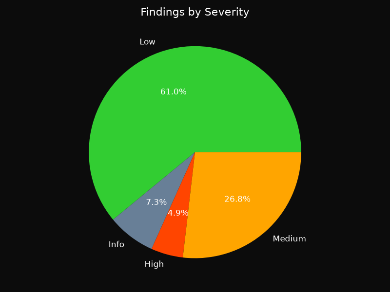
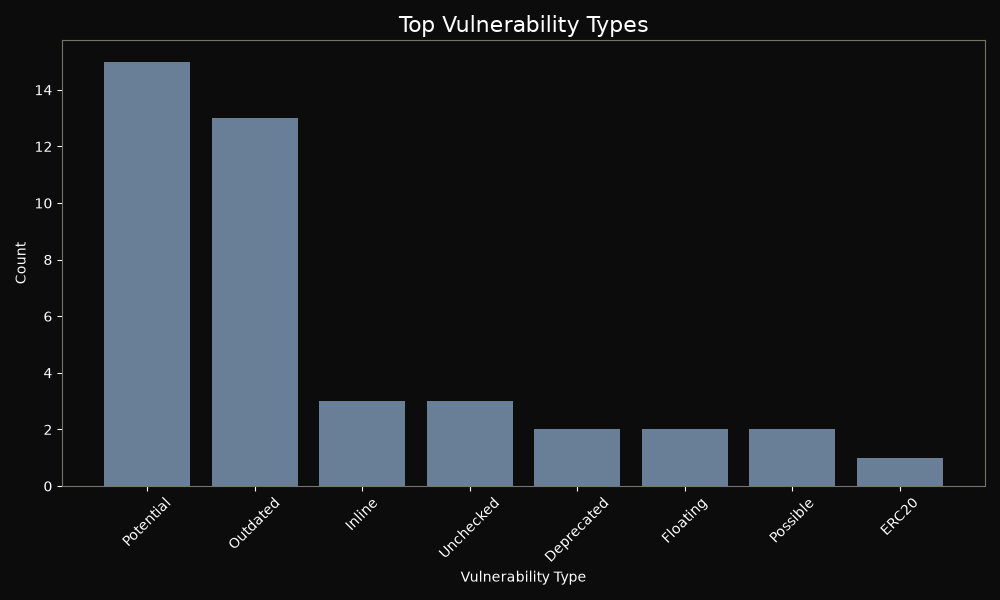

# Hawk-i Audit Report

**Generated:** 2026-07-23T13:27:46.682707Z

## Executive Summary

- **Mode:** minimal (AI: False, Sandbox: False)
- **Repository:** demo/pancake-smart-contracts/projects/farms-pools/contracts (local)
- **Contracts Scanned:** 13
- **Files Analyzed:** 13
- **Total Findings:** 41
- **Severity Breakdown:** Critical: 0, High: 2, Medium: 11, Low: 25, Info: 3
- **Simulation Success Rate:** N/A
- **Security Score:** 15/100 (Critical Risk)


> AI reasoning was not enabled during this scan.


> Exploit simulation was not executed.


## Vulnerability Breakdown

### Severity Distribution



### Vulnerability Types (Top 10)



### Severity Table

| Severity | Count |
|----------|-------|
| Critical | 0 |
| High     | 2 |
| Medium   | 11 |
| Low      | 25 |
| Info     | 3 |

## Detailed Findings

Each finding below shows exactly where the flaw is, the code responsible, a
plain explanation of why it is dangerous, its impact, and a concrete fix.


### F001 | Low: ERC20 approval race condition

- **Severity:** Low
- **Location:** `demo/pancake-smart-contracts/projects/farms-pools/contracts/libs/WBNB.sol:37`
- **Function:** `approve`

**Vulnerable code**

```solidity
35 | }
  36 |
> 37 | function approve(address guy, uint256 wad) public returns (bool) {
  38 |     allowance[msg.sender][guy] = wad;
  39 |     emit Approval(msg.sender, guy, wad);
```

**What is wrong**

The standard ERC20 `approve` function is vulnerable to a race condition: if an owner changes allowance from N to M, and the spender submits a transfer before the new approval, they can spend N and then M, exceeding the intended limit.

**Impact**

An attacker can spend more tokens than allowed, leading to theft.

**Recommended fix**

```solidity
function approve(address spender, uint256 amount) public returns (bool) {
    require((amount == 0) || (allowance[msg.sender][spender] == 0), "Use increaseAllowance instead");
    allowance[msg.sender][spender] = amount;
    emit Approval(msg.sender, spender, amount);
    return true;
}
```


---

### F002 | Low: Deprecated Solidity construct

- **Severity:** Low
- **Location:** `demo/pancake-smart-contracts/projects/farms-pools/contracts/CakeToken.sol:96`


**Vulnerable code**

```solidity
94 |     require(signatory != address(0), "CAKE::delegateBySig: invalid signature");
  95 |     require(nonce == nonces[signatory]++, "CAKE::delegateBySig: invalid nonce");
> 96 |     require(now <= expiry, "CAKE::delegateBySig: signature expired");
  97 |     return _delegate(signatory, delegatee);
  98 | }
```

**What is wrong**

The contract uses a deprecated Solidity construct (`throw`, `sha3`, `suicide`, `var`, `block.blockhash` or `now`). These constructs have been superseded and removed in modern compiler versions, and their presence signals stale, unmaintained code that cannot compile on current toolchains.

**Impact**

Deprecated constructs block compiler upgrades, may behave subtly differently from their replacements (e.g. `throw` consumes all remaining gas), and keep the contract tied to old compilers with known bugs.

**Recommended fix**

```solidity
Replace deprecated constructs with their modern equivalents: `throw` -> `revert()`, `sha3()` -> `keccak256()`, `suicide()` -> `selfdestruct()`, `var` -> explicit types, `block.blockhash()` -> `blockhash()`, `now` -> `block.timestamp`.
```


---

### F003 | Low: Deprecated Solidity construct

- **Severity:** Low
- **Location:** `demo/pancake-smart-contracts/projects/farms-pools/contracts/SyrupBar.sol:119`


**Vulnerable code**

```solidity
117 |     require(signatory != address(0), "CAKE::delegateBySig: invalid signature");
  118 |     require(nonce == nonces[signatory]++, "CAKE::delegateBySig: invalid nonce");
> 119 |     require(now <= expiry, "CAKE::delegateBySig: signature expired");
  120 |     return _delegate(signatory, delegatee);
  121 | }
```

**What is wrong**

The contract uses a deprecated Solidity construct (`throw`, `sha3`, `suicide`, `var`, `block.blockhash` or `now`). These constructs have been superseded and removed in modern compiler versions, and their presence signals stale, unmaintained code that cannot compile on current toolchains.

**Impact**

Deprecated constructs block compiler upgrades, may behave subtly differently from their replacements (e.g. `throw` consumes all remaining gas), and keep the contract tied to old compilers with known bugs.

**Recommended fix**

```solidity
Replace deprecated constructs with their modern equivalents: `throw` -> `revert()`, `sha3()` -> `keccak256()`, `suicide()` -> `selfdestruct()`, `var` -> explicit types, `block.blockhash()` -> `blockhash()`, `now` -> `block.timestamp`.
```


---

### F004 | Low: Floating pragma

- **Severity:** Low
- **Location:** `demo/pancake-smart-contracts/projects/farms-pools/contracts/libs/WBNB.sol:2`


**Vulnerable code**

```solidity
1 | // SPDX-License-Identifier: MIT
> 2 | pragma solidity >0.4.18;
  3 |
  4 | contract WBNB {
```

**What is wrong**

The contract uses a floating pragma (a version range such as `^0.8.0` or `>=0.6.0`). The exact compiler version used for deployment is therefore not locked, so the contract may be compiled with a newer compiler than it was tested with, potentially introducing behavioral differences or new bugs.

**Impact**

Deployments become non-reproducible: different compiler versions can produce different bytecode, and an untested compiler release may contain bugs or changed semantics that affect the contract.

**Recommended fix**

```solidity
Pin the pragma to the exact compiler version the contract was tested with, e.g. `pragma solidity 0.8.24;` instead of `pragma solidity ^0.8.24;`.
```


---

### F005 | Low: Floating pragma

- **Severity:** Low
- **Location:** `demo/pancake-smart-contracts/projects/farms-pools/contracts/libs/CoinFactory.sol:2`


**Vulnerable code**

```solidity
1 | // SPDX-License-Identifier: MIT
> 2 | pragma solidity ^0.6.12;
  3 |
  4 | import "@openzeppelin/contracts/access/Ownable.sol";
```

**What is wrong**

The contract uses a floating pragma (a version range such as `^0.8.0` or `>=0.6.0`). The exact compiler version used for deployment is therefore not locked, so the contract may be compiled with a newer compiler than it was tested with, potentially introducing behavioral differences or new bugs.

**Impact**

Deployments become non-reproducible: different compiler versions can produce different bytecode, and an untested compiler release may contain bugs or changed semantics that affect the contract.

**Recommended fix**

```solidity
Pin the pragma to the exact compiler version the contract was tested with, e.g. `pragma solidity 0.8.24;` instead of `pragma solidity ^0.8.24;`.
```


---

### F006 | Low: Potential front-running via block.timestamp/number

- **Severity:** Low
- **Location:** `demo/pancake-smart-contracts/projects/farms-pools/contracts/Timelock.sol:169`


**Vulnerable code**

```solidity
167 |     function getBlockTimestamp() internal view returns (uint256) {
  168 |         // solium-disable-next-line security/no-block-members
> 169 |         return block.timestamp;
  170 |     }
  171 | }
```

**What is wrong**

Using `block.timestamp` or `block.number` for critical logic can allow miners or bots to front-run transactions by manipulating the block parameters or ordering.

**Impact**

Attackers can exploit front-running to gain unfair advantage, e.g., by seeing a pending trade and inserting their own transaction first.

**Recommended fix**

```solidity
// Add slippage protection and, where ordering matters, commit reveal.
function swap(uint amountIn, uint minAmountOut, uint deadline) external {
    require(block.timestamp <= deadline, "Expired");
    uint amountOut = _swap(amountIn);
    require(amountOut >= minAmountOut, "Slippage exceeded");
}

// Commit reveal for order sensitive actions:
// 1. commit(keccak256(abi.encode(value, salt)))
// 2. later reveal(value, salt) and verify the stored hash.
// Consider private mempools or batch auctions to remove ordering advantage.
```


---

### F007 | Low: Potential front-running via block.timestamp/number

- **Severity:** Low
- **Location:** `demo/pancake-smart-contracts/projects/farms-pools/contracts/SmartChefInitializable.sol:221`


**Vulnerable code**

```solidity
219 |  */
  220 | function stopReward() external onlyOwner {
> 221 |     bonusEndBlock = block.number;
  222 | }
  223 |
```

**What is wrong**

Using `block.timestamp` or `block.number` for critical logic can allow miners or bots to front-run transactions by manipulating the block parameters or ordering.

**Impact**

Attackers can exploit front-running to gain unfair advantage, e.g., by seeing a pending trade and inserting their own transaction first.

**Recommended fix**

```solidity
// Add slippage protection and, where ordering matters, commit reveal.
function swap(uint amountIn, uint minAmountOut, uint deadline) external {
    require(block.timestamp <= deadline, "Expired");
    uint amountOut = _swap(amountIn);
    require(amountOut >= minAmountOut, "Slippage exceeded");
}

// Commit reveal for order sensitive actions:
// 1. commit(keccak256(abi.encode(value, salt)))
// 2. later reveal(value, salt) and verify the stored hash.
// Consider private mempools or batch auctions to remove ordering advantage.
```


---

### F008 | Low: Potential front-running via block.timestamp/number

- **Severity:** Low
- **Location:** `demo/pancake-smart-contracts/projects/farms-pools/contracts/CakeToken.sol:118`


**Vulnerable code**

```solidity
116 |  */
  117 | function getPriorVotes(address account, uint256 blockNumber) external view returns (uint256) {
> 118 |     require(blockNumber < block.number, "CAKE::getPriorVotes: not yet determined");
  119 |
  120 |     uint32 nCheckpoints = numCheckpoints[account];
```

**What is wrong**

Using `block.timestamp` or `block.number` for critical logic can allow miners or bots to front-run transactions by manipulating the block parameters or ordering.

**Impact**

Attackers can exploit front-running to gain unfair advantage, e.g., by seeing a pending trade and inserting their own transaction first.

**Recommended fix**

```solidity
// Add slippage protection and, where ordering matters, commit reveal.
function swap(uint amountIn, uint minAmountOut, uint deadline) external {
    require(block.timestamp <= deadline, "Expired");
    uint amountOut = _swap(amountIn);
    require(amountOut >= minAmountOut, "Slippage exceeded");
}

// Commit reveal for order sensitive actions:
// 1. commit(keccak256(abi.encode(value, salt)))
// 2. later reveal(value, salt) and verify the stored hash.
// Consider private mempools or batch auctions to remove ordering advantage.
```


---

### F009 | Low: Potential front-running via block.timestamp/number

- **Severity:** Low
- **Location:** `demo/pancake-smart-contracts/projects/farms-pools/contracts/SmartChef.sol:204`


**Vulnerable code**

```solidity
202 |  */
  203 | function stopReward() external onlyOwner {
> 204 |     bonusEndBlock = block.number;
  205 | }
  206 |
```

**What is wrong**

Using `block.timestamp` or `block.number` for critical logic can allow miners or bots to front-run transactions by manipulating the block parameters or ordering.

**Impact**

Attackers can exploit front-running to gain unfair advantage, e.g., by seeing a pending trade and inserting their own transaction first.

**Recommended fix**

```solidity
// Add slippage protection and, where ordering matters, commit reveal.
function swap(uint amountIn, uint minAmountOut, uint deadline) external {
    require(block.timestamp <= deadline, "Expired");
    uint amountOut = _swap(amountIn);
    require(amountOut >= minAmountOut, "Slippage exceeded");
}

// Commit reveal for order sensitive actions:
// 1. commit(keccak256(abi.encode(value, salt)))
// 2. later reveal(value, salt) and verify the stored hash.
// Consider private mempools or batch auctions to remove ordering advantage.
```


---

### F010 | Low: Potential front-running via block.timestamp/number

- **Severity:** Low
- **Location:** `demo/pancake-smart-contracts/projects/farms-pools/contracts/SyrupBar.sol:141`


**Vulnerable code**

```solidity
139 |  */
  140 | function getPriorVotes(address account, uint256 blockNumber) external view returns (uint256) {
> 141 |     require(blockNumber < block.number, "CAKE::getPriorVotes: not yet determined");
  142 |
  143 |     uint32 nCheckpoints = numCheckpoints[account];
```

**What is wrong**

Using `block.timestamp` or `block.number` for critical logic can allow miners or bots to front-run transactions by manipulating the block parameters or ordering.

**Impact**

Attackers can exploit front-running to gain unfair advantage, e.g., by seeing a pending trade and inserting their own transaction first.

**Recommended fix**

```solidity
// Add slippage protection and, where ordering matters, commit reveal.
function swap(uint amountIn, uint minAmountOut, uint deadline) external {
    require(block.timestamp <= deadline, "Expired");
    uint amountOut = _swap(amountIn);
    require(amountOut >= minAmountOut, "Slippage exceeded");
}

// Commit reveal for order sensitive actions:
// 1. commit(keccak256(abi.encode(value, salt)))
// 2. later reveal(value, salt) and verify the stored hash.
// Consider private mempools or batch auctions to remove ordering advantage.
```


---

### F011 | Low: Potential front-running via block.timestamp/number

- **Severity:** Low
- **Location:** `demo/pancake-smart-contracts/projects/farms-pools/contracts/BnbStaking.sol:131`


**Vulnerable code**

```solidity
129 | uint256 accCakePerShare = pool.accCakePerShare;
  130 | uint256 lpSupply = pool.lpToken.balanceOf(address(this));
> 131 | if (block.number > pool.lastRewardBlock && lpSupply != 0) {
  132 |     uint256 multiplier = getMultiplier(pool.lastRewardBlock, block.number);
  133 |     uint256 cakeReward = multiplier.mul(rewardPerBlock).mul(pool.allocPoint).div(totalAllocPoint);
```

**What is wrong**

Using `block.timestamp` or `block.number` for critical logic can allow miners or bots to front-run transactions by manipulating the block parameters or ordering.

**Impact**

Attackers can exploit front-running to gain unfair advantage, e.g., by seeing a pending trade and inserting their own transaction first.

**Recommended fix**

```solidity
// Add slippage protection and, where ordering matters, commit reveal.
function swap(uint amountIn, uint minAmountOut, uint deadline) external {
    require(block.timestamp <= deadline, "Expired");
    uint amountOut = _swap(amountIn);
    require(amountOut >= minAmountOut, "Slippage exceeded");
}

// Commit reveal for order sensitive actions:
// 1. commit(keccak256(abi.encode(value, salt)))
// 2. later reveal(value, salt) and verify the stored hash.
// Consider private mempools or batch auctions to remove ordering advantage.
```


---

### F012 | Low: Potential front-running via block.timestamp/number

- **Severity:** Low
- **Location:** `demo/pancake-smart-contracts/projects/farms-pools/contracts/MasterChef.sol:126`


**Vulnerable code**

```solidity
124 |     massUpdatePools();
  125 | }
> 126 | uint256 lastRewardBlock = block.number > startBlock ? block.number : startBlock;
  127 | totalAllocPoint = totalAllocPoint.add(_allocPoint);
  128 | poolInfo.push(
```

**What is wrong**

Using `block.timestamp` or `block.number` for critical logic can allow miners or bots to front-run transactions by manipulating the block parameters or ordering.

**Impact**

Attackers can exploit front-running to gain unfair advantage, e.g., by seeing a pending trade and inserting their own transaction first.

**Recommended fix**

```solidity
// Add slippage protection and, where ordering matters, commit reveal.
function swap(uint amountIn, uint minAmountOut, uint deadline) external {
    require(block.timestamp <= deadline, "Expired");
    uint amountOut = _swap(amountIn);
    require(amountOut >= minAmountOut, "Slippage exceeded");
}

// Commit reveal for order sensitive actions:
// 1. commit(keccak256(abi.encode(value, salt)))
// 2. later reveal(value, salt) and verify the stored hash.
// Consider private mempools or batch auctions to remove ordering advantage.
```


---

### F013 | Info: Inline assembly used

- **Severity:** Info
- **Location:** `demo/pancake-smart-contracts/projects/farms-pools/contracts/SmartChefFactory.sol:44`


**Vulnerable code**

```solidity
42 | address smartChefAddress;
  43 |
> 44 | assembly {
  45 |     smartChefAddress := create2(0, add(bytecode, 32), mload(bytecode), salt)
  46 | }
```

**What is wrong**

The contract contains an inline `assembly` block. Assembly bypasses Solidity's type system, overflow checks and memory-safety guarantees, so any mistake inside the block goes undetected by the compiler.

**Impact**

Errors in hand-written assembly (wrong memory offsets, missing checks, unchecked external call results) can corrupt state or leak funds without any compiler warning. This is informational; assembly is often legitimate.

**Recommended fix**

```solidity
Prefer high-level Solidity where possible. If assembly is required, keep the block minimal, mark it `memory-safe` when applicable, document the invariants it relies on, and cover it with targeted tests.
```


---

### F014 | Info: Inline assembly used

- **Severity:** Info
- **Location:** `demo/pancake-smart-contracts/projects/farms-pools/contracts/CakeToken.sol:210`


**Vulnerable code**

```solidity
208 | function getChainId() internal pure returns (uint256) {
  209 |     uint256 chainId;
> 210 |     assembly {
  211 |         chainId := chainid()
  212 |     }
```

**What is wrong**

The contract contains an inline `assembly` block. Assembly bypasses Solidity's type system, overflow checks and memory-safety guarantees, so any mistake inside the block goes undetected by the compiler.

**Impact**

Errors in hand-written assembly (wrong memory offsets, missing checks, unchecked external call results) can corrupt state or leak funds without any compiler warning. This is informational; assembly is often legitimate.

**Recommended fix**

```solidity
Prefer high-level Solidity where possible. If assembly is required, keep the block minimal, mark it `memory-safe` when applicable, document the invariants it relies on, and cover it with targeted tests.
```


---

### F015 | Info: Inline assembly used

- **Severity:** Info
- **Location:** `demo/pancake-smart-contracts/projects/farms-pools/contracts/SyrupBar.sol:233`


**Vulnerable code**

```solidity
231 | function getChainId() internal pure returns (uint256) {
  232 |     uint256 chainId;
> 233 |     assembly {
  234 |         chainId := chainid()
  235 |     }
```

**What is wrong**

The contract contains an inline `assembly` block. Assembly bypasses Solidity's type system, overflow checks and memory-safety guarantees, so any mistake inside the block goes undetected by the compiler.

**Impact**

Errors in hand-written assembly (wrong memory offsets, missing checks, unchecked external call results) can corrupt state or leak funds without any compiler warning. This is informational; assembly is often legitimate.

**Recommended fix**

```solidity
Prefer high-level Solidity where possible. If assembly is required, keep the block minimal, mark it `memory-safe` when applicable, document the invariants it relies on, and cover it with targeted tests.
```


---

### F016 | High: Possible missing input validation

- **Severity:** High
- **Location:** `demo/pancake-smart-contracts/projects/farms-pools/contracts/BnbStaking.sol:141`


**Vulnerable code**

```solidity
139 | // Update reward variables of the given pool to be up-to-date.
  140 | function updatePool(uint256 _pid) public {
> 141 |     PoolInfo storage pool = poolInfo[_pid];
  142 |     if (block.number <= pool.lastRewardBlock) {
  143 |         return;
```

**What is wrong**

User-supplied inputs should be validated to prevent out-of-bounds errors, integer overflows, or unexpected behavior. Missing checks can lead to vulnerabilities like underflows or access to invalid indices.

**Impact**

An attacker could supply values that cause array index errors, arithmetic issues, or bypass logic.

**Recommended fix**

```solidity
require(index < array.length, "Index out of bounds");
require(amount > 0, "Amount must be positive");
```


---

### F017 | High: Possible missing input validation

- **Severity:** High
- **Location:** `demo/pancake-smart-contracts/projects/farms-pools/contracts/MasterChef.sol:143`


**Vulnerable code**

```solidity
141 |     massUpdatePools();
  142 | }
> 143 | uint256 prevAllocPoint = poolInfo[_pid].allocPoint;
  144 | poolInfo[_pid].allocPoint = _allocPoint;
  145 | if (prevAllocPoint != _allocPoint) {
```

**What is wrong**

User-supplied inputs should be validated to prevent out-of-bounds errors, integer overflows, or unexpected behavior. Missing checks can lead to vulnerabilities like underflows or access to invalid indices.

**Impact**

An attacker could supply values that cause array index errors, arithmetic issues, or bypass logic.

**Recommended fix**

```solidity
require(index < array.length, "Index out of bounds");
require(amount > 0, "Amount must be positive");
```


---

### F018 | Medium: Potential integer overflow/underflow

- **Severity:** Medium
- **Location:** `demo/pancake-smart-contracts/projects/farms-pools/contracts/SmartChefFactory.sol:1`


**Vulnerable code**

```solidity
> 1 | // SPDX-License-Identifier: MIT
  2 | pragma solidity 0.6.12;
  3 |
```

**What is wrong**

Arithmetic operations in Solidity versions prior to 0.8.0 can overflow/underflow silently, leading to incorrect balances or logic. Even in 0.8.x, `unchecked` blocks can reintroduce overflow.

**Impact**

An attacker could manipulate arithmetic to gain unexpected tokens or break contract invariants.

**Recommended fix**

```solidity
// Use Solidity >= 0.8.0 so arithmetic reverts on overflow by default.
pragma solidity ^0.8.20;

function transfer(address to, uint256 amount) external {
    // These now revert automatically on underflow/overflow:
    balances[msg.sender] -= amount;
    balances[to] += amount;
}

// For Solidity < 0.8, use OpenZeppelin SafeMath:
// using SafeMath for uint256;
// balances[msg.sender] = balances[msg.sender].sub(amount);
// Only use unchecked { } when you have proven the bounds are safe.
```


---

### F019 | Medium: Potential integer overflow/underflow

- **Severity:** Medium
- **Location:** `demo/pancake-smart-contracts/projects/farms-pools/contracts/CakeToken.sol:1`


**Vulnerable code**

```solidity
> 1 | // SPDX-License-Identifier: MIT
  2 | pragma solidity 0.6.12;
  3 |
```

**What is wrong**

Arithmetic operations in Solidity versions prior to 0.8.0 can overflow/underflow silently, leading to incorrect balances or logic. Even in 0.8.x, `unchecked` blocks can reintroduce overflow.

**Impact**

An attacker could manipulate arithmetic to gain unexpected tokens or break contract invariants.

**Recommended fix**

```solidity
// Use Solidity >= 0.8.0 so arithmetic reverts on overflow by default.
pragma solidity ^0.8.20;

function transfer(address to, uint256 amount) external {
    // These now revert automatically on underflow/overflow:
    balances[msg.sender] -= amount;
    balances[to] += amount;
}

// For Solidity < 0.8, use OpenZeppelin SafeMath:
// using SafeMath for uint256;
// balances[msg.sender] = balances[msg.sender].sub(amount);
// Only use unchecked { } when you have proven the bounds are safe.
```


---

### F020 | Medium: Potential integer overflow/underflow

- **Severity:** Medium
- **Location:** `demo/pancake-smart-contracts/projects/farms-pools/contracts/SyrupBar.sol:1`


**Vulnerable code**

```solidity
> 1 | // SPDX-License-Identifier: MIT
  2 | pragma solidity 0.6.12;
  3 |
```

**What is wrong**

Arithmetic operations in Solidity versions prior to 0.8.0 can overflow/underflow silently, leading to incorrect balances or logic. Even in 0.8.x, `unchecked` blocks can reintroduce overflow.

**Impact**

An attacker could manipulate arithmetic to gain unexpected tokens or break contract invariants.

**Recommended fix**

```solidity
// Use Solidity >= 0.8.0 so arithmetic reverts on overflow by default.
pragma solidity ^0.8.20;

function transfer(address to, uint256 amount) external {
    // These now revert automatically on underflow/overflow:
    balances[msg.sender] -= amount;
    balances[to] += amount;
}

// For Solidity < 0.8, use OpenZeppelin SafeMath:
// using SafeMath for uint256;
// balances[msg.sender] = balances[msg.sender].sub(amount);
// Only use unchecked { } when you have proven the bounds are safe.
```


---

### F021 | Medium: Potential integer overflow/underflow

- **Severity:** Medium
- **Location:** `demo/pancake-smart-contracts/projects/farms-pools/contracts/libs/WBNB.sol:1`


**Vulnerable code**

```solidity
> 1 | // SPDX-License-Identifier: MIT
  2 | pragma solidity >0.4.18;
  3 |
```

**What is wrong**

Arithmetic operations in Solidity versions prior to 0.8.0 can overflow/underflow silently, leading to incorrect balances or logic. Even in 0.8.x, `unchecked` blocks can reintroduce overflow.

**Impact**

An attacker could manipulate arithmetic to gain unexpected tokens or break contract invariants.

**Recommended fix**

```solidity
// Use Solidity >= 0.8.0 so arithmetic reverts on overflow by default.
pragma solidity ^0.8.20;

function transfer(address to, uint256 amount) external {
    // These now revert automatically on underflow/overflow:
    balances[msg.sender] -= amount;
    balances[to] += amount;
}

// For Solidity < 0.8, use OpenZeppelin SafeMath:
// using SafeMath for uint256;
// balances[msg.sender] = balances[msg.sender].sub(amount);
// Only use unchecked { } when you have proven the bounds are safe.
```


---

### F022 | Medium: Potential integer overflow/underflow

- **Severity:** Medium
- **Location:** `demo/pancake-smart-contracts/projects/farms-pools/contracts/libs/MockBEP20.sol:1`


**Vulnerable code**

```solidity
> 1 | // SPDX-License-Identifier: MIT
  2 | pragma solidity 0.6.12;
  3 |
```

**What is wrong**

Arithmetic operations in Solidity versions prior to 0.8.0 can overflow/underflow silently, leading to incorrect balances or logic. Even in 0.8.x, `unchecked` blocks can reintroduce overflow.

**Impact**

An attacker could manipulate arithmetic to gain unexpected tokens or break contract invariants.

**Recommended fix**

```solidity
// Use Solidity >= 0.8.0 so arithmetic reverts on overflow by default.
pragma solidity ^0.8.20;

function transfer(address to, uint256 amount) external {
    // These now revert automatically on underflow/overflow:
    balances[msg.sender] -= amount;
    balances[to] += amount;
}

// For Solidity < 0.8, use OpenZeppelin SafeMath:
// using SafeMath for uint256;
// balances[msg.sender] = balances[msg.sender].sub(amount);
// Only use unchecked { } when you have proven the bounds are safe.
```


---

### F023 | Medium: Potential integer overflow/underflow

- **Severity:** Medium
- **Location:** `demo/pancake-smart-contracts/projects/farms-pools/contracts/libs/MockERC20.sol:1`


**Vulnerable code**

```solidity
> 1 | // SPDX-License-Identifier: MIT
  2 | pragma solidity 0.6.12;
  3 |
```

**What is wrong**

Arithmetic operations in Solidity versions prior to 0.8.0 can overflow/underflow silently, leading to incorrect balances or logic. Even in 0.8.x, `unchecked` blocks can reintroduce overflow.

**Impact**

An attacker could manipulate arithmetic to gain unexpected tokens or break contract invariants.

**Recommended fix**

```solidity
// Use Solidity >= 0.8.0 so arithmetic reverts on overflow by default.
pragma solidity ^0.8.20;

function transfer(address to, uint256 amount) external {
    // These now revert automatically on underflow/overflow:
    balances[msg.sender] -= amount;
    balances[to] += amount;
}

// For Solidity < 0.8, use OpenZeppelin SafeMath:
// using SafeMath for uint256;
// balances[msg.sender] = balances[msg.sender].sub(amount);
// Only use unchecked { } when you have proven the bounds are safe.
```


---

### F024 | Medium: Potential integer overflow/underflow

- **Severity:** Medium
- **Location:** `demo/pancake-smart-contracts/projects/farms-pools/contracts/libs/CoinFactory.sol:1`


**Vulnerable code**

```solidity
> 1 | // SPDX-License-Identifier: MIT
  2 | pragma solidity ^0.6.12;
  3 |
```

**What is wrong**

Arithmetic operations in Solidity versions prior to 0.8.0 can overflow/underflow silently, leading to incorrect balances or logic. Even in 0.8.x, `unchecked` blocks can reintroduce overflow.

**Impact**

An attacker could manipulate arithmetic to gain unexpected tokens or break contract invariants.

**Recommended fix**

```solidity
// Use Solidity >= 0.8.0 so arithmetic reverts on overflow by default.
pragma solidity ^0.8.20;

function transfer(address to, uint256 amount) external {
    // These now revert automatically on underflow/overflow:
    balances[msg.sender] -= amount;
    balances[to] += amount;
}

// For Solidity < 0.8, use OpenZeppelin SafeMath:
// using SafeMath for uint256;
// balances[msg.sender] = balances[msg.sender].sub(amount);
// Only use unchecked { } when you have proven the bounds are safe.
```


---

### F025 | Medium: Potential integer overflow/underflow

- **Severity:** Medium
- **Location:** `demo/pancake-smart-contracts/projects/farms-pools/contracts/libs/MockCoin.sol:1`


**Vulnerable code**

```solidity
> 1 | // SPDX-License-Identifier: MIT
  2 | pragma solidity 0.6.12;
  3 |
```

**What is wrong**

Arithmetic operations in Solidity versions prior to 0.8.0 can overflow/underflow silently, leading to incorrect balances or logic. Even in 0.8.x, `unchecked` blocks can reintroduce overflow.

**Impact**

An attacker could manipulate arithmetic to gain unexpected tokens or break contract invariants.

**Recommended fix**

```solidity
// Use Solidity >= 0.8.0 so arithmetic reverts on overflow by default.
pragma solidity ^0.8.20;

function transfer(address to, uint256 amount) external {
    // These now revert automatically on underflow/overflow:
    balances[msg.sender] -= amount;
    balances[to] += amount;
}

// For Solidity < 0.8, use OpenZeppelin SafeMath:
// using SafeMath for uint256;
// balances[msg.sender] = balances[msg.sender].sub(amount);
// Only use unchecked { } when you have proven the bounds are safe.
```


---

### F026 | Low: Outdated Solidity version

- **Severity:** Low
- **Location:** `demo/pancake-smart-contracts/projects/farms-pools/contracts/Timelock.sol:11`


**Vulnerable code**

```solidity
9 | //
  10 |
> 11 | pragma solidity 0.6.12;
  12 |
  13 | import "@openzeppelin/contracts/math/SafeMath.sol";
```

**What is wrong**

The contract targets a Solidity compiler older than 0.8. Pre-0.8 compilers do not perform automatic arithmetic overflow/underflow checks and lack numerous compiler bug fixes and safety improvements introduced since.

**Impact**

Arithmetic silently wraps on overflow/underflow unless a library like SafeMath is used consistently, and the contract remains exposed to known bugs fixed in newer compiler releases.

**Recommended fix**

```solidity
Upgrade the contract to a modern compiler, e.g. `pragma solidity 0.8.24;`, and re-test: 0.8+ reverts on arithmetic overflow/underflow by default.
```


---

### F027 | Low: Outdated Solidity version

- **Severity:** Low
- **Location:** `demo/pancake-smart-contracts/projects/farms-pools/contracts/SmartChefFactory.sol:2`


**Vulnerable code**

```solidity
1 | // SPDX-License-Identifier: MIT
> 2 | pragma solidity 0.6.12;
  3 |
  4 | import "@openzeppelin/contracts/access/Ownable.sol";
```

**What is wrong**

The contract targets a Solidity compiler older than 0.8. Pre-0.8 compilers do not perform automatic arithmetic overflow/underflow checks and lack numerous compiler bug fixes and safety improvements introduced since.

**Impact**

Arithmetic silently wraps on overflow/underflow unless a library like SafeMath is used consistently, and the contract remains exposed to known bugs fixed in newer compiler releases.

**Recommended fix**

```solidity
Upgrade the contract to a modern compiler, e.g. `pragma solidity 0.8.24;`, and re-test: 0.8+ reverts on arithmetic overflow/underflow by default.
```


---

### F028 | Low: Outdated Solidity version

- **Severity:** Low
- **Location:** `demo/pancake-smart-contracts/projects/farms-pools/contracts/SmartChefInitializable.sol:2`


**Vulnerable code**

```solidity
1 | // SPDX-License-Identifier: MIT
> 2 | pragma solidity 0.6.12;
  3 |
  4 | import "@openzeppelin/contracts/access/Ownable.sol";
```

**What is wrong**

The contract targets a Solidity compiler older than 0.8. Pre-0.8 compilers do not perform automatic arithmetic overflow/underflow checks and lack numerous compiler bug fixes and safety improvements introduced since.

**Impact**

Arithmetic silently wraps on overflow/underflow unless a library like SafeMath is used consistently, and the contract remains exposed to known bugs fixed in newer compiler releases.

**Recommended fix**

```solidity
Upgrade the contract to a modern compiler, e.g. `pragma solidity 0.8.24;`, and re-test: 0.8+ reverts on arithmetic overflow/underflow by default.
```


---

### F029 | Low: Outdated Solidity version

- **Severity:** Low
- **Location:** `demo/pancake-smart-contracts/projects/farms-pools/contracts/CakeToken.sol:2`


**Vulnerable code**

```solidity
1 | // SPDX-License-Identifier: MIT
> 2 | pragma solidity 0.6.12;
  3 |
  4 | import "bsc-library/contracts/BEP20.sol";
```

**What is wrong**

The contract targets a Solidity compiler older than 0.8. Pre-0.8 compilers do not perform automatic arithmetic overflow/underflow checks and lack numerous compiler bug fixes and safety improvements introduced since.

**Impact**

Arithmetic silently wraps on overflow/underflow unless a library like SafeMath is used consistently, and the contract remains exposed to known bugs fixed in newer compiler releases.

**Recommended fix**

```solidity
Upgrade the contract to a modern compiler, e.g. `pragma solidity 0.8.24;`, and re-test: 0.8+ reverts on arithmetic overflow/underflow by default.
```


---

### F030 | Low: Outdated Solidity version

- **Severity:** Low
- **Location:** `demo/pancake-smart-contracts/projects/farms-pools/contracts/SmartChef.sol:2`


**Vulnerable code**

```solidity
1 | // SPDX-License-Identifier: MIT
> 2 | pragma solidity 0.6.12;
  3 |
  4 | import "@openzeppelin/contracts/access/Ownable.sol";
```

**What is wrong**

The contract targets a Solidity compiler older than 0.8. Pre-0.8 compilers do not perform automatic arithmetic overflow/underflow checks and lack numerous compiler bug fixes and safety improvements introduced since.

**Impact**

Arithmetic silently wraps on overflow/underflow unless a library like SafeMath is used consistently, and the contract remains exposed to known bugs fixed in newer compiler releases.

**Recommended fix**

```solidity
Upgrade the contract to a modern compiler, e.g. `pragma solidity 0.8.24;`, and re-test: 0.8+ reverts on arithmetic overflow/underflow by default.
```


---

### F031 | Low: Outdated Solidity version

- **Severity:** Low
- **Location:** `demo/pancake-smart-contracts/projects/farms-pools/contracts/SyrupBar.sol:2`


**Vulnerable code**

```solidity
1 | // SPDX-License-Identifier: MIT
> 2 | pragma solidity 0.6.12;
  3 |
  4 | import "bsc-library/contracts/BEP20.sol";
```

**What is wrong**

The contract targets a Solidity compiler older than 0.8. Pre-0.8 compilers do not perform automatic arithmetic overflow/underflow checks and lack numerous compiler bug fixes and safety improvements introduced since.

**Impact**

Arithmetic silently wraps on overflow/underflow unless a library like SafeMath is used consistently, and the contract remains exposed to known bugs fixed in newer compiler releases.

**Recommended fix**

```solidity
Upgrade the contract to a modern compiler, e.g. `pragma solidity 0.8.24;`, and re-test: 0.8+ reverts on arithmetic overflow/underflow by default.
```


---

### F032 | Low: Outdated Solidity version

- **Severity:** Low
- **Location:** `demo/pancake-smart-contracts/projects/farms-pools/contracts/BnbStaking.sol:2`


**Vulnerable code**

```solidity
1 | // SPDX-License-Identifier: MIT
> 2 | pragma solidity 0.6.12;
  3 |
  4 | import "@openzeppelin/contracts/access/Ownable.sol";
```

**What is wrong**

The contract targets a Solidity compiler older than 0.8. Pre-0.8 compilers do not perform automatic arithmetic overflow/underflow checks and lack numerous compiler bug fixes and safety improvements introduced since.

**Impact**

Arithmetic silently wraps on overflow/underflow unless a library like SafeMath is used consistently, and the contract remains exposed to known bugs fixed in newer compiler releases.

**Recommended fix**

```solidity
Upgrade the contract to a modern compiler, e.g. `pragma solidity 0.8.24;`, and re-test: 0.8+ reverts on arithmetic overflow/underflow by default.
```


---

### F033 | Low: Outdated Solidity version

- **Severity:** Low
- **Location:** `demo/pancake-smart-contracts/projects/farms-pools/contracts/MasterChef.sol:2`


**Vulnerable code**

```solidity
1 | // SPDX-License-Identifier: MIT
> 2 | pragma solidity 0.6.12;
  3 |
  4 | import "@openzeppelin/contracts/access/Ownable.sol";
```

**What is wrong**

The contract targets a Solidity compiler older than 0.8. Pre-0.8 compilers do not perform automatic arithmetic overflow/underflow checks and lack numerous compiler bug fixes and safety improvements introduced since.

**Impact**

Arithmetic silently wraps on overflow/underflow unless a library like SafeMath is used consistently, and the contract remains exposed to known bugs fixed in newer compiler releases.

**Recommended fix**

```solidity
Upgrade the contract to a modern compiler, e.g. `pragma solidity 0.8.24;`, and re-test: 0.8+ reverts on arithmetic overflow/underflow by default.
```


---

### F034 | Low: Outdated Solidity version

- **Severity:** Low
- **Location:** `demo/pancake-smart-contracts/projects/farms-pools/contracts/libs/WBNB.sol:2`


**Vulnerable code**

```solidity
1 | // SPDX-License-Identifier: MIT
> 2 | pragma solidity >0.4.18;
  3 |
  4 | contract WBNB {
```

**What is wrong**

The contract targets a Solidity compiler older than 0.8. Pre-0.8 compilers do not perform automatic arithmetic overflow/underflow checks and lack numerous compiler bug fixes and safety improvements introduced since.

**Impact**

Arithmetic silently wraps on overflow/underflow unless a library like SafeMath is used consistently, and the contract remains exposed to known bugs fixed in newer compiler releases.

**Recommended fix**

```solidity
Upgrade the contract to a modern compiler, e.g. `pragma solidity 0.8.24;`, and re-test: 0.8+ reverts on arithmetic overflow/underflow by default.
```


---

### F035 | Low: Outdated Solidity version

- **Severity:** Low
- **Location:** `demo/pancake-smart-contracts/projects/farms-pools/contracts/libs/MockBEP20.sol:2`


**Vulnerable code**

```solidity
1 | // SPDX-License-Identifier: MIT
> 2 | pragma solidity 0.6.12;
  3 |
  4 | import "bsc-library/contracts/BEP20.sol";
```

**What is wrong**

The contract targets a Solidity compiler older than 0.8. Pre-0.8 compilers do not perform automatic arithmetic overflow/underflow checks and lack numerous compiler bug fixes and safety improvements introduced since.

**Impact**

Arithmetic silently wraps on overflow/underflow unless a library like SafeMath is used consistently, and the contract remains exposed to known bugs fixed in newer compiler releases.

**Recommended fix**

```solidity
Upgrade the contract to a modern compiler, e.g. `pragma solidity 0.8.24;`, and re-test: 0.8+ reverts on arithmetic overflow/underflow by default.
```


---

### F036 | Low: Outdated Solidity version

- **Severity:** Low
- **Location:** `demo/pancake-smart-contracts/projects/farms-pools/contracts/libs/MockERC20.sol:2`


**Vulnerable code**

```solidity
1 | // SPDX-License-Identifier: MIT
> 2 | pragma solidity 0.6.12;
  3 |
  4 | import "@openzeppelin/contracts/token/ERC20/ERC20.sol";
```

**What is wrong**

The contract targets a Solidity compiler older than 0.8. Pre-0.8 compilers do not perform automatic arithmetic overflow/underflow checks and lack numerous compiler bug fixes and safety improvements introduced since.

**Impact**

Arithmetic silently wraps on overflow/underflow unless a library like SafeMath is used consistently, and the contract remains exposed to known bugs fixed in newer compiler releases.

**Recommended fix**

```solidity
Upgrade the contract to a modern compiler, e.g. `pragma solidity 0.8.24;`, and re-test: 0.8+ reverts on arithmetic overflow/underflow by default.
```


---

### F037 | Low: Outdated Solidity version

- **Severity:** Low
- **Location:** `demo/pancake-smart-contracts/projects/farms-pools/contracts/libs/CoinFactory.sol:2`


**Vulnerable code**

```solidity
1 | // SPDX-License-Identifier: MIT
> 2 | pragma solidity ^0.6.12;
  3 |
  4 | import "@openzeppelin/contracts/access/Ownable.sol";
```

**What is wrong**

The contract targets a Solidity compiler older than 0.8. Pre-0.8 compilers do not perform automatic arithmetic overflow/underflow checks and lack numerous compiler bug fixes and safety improvements introduced since.

**Impact**

Arithmetic silently wraps on overflow/underflow unless a library like SafeMath is used consistently, and the contract remains exposed to known bugs fixed in newer compiler releases.

**Recommended fix**

```solidity
Upgrade the contract to a modern compiler, e.g. `pragma solidity 0.8.24;`, and re-test: 0.8+ reverts on arithmetic overflow/underflow by default.
```


---

### F038 | Low: Outdated Solidity version

- **Severity:** Low
- **Location:** `demo/pancake-smart-contracts/projects/farms-pools/contracts/libs/MockCoin.sol:2`


**Vulnerable code**

```solidity
1 | // SPDX-License-Identifier: MIT
> 2 | pragma solidity 0.6.12;
  3 |
  4 | import "@openzeppelin/contracts/token/ERC20/ERC20.sol";
```

**What is wrong**

The contract targets a Solidity compiler older than 0.8. Pre-0.8 compilers do not perform automatic arithmetic overflow/underflow checks and lack numerous compiler bug fixes and safety improvements introduced since.

**Impact**

Arithmetic silently wraps on overflow/underflow unless a library like SafeMath is used consistently, and the contract remains exposed to known bugs fixed in newer compiler releases.

**Recommended fix**

```solidity
Upgrade the contract to a modern compiler, e.g. `pragma solidity 0.8.24;`, and re-test: 0.8+ reverts on arithmetic overflow/underflow by default.
```


---

### F039 | Medium: Unchecked send/transfer

- **Severity:** Medium
- **Location:** `demo/pancake-smart-contracts/projects/farms-pools/contracts/SyrupBar.sol:31`


**Vulnerable code**

```solidity
29 | uint256 cakeBal = cake.balanceOf(address(this));
  30 | if (_amount > cakeBal) {
> 31 |     cake.transfer(_to, cakeBal);
  32 | } else {
  33 |     cake.transfer(_to, _amount);
```

**What is wrong**

`send()` and `transfer()` return a boolean indicating success. If you don't check this return value, the function may silently fail, leading to incorrect contract state.

**Impact**

Failed transfers could leave the contract in an inconsistent state, possibly locking funds or allowing users to withdraw more than they should.

**Recommended fix**

```solidity
// Always check the return value of low level calls and revert on failure.
function withdraw(uint256 amount) external {
    require(balances[msg.sender] >= amount, "Insufficient");
    balances[msg.sender] -= amount; // effects before interaction
    (bool ok, ) = msg.sender.call{value: amount}("");
    require(ok, "Transfer failed");
}

// Or use OpenZeppelin Address.sendValue, which reverts on failure:
// Address.sendValue(payable(msg.sender), amount);
```


---

### F040 | Medium: Unchecked send/transfer

- **Severity:** Medium
- **Location:** `demo/pancake-smart-contracts/projects/farms-pools/contracts/SyrupBar.sol:33`


**Vulnerable code**

```solidity
31 |         cake.transfer(_to, cakeBal);
  32 |     } else {
> 33 |         cake.transfer(_to, _amount);
  34 |     }
  35 | }
```

**What is wrong**

`send()` and `transfer()` return a boolean indicating success. If you don't check this return value, the function may silently fail, leading to incorrect contract state.

**Impact**

Failed transfers could leave the contract in an inconsistent state, possibly locking funds or allowing users to withdraw more than they should.

**Recommended fix**

```solidity
// Always check the return value of low level calls and revert on failure.
function withdraw(uint256 amount) external {
    require(balances[msg.sender] >= amount, "Insufficient");
    balances[msg.sender] -= amount; // effects before interaction
    (bool ok, ) = msg.sender.call{value: amount}("");
    require(ok, "Transfer failed");
}

// Or use OpenZeppelin Address.sendValue, which reverts on failure:
// Address.sendValue(payable(msg.sender), amount);
```


---

### F041 | Medium: Unchecked send/transfer

- **Severity:** Medium
- **Location:** `demo/pancake-smart-contracts/projects/farms-pools/contracts/libs/WBNB.sol:29`


**Vulnerable code**

```solidity
27 |     require(balanceOf[msg.sender] >= wad);
  28 |     balanceOf[msg.sender] -= wad;
> 29 |     msg.sender.transfer(wad);
  30 |     emit Withdrawal(msg.sender, wad);
  31 | }
```

**What is wrong**

`send()` and `transfer()` return a boolean indicating success. If you don't check this return value, the function may silently fail, leading to incorrect contract state.

**Impact**

Failed transfers could leave the contract in an inconsistent state, possibly locking funds or allowing users to withdraw more than they should.

**Recommended fix**

```solidity
// Always check the return value of low level calls and revert on failure.
function withdraw(uint256 amount) external {
    require(balances[msg.sender] >= amount, "Insufficient");
    balances[msg.sender] -= amount; // effects before interaction
    (bool ok, ) = msg.sender.call{value: amount}("");
    require(ok, "Transfer failed");
}

// Or use OpenZeppelin Address.sendValue, which reverts on failure:
// Address.sendValue(payable(msg.sender), amount);
```


---


## Simulation Metrics

- **Success Rate:** N/A
- **Total Exploits Attempted:** 0


## Additional Security Modules

### Bytecode Verification


Not performed.


### Dependency Vulnerabilities


No vulnerable dependencies found or scan not run.


### Upgrade Safety


No upgrade safety issues detected.


### Formal Verification


No formal verification issues found or not run.


### Hawk-i Deep Agent Campaign


Deep agent not run.


---

*Report generated by Hawk-i v1.0.0*